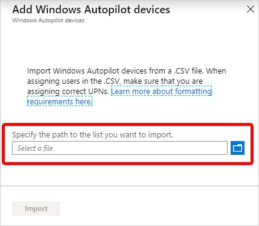

# Manually register devices with Windows Autopilot

*Applies to:*

- Windows 11
- Windows 10
- Windows Holographic, version 2004

You can perform Windows Autopilot device registration within your organization by manually collecting the hardware identity of devices (hardware hashes) and uploading this information in a comma-separated-values (CSV) file. Capturing the hardware hash for manual registration requires booting the device into Windows. So, this process is primarily for testing and evaluation scenarios.

Device owners can only register their devices with a hardware hash. Other methods (PKID, tuple) are available through OEMs or CSP partners.

This article provides step-by-step guidance for manual registration. For more information about registration, see:

- [Windows Autopilot registration overview](registration-overview.md)
- [Manual registration overview](manual-registration.md)
- [Windows Autopilot for HoloLens 2](/hololens/hololens2-autopilot#2-register-devices-in-windows-autopilot)

## Prerequisites

- [Intune subscription](/mem/intune/fundamentals/licenses)
- [Windows automatic enrollment enabled](/mem/intune/enrollment/windows-enroll#enable-windows-automatic-enrollment)
- [Azure Active Directory Premium subscription](/azure/active-directory/active-directory-get-started-premium) <!--&#40;[trial subscription](https://go.microsoft.com/fwlink/?LinkID=816845)&#41;-->

## Required permissions

Device enrollment requires *Intune Administrator* or *Policy and Profile Manager* permissions. You can also create a custom Autopilot device manager role by using [role-based access control](/mem/intune/fundamentals/role-based-access-control). Autopilot device management requires only that you enable all permissions under **Enrollment programs**, except for the four token management options.

> [!NOTE]
>
> In both Intune Administrator and role-based access control methods, the administrative user also requires consent to use the Microsoft Intune PowerShell and Microsoft Graph PowerShell enterprise applications.

## Collect the hardware hash

The following methods are available to harvest a hardware hash from existing devices:

1. Using [Microsoft Configuration Manager](#configuration-manager)

1. Using [Windows PowerShell](#powershell)

1. During OOBE by using the [Diagnostics Page](#diagnostics-page-hash-export) (Windows 11 only)

1. From the Desktop using [Settings > Accounts](#desktop-hash-export)

For a description of each method, select the link for the method.

> [!NOTE]
>
> If OOBE is restarted too many times, it can enter a recovery mode and fail to run the Autopilot configuration. You can identify this scenario if OOBE displays multiple configuration options on the same page, including language, region, and keyboard layout. The normal OOBE process displays each of these configuration options on a separate page. The following registry key value tracks the count of OOBE retries:
>
> `HKCU\SOFTWARE\Microsoft\Windows\CurrentVersion\UserOOBE`
>
> To ensure that OOBE hasn't been restarted too many times, you can change this value to `1`.

### Configuration Manager

Microsoft Configuration Manager automatically collects the hardware hashes for existing Windows devices. For more information, see [Gather information from Configuration Manager for Windows Autopilot](/configmgr/comanage/how-to-prepare-win10#windows-autopilot). You can extract the hash information from Configuration Manager into a CSV file.

### PowerShell

The hardware hash for an existing device is available through Windows Management Instrumentation (WMI), as long as that device is running a supported version of Windows. You can use a PowerShell script ([Get-WindowsAutopilotInfo.ps1](https://www.powershellgallery.com/packages/Get-WindowsAutopilotInfo)) to get a device's hardware hash and serial number. The serial number is useful for quickly seeing which device the hardware hash belongs to.

To use this script, you can use either of the following methods:

- Download the script file from the PowerShell Gallery and run it on each computer.
- Install the script directly from the PowerShell Gallery.

To install the script directly and capture the hardware hash from the local computer:

1. Use the following commands from an elevated Windows PowerShell prompt:

   ```powershell
   [Net.ServicePointManager]::SecurityProtocol = [Net.SecurityProtocolType]::Tls12
   New-Item -Type Directory -Path "C:\HWID"
   Set-Location -Path "C:\HWID"
   $env:Path += ";C:\Program Files\WindowsPowerShell\Scripts"
   Set-ExecutionPolicy -Scope Process -ExecutionPolicy RemoteSigned
   Install-Script -Name Get-WindowsAutopilotInfo
   Get-WindowsAutopilotInfo -OutputFile AutopilotHWID.csv
   ```

   You can run the commands remotely if both of the following are true:

   - WMI permissions are in place.
   - WMI is accessible through Windows Firewall on the remote computer.

1. While OOBE is running, you can start uploading the hardware hash by opening a command prompt (Shift+F10 at the sign-in prompt), running the `PowerShell` command in the command prompt that opens, and then using the following PowerShell commands:

   ```powershell
   [Net.ServicePointManager]::SecurityProtocol = [Net.SecurityProtocolType]::Tls12
   PowerShell.exe -ExecutionPolicy Bypass
   Install-Script -name Get-WindowsAutopilotInfo -Force
   Set-ExecutionPolicy -Scope Process -ExecutionPolicy RemoteSigned
   Get-WindowsAutopilotInfo -Online
   ```

   > [!NOTE]
   >
   > The `Get-WindowsAutopilotInfo` script was updated in July of 2023 to use the Microsoft Graph PowerShell modules instead of the deprecated AzureAD Graph PowerShell modules. Make sure you're using the latest version of the script. The Microsoft Graph PowerShell modules may require approval of additional permissions in Azure AD when they're first used. For more information, see [AzureAD](/powershell/module/azuread/) and [Important: Azure AD Graph Retirement and PowerShell Module Deprecation](https://techcommunity.microsoft.com/t5/microsoft-entra-azure-ad-blog/important-azure-ad-graph-retirement-and-powershell-module/ba-p/3848270).

1. You're prompted to sign in. An account with the Intune Administrator role is sufficient, and the device hash is uploaded automatically.

1. After you confirm the details of the uploaded device hash, run a sync in the [Microsoft Intune admin center](https://go.microsoft.com/fwlink/?linkid=2109431). Select **Devices** > **Windows** > **Windows enrollment** > **Devices** (under **Windows Autopilot Deployment Program**) > **Sync**.

1. After the device appears in your device list, and an Autopilot profile is assigned, restarting the device causes OOBE to run through the Windows Autopilot provisioning process.

   On first run, you're prompted to approve the required app registration permissions.

> [!NOTE]
>
> Because Intune offers free (or inexpensive) accounts that lack robust vetting, and because 4K hardware hashes contain sensitive information that only device owners should maintain, we recommend registering devices through Microsoft Intune via a 4K hardware hash only for testing or other limited scenarios. In most cases, you should instead use the Microsoft Partner Center for Autopilot device registration.

For more information about running the `Get-WindowsAutopilotInfo.ps1` script, see the script's help by using `Get-Help Get-WindowsAutopilotInfo`.

### Diagnostics page hash export

To export a hardware hash using the [Windows Autopilot Diagnostics Page](windows-autopilot-whats-new.md#windows-autopilot-diagnostics-page), the device must be running Windows 11.

Windows Autopilot Diagnostics are available in OOBE.

During OOBE, press **Ctrl-Shift-D** to bring up the Diagnostics Page. From this page, you can export logs to a thumb drive. The logs include a CSV file with the hardware hash.

### Desktop hash export

1. From the Windows 10 or Windows 11 Start menu, right click and select **Settings** > **Accounts** > **Access work or school**.

1. Export log files. The logs include a CSV file with the hardware hash.

   - Windows 11: In the **Export your management log files** tile, select **Export**.
   - Windows 10: Select the **Export your management log files** link.

Log files are exported to the Users\Public\Documents\MDMDiagnostics directory.

For more information, see [Diagnose MDM failures in Windows 10](/windows/client-management/mdm/diagnose-mdm-failures-in-windows-10)

## Ensure that the CSV file meets requirements

Device information in the CSV file where you capture hardware hashes should include:

- Serial number
- Windows product ID
- Hardware hash
- Optional group tag
- Optional assigned user

You can have up to 500 rows in the file's list of devices. The header and line format must look like this:

`Device Serial Number,Windows Product ID,Hardware Hash,Group Tag,Assigned User`</br>
`<serialNumber>,<ProductID>,<hardwareHash>,<optionalGroupTag>,<optionalAssignedUser>`

Keep these other requirements for the CSV file in mind:

- You can't use extra columns.
- You can't use quotation marks.
- You can use only ANSI-format text files (not Unicode).
- Headers are case-sensitive.

> [!IMPORTANT]
>
> Use a plain-text editor with this CSV file, like Notepad. Don't use Microsoft Excel. Because of the requirements, editing an Excel file and saving it as `.csv` doesn't generate a usable file for importing to Intune.

When you upload a CSV file to assign a user, make sure that you assign valid User Principal Names (UPNs). If you assign an invalid UPN (that is, an incorrect username), your device might be inaccessible until you remove the invalid assignment.

During upload of a CSV file, the only validation that Microsoft performs on the `Assigned User` column is to check that the domain name is valid. Microsoft doesn't perform individual UPN validation to ensure that you're assigning an existing or correct user.

## Add devices

Now that you've captured hardware hashes in a CSV file, you can add Windows Autopilot devices by importing the file. To import the file by using Intune:

1. In the [Microsoft Intune admin center](https://go.microsoft.com/fwlink/?linkid=2109431), select **Devices** > **Windows** > **Windows enrollment** > **Devices** (under **Windows Autopilot Deployment Program**) > **Import**.

   

1. Under **Add Windows Autopilot devices**, browse to the CSV file that lists the devices that you want to add.

   

1. Select **Import** to start importing the device information. Importing can take several minutes.

1. After import is complete, select **Devices** > **Windows** > **Windows enrollment** > **Devices** (under **Windows Autopilot Deployment Program**) > **Sync**.

   A message says that the synchronization is in progress. The process might take a few minutes to complete, depending on how many devices are being synchronized.

1. Refresh the view to see the new devices.

## Edit Autopilot device attributes

After you've uploaded an Autopilot device, you can edit certain attributes of the device:

1. In the [Microsoft Intune admin center](https://go.microsoft.com/fwlink/?linkid=2109431), select **Devices** > **Windows** > **Windows enrollment** > **Devices** (under **Windows Autopilot Deployment Program**).

1. Select the device that you want to edit.

1. On the pane on the right of the screen, you can edit:

   - Device name
   - Group tag
   - Username (if you've assigned a user)

1. Select **Save**.

> [!NOTE]
>
> Device names can be configured for all devices but are ignored in Hybrid Azure Active Directory (Azure AD) deployments. The device name still comes from the domain join profile for Hybrid Azure AD devices.

## Delete Autopilot devices

You can delete Windows Autopilot devices that aren't enrolled in Intune:

1. Select **Devices** > **Windows** > **Windows enrollment** > **Devices** (under **Windows Autopilot Deployment Program**).

1. Choose the devices that you want to delete, and then select **Delete**. The deletion process can take a few minutes to complete.

Completely removing a device from your tenant requires you to delete the Intune, Azure AD, and Windows Autopilot device records. You can do all these deletions from Intune, in this order:

1. If the devices are enrolled in Intune, [delete them from the Intune All devices pane](/mem/intune/remote-actions/devices-wipe#delete-devices-from-the-intune-admin-center).

1. Delete the devices from Windows Autopilot at **Devices** > **Windows** > **Windows enrollment** > **Devices** (under **Windows Autopilot Deployment Program**). Choose the devices that you want to delete, and then select **Delete**. The deletion process can take a few minutes to complete.

1. Delete the devices from Azure AD at **Devices** > **Azure AD devices**.

## Next steps

[Create device groups](enrollment-autopilot.md) to apply Autopilot deployment profiles.
