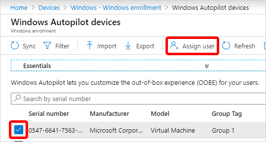

# Create device groups for Windows Autopilot

> [!NOTE]
>
> HoloLens 2 devices require Windows Autopilot self-deploying mode. For more information about using Windows Autopilot to deploy HoloLens 2 devices, see [Windows Autopilot for HoloLens 2](/hololens/hololens2-autopilot). **Assign to User** isn't applicable for self-deployment Autopilot mode on HoloLens 2.

## Create an Autopilot device group using Intune

1. In the [Microsoft Intune admin center](https://go.microsoft.com/fwlink/?linkid=2109431), select **Groups** > **New group**.

1. In **New Group**, configure the following properties:

    - **Group type**: Select **Security**.

    - **Group name** and **Group description**: Enter a name and description for your group.

    - **Azure AD roles can be assigned to the group**: Select **No**, Azure AD roles aren't assigned to this group.

      For more information, see [Use cloud groups to manage role assignments in Azure AD](/azure/active-directory/roles/groups-concept).

    - **Membership type**: Choose how devices become members of this group. Select **Dynamic Device**. For more information, see [Add groups to organize users and devices](/mem/intune/fundamentals/groups-add).

    - **Owners**: Select users that own the group. Owners can also delete this group.

    - **Dynamic device members**: Select **Add dynamic query** > **Add expression**.

      Create rules using Autopilot device attributes. Autopilot devices that meet these rules are automatically added to the group. Creating an expression using non-autopilot attributes doesn't guarantee that devices included in the group are registered to Autopilot.

      When creating expressions:

      - To create a group that includes all of your Autopilot devices, enter: `(device.devicePhysicalIDs -any (_ -contains "[ZTDID]"))`.

      - Intune's group tag field maps to the `OrderID` attribute on Azure AD devices. To create a group that includes all Autopilot devices with a specific group tag (the Azure AD device `OrderID`), enter: `(device.devicePhysicalIds -any (_ -eq "[OrderID]:179887111881"))`.

      - To create a group that includes all your Autopilot devices with a specific Purchase Order ID, enter: `(device.devicePhysicalIds -any (_ -eq "[PurchaseOrderId]:76222342342"))`

      **Save** your expressions.

1. Select **Create**.

> [!NOTE]
>
> Anything assigned to these attributes is only assigned if the device is registered with Autopilot.

For a detailed tutorial on creating a device group for each of the Windows Autopilot scenarios using Intune, see the following links:

- [User-driven Azure AD join: Create a device group](tutorial/user-driven/azure-ad-join-device-group.md).
- [User-driven hybrid Azure AD join: Create a device group](tutorial/user-driven/hybrid-azure-ad-join-device-group.md).
- [Pre-provision Azure AD join: Create a device group](tutorial/pre-provisioning/azure-ad-join-device-group.md).
- [Pre-provision hybrid Azure AD join: Create a device group](tutorial/pre-provisioning/hybrid-azure-ad-join-device-group.md).
- [Self-deploying mode: Create a device group](tutorial/self-deploying/self-deploying-device-group.md).

## Add devices

The dynamic device group that includes Autopilot devices automatically adds existing Autopilot devices to the device group. To manually add new devices as Windows Autopilot devices using a CSV file so that they become part of the device group, see [Manually register devices with Windows Autopilot](add-devices.md).

## Assign a user to a specific Autopilot device

You can assign a licensed Intune user to a specific Autopilot device. For supported OEMs, this assignment will:

- Pre-populate the Azure Active Directory (Azure AD) User Principal Name (UPN) under the pre-provisioning landing page and Azure AD sign in page.
- Allows setting of a custom greeting name.

For more information including a list of supported OEMs, see [Return of key functionality for Windows Autopilot sign-in and deployment experience](https://techcommunity.microsoft.com/t5/intune-customer-success/return-of-key-functionality-for-windows-autopilot-sign-in-and/ba-p/3583130).

> [!NOTE]
>
> Assigning a licensed user to a specific Autopilot device only impacts pre-populating the UPN and setting of a custom greeting name. It doesn't impact assigned policies and applications that are deployed to the device or to the user. The assigned policies and applications are still deployed regardless of the OEM. For more information, see [Windows Autopilot for pre-provisioned deployment](pre-provision.md#preparation).

Prerequisites:

- Azure Active Directory [Company Branding](/azure/active-directory/fundamentals/customize-branding) has been configured.

> [!IMPORTANT]
>
> Assigning a user to a specific Autopilot device doesn't work if you're using ADFS.

1. In the [Microsoft Intune admin center](https://go.microsoft.com/fwlink/?linkid=2109431), choose **Devices** > **Windows** > **Windows enrollment** > **Windows Autopilot Deployment Program** > **Devices** > choose the device > **Assign user**.

    

1. Choose an Azure user licensed to use Intune and choose **Select**.

    

1. In the **User Friendly Name** box, type a friendly name or just accept the default.

1. Choose **Save**.

For a detailed tutorial on assigning a user for each of the Windows Autopilot scenarios using Intune, see the following articles:

- [User-driven Azure AD join: Assign Autopilot device to a user](tutorial/user-driven/azure-ad-join-assign-device-to-user.md).
- [User-driven hybrid Azure AD join: Assign Autopilot device to a user](tutorial/user-driven/hybrid-azure-ad-join-assign-device-to-user.md).
- [Pre-provision Azure AD join: Assign Autopilot device to a user](tutorial/pre-provisioning/azure-ad-join-assign-device-to-user.md).
- [Pre-provision hybrid Azure AD join: Assign Autopilot device to a user](tutorial/pre-provisioning/hybrid-azure-ad-join-assign-device-to-user.md).

## Using Autopilot in other portals

If you aren't interested in mobile device management, you can use Autopilot in other portals. While using other portals is an option, we recommend you only use Intune to manage your Autopilot deployments. When you use Intune and another portal, Intune isn't able to:

- Display changes to profiles created in Intune, but edited in another portal.
- Synchronize profiles created in another portal.
- Display changes to profile assignments done in another portal.
- Synchronize profile assignments done in another portal.
- Display changes to the device list that were made in another portal.

## Windows Autopilot for existing devices

You can group Windows devices by a correlator ID when enrolling using [Autopilot for existing devices](tutorial/existing-devices/existing-devices-workflow.md) through Configuration Manager. The correlator ID is a parameter of the Autopilot configuration file. The [Azure AD device attribute enrollmentProfileName](/azure/active-directory/users-groups-roles/groups-dynamic-membership#rules-for-devices) is automatically set to equal **OfflineAutopilotprofile-\<correlator ID\>**. Using the correlator ID from the **enrollmentprofileName** attribute, arbitrary Azure AD dynamic groups can be created.

>[!WARNING]
>
> Because the correlator ID isn't pre-listed in Intune, the device may report any correlator ID they want. If the user creates a correlator ID matching an Autopilot or Apple ADE profile name, the device is added to any dynamic Azure AD device group based off the enrollmentProfileName attribute. To avoid this conflict:
>
> - Always create dynamic group rules matching against the *entire* **enrollmentProfileName** value
> - Never name Autopilot or Apple ADE profiles beginning with **OfflineAutopilotprofile-**.

If you want all devices in the groups to automatically register to Autopilot, in any Autopilot profiles assigned to the groups, set the setting **Convert all targeted devices to Autopilot** to **Yes**. All non-Autopilot devices in assigned groups register with the Autopilot deployment service. Allow 48 hours for the registration to be processed. When the device is unenrolled and reset, Autopilot enrolls it again. After a device is registered in this way, disabling this setting or removing the profile assignment won't remove the device from the Autopilot deployment service. You must remove the device by deregistering the device from Autopilot. For more information on how to properly deregister a device, see [Deregister a device](registration-overview.md#deregister-a-device).

For a full tutorial on Windows Autopilot for existing devices, see [Step by step tutorial for Windows Autopilot deployment for existing devices in Intune and Configuration Manager](tutorial/existing-devices/existing-devices-workflow.md).

## Next steps

After you have created a device group, you can configure and apply a Windows Autopilot deployment profile to each device in the group. Deployment profiles determine the deployment mode, and customize the OOBE for your end users. For more information, see [Configure deployment profiles](profiles.md).

For a detailed tutorial on configuring and assigning a Windows Autopilot deployment profile for each of the Windows Autopilot scenarios using Intune, see the following articles:

- [User-driven Azure AD join: Create and assign user-driven Azure AD join Autopilot profile](tutorial/user-driven/azure-ad-join-autopilot-profile.md)
- [User-driven hybrid Azure AD join: Create and assign user-driven hybrid Azure AD join Autopilot profile](tutorial/user-driven/hybrid-azure-ad-join-autopilot-profile.md)
- [Pre-provision Azure AD join: Create and assign a pre-provisioned Azure AD join Autopilot profile](tutorial/pre-provisioning/azure-ad-join-autopilot-profile.md)
- [Pre-provision hybrid Azure AD join: Create and assign a pre-provisioned hybrid Azure AD join Autopilot profile](tutorial/pre-provisioning/hybrid-azure-ad-join-autopilot-profile.md)
- [Self-deploying mode: Create and assign self-deploying Autopilot profile](tutorial/self-deploying/self-deploying-autopilot-profile.md)

For more information about managing your Windows Autopilot devices, see [What is Microsoft Intune device management?](/mem/intune/remote-actions/device-management)
