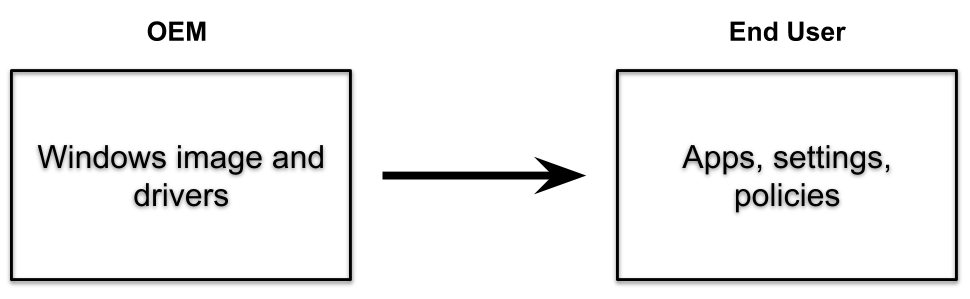

# Windows Autopilot for pre-provisioned deployment (Public preview)

**Applies to:**

- Windows 11
- Windows 10, version 1903 or later

> [!NOTE]
> The Windows Autopilot white glove feature has been renamed to **Windows Autopilot for pre-provisioned deployment**. All references in this documentation to **white glove** have been replaced with: **pre-provisioning**.  The term **white glove** might still appear in some blogs and other articles about Windows Autopilot. These references correspond to the pre-provisioning process described in this article.

Windows Autopilot helps organizations easily provision new devices by using the preinstalled OEM image and drivers. This functionality lets end users get their devices business-ready by using a simple process.

Windows Autopilot can also provide a _pre-provisioning_ service that helps partners or IT staff pre-provision a fully configured and business-ready Windows PC. From the end user's perspective, the Windows Autopilot user-driven experience is unchanged, but getting their device to a fully provisioned state is faster.

With **Windows Autopilot for pre-provisioned deployment**, the provisioning process is split. The time-consuming portions are done by IT, partners, or OEMs. The end user simply completes a few necessary settings and policies and then they can begin using their device.

Pre-provisioned deployments use Microsoft Intune in Windows 10, version 1903 and later. Such deployments build on existing Windows Autopilot [user-driven scenarios](user-driven.md) and support user-driven mode scenarios for both Azure Active Directory joined and Hybrid Azure Active Directory joined devices.

## Prerequisites

In addition to [Windows Autopilot requirements](software-requirements.md), Windows Autopilot for pre-provisioned deployment also requires:

- Windows 10, version 1903 or later, or Windows 11
- Windows Pro, Enterprise, or Education editions
- An Intune subscription.
- Physical devices that support TPM 2.0 and device attestation. Virtual machines aren't supported. The pre-provisioning process uses Windows Autopilot self-deploying capabilities, so TPM 2.0 is required. The TPM attestation process also requires access to a set of HTTPS URLs that are unique for each TPM provider. For more information, see the entry for Autopilot self-Deploying mode and Autopilot pre-provisioning in [Networking requirements](networking-requirements.md#tpm).
- Network connectivity. Using wireless connectivity requires selecting region, language and keyboard before you're able to connect and start provisioning.

> [!IMPORTANT]
>
> - Because the OEM or vendor performs the pre-provisioning process, this **doesn't require access to an end-user's on-prem domain infrastructure**. This is unlike a typical hybrid Azure AD-joined scenario because rebooting the device is postponed. The device is resealed before the time when connectivity to a domain controller is expected, and the domain network is contacted when the device is unboxed on-prem by the end-user.
>
> - See [Windows Autopilot known issues](known-issues.md) and [Troubleshoot Autopilot device import and enrollment](troubleshoot-device-enrollment.md) to review known errors and solutions.

## Preparation

Devices slated for pre-provisioning are registered for Autopilot via the normal registration process.

To be ready to try out Windows Autopilot for pre-provisioned deployment, make sure that you can first successfully use existing Windows Autopilot user-driven scenarios:

- User-driven Azure AD join. Make sure that you can deploy devices using Windows Autopilot and join them to an Azure Active Directory tenant.
- User-driven with Hybrid Azure AD join. Make sure that you can deploy devices using Windows Autopilot, join them to an on-premises Active Directory domain, and register them with Azure Active Directory to enable the features of hybrid Azure AD join.

If these scenarios can't be completed, Windows Autopilot for pre-provisioned deployment also doesn't succeed since it builds on top of these scenarios.

Before starting the pre-provisioning process in the provisioning service facility, you must configure another Autopilot profile setting by using your Intune account:

:::image type="content" source="images/allow-white-glove-oobe.png" alt-text="Screenshot of the Out-of-box experience (OOBE) portal and the highlighted setting to allow pre-provisioning":::

The pre-provisioning process applies all device-targeted policies from Intune. Those policies include certificates, security templates, settings, apps, and more - anything targeting the device. Additionally, any Win32 or LOB apps are installed if they meet the following conditions:

- Configured to install in the device context.
- Assigned to either the device or to the user preassigned to the Autopilot device.

> [!IMPORTANT]
> Make sure not to target both win32 and LOB apps to the same device. For more information, see [Add a Windows line-of-business app to Microsoft Intune](/mem/intune/apps/lob-apps-windows).

> [!NOTE]
> Select the language mode as user specified in Autopilot profiles to ensure easy access into pre-provisioning mode. The pre-provisioning technician phase will install all device-targeted apps and any user-targeted, device-context apps that are targeted to the assigned user. If there's no assigned user, then it will only install the device-targeted apps. Other user-targeted policies will not apply until the user signs into the device. To verify these behaviors, be sure to create appropriate apps and policies targeted to devices and users.

## Scenarios

Windows Autopilot for pre-provisioned deployment supports two distinct scenarios:

- User-driven deployments with Azure AD join. The device is joined to an Azure AD tenant.
- User-driven deployments with hybrid Azure AD join. The device is joined to an on-premises Active Directory domain, and separately registered with Azure AD.

Each of these scenarios consists of two parts, a technician flow and a user flow. At a high level, these parts are the same for Azure AD join and hybrid Azure AD join. The differences are primarily seen by the end user in the authentication steps.

### Technician flow

After the customer or IT Admin has targeted all the apps and settings they want for their devices through Intune, the pre-provisioning technician can begin the pre-provisioning process. The technician could be a member of the IT staff, a services partner, or an OEM - each organization can decide who should perform these activities. Regardless of the scenario, the process done by the technician is the same:

- Boot the device.
- From the first OOBE screen (which could be a language selection, locale selection screen, or the Azure AD sign-in page), don't select **Next**. Instead, press the Windows key five times to view another options dialog. From that screen, choose the **Windows Autopilot provisioning** option and then select **Continue**.

 

- On the **Windows Autopilot Configuration** screen, it displays the following information about the device:
  - The Autopilot profile assigned to the device.
  - The organization name for the device.
  - The user assigned to the device (if there's one).
  - A QR code containing a unique identifier for the device. You can use this code to look up the device in Intune, which you might want to do to make configuration changes. For example, assign a user or add the device to groups needed for app or policy targeting.

    > [!NOTE]
    > The QR codes can be scanned using a companion app. The app also configures the device to specify who it belongs to. An [open-source sample of the companion app](https://github.com/Microsoft/WindowsAutopilotCompanion) that integrates with Intune by using the Graph API has been published to GitHub by the Autopilot team.

- Validate the information displayed. If any changes are needed, make the changes, and then select **Refresh** to redownload the updated Autopilot profile details.

 

- Select **Provision** to begin the provisioning process.

If the pre-provisioning process completes successfully:

- A green status screen appears with information about the device, including the same details presented previously. For example, Autopilot profile, organization name, assigned user, and QR code. The elapsed time for the pre-provisioning steps is also provided.
 
- Select **Reseal** to shut down the device. At that point, the device can be shipped to the end user.

> [!NOTE]
> Technician flow inherits behavior from [self-deploying mode](self-deploying.md). Per the Self-Deploying Mode documentation, it uses the Enrollment Status Page to hold the device in a provisioning state and prevent the user from proceeding to the desktop after enrollment but before software and configuration is done applying. As such, if Enrollment Status Page is disabled, the reseal button may appear before software and configuration is done applying letting you proceed to the user flow before technician flow provisioning is complete. The green screen validates that enrollment was successful, not that the technician flow is necessarily complete.

If the pre-provisioning process fails:

- A red status screen appears with information about the device, including the same details presented previously. For example, Autopilot profile, organization name, assigned user, and QR code. The elapsed time for the pre-provisioning steps is also provided.
- Diagnostic logs can be gathered from the device, and then it can be reset to start the process over again.

### User flow

If the pre-provisioning process completed successfully and the device was resealed, you can deliver to the end user. The end user completes the normal Windows Autopilot user-driven process following these steps:

- Power on the device.
- Select the appropriate language, locale, and keyboard layout.
- Connect to a network (if using Wi-Fi). Internet access is always required. If using hybrid Azure AD Join, there must also be connectivity to a domain controller.
- If using Azure AD join, on the branded sign-on screen, enter the user's Azure Active Directory credentials.
- If using hybrid Azure AD Join, the device will reboot; after the reboot, enter the user's Active Directory credentials.
  > [!NOTE]
  > 
  > In certain circumstances, Azure AD credentials may also be prompted for during a hybrid Azure AD join scenario. For example, if ADFS isn't being used.
- More policies and apps are delivered to the device, as tracked by the Enrollment Status Page (ESP). Once complete, the user can access the desktop.

A change was made in the 2021.09C release to rerun the device ESP during the user flow so that both device and user ESP run when the user logs in. This change allows ESP to install other policies that may have been assigned to the device after it was provisioned in the technician phase.  

> [!NOTE]
> If the Microsoft Account Sign-In Assistant (wlidsvc) is disabled during the Technician Flow, the Azure AD sign in option may not show. Instead, users are asked to accept the EULA, and create a local account, which may not be what you want.

## Related articles

[Pre-provisioning video](https://youtu.be/nE5XSOBV0rI)
