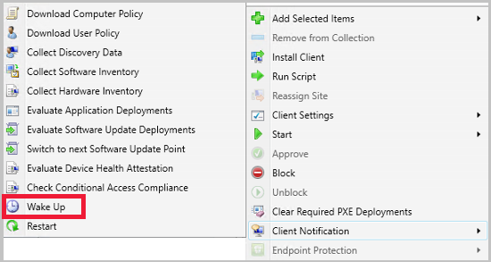
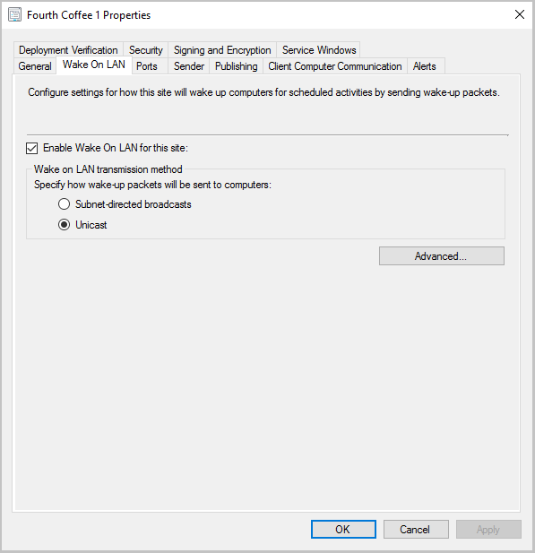

# How to configure Wake on LAN in Configuration Manager

*Applies to: Configuration Manager (current branch)*

Specify Wake on LAN (WoL) settings for Configuration Manager when you want to bring computers out of a sleep state.

##  Wake on LAN starting in version 1810
<!--3607710-->
Starting in Configuration Manager 1810, there's a new way to wake up sleeping machines. You can wake up clients from the Configuration Manager console, even if the client isn't on the same subnet as the site server. If you need to do maintenance or query devices, you're not limited by remote clients that are asleep. The site server uses the client notification channel to identify other clients that are awake on the same remote subnet, then uses those clients to send a wake on LAN request (magic packet). Using the client notification channel helps avoid MAC flaps, which could cause the port to be shut down by the router. The new version of Wake on LAN can be enabled at the same time as the [older version](#bkmk_wol-previous).

### Prerequisites and limitations
<!--7323898, 7363492-->
- At least one client in the target subnet must be awake.
- This feature doesn't support the following network technologies:
   - IPv6
   - 802.1x network authentication
      - 802.1x network authentication may work with additional configuration depending on the hardware and its configuration.
- DHCP lease durations can't be set to infinite. <!--8018584-->
   - With Configuration Manager version 2010 and later, if the DHCP lease is set to infinite a client won't be woken up or used as a peer to wake other devices. 
   - With Configuration Manager version 2006 and earlier, you may see the SleepAgent_&lt;*domain*\>@SYSTEM_0.log become very large and possibly a broadcast storm in environments where DHCP leases are set to infinite. 

Limitations for Configuration Manager version 2006 and earlier:
- Machines only wake when you notify them through the **Wake Up** client notification.
   - For wake-up when a deadline occurs, the older version of Wake on LAN is used.
      - Starting in Configuration Manager version 2010, you can wake up at deadline with the new version of WoL. For more information, see [Notify client to wake when a deployment deadline occurs](#bkmk_deadline).
   - If the older version isn't enabled, client wake-up won't occur for deployments created with the settings **Use Wake-on-LAN to wake up clients for required deployments** or **Send wake-up packets**.
 
### Security role permissions

- **Notify resource** under the Collection category

### Configure the clients to use Wake on LAN starting in version 1810

Previously you had to manually enable the client for wake on LAN in the properties of the network adapter. Configuration Manager 1810 includes a new client setting called **Allow network wake-up**. Configure and deploy this setting instead of modifying the properties of the network adapter.

1. Under **Administration**, go to **Client Settings**.
1. Select the client settings you want to edit, or create new custom client settings to deploy. For more information, see [How to configure client settings](configure-client-settings.md).
1. Under the **Power Management** client settings, select **Enable** for the **Allow network wake-up** setting. For more information about this setting, see [About client settings](about-client-settings.md#power-management).

4. Starting in Configuration Manager 1902, the new version of Wake on LAN honors the custom UDP port you specify for the **Wake On LAN port number (UDP)** [client setting](about-client-settings.md#power-management). This setting is shared by both the new and older version of Wake on LAN.
 
<!--3605925-->

### Wake up a client using client notification starting in 1810
 
You can wake up a single client or any sleeping clients in a collection. For devices that are already awake in the collection, no action is taken for them. Only clients that are asleep will be sent a Wake on LAN request. For more information on how to notify a client to wake, see [Client notification](../manage/client-notification.md).

- **To wake up a single client:**
Right-click on the client, go to **Client Notification**, then select **Wake up**.

   

- **To wake up all sleeping clients in a collection:** Right-click on the device collection, go to **Client Notification**, then select **Wake up**.
   - This action can't be run on built-in collections.
   - When you have a mix of asleep and awake clients in a collection, only the clients that are asleep are sent a Wake on LAN request.
   - Starting in Configuration Manager 2002, this action is available from a console connected to a Central Administration site, a stand-alone site, or child primary site.
   - In versions 1910 and earlier, this action is only active when the Configuration Manager console is connected to a stand-alone or child primary site. When connected to a Central Administration Site, the action isn't available.

###  Wake machine at deployment deadline using peer clients on the same remote subnet
<!--3734819-->
*(Introduced in version 2010)*

Starting in Configuration Manager version 2010, you can allow the site to wake devices at the deadline of a deployment, using the client notification channel. Instead of the site server issuing the magic packet directly, the site uses the client notification channel to find an online machine in the last known subnet of the target device(s) and instructs the online client to issue the WoL packet for the target device.

#### Prerequisites for waking a client at deadline using the client notification channel

Target computer prerequisites:
- Offline
- Updated to latest Configuration Manager client version
- Targeted with a **Required** deployment with a **Deadline** and the **Send wake-up packages** option enabled.

Prerequisites for the computer sending the WoL magic packet to the target computer:
- Online
- Updated to latest client version
- On the same subnet as the target computer

#### Enable waking a client at deadline using the client notification channel

1. At the site level, enable Wake on LAN:
   1. In the Configuration Manager console, go to **Administration > Site Configuration > Sites**.
   1. Select the primary site to configure, and then choose **Properties**.
   1. In the **Wake on LAN** tab, select **Enable Wake On LAN for this site** and send the wake-up packets **Using client notification channel**.
   1. Select **OK** and repeat the procedure for all primary sites in the hierarchy.
       :::image type="content" source="./media/3734819-wol-site-setting.png" alt-text="Site properties for using client notification channel for WoL" lightbox="./media/3734819-wol-site-setting.png":::

1. Verify **Allow network wake-up** under the [**Power Management** client settings](about-client-settings.md#power-management) is enabled.
1. Create a deployment as **Required** with the **Send wake-up packages** option and a **Deadline**. Clients are sent a notification when a deadline is received on deployments such as task sequences, software distribution, or software updates installation.

    :::image type="content" source="./media/3734819-wol-deployment.png" alt-text="Send wake-up packets option in the deployment wizard" lightbox="./media/3734819-wol-deployment.png":::

## What to expect when only the new version of Wake on LAN is enabled

When you have only the new version of Wake on LAN enabled, only the **Wake Up** client notification is enabled. Clients aren't sent a notification when a deadline is received on deployments such as task sequences, software distribution, or software updates installation. Once a sleeping machine is back online, it will be reflected in the console when it checks in with the Management Point.

- Starting in Configuration Manager version 1902, you can specify the Wake on LAN port. This setting is shared by both the new and older version of Wake on LAN.

- Starting in Configuration Manager version 2010, you can use the client notification channel to wake clients when a deadline is received on deployments such as task sequences, software distribution, or software updates installation. For more information, see [Use the client notification channel to  wake a client when a deployment deadline occurs](#bkmk_deadline).

## What to expect when both versions of Wake on LAN are enabled

When you have both versions of Wake on LAN enabled, you can use the **Wake Up** client notification and wake up on deadline. The client notification functions a little differently than traditional Wake on LAN. For a brief explanation of how the client notification works, see the [Wake on LAN starting in version 1810](#bkmk_wol-1810) section. The new client setting **Allow network wake-up** will change the NIC properties to allow Wake on LAN. You no longer need to manually change it for new machines that are added to your environment. All other functionality of Wake on LAN hasn't been changed.

- Starting in version 1902, the **Wake Up** client notification honors your existing **Wake On LAN port number (UDP)** setting.
- Starting in Configuration Manager version 2010, you can use the client notification channel to wake clients when a deadline is received on deployments such as task sequences, software distribution, or software updates installation. For more information, see [Use the client notification channel to  wake a client when a deployment deadline occurs](#bkmk_deadline).

##   Wake on LAN for version 1806 and earlier

Specify Wake on LAN settings for Configuration Manager when you want to bring computers out of a sleep state to install required software, such as software updates, applications, task sequences, and programs.

You can supplement Wake on LAN by using the wake-up proxy client settings. However, to use wake-up proxy, you must first enable Wake on LAN for the site and specify **Use wake-up packets only** and the **Unicast** option for the Wake on LAN transmission method. This wake-up solution also supports ad-hoc connections, such as a remote desktop connection.

Use the first procedure to configure a primary site for Wake on LAN. Then, use the second procedure to configure the wake-up proxy client settings. This second procedure configures the default client settings for the wake-up proxy settings to apply to all computers in the hierarchy. If you want these settings to apply to only selected computers, create a custom device setting and assign it to a collection that contains the computers that you want to configure for wake-up proxy. For more information about how to create custom client settings, see [How to configure client settings](../../../core/clients/deploy/configure-client-settings.md).

A computer that receives the wake-up proxy client settings will likely pause its network connection for 1-3 seconds. This pause occurs because the client must reset the network interface card to enable the wake-up proxy driver on it.

> [!WARNING]
> To avoid unexpected disruption to your network services, first evaluate wake-up proxy on an isolated and representative network infrastructure. Then use custom client settings to expand your test to a selected group of computers on several subnets. For more information about how wake-up proxy works, see [Plan how to wake up clients](../../../core/clients/deploy/plan/plan-wake-up-clients.md).

### To configure Wake on LAN for a site for version 1806 and earlier

 To use Wake on LAN, you need to enable it for each site in a hierarchy.

1. In the Configuration Manager console, go to **Administration > Site Configuration > Sites**.
2. Select the primary site to configure, and then choose **Properties**.
3. In the **Wake on LAN** tab, and configure the options that you require for this site. To support wake-up proxy, make sure you select **Use wake-up packets only** and **Unicast**. For more information, see [Plan how to wake up clients](../../../core/clients/deploy/plan/plan-wake-up-clients.md).
4. Select **OK** and repeat the procedure for all primary sites in the hierarchy.

### To configure wake-up proxy client settings

1. In the Configuration Manager console, go to **Administration > Client Settings**.
2. Select **Default Client Settings**, and then choose **Properties**.
3. Select **Power Management** and then choose **Yes** for **Enable wake-up proxy**.
4. Review and if necessary, configure the other wake-up proxy settings. For more information on these settings, see [Power management settings](../../../core/clients/deploy/about-client-settings.md#power-management).
5. Select **OK** to close the dialog box, and then **OK** to close the Default Client Settings dialog box.

You can use the following Wake On LAN reports to monitor the installation and configuration of wake-up proxy:

- Wake-Up Proxy Deployment State Summary
- Wake-Up Proxy Deployment State Details

> [!TIP]
> To test whether wake-up proxy is working, test a connection to a sleeping computer. For example, connect to a shared folder on that computer, or try connecting to the computer using Remote Desktop. If you use Direct Access, check that the IPv6 prefixes work by trying the same tests for a sleeping computer that is currently on the Internet.
