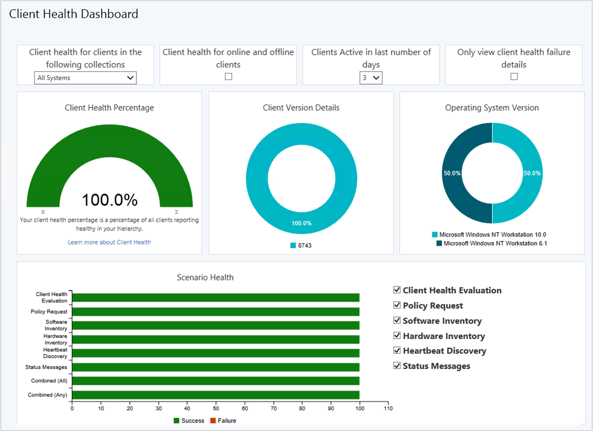

##  Client health dashboard
<!--3599209-->

You deploy software updates and other apps to help secure your environment, but these deployments only reach healthy clients. Unhealthy Configuration Manager clients adversely effect overall compliance. Determining client health can be challenging depending upon the denominator: how many total devices should be in your scope of management? For example, if you discover all systems from Active Directory, even if some of those records are for retired machines, this process increases your denominator. 

You can now view a dashboard with information about the health of Configuration Manager clients in your environment. View your client health, scenario health, and common errors. Filter the view by several attributes to see any potential issues by OS and client versions. 

In the Configuration Manager console, go to the **Monitoring** workspace. Expand **Client status**, and select the **Client health dashboard** node. 

> [!Tip]  
> There are no changes to ccmeval in this version.  

### Filters

At the top of the dashboard, there's a set of filters to adjust the data displayed in the dashboard.

- **Collection**: By default, the dashboard displays devices in the All Systems collection. Select a device collection from the list to scope the view to a subset of devices in a specific collection.  

- **Online/offline**: By default, the dashboard displays only online clients. This state comes from the client notification channel that update a client's status every five minutes. For more information, see [About client status](../../../../clients/manage/monitor-clients.md#about-client-status).  

- **Active \# days**: By default, the dashboard displays clients that are active in the last three days.  

- **Failure only**: Scope the view to only devices that are reporting a client health failure.  

    > [!Tip]  
    > Use this filter along with the client version and OS version tiles. For more information, see [Version tiles](#version-tiles). 

### Client health percentage

This tile shows the overall client health in your hierarchy. 

A healthy Configuration Manager client has the following properties: 
- Online  
- Actively sending data  
- Passes all client health evaluation checks  

For more information, see [About client status](../../../../clients/manage/monitor-clients.md#about-client-status).

A healthy client successfully communicates with the site. It reports all data based on the defined schedules in client settings.

Select a segment of this chart to drill down to a device list view.

### Version tiles

There are two tiles that show client health by Configuration Manager client version and OS version. These tiles are useful when you make changes to the filters, such as **Failure only**. They can help highlight whether any issues are consistent across a specific version. Use this information to help you make upgrade decisions. 

Select a segment of these charts to drill down to a device list view.

### Scenario health

This bar chart shows the overall health for the following core scenarios: 
- Client policy
- Heartbeat discovery
- Hardware inventory
- Software inventory
- Status messages

Use the selectors to adjust the focus on specific scenarios in the chart. 

The following two bars are always shown:

- **Combined (All)**: the combination of all scenarios (AND)  
- **Combined (Any)**: at least one of the scenarios (OR)

> [!Tip]  
> Scenario health isn't measured from your configuration of client settings. These values can vary based upon the resultant set of policy per device. Use the following steps to adjust the evaluation periods for scenario health:
> - In the Configuration Manager console, go to the **Monitoring** workspace, and select the **Client Status** node.  
> - In the ribbon, select **Client Status Settings**.  
> 
> By default, if a client doesn't send scenario-specific data in **7 days**, Configuration Manager considers it unhealthy for that scenario.

### Top 10 client health failures

This chart lists the most common failures in your environment. These errors come from Windows or Configuration Manager. 

<!-- The following list includes some of the more common failures overall:

#### Failure 1 title
Failure 1 description

Solution for failure 1 -->
