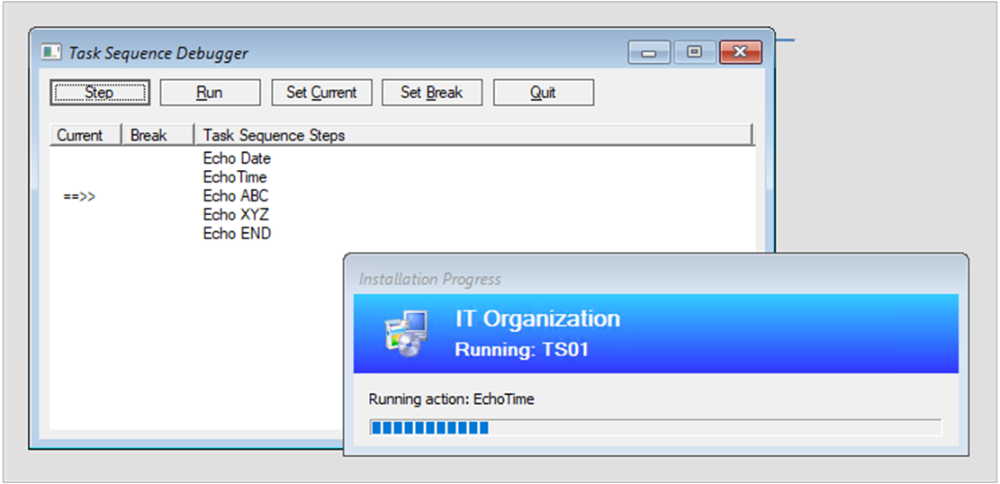

##  Task sequence debugger

<!--3612274-->

The task sequence debugger is a new troubleshooting tool. You deploy a task sequence in debug mode to a collection of one device. It lets you step through the task sequence in a controlled manner to aid troubleshooting and investigation.

### Prerequisites

- Update the Configuration Manager client on the target device

- Update the boot image associated with the task sequence to make sure it has the latest client version

### Try it out!

Try to complete the tasks. Then send [Feedback](../../../../understand/product-feedback.md) with your thoughts on the feature.

1. In the Configuration Manager console, go to the **Software Library** workspace, expand **Operating Systems**, and select **Task Sequences**.
1. Select a task sequence. In the Deployment group of the ribbon, select **Debug**.

    > [!Tip]  
    > Alternatively, set the variable **TSDebugMode** to `TRUE` on a collection to which the task sequence is deployed. This variable changes the behavior of any task sequence on any device in that collection.  

When the task sequence runs on the device in Windows PE, the Task Sequence Debugger window opens similar to the following screenshot:

The debugger includes the following controls:

- **Step**: From the *current* position, run only the next step in the task sequence.  

- **Run**: From the *current* position, run the task sequence normally to the end or the next *break* point.  

- **Set Current**: Select a step in the debugger and then select **Set Current**. This action moves the *current* pointer to that step. This action allows you to skip steps or move backwards.  

    > [!Warning]  
    > The debugger doesn't consider the type of step when you change the current position in the sequence. Some steps may fail or cause significant damage to a device if run out of order. Use this option at your own risk.  

- **Set Break**: Select a step in the debugger and then select **Set Break**. This action adds a *break* point in the debugger. When you **Run** the task sequence, it stops at a *break*.  

- **Quit**: Quit the debugger and stop the task sequence.  

### Known issues

The debugger currently only works in Windows PE.
