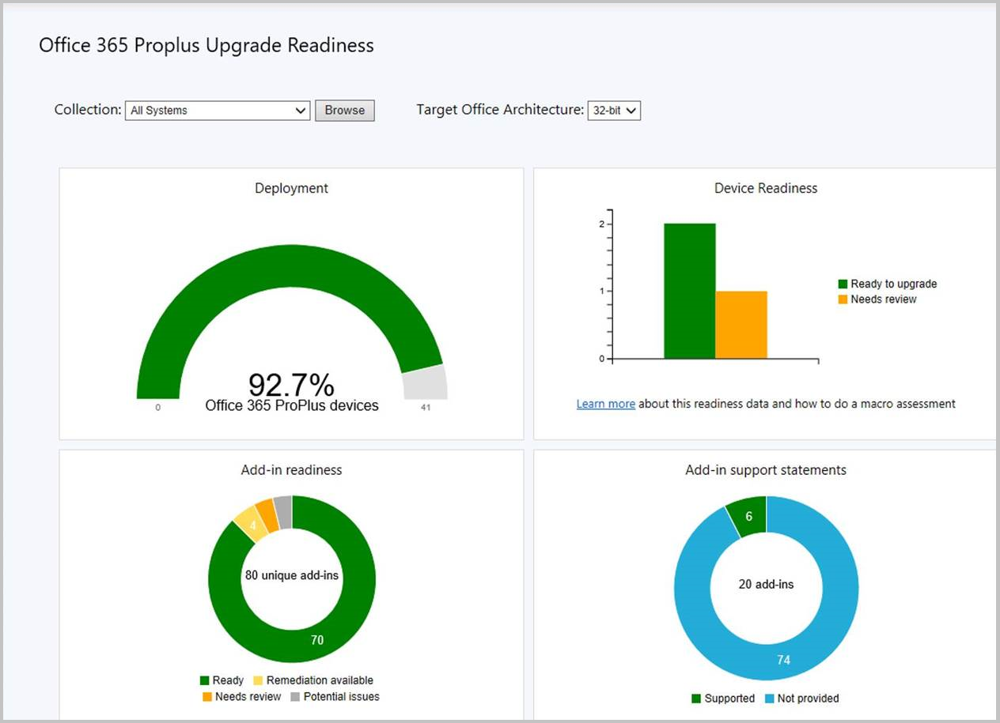
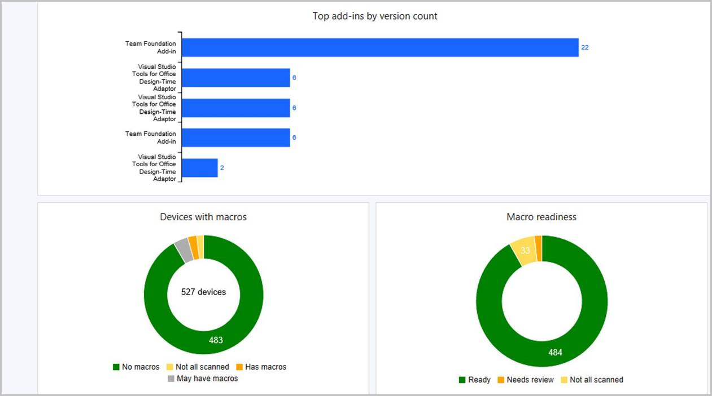
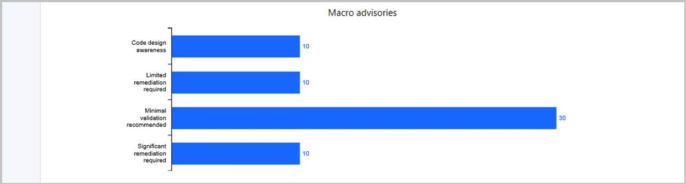

## Improvements to Office 365 ProPlus upgrade readiness dashboard
<!--4021125-->

We've made improvements to the **Office 365 ProPlus upgrade readiness** dashboard that released in [Technical Preview version 1904](../../technical-preview-1904.md#bkmk_o365). The following new tiles on this dashboard help you evaluate readiness:

- Deployment
- Macro advisories
- Top add-ins by count of version

In the Configuration Manager console, go to the **Software Library** workspace, expand **Office 365 Client Management**, and select the **Office 365 ProPlus Upgrade Readiness** node.

For more information on prerequisites and using this data, see [Integration for Microsoft 365 Apps readiness](/sccm/sum/deploy-use/office-365-dashboard#bkmk_o365_readiness).