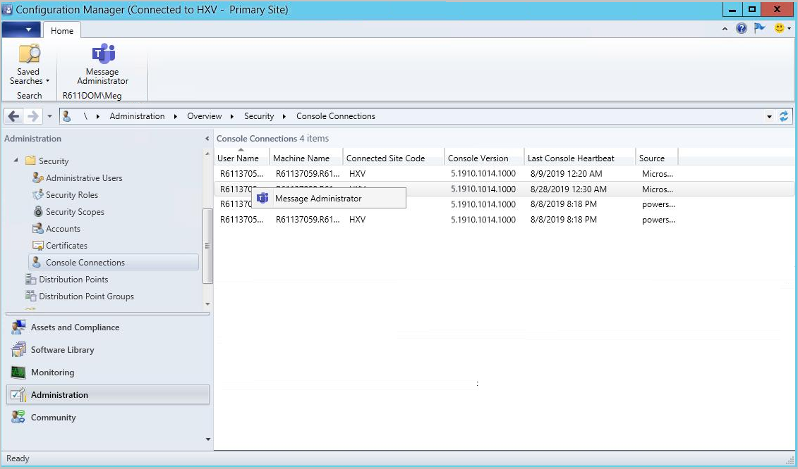

## Improvements to Console Connections
<!--4923997-->
We've made the following improvements to **Console Connections**:

- The ability to message other administrators through Microsoft Teams.
- The **Last Console Heartbeat** column has replaced the **Last Connected Time** column.
  - An open console in the foreground sends a heartbeat every 10 minutes.

### Prerequisites

- The [Administration Service](../../../../plan-design/hierarchy/plan-for-the-sms-provider.md#administration-service) must be enabled for the **Last Console Heartbeat** to function. 
- For messaging administrators, the account you want to message needs to have been discovered with [Microsoft Entra ID or AD User Discovery](../../../../servers/deploy/configure/about-discovery-methods.md#bkmk_aboutUser).

### Log files

For troubleshooting, refer to the **SmsAdminUI.log**.

### Known issues

The error message notifying you that Microsoft Teams isn't installed won't be displayed if the following Registry key doesn't exist:

Computer\HKEY_CURRENT_USER\SOFTWARE\Microsoft\Windows\CurrentVersion\Uninstall

To work around the issue, manually create the Registry key.

### Try it out!

Try to complete the tasks. Then send [Feedback](../../../../understand/product-feedback.md) with your thoughts on the feature.

1. Go to **Administration** > **Security** > **Console Connections**.
1. Notice the column **Last Console Heartbeat** has replaced the **Last Connected Time** column.
1. Right-click on a user's console connection and select **Message Administrator**.
    - If the User Principal Name isn't found for the selected administrator,  **Message Administrator** is grayed out.
    - An error message, including a download link, appears if Microsoft Teams isn't installed on the device from which you run the console.
    - If Microsoft Teams is installed on the device from which you run the console, it will open a chat with the user.

