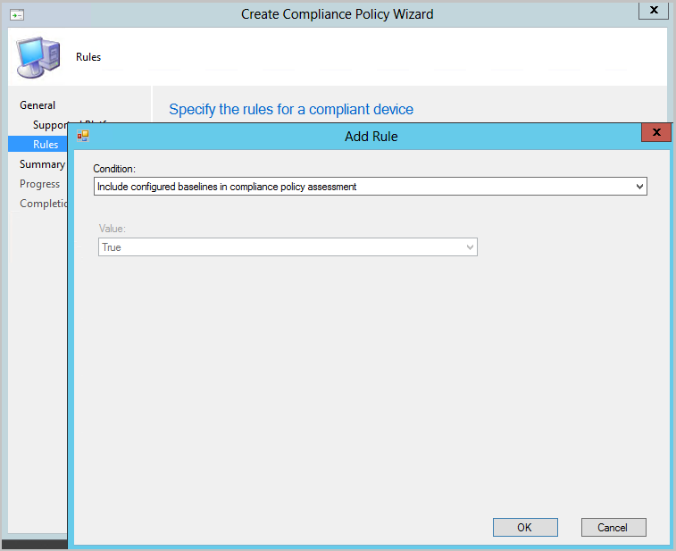

##  Include custom configuration baselines as part of compliance policy assessment

You can now add evaluation of custom configuration baselines as a compliance policy assessment rule. When you create or edit a configuration baseline, you have a new option, **Evaluate this baseline as part of compliance policy assessment**. When adding or editing a compliance policy rule, you have a new condition called **Include configured baselines in compliance policy assessment**.

When a user is part of a collection targeted with a compliance policy that includes the rule condition **Include configured baselines in compliance policy assessment**, any baselines with the **Evaluate this baseline as part of compliance policy assessment** option selected that are deployed to the user or the user's device are evaluated for compliance. For example:

- `User1` is part of `User Collection 1`.
- `User1` uses `Device1`, which is in `Device Collection 1` and `Device Collection 2`.
- `Compliance Policy 1` has the **Include configured baselines in compliance policy assessment** rule condition and is deployed to `User Collection 1`.
- `Configuration Baseline 1` has **Evaluate this baseline as part of compliance policy assessment** selected and is deployed to `Device Collection 1`.
- `Configuration Baseline 2` has **Evaluate this baseline as part of compliance policy assessment** selected and is deployed to `Device Collection 2`.

In this scenario, when `Compliance Policy 1` evaluates for `User1` using `Device1`, both `Configuration Baseline 1` and `Configuration Baseline 2` are evaluated too.

- `User1` sometimes uses `Device2`.
- `Device2`is a member of `Device Collection 2` and `Device Collection 3`.
- `Device Collection 3` has `Configuration Baseline 3` deployed to it, but **Evaluate this baseline as part of compliance policy assessment** isn't selected.

When `User1` uses `Device2`, only `Configuration Baseline 2` gets evaluated when `Compliance Policy 1` evaluates.

###  Log files

- ComplianceHandler.log
- SettingsAgent.log
- DCMAgent.log
- CIAgent.log

### Known issues
<!--5582516-->
If the compliance policy evaluates a new baseline that has never been evaluated on the client before, it may report non-compliance. This occurs if the baseline evaluation is still running when the compliance is evaluated. To workaround this issue, click **Check compliance** in the **Software Center**.

### Try it out!

Try to complete the tasks. Then send [Feedback](../../../../understand/product-feedback.md) with your thoughts on the feature.

#### Prerequisites when the devices are co-managed

- Make sure the [Compliance policies workload](../../../../../comanage/workloads.md#compliance-policies) is moved to either Pilot or Intune.
- From Intune's Windows 10 compliance policy, make sure that **Require** is set for [**Configuration Manager Compliance**](/mem/intune-service/protect/compliance-policy-create-windows#configuration-manager-compliance).

#### Create and deploy a compliance policy with a rule for baseline compliance policy assessment

1. In the **Assets and Compliance** workspace, expand **Compliance Settings**, then select the **Compliance Policies** node.
1. Click **Create Compliance Policy** in the ribbon to bring up the **Create Compliance Policy Wizard**.
1. On the **General** page, select **Compliance rules for devices managed with the Configuration Manager client**.
   - Devices must be managed with the Configuration Manager client to include custom configuration baselines as part of compliance policy assessment.
1. Select your platforms on the **Supported Platforms** pages.
1. On the **Rules** page, select **New**, then select the **Include configured baselines in compliance policy assessment** condition.

   

1. Click **OK**, then **Next** to get to the **Summary** page.
1. Verify your selections and click **Next** then **Close**.
1. In the **Compliance Policies** node, right-click on the policy you created, and select **Deploy**.
1. Choose your collection, alert generation settings, and your compliance evaluation schedule for the policy.
1. Click **OK** to deploy the compliance policy.

#### Select a configuration baseline and check "Evaluate this baseline as part of compliance policy assessment"

1. In the **Assets and Compliance** workspace, expand **Compliance Settings**, then select the **Configuration Baselines** node.
1. Right-click on an existing baseline that's deployed to a device collection, then select **Properties**.
   - The baseline must be deployed to a device collection, not a user collection.
1. Enable the **Evaluate this baseline as part of compliance policy assessment** setting.
1. Click **OK** to save the changes to your configuration baseline.

