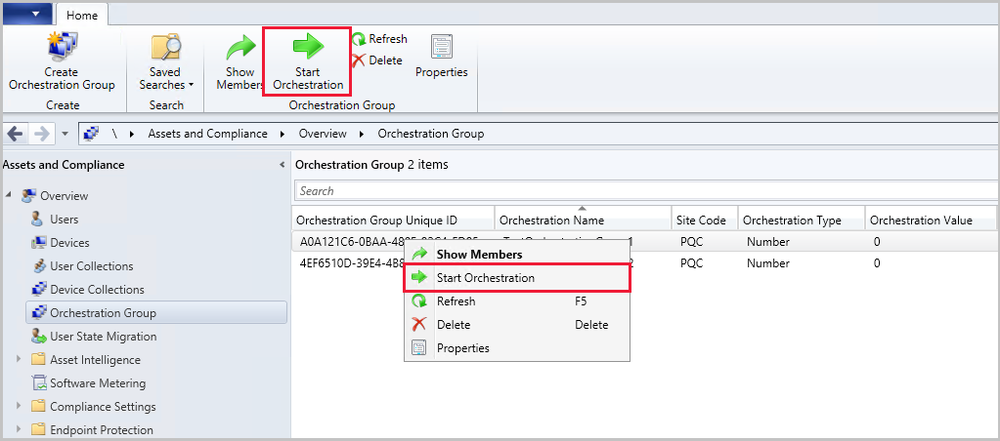

##  Improvements to Orchestration Groups
<!--3098816-->
Orchestration Groups are the evolution of the "Server Groups" feature. They were first introduced in the [technical preview for Configuration Manager, version 1909](../../../2019/technical-preview-1909.md#bkmk_OGs). We improved upon Orchestration Groups in [technical preview 2001](../../technical-preview-2001.md#bkmk_orch) by adding customizable timeouts, resource validation, and site code selection for member selection. Now, in this technical preview, we've added the following improvements to Orchestration Groups:

- You can change the settings of an existing Orchestration Group using in the **Properties**.
- **Start Orchestration**: You can now start orchestration for your groups. Select your Orchestration Group, then click **Start Orchestration** in the ribbon or from the right-click menu.

