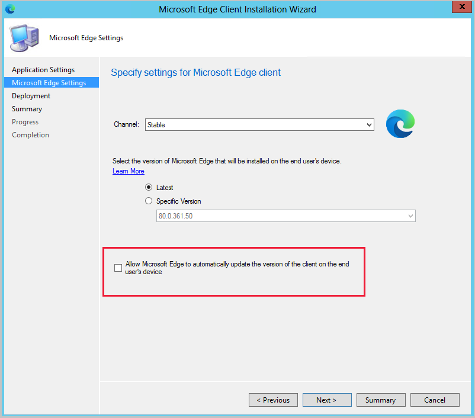

##  Improvements to Microsoft Edge management
<!--4561024-->

You can now create a Microsoft Edge application that's set up to receive automatic updates rather than having automatic updates disabled. This change allows you to choose to manage updates for Microsoft Edge with Configuration Manager or allow Microsoft Edge to automatically update. When creating the application, select **Allow Microsoft Edge to automatically update the version of the client on the end user's device** on the **Microsoft Edge Settings** page.

