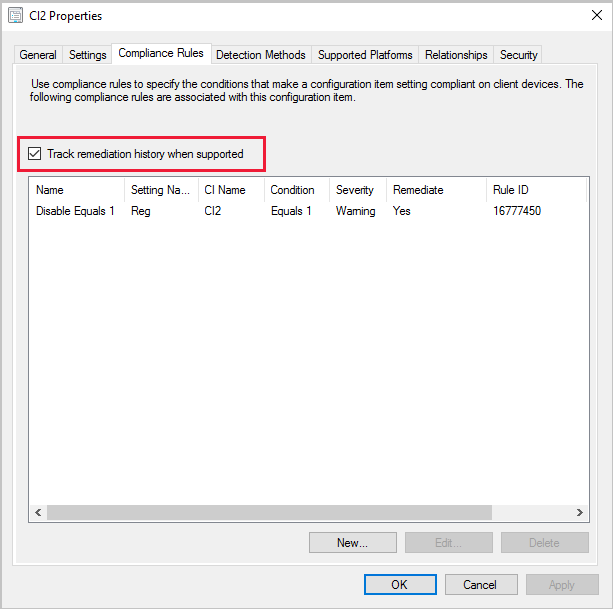

##  Track configuration item remediations
<!--42631411-->

You can now **Track remediation history when supported** on your configuration item compliance rules. When this option is enabled, any remediation that occurs on the client for the configuration item generates a state message. The history is stored in the Configuration Manager database.

Build custom reports to view the remediation history by using the public view **v_CIRemediationHistory**. The `RemediationDate` column is the time, in UTC, the client ran the remediation. The `ResourceID` identifies the device. Building custom reports with the **v_CIRemediationHistory** view helps you:

- Identify possible issues with your remediation scripts
- Find trends in remediations such as a client that is consistently non-compliant each evaluation cycle.

### Try it out!

Try to complete the tasks. Then send [Feedback](../../technical-preview-2003.md#bkmk_feedback) with your thoughts on the feature.

#### Enable the Track remediation history when supported option

- For new configuration items, add the **Track remediation history when supported** option in the **Compliance Rules** tab when you create a new setting on the wizard's **Settings** page.
- For existing configuration items, add the **Track remediation history when supported** option on the **Compliance Rules** tab in the configuration item **Properties**.

