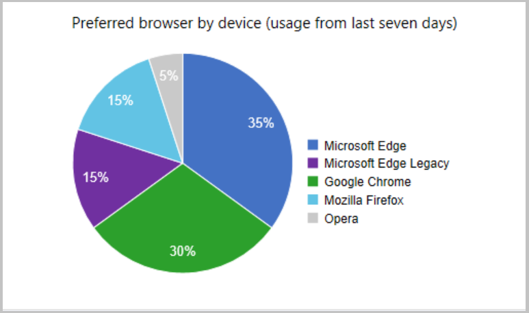

##  Improvements to Microsoft Edge Management dashboard
<!--5907383-->

The Microsoft Edge Management dashboard has a new **Preferred browser by device** chart. The chart gives you insights into which browser was most used by each device over the last seven days. If a user has two devices, they're counted separately since the primary browser used on each device might vary.

### Prerequisites

Enable the following properties in the below [hardware inventory](../../../../clients/manage/inventory/extend-hardware-inventory.md) classes for the new **Preferred browser by device** chart:

- **SMS_BrowserUsage (SMS_BrowserUsage)**
   - BrowserName
   - UsagePercentage

### View the dashboard

From the **Software Library** workspace, click **Microsoft Edge Management** to see the dashboard's new chart.
