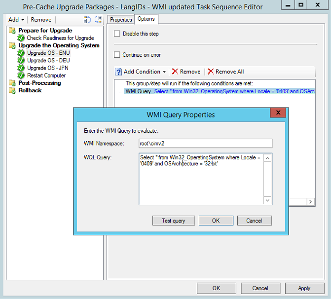

# Capabilities in Technical Preview 1611 for Configuration Manager

*Applies to: Configuration Manager (technical preview branch)*

This article introduces the features that are available in the Technical Preview for Configuration Manager, version 1611. You can install this version to update and add new capabilities to your Configuration Manager technical preview site. Before installing this version of the technical preview, review the introductory article, [Technical Preview for Configuration Manager](../../core/get-started/technical-preview.md), to become familiar with general requirements and limitations for using a technical preview, how to update between versions, and how to provide feedback about the features in a technical preview.

**Known Issues in this Technical Preview:**
- ***Prerequisite status***: When you install version 1611, the overall status for prerequisites might show as passed with warnings, but doesn't list which prerequisites caused the warnings. These warnings can be caused by the following two prerequisites:
  - SQL Server Index Create Memory options
  - Checks for supported SQL Server version

  Because these alerts are only warnings, they can be ignored.

- ***PowerShell***: When you connect to Windows PowerShell from the Configuration Manager console, you might receive the following error: **Microsoft.ConfigurationManagement.PowerShell.Types.ps1xml is not digitally signed**.

   You can resolve this issue by replacing certain files with signed versions from version 1610. Copy all files with the following extensions from the **&lt;install directory>\AdminConsole\bin\\** folder in your version 1610 installation: **.psd1**, **.ps1xml**, and **.psm1**. Paste these files into the **&lt;install directory>\AdminConsole\bin\\** folder in your Technical Preview 1611 installation, overwriting the 1611 version of the files.

**The following are new features you can try out with this version.**

## Pre-cache content for available deployments and task sequences
In this technical preview, for available deployments and task sequences, you can choose to use the pre-cache feature to have clients download only relevant content before a user installs the content.

For example, let's say you want to deploy a Windows 10 in-place upgrade task sequence, only want a single task sequence for all users, and have multiple architectures and/or languages. In Current Branch, if you create an available deployment, and then the user selects **Install** in Software Center, the content downloads at that time. This adds more time before the installation is ready to start. Alternatively, in Current Branch if you create an available task sequence deployment, all content referenced in the task sequence is downloaded. This includes the operating system upgrade package for all languages and architectures. If each is roughly 3 GB in size, the download package can be large.

The pre-cache content feature gives you the option to allow the client to only download the applicable content as soon as it receives the deployment. Therefore, when the user selects **Install** in Software Center, the content is ready and the installation starts quickly because the content is on the local hard drive.

### To configure the pre-cache feature

1. Create operating system upgrade packages for specific architectures and languages. Specify the architecture and language on the **Data Source** tab of the package. For the language, use the decimal conversion (for example, 1033 is the decimal for English and 0x0409 is the hexadecimal equivalent). For details, see [Create a task sequence to upgrade an operating system](../../osd/deploy-use/create-a-task-sequence-to-upgrade-an-operating-system.md).

    The architecture and language values are used to match task sequence step conditions that you'll create in the next step to determine whether the operating system upgrade package should be pre-cached.
2. Create a task sequence with conditional steps for the different languages and architectures. For example, for the English version you could create a step like:

    

    

3. Deploy the task sequence. For the pre-cache feature, do the following configuration:
    - On the **General** tab, select **Pre-download content for this task sequence**.
    - On the **Deployment settings** tab, configure the task sequence with the **Available** for **Purpose**. If you create a **Required** deployment, the pre-cache functionality won't work.
    - On the **Scheduling** tab, for the **Schedule when this deployment will be available** setting, choose a time in the future that gives clients enough time to pre-cache the content before the deployment is made available to users. For example, you can set the available time to be 3 hours in the future to allow enough time for the content to be pre-cached.
    - On the **Distribution Points** tab, configure the **Deployment options** settings. If the content isn't pre-cached on a client before a user starts the installation, these settings are used.

### User experience
- When the client receives the deployment policy, it starts to pre-cache the content. This content includes all referenced content (any other package types) and only the operating system upgrade package that matches the client based on the conditions that you set in the task sequence.
- When the deployment is made available to users (setting on the **Scheduling** tab of the deployment), a notification displays to inform users about the new deployment and the deployment becomes visible in Software Center. The user can go to Software Center and select **Install** to start the installation.
- If the content isn't fully pre-cached, then it uses the settings specified on the **Deployment Option** tab of the deployment. We recommend that there's sufficient time between when the deployment is created and the time in which the deployment becomes available to users to allow clients enough time to pre-cache the content.

## See Also
[Technical Preview for Configuration Manager](../../core/get-started/technical-preview.md)
