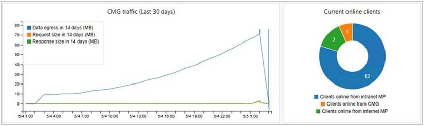
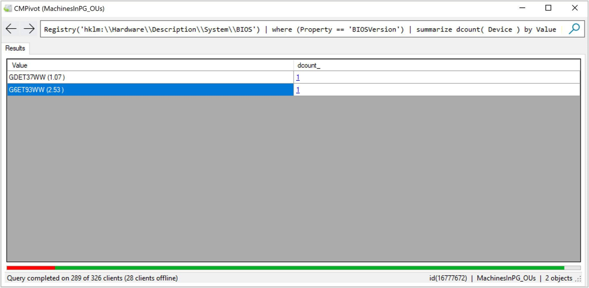

# Capabilities in Technical Preview 1805 for Configuration Manager

*Applies to: Configuration Manager (technical preview branch)*

This article introduces the features that are available in the Technical Preview for Configuration Manager, version 1805. You can install this version to update and add new capabilities to your technical preview site. 

Review the [Technical Preview](technical-preview.md) article before installing this update. That article familiarizes you with the general requirements and limitations for using a technical preview, how to update between versions, and how to provide feedback.     

<!--  Known Issues Template
## Known Issues in this Technical Preview

###  Known issue title
<!--bugID--
Issue description and cause.

#### Workaround
Steps to workaround, if any.  
-->

 

**The following are new features you can try out with this version.**  

## Create a phased deployment with manually configured phases for a task sequence
<!--1358148-->
You can now [create a phased deployment](../../osd/deploy-use/create-phased-deployment-for-task-sequence.md) with manually configured phases for a task sequence. You can add up to 10 additional phases from the **Phases** tab of the Create Phased Deployment wizard. 

### Try it out!
Follow the instructions to create a phased deployment where you manually configure all phases. Send [Feedback](capabilities-in-technical-preview-1804.md#bkmk_feedback) letting us know how it worked. 

1. In the **Software Library** workspace, expand **Operating Systems**, and select **Task Sequences**.  

2. Right-click on an existing task sequence and select **Create Phased Deployment**.  

3. On the **General** tab, give the phased deployment a name, description (optional), and select **Manually configure all phases**.  

4. On the **Phases** tab, click on **Add**.  

5. Specify a **Name** for the phase, and then browse to the target **Phase Collection**.  

6. On the **Phase Settings** tab, choose one option for each of the scheduling settings and select **Next** when complete.  

    - Criteria for success of the previous phase (This option is disabled for the first phase.)
        - **Deployment success percentage**: Specify percent of devices that successfully complete the deployment for the previous phase success criteria.  

    - Conditions for beginning this phase of deployment after success of the previous phase  
        - **Automatically begin this phase after a deferral period (in days)**: Choose the number of days to wait before beginning the next phase after the success of the previous phase. 
        - **Manually begin this phase of deployment**: Don't begin this phase automatically after success of the previous phase.  

    - Once a device is targeted, install the software
        - **As soon as possible**: Sets the deadline for installation on the device as soon as the device is targeted.
        - **Deadline time (relative to the time device is targeted)**: Sets deadline for installation a certain number of days after device is targeted.  
     
7. Complete the Phase Settings wizard.

8. On the **Phases** tab of the Create Phased Deployment wizard you can now add, remove, reorder, or edit the phases for this deployment.  

9. Complete the Create Phased Deployment wizard.  

## Cloud distribution point support for Azure Resource Manager
<!--1322209-->
When creating an instance of the [cloud distribution point](../servers/deploy/configure/install-cloud-based-distribution-points-in-microsoft-azure.md), the wizard now provides the option to create an **Azure Resource Manager deployment**. [Azure Resource Manager](/azure/azure-resource-manager/resource-group-overview) is a modern platform for managing all solution resources as a single entity, called a [resource group](/azure/azure-resource-manager/resource-group-overview#resource-groups). When deploying a cloud distribution point with Azure Resource Manager, the site uses Microsoft Entra ID to authenticate and create the necessary cloud resources. This modernized deployment does not require the classic Azure management certificate.  

The cloud distribution point wizard still provides the option for a **classic service deployment** using an Azure management certificate. To simplify the deployment and management of resources, we recommend using the Azure Resource Manager deployment model for all new cloud distribution points. If possible, redeploy existing cloud distribution points through Resource Manager.

Configuration Manager does not migrate existing classic cloud distribution points to the Azure Resource Manager deployment model. Create new cloud distribution points using Azure Resource Manager deployments, and then remove classic cloud distribution points. 

> [!IMPORTANT]  
> This capability does not enable support for Azure Cloud Service Providers (CSP). The cloud distribution point deployment with Azure Resource Manager continues to use the classic cloud service, which the CSP does not support. For more information, see [available Azure services in Azure CSP](/azure/cloud-solution-provider/overview/azure-csp-available-services).  

### Prerequisites  
- Integration with [Microsoft Entra ID](../clients/deploy/deploy-clients-cmg-azure.md). Microsoft Entra user discovery is not required.  

- The same [requirements for a cloud distribution point](../plan-design/hierarchy/use-a-cloud-based-distribution-point.md#bkmk_requirements), except for the Azure management certificate.  

### Try it out!  
 Try to complete the tasks. Then send [Feedback](capabilities-in-technical-preview-1804.md#bkmk_feedback) letting us know how it worked.

1. In the Configuration Manager console, **Administration** workspace, expand **Cloud Services**, and select **Cloud Distribution Points**. Click **Create Cloud Distribution Point** in the ribbon.   

2. On the **General** page, select **Azure Resource Manager deployment**. Click **Sign in** to authenticate with an Azure subscription administrator account. The wizard auto-populates the remaining fields from the Microsoft Entra subscription information stored during the integration prerequisite. If you own multiple subscriptions, select the desired subscription to use. Click **Next**.  

3. On the **Settings** page, provide the server PKI **Certificate file** as usual. This certificate defines the cloud distribution point **Service FQDN** used by Azure. Select the **Region**, and then select a resource group option to either **Create new** or **Use existing**. Enter the new resource group name, or select an existing resource group from the drop-down list.  

4. Complete the wizard.  

> [!NOTE]  
> For the selected Microsoft Entra server app, Azure assigns the subscription **contributor** permission.  

Monitor the service deployment progress with **cloudmgr.log** on the service connection point.

## Take actions based on management insights
<!--1357930-->
Some [management insights](../servers/manage/management-insights.md) now have the option to take an action. Depending upon the rule, this action exhibits one of the following behaviors:  

- Automatically navigate in the console to the node where you can take further action. For example, if the management insight recommends changing a client setting, taking action navigates to the Client Settings node. You can take further action by modifying the default or a custom client settings object.  

- Navigate to a filtered view based on a query. For example, taking action on the empty collections rule shows just these collections in the list of collections. Here you can take further action, such as deleting a collection or modifying its membership rules.  

The following management insight rules have actions in this release:
- Security
    - Unsupported antimalware client versions
- Software Center
    - Use the new version of Software Center
- Applications
    - Applications without deployments
- Simplified Management
    - Non-CB Client Versions
- Collections
    - Empty Collections 
- Cloud Services
    - Update clients to the latest Windows 10 version

## Transition device configuration workload to Intune using co-management
<!--1357903-->

You can now transition the device configuration workload from Configuration Manager to Intune after enabling co-management. Transitioning this workload lets you use Intune to deploy MDM policies, while continuing to use Configuration Manager for deploying applications. 

To transition this workload, go to the co-management properties page and move the slider bar from Configuration Manager to **Pilot** or **All**. For more information, see [Co-management for Windows 10 devices](../../comanage/overview.md).

> [!Note]  
> Moving this workload also moves the **Resource Access** and **Endpoint Protection** workloads, which are a subset of the device configuration workload.

When you transition this workload, you can still deploy settings from Configuration Manager to co-managed devices, even though Intune is the device configuration authority. This exception might be used to configure settings that are required by your organization but not yet available in Intune. Specify this exception on a Configuration Manager configuration baseline. Enable the option to **Always apply this baseline even for co-managed clients** when creating the baseline, or on the **General** tab of the properties of an existing baseline. 

## Enable distribution points to use network congestion control
<!--1358112-->

Windows Low Extra Delay Background Transport (LEDBAT) is a feature of Windows Server to help manage background network transfers. For distribution points running on supported versions of Windows Server, you can enable an option to help adjust network traffic. Clients only use network bandwidth when it's available. 

### Prerequisites
- A distribution point on Windows Server, version 1709.  

- There's no client prerequisite.<!--SCCMDocs issue 699-->  

### Try it out!
 Try to complete the tasks. Then send [Feedback](capabilities-in-technical-preview-1804.md#bkmk_feedback) letting us know how it worked.

1. In the Configuration Manager console, go to the **Administration** workspace. Select the **Distribution Points** node. Select the target distribution point, and click **Properties** in the ribbon.  

2. On the **General** tab, enable the option to **Adjust the download speed to use the unused network bandwidth (Windows LEDBAT)**.  

## Cloud management dashboard
<!--1358461-->
The new **cloud management dashboard** provides a centralized view for cloud management gateway (CMG) usage. When the site is onboarded with Microsoft Entra ID, it also displays data about cloud users and devices.  

The following screenshot is a portion of the cloud management dashboard showing two of the available tiles:  

This feature also includes the **CMG connection analyzer** for real-time verification to aid troubleshooting. The in-console utility checks the current status of the service, and the communication channel through the CMG connection point to any management points that allow CMG traffic.

### Prerequisites
- An active [cloud management gateway](../clients/manage/cmg/overview.md) used by internet-based clients.  

- The site onboarded to [Azure services](../servers/deploy/configure/azure-services-wizard.md) for cloud management.  

### Try it out!
Try to complete the tasks. Then send [Feedback](capabilities-in-technical-preview-1804.md#bkmk_feedback) letting us know how it worked.

#### Cloud management dashboard

In the Configuration Manager console, go to the **Monitoring** workspace. Select the **Cloud Management** node, and view the dashboard tiles.  

#### CMG connection analyzer

1. In the Configuration Manager console, go to the **Administration** workspace. Expand **Cloud Services** and select **Cloud management gateway**.  

2. Select the target CMG instance, and then select **Connection analyzer** in the ribbon.  

3. In the CMG connection analyzer window, select one of the following options to authenticate with the service:  

     1. **Microsoft Entra user**: use this option to simulate communication the same as a cloud-based user identity logged on to a Microsoft Entra joined Windows 10 device. Click **Sign In** to securely enter the credentials for this Microsoft Entra user account.  

     2. **Client certificate**: use this option to simulate communication the same as a Configuration Manager client with a [client authentication certificate](../clients/manage/cmg/configure-authentication.md#pki-certificate).  

4. Click **Start** to start the analysis. The results are displayed in the analyzer window. Select an entry to see more details in the Description field.  

## CMPivot
<!--1358456-->
Configuration Manager has always provided a large centralized store of device data, which customers use for reporting purposes. However, that data is only as good as the last time it was collected from clients. 

CMPivot is a new in-console utility that provides access to real-time state of devices in your environment. It immediately runs a query on all currently connected devices in the target collection and returns the results. You can then filter and group this data in the tool. By providing real-time data from online clients, you can more quickly answer business questions, troubleshoot issues, and respond to security incidents.

For example, in [mitigating speculative execution side channel vulnerabilities](https://techcommunity.microsoft.com/t5/configuration-manager-blog/additional-guidance-to-mitigate-speculative-execution-side/ba-p/274974), one of the requirements is to update the system BIOS. You can use CMPivot to quickly query on system BIOS information, and find clients that are not in compliance. 

In this screenshot, CMPivot displays two separate BIOS versions with a device count of one each. You can use this example query when you try out CMPivot:  
`Registry('hklm:\\Hardware\\Description\\System\\BIOS') | where (Property == 'BIOSVersion') | summarize dcount( Device ) by Value`  

You can click on the device count to drill down to see the specific devices. When displaying devices in CMPivot, you can right-click a device and select the following [client notification actions](../clients/manage/manage-clients.md#manage-clients-from-the-devices-node):
- Run Script
- Remote Control
- Resource Explorer

When right-clicking on a specific device, you can also pivot the view of the specific device to one of the following attributes:
- Autostart Commands
- Installed Products
- Processes
- Services
- Users
- Active Connections
- Missing Updates

### Prerequisites
- The target clients must be updated to the latest version.  

- The Configuration Manager administrator needs permissions to run scripts. For more information, see [Security roles for scripts](../../apps/deploy-use/create-deploy-scripts.md#bkmk_ScriptRoles).  

### Try it out!
Try to complete the tasks. Then send [Feedback](capabilities-in-technical-preview-1804.md#bkmk_feedback) letting us know how it worked.

1. In the Configuration Manager console, go to the **Assets and Compliance** workspace, and select **Device Collections**. Select a target collection, and click **Start CMPivot** in the ribbon to launch the tool.  

2. The interface provides further information about using the tool. 
     - You can manually enter query strings at the top, or click the links in the in-line documentation.
     - Click one of the **Entities** to add it to the query string. 
     - The links for **Table Operators**, **Aggregation Functions**, and **Scalar Functions** open language reference documentation in the web browser. CMPivot uses the same query language as [Azure Log Analytics](/azure/kusto/query/).

## Improved secure client communications
<!--1356889,1358228,1358460-->
Using HTTPS communication is recommended for all Configuration Manager communication paths, but can be challenging for some customers due to the overhead of managing PKI certificates. The introduction of Microsoft Entra integration reduces some but not all of the certificate requirements. 

This release includes improvements to how clients communicate with site systems. There are two primary goals for these improvements:  

- You can secure client communication without the need for PKI server authentication certificates.  

- Clients can securely access content from distribution points without the need for a network access account.  

> [!Note]  
> PKI certificates are still a valid option for customers that want to use it.  

###  Scenarios
The following scenarios benefit from these improvements:  

####  Scenario 1: Client to management point
<!--1356889-->
[Microsoft Entra joined devices](/azure/active-directory/devices/concept-azure-ad-join) can communicate through a cloud management gateway (CMG) with a management point configured for HTTP. The site server generates a certificate for the management point allowing it to communicate via a secure channel.   

> [!Note]  
> This behavior is changed from Configuration Manager current branch version 1802, which requires an HTTPS-enabled management point for this scenario. For more information, see [Enable management point for HTTPS](../clients/manage/cmg/configure-authentication.md#enable-management-point-for-https).  

####  Scenario 2: Client to distribution point
<!--1358228-->
A workgroup or Microsoft Entra joined client can download content over a secure channel from a distribution point configured for HTTP.   

####  Scenario 3 Microsoft Entra device identity 
<!--1358460-->
A Microsoft Entra joined or [hybrid Microsoft Entra device](/azure/active-directory/devices/concept-azure-ad-join-hybrid) without a Microsoft Entra user logged in can securely communicate with its assigned site. The cloud-based device identity is now sufficient to authenticate with the CMG and management point.  

### Prerequisites  

- A management point configured for HTTP client connections. Set this option on the **General** tab of the site system role properties.  

- A distribution point configured for HTTP client connections. Set this option on the **General** tab of the site system role properties. Do not enable the option to **Allow clients to connect anonymously**.  

- A cloud management gateway.  

- Onboard the site to Microsoft Entra ID for cloud management.  

    - If you have already met this prerequisite for your site, you need to update the Microsoft Entra application. In the Configuration Manager console, go to the **Administration** workspace, expand **Cloud Services**, and select **Microsoft Entra tenants**. Select the Microsoft Entra tenant, select the web application in the **Applications** pane, and then click **Update application setting** in the ribbon.  

- A client running Windows 10 version 1803 and joined to Microsoft Entra ID. (This requirement is technically only for [Scenario 3](#bkmk_token3).) 

### Try it out!
Try to complete the tasks. Then send [Feedback](capabilities-in-technical-preview-1804.md#bkmk_feedback) letting us know how it worked.

1. In the Configuration Manager console, go to the **Administration** workspace, expand **Site Configuration**, and select **Sites**. Select the site and click **Properties** in the ribbon.  

2. Switch to the **Client Computer Communication** tab. Select the option for **HTTPS or HTTP** and then enable the new option to **Use Configuration Manager-generated certificates for HTTP site systems**.  

See the earlier [list of scenarios](#bkmk_token) to validate.

> [!Tip]
> In this release, wait up to 30 minutes for the management point to receive and configure the new certificate from the site.

You can see these certificates in the Configuration Manager console. Go to the **Administration** workspace, expand **Security**, and select the **Certificates** node. Look for the **SMS Issuing** root certificate, as well as the site server role certificates issued by the SMS Issuing root.

### Known issues
- The user can't view in Software Center any applications targeted to them as available.  

- OS deployment scenarios still require the network access account.  

- Rapidly and repeatedly enabling and disabling the option to **Use Configuration Manager-generated certificates for HTTP site systems** may cause the certificate to not properly bind to the site system roles. No certificates issued by the "SMS Issuing" certificate are bound to a website in Windows Server Internet Information Services (IIS). To work around this issue, delete all certificates issued by "SMS Issuing" from the **SMS** certificate store in Windows, and then restart the smsexec service.

## Improvements for enabling third-party software update support
<!--1357605-->
As a result of your feedback on third-party software update support, this release further iterates on the integration with System Center Updates Publisher (SCUP). Configuration Manager technical preview [version 1803](capabilities-in-technical-preview-1803.md#enable-third-party-software-update-support-on-clients) added the ability to read the certificate from WSUS for third-party updates, and then deploy that certificate to clients. But you still needed to use the SCUP tool to create and manage the certificate for signing third-party software updates.

In this release, you can enable the Configuration Manager site to automatically configure the certificate. The site communicates with WSUS to generate a certificate for this purpose. Configuration Manager then continues to deploy that certificate to clients. This iteration removes the need to use the SCUP tool to create and manage the certificate. 

For more information on general use of the SCUP tool, see [System Center Updates Publisher](../../sum/tools/updates-publisher.md).

### Prerequisites
- Enable and deploy the client setting **Enable third party software updates** in the **Software Updates** group.
- If WSUS is on a separate server from the software update point, you must do one of the following options on the remote WSUS server:
    - Enable the Remote Registry service in Windows  
    or
    - In the registry key `HKLM\Software\Microsoft\Update Services\Server\Setup`, create a new DWORD named **EnableSelfSignedCertificates** with a value of `1`. 

### Try it out!
Try to complete the tasks. Then send [Feedback](capabilities-in-technical-preview-1804.md#bkmk_feedback) letting us know how it worked.

1. In the Configuration Manager console, go to the **Administration** workspace. Expand **Site Configuration** and select **Sites**. Select the top-level site, click **Configure Site Components** in the ribbon, and select **Software Update Point**.  

2. Switch to the **Third Party Updates** tab. Select the option to **Enable third-party software updates**, and then select the option for **Configuration Manager automatically manages the certificate**.

3. Continue with the rest of the typical SCUP workflow for importing a third-party software update catalog, and then deploy the updates to clients.

## Improvements to Windows 10 in-place upgrade task sequence
<!--1358500-->

The default task sequence template for Windows 10 in-place upgrade now includes another new group with recommended actions to add in case the upgrade process fails. These actions make it easier to troubleshoot.

### New groups under **Run actions on failure**
- **Collect logs**: To gather logs from the client, add steps in this group. 
    - A common practice is to copy the log files to a network share. To establish this connection, use the [Connect to Network Folder](../../osd/understand/task-sequence-steps.md#BKMK_ConnectToNetworkFolder) step. 
    - To perform the copy operation, use a custom script or utility with either the [Run Command Line](../../osd/understand/task-sequence-steps.md#BKMK_RunCommandLine) or [Run PowerShell Script](../../osd/understand/task-sequence-steps.md#BKMK_RunPowerShellScript) step.
    - Files to collect might include the following logs:  
         `%_SMSTSLogPath%\*.log`   
         `%SystemDrive%\$Windows.~BT\Sources\Panther\setupact.log`  
    - For more information on setupact.log and other Windows Setup logs, see [Windows Setup Log files](/windows/deployment/upgrade/log-files).
    - For more information on Configuration Manager client logs, see [Configuration Manager client logs](../plan-design/hierarchy/log-files.md#BKMK_ClientLogs)
    - For more information on _SMSTSLogPath and other useful variables, see [Task sequence built-in variables](../../osd/understand/task-sequence-variables.md)

- **Run diagnostic tools**: To run additional diagnostic tools, add steps in this group. These tools should be automated for collecting additional information from the system as soon after the failure as possible.
    - One such tool is Windows [SetupDiag](/windows/deployment/upgrade/setupdiag). It's a standalone diagnostic tool that you can use to obtain details about why a Windows 10 upgrade was unsuccessful.
         - In Configuration Manager, [create a package](../../apps/deploy-use/packages-and-programs.md#create-a-package-and-program) for the tool.
         - Add a [Run Command Line](../../osd/understand/task-sequence-steps.md#BKMK_RunCommandLine) step to this group of your task sequence. Use the **Package** option to reference the tool. The following string is an example **Command line**:  
             `SetupDiag.exe /Output:"%_SMSTSLogPath%\SetupDiagResults.log" /Mode:Online`

## CMTrace installed with client
<!--1357971-->

The CMTrace log viewing tool is now automatically installed along with the Configuration Manager client. It's added to the client installation directory, which by default is `%WinDir%\ccm\cmtrace.exe`.

> [!Note]  
> CMTrace is *not* automatically registered with Windows to open the .log file extension.

## Improvement to the Configuration Manager console
<!--1358202-->
We've made the following improvement to the Configuration Manager console:

- Device lists under Assets and Compliance, Devices, now by default display the currently logged on user. This value is as current as the [client status](../clients/manage/monitor-clients.md#monitor-individual-clients). The value is cleared when the user logs off. If no user is logged on, the value is blank. 

<!-- ### Known issues
The currently logged on user value is blank in the Devices node or when viewing a device list under the Device Collections node. To work around this issue, download this [SQL script](https://gallery.technet.microsoft.com/ConfigMgr-1805-BgbUpdateLiv-306ff46c). Run sp_BgbUpdateLiveData.sql on the site database server, and then restart the smsexec and sms_notification_server services on the management point.<!--514471

Commenting out this section, as the script on TechNet Gallery is gone, and no one should be using this build anymore anyway, but maintaining for historical purposes.
-->

## Improvements to console feedback
<!--1357542-->
This release includes the following improvements to the new [Feedback](capabilities-in-technical-preview-1804.md#bkmk_feedback) mechanism in the Configuration Manager console:  

- The feedback dialog now remembers your previous settings, such as the selected options and your email address.  

- It now supports offline feedback. Save your feedback from the console, and then upload to Microsoft from an internet-connected system. Use the new offline feedback uploader tool located in `cd.latest\SMSSETUP\Tools\UploadOfflineFeedback\UploadOfflineFeedback.exe`. To see the available and required command-line options, run the tool with the `--help` option. The connected system needs access to **petrol.office.microsoft.com**.

### Known issues
When using **Send a smile** or **Send a frown** from the console on a machine with internet connectivity, it may return with the following message: "Error sending feedback." If you click on **More details**, it shows the following text: `{"Message":""}`. This error is due to a known issue with the response from the backend feedback system. You can dismiss the error. Microsoft still received your feedback. (If the details display a different message, use the offline feedback option to retry sending your feedback at a later time.)

## Improvements to PXE-enabled distribution points
<!--1357580-->

This release includes the following additional improvements when you use the option to [**Enable a PXE responder without Windows Deployment Service**](capabilities-in-technical-preview-1802.md#improvements-to-pxe-enabled-distribution-points) on a distribution point:  

- Windows Firewall rules are automatically created on the distribution point when you enable this option  
- Improvements to component logging

## Improvement to hardware inventory for large integer values
<!--1357880-->
Hardware inventory currently has a limit for integers larger than 4,294,967,296 (2^32). This limit can be reached for attributes such as hard drive sizes in bytes. The management point doesn't process integer values above this limit, thus no value is stored in the database. Now in this release the limit is increased to 18,446,744,073,709,551,616 (2^64). 

For a property with a value that doesn't change, like total disk size, you may not immediately see the value after upgrading the site. Most hardware inventory is a delta report. The client only sends values that change. To work around this behavior, add another property to the same class. This action causes the client to update all properties in the class that changed. 

## Improvement to WSUS maintenance
<!--1357898-->

The WSUS cleanup wizard now declines updates that are either expired or superseded according to the supersedence rules. These rules are defined on the software update point component properties.

### Try it out!
Try to complete the tasks. Then send [Feedback](capabilities-in-technical-preview-1804.md#bkmk_feedback) letting us know how it worked.

1. In the Configuration Manager console, go to the **Administration** workspace. Expand **Site Configuration** and select **Sites**. Select the top-level site, click **Configure Site Components** in the ribbon, and select **Software Update Point**.  

2. Switch to the **Supersedence Rules** tab. Enable the option to **Run WSUS cleanup wizard**. Specify the desired supersedence behavior.  

3. Review the WSyncMgr.log file.

## Improvement to support for CNG certificates
<!--1357314-->
In this release, use [CNG certificates](../plan-design/network/cng-certificates-overview.md) for the following additional HTTPS-enabled server roles:  
- Certificate registration point, including the NDES server with the Configuration Manager policy module

## Next steps
For information about installing or updating the technical preview branch, see [Technical Preview for Configuration Manager](technical-preview.md).
