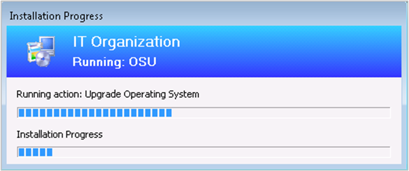

# What's new in version 1902 of Configuration Manager current branch

*Applies to: Configuration Manager (current branch)*

Update 1902 for Configuration Manager current branch is available as an in-console update. Apply this update on sites that run version 1802, 1806, or 1810. <!-- baseline only statement:-->When installing a new site, it's also available as a baseline version. This article summarizes the changes and new features in Configuration Manager, version 1902.  

Always review the latest checklist for installing this update. For more information, see [Checklist for installing update 1902](../../servers/manage/checklist-for-installing-update-1902.md). After you update a site, also review the [Post-update checklist](../../servers/manage/checklist-for-installing-update-1902.md#post-update-checklist).

To take full advantage of new Configuration Manager features, after you update the site, also update clients to the latest version. While new functionality appears in the Configuration Manager console when you update the site and console, the complete scenario isn't functional until the client version is also the latest.

<!-- > [!Note]  
> This article currently lists all significant features in this version. However, not all sections yet link to updated content with further information on the new features. Keep checking this page regularly for updates. Changes are noted with the ***[Updated]*** tag. This note will be removed when the content is finalized.  
 -->

##  Deprecated features and operating systems

Learn about support changes before they're implemented in [removed and deprecated items](deprecated/removed-and-deprecated.md).

- The implementation for sharing content from Azure has changed. Use a content-enabled cloud management gateway by enabling the option to **Allow CMG to function as a cloud distribution point and serve content from Azure storage**. You won't be able to create a traditional cloud distribution point in the future.

Version 1902 drops support for the following products:  

- Linux and UNIX as a client. Deprecation was announced with [version 1802](whats-new-in-version-1802.md#deprecation-announcement-for-linux-and-unix-client-support). Consider Microsoft Azure Management for managing Linux servers. Azure solutions have extensive Linux support that in most cases exceed Configuration Manager functionality, including end-to-end patch management for Linux.

##  Site infrastructure

### Client health dashboard

<!--3599209-->
You deploy software updates and other apps to help secure your environment, but these deployments only reach healthy clients. Unhealthy Configuration Manager clients adversely effect overall compliance. Determining client health can be challenging depending upon the denominator: how many total devices should be in your scope of management? For example, if you discover all systems from Active Directory, even if some of those records are for retired machines, this process increases your denominator.

You can now view a dashboard with information about the health of Configuration Manager clients in your environment. View your client health, scenario health, and common errors. Filter the view by several attributes to see any potential issues by OS and client versions.

In the Configuration Manager console, go to the **Monitoring** workspace. Expand **Client status**, and select the **Client health dashboard** node.

For more information, see [Client health dashboard](../../clients/manage/client-health-dashboard.md).

### New management insight rules

The management insights feature has the following new rules:

- Multiple rules with recommendations on managing collections. Use these insights to simplify management and improve performance. Review these new rules in the **Collections** group.<!--3555752-->  

- **Update clients to a supported Windows 10 version** rule in the **Simplified Management** group. This rule reports on clients that are running a version of Windows 10 that's no longer supported. It also includes clients with a Windows 10 version that's near end of service (three months).<!--3897268-->  

For more information, see [Management insights](../../servers/manage/management-insights.md).

### Improvement to enhanced HTTP

<!--3798957-->

You can now enable enhanced HTTP per primary site or for the central administration site.

On the properties of the central administration site, select the option to **Use Configuration Manager-generated certificates for HTTP site systems**. This setting only applies to site system roles in the central administration site. It isn't a global setting for the hierarchy.

For more information, see [enhanced HTTP](../hierarchy/enhanced-http.md).

### Improvement to setup prerequisites

When you install or update to version 1902, Configuration Manager setup now includes the following prerequisite check:

- **Pending system restart on the remote SQL Server**: This prerequisite check is similar to the **Pending system restart** rule, but it checks a remote SQL Server. For more information, see [List of prerequisite checks](../../servers/deploy/install/list-of-prerequisite-checks.md#pending-system-restart-on-the-remote-sql-server). <!--SCCMDocs-pr issue 3377-->  

##  Cloud-attached management

### Stop cloud service when it exceeds threshold

<!--3735092-->
Configuration Manager can now stop a cloud management gateway (CMG) service when the total data transfer goes over your limit. The CMG has always had alerts to trigger notifications when the usage reached warning or critical levels. To help reduce any unexpected Azure costs because of a spike in usage, this new option turns off the cloud service.

For more information, see [Stop CMG when it exceeds threshold](../../clients/manage/cmg/monitor-clients-cloud-management-gateway.md#stop-cmg-when-it-exceeds-threshold).

### Use Azure Resource Manager for cloud services

<!--3605704-->
Starting in version 1810, the classic service deployment in Azure was deprecated for use in Configuration Manager. That version is the last to support creation of these Azure deployments.

Existing deployments continue to work. Starting in this current branch version, Azure Resource Manager is the only deployment mechanism for new instances of the cloud management gateway and cloud distribution point.

For more information, see [Azure Resource Manager for the cloud management gateway](../../clients/manage/cmg/plan-cloud-management-gateway.md#azure-resource-manager).

### Add cloud management gateway to boundary groups

<!--3640932-->
You can now associate a cloud management gateway (CMG) with a boundary group. This configuration allows clients to default or fallback to the CMG for client communication according to boundary group relationships. This behavior is especially useful in branch office and VPN scenarios. You can direct client traffic away from expensive and slow WAN links to instead use faster internet links to Microsoft Azure.

For more information, see [CMG hierarchy design](../../clients/manage/cmg/plan-hierarchy-design.md) and [Set up CMG](../../clients/manage/cmg/setup-cloud-management-gateway.md#configure-boundary-groups).

##  Real-time management

### Run CMPivot from the central administration site

<!--3610960-->
Configuration Manager now supports running CMPivot from the central administration site in a hierarchy. The primary site still handles the communication to the client. When running CMPivot from the central administration site, it communicates with the primary site over the high-speed message subscription channel. This communication doesn't rely upon standard SQL Server replication between sites.

For more information, see [CMPivot for real-time data](../../servers/manage/cmpivot-changes.md#bkmk_cmpivot1902).

### Edit or copy PowerShell scripts

<!--3705507-->
You can now **Edit** or **Copy** an existing PowerShell script used with the Run Scripts feature. Instead of recreating a script that you need to change, now directly edit it. Both actions use the same wizard experience as when you create a new script. When you edit or copy a script, Configuration Manager doesn't persist the approval state.

For more information, see [Run Scripts](../../../apps/deploy-use/create-deploy-scripts.md#bkmk_psedit).

##  Content management

### Distribution point maintenance mode

<!--3555754-->

You can now set a distribution point in maintenance mode. Enable maintenance mode when you're installing software updates, or making hardware changes to the server.

While the distribution point is in maintenance mode, it has the following behaviors:

- The site doesn't distribute any content to it.  

- Management points don't return the location of this distribution point to clients.

- When you update the site, a distribution point in maintenance mode still updates.

- The distribution point properties are read-only. For example, you can't change the certificate or add boundary groups.  

- Any scheduled task, like content validation, still runs on the same schedule.

For more information on this feature, see [Maintenance mode](../../servers/deploy/configure/install-and-configure-distribution-points.md#bkmk_maint).

For more information on automating this process with the Configuration Manager SDK, see [SetDPMaintenanceMode method in class SMS_DistributionPointInfo](../../../develop/reference/core/servers/configure/setdpmaintenancemode-method-in-class-sms-distributionpointinfo.md).

##  Client management

### Client provisioning mode timeout

<!--3197824-->
The task sequence sets a timestamp when it puts the client in provisioning mode. A client in provisioning mode checks every 60 minutes the duration of time since the timestamp. If it's been in provisioning mode for more than 48 hours, the client automatically exits provisioning mode and restarts its process.

For more information, see [Provisioning mode](../../../osd/understand/provisioning-mode.md).

### View first screen only during remote control

<!--3231732-->
When connecting to a client with two or more monitors, it can be difficult to view them all in the Configuration Manager remote control viewer. A remote tools operator can now choose between seeing **All screens** or the **First screen** only.

For more information, see [How to remotely administer a Windows client computer](../../clients/manage/remote-control/remotely-administer-a-windows-client-computer.md).

### Specify a custom port for peer wakeup

<!--3605925-->
You can now specify a custom port number for wake-up proxy. In client settings, in the **Power Management** group, configure the setting for **Wake On LAN port number (UDP)**.  

For more information, see [How to configure Wake on LAN](../../clients/deploy/configure-wake-on-lan.md).

##  Application management

### Improvements to application approvals via email

<!--3594063-->
This version has improvements to the feature to receive email notifications for application requests. Users could  always add a comment to the request from Software Center. This comment shows on the application request in the Configuration Manager console. Now that comment also shows in the email. Including this comment in the email helps the approvers make a better decision to approve or deny the request.

For more information, see [Email notifications](../../../apps/deploy-use/app-approval.md#bkmk_email-approve).

### Improvements to Package Conversion Manager

<!-- SCCMDocs-pr issue #3357 -->
This version includes the following improvements to [Package Conversion Manager](../../../apps/pcm/package-conversion-manager.md):

- Scheduled package analysis runs every 7 days by default
- PowerShell cmdlets for analyzing and converting packages
- General bug fixes and improvements

##  OS deployment

### Progress status during in-place upgrade task sequence

<!--3747129-->
You now see a more detailed progress bar during a Windows 10 in-place upgrade task sequence. This bar shows the progress of Windows setup, which is otherwise silent during the task sequence. Users now have some visibility into the underlying progress. It helps with concerns that the upgrade process is suspended because of a lack of progress indication.  

This feature works with any supported version of Windows 10, and only with the in-place upgrade task sequence.

### Improvements to task sequence media creation

<!--3556027, fka 1359388-->
This version includes several improvements to help you better create and manage task sequence media. For more information, see the following articles for specific media types:

- [Create stand-alone media](../../../osd/deploy-use/create-stand-alone-media.md)
- [Create prestaged media](../../../osd/deploy-use/create-prestaged-media.md)
- [Create bootable media](../../../osd/deploy-use/create-bootable-media.md)
- [Create capture media](../../../osd/deploy-use/create-capture-media.md)

#### Specify temporary storage

When you create task sequence media, now customize the location that the site uses for temporary storage of data. This process can require a lot of temporary drive space. This change gives you greater flexibility to choose where to store these temporary files.

In the **Create Task Sequence Media Wizard**, specify a location for the **Staging folder**. By default this location is similar to the following path: `%UserProfile%\AppData\Local\Temp`.

#### Add a label to the media

You can now add a label to task sequence media. This label helps you better identify the media after you create it. In the **Create Task Sequence Media Wizard**, specify a **Media label**.

### Import a single index of an OS image

<!--3719699-->
When importing a Windows image (WIM) file to Configuration Manager, you can now specify to automatically import a single index rather than all image indexes in the file. This option provides the following benefits:

- Smaller image file  
- Faster offline servicing  
- Optimize image servicing, for a smaller image file after offline servicing

When you import an OS image, select the option to **Extract a specific image index from the specified WIM file**. Then select the image index from the list.  

For more information, see [Add an OS image](../../../osd/get-started/manage-operating-system-images.md#BKMK_AddOSImages).

### Optimized image servicing

<!--3555951-->
When you apply software updates to an OS image, there's a new option to optimize the output by removing any superseded updates. The optimization to offline servicing only applies to images with a single index.

When you create a schedule to update an OS image, select the option to **Remove superseded updates after the image is updated**.

For more information, see [Apply software updates to an image](../../../osd/get-started/manage-operating-system-images.md#optimized-image-servicing).

### Improvements to Run PowerShell Script task sequence step

<!--3556028, fka 1359389-->
The **Run PowerShell Script** task sequence step now includes the following improvements:  

- You can now directly enter Windows PowerShell code in this step. This change lets you run PowerShell commands during a task sequence without first creating and distributing a package with the script.

- When you choose the **Enter a PowerShell script** option, select **Edit Script**. The new PowerShell script window provides the following actions:  

    - Edit the script directly  

    - Open an existing script from file  

    - Browse to an existing approved script in Configuration Manager

- Save the script output to a custom task sequence variable  

- To include the script parameters in the task sequence log, set the task sequence variable **OSDLogPowerShellParameters** to **TRUE**. By default, the parameters aren't in the log.  

- Other improvements that provide similar functionality as the [Run Command Line](../../../osd/understand/task-sequence-steps.md#BKMK_RunCommandLine) step. For example, specify alternate user credentials or specify a time-out.

> [!Important]  
> To take advantage of this new Configuration Manager feature, after you update the site, also update clients to the latest version. While new functionality appears in the Configuration Manager console when you update the site and console, the complete scenario isn't functional until the client version is also the latest.

For more information, see [Run PowerShell Script](../../../osd/understand/task-sequence-steps.md#BKMK_RunPowerShellScript).

### Other improvements to OS deployment

<!--3633146,3641475,3654172,3734270-->
This version includes the following improvements to OS deployment:

- There's a new **View** default action on task sequences. <!--3633146-->  

- The task sequence error dialog window now displays more information. It shows the name of the task sequence step that failed. <!--3641475-->  

- When you set the **OSDDoNotLogCommand** task sequence variable to true, now it also hides the command line from the Run Command Line step in the log file. It previously only masked the program name from the Install Package step in smsts.log.<!--3654172-->  

- When you enable a PXE responder on a distribution point without Windows Deployment Service, it can now be on the same server as the DHCP service. <!--3734270--> For more information, see [Configure at least one distribution point to accept PXE requests](../../../osd/deploy-use/use-pxe-to-deploy-windows-over-the-network.md#BKMK_Configure).

##  Software Center

### Replace toast notifications with dialog window

<!--3555947-->
Sometimes users don't see the Windows toast notification about a restart or required deployment. Then they don't see the experience to snooze the reminder. This behavior can lead to a poor user experience when the client reaches a deadline.

Now when deployments need a restart or software changes are required, you have the option of using a more intrusive dialog window.

For more information, see [User notifications](../../../apps/plan-design/user-notifications.md#replace-toast-notifications-with-dialog-window)

### Configure user device affinity in Software Center

<!--3485366-->
With [Software Center infrastructure improvements](whats-new-in-version-1806.md#software-center-infrastructure-improvements) starting in version 1806, the application catalog site server roles are no longer required for most scenarios. Some customers still relied upon the application catalog to allow users to set their primary device for user device affinity.

Now users can set their primary device in Software Center. This action makes them a primary user of the device in Configuration Manager.

For more information, see [Link users and devices with user device affinity](../../../apps/deploy-use/link-users-and-devices-with-user-device-affinity.md).

### Configure default views in Software Center

<!--3612112-->
This version of Configuration Manager further iterates on how you can customize Software Center:

- Set the default layout of applications, either as tiles or a list  

    - If a user changes this configuration, Software Center persists the user's preference in the future  

- Configure the default application filter, either all or only required apps  

    - Software Center always uses your default setting. Users can change this filter, but Software Center doesn't persist their preference.

Specify these settings in the **Software Center** group of client settings.

For more information, see [About client settings](../../clients/deploy/about-client-settings.md#software-center-customization---defaults).

##  Software updates

### Specify priority for feature updates in Windows 10 servicing

<!--3734525-->
Adjust the priority with which clients install a feature update through [Windows 10 servicing](../../../osd/deploy-use/manage-windows-as-a-service.md). By default, clients now install feature updates with higher processing priority.

Use client settings to configure this option. In the **Software Updates** group, configure the following setting: **Specify thread priority for feature updates**.

For more information, see [About client settings](../../clients/deploy/about-client-settings.md#software-updates).

##  Office management

### Redirect Windows known folders to OneDrive

<!--3556021-->
Use Configuration Manager to move Windows known folders to OneDrive for Business. These folders include Desktop, Documents, and Pictures. To simplify your Windows 10 upgrades, deploy these settings to Windows 7 clients before deploying a task sequence.

For more information on this feature of OneDrive for Business, see [Redirect and move Windows known folders to OneDrive](/onedrive/redirect-known-folders).

First, [find your Microsoft 365 tenant ID](/onedrive/find-your-office-365-tenant-id). Then deploy the OneDrive sync client version 18.111.0603.0004 or later. For more information, see [Deploy OneDrive apps by using Configuration Manager](/onedrive/deploy-on-windows).  

To create and deploy a OneDrive for Business profile, in the Configuration Manager console, go to the **Assets and Compliance** workspace. Expand **Compliance Settings**, and select the **OneDrive for Business Profiles** node.  

For more information, see the Redirect Windows known folders to OneDrive section in the [OneDrive for Business Profiles](../../../compliance/deploy-use/onedrive-profile.md) article.

### Integration for Microsoft 365 Apps for enterprise readiness

<!--3735402-->
Use Configuration Manager to identify devices with high confidence that are ready to upgrade to Microsoft 365 Apps for enterprise. The integration provides insights into any potential compatibility issues with Office add-ins and macros used in your environment. Then use Configuration Manager to deploy Office to ready devices.

The existing Microsoft 365 client management dashboard now includes a new tile, **Office 365 ProPlus Upgrade Readiness**.

For more information, see [Microsoft 365 client management dashboard](../../../sum/deploy-use/office-365-dashboard.md#bkmk_o365_readiness)

### Additional languages for Microsoft 365 updates

<!--3555955-->
Configuration Manager now supports all supported languages for Microsoft 365 client updates. The update workflow now separates the 38 languages for **Windows Update** from the numerous languages for **Office 365 Client Update**.

For more information, see [Manage Microsoft 365 updates](../../../sum/deploy-use/manage-office-365-proplus-updates.md#bkmk_o365_lang)

### Office products on lifecycle dashboard

<!--3556026-->
The product lifecycle dashboard now includes information for installed versions of Office 2003 through Office 2016. Data shows up after the site runs the lifecycle summarization task, which is every 24 hours.

For more information, see [Use the Product Lifecycle dashboard](../../clients/manage/asset-intelligence/product-lifecycle-dashboard.md).

##  Phased deployments

### Dedicated monitoring for phased deployments

<!--3555949-->
Phased deployments now have their own dedicated monitoring node. This node makes it easier to identify phased deployments that you created and then navigate to the phased deployment monitoring view. In the Configuration Manager console, go to the **Monitoring** workspace, and select the **Phased Deployments** node. It shows the list of phased deployments.

For more information, see [Phased deployment monitoring view](../../../osd/deploy-use/manage-monitor-phased-deployments.md#bkmk_monitor).

### Improvement to phased deployment success criteria

<!--3555946-->
Specify additional criteria for the success of a phase in a phased deployment. Instead of only a percentage, this criteria can now also be the number of devices successfully deployed. This option is useful when the size of the collection is variable, and you have a specific number of devices to show success before moving to the next phase.

Create a phased deployment for a task sequence, software update, or application. Then on the Settings page of the wizard, select the following option as the criteria for success of the first phase: **Number of devices successfully deployed**.

For more information, see [Create phased deployments](../../../osd/deploy-use/create-phased-deployment-for-task-sequence.md).

##  Configuration Manager console

###  Improvements to Configuration Manager console

<!--3594151-->
Based on customer feedback at the Midwest Management Summit (MMS) Desert Edition 2018, this version includes the following improvements to the Configuration Manager console:

- Maximize the browse registry window for application detection methods
- Go to the collection from an application deployment
- Remove content from monitoring status
- Views sort by integer values in the **Deployments** node of the **Monitoring** workspace
- Move the warning for a large number of results

For more information, see [Configuration Manager console tips](../../servers/manage/admin-console-tips.md).

### Configuration Manager console notifications

<!--3556016, fka 1318035-->
To keep you better informed so that you can take the appropriate action, the Configuration Manager console now notifies you for the following events:

- When an update is available for Configuration Manager itself
- When lifecycle and maintenance events occur in the environment

This notification is a bar at the top of the console window below the ribbon. It replaces the previous experience when Configuration Manager updates are available. These in-console notifications still display critical information, but don't interfere with your work in the console. You can't dismiss critical notifications. The console displays all notifications in a new notification area of the title bar.

For more information, see [Configuration Manager console notifications](../../servers/manage/admin-console-notifications.md).

### Confirmation of console feedback

<!--3556010-->
When you send [feedback](../../understand/product-feedback.md) in the Configuration Manager console, it now shows a confirmation message. This message includes a **Feedback ID**, which you can give to Microsoft as a tracking identifier.

For more information, see [Product feedback](../../understand/product-feedback.md#confirmation-of-console-feedback).

### View recently connected consoles

<!--3699367-->
You can now view the most recent connections for the Configuration Manager console. The view includes active connections and those consoles that recently connected. In the Configuration Manager console, go to the **Administration** workspace, expand **Security**, and select the **Console Connections** node.

For more information, see [Using the Configuration Manager console](../../servers/manage/admin-console.md#bkmk_viewconnected).

### In-console documentation dashboard

<!--3556019, fka 1357546-->
There's a new **Documentation** node in the new **Community** workspace. This node includes up-to-date information about Configuration Manager documentation and support articles.

For more information, see [Using the Configuration Manager console](../../servers/manage/admin-console.md#bkmk_doc-dashboard).

### Search device views using MAC address

<!--3600878-->
You can now search for a MAC address in a device view of the Configuration Manager console. This property is useful for OS deployment administrators while troubleshooting PXE-based deployments. When you view a list of devices, add the **MAC Address** column to the view. Use the search field to add the **MAC Address** search criteria.

For more information, see [Configuration Manager console tips](../../servers/manage/admin-console-tips.md).

### Use .NET 4.7 for improved console accessibility

<!-- SCCMDocs-pr issue #3228 -->
To improve the accessibility features of the Configuration Manager console, update .NET to version 4.7 or later on the computer running the console.

For more information, see [Accessibility features in Configuration Manager](../../understand/accessibility-features.md).

### Changes to console setup process

<!-- 3612513 -->
There are new components required when installing the Configuration Manager console. If you create a package for installing the console on other computers, make sure the package includes the following files:

- ConsoleSetup.exe
- AdminConsole.msi
- ConfigMgr.AC_Extension.i386.cab
- ConfigMgr.AC_Extension.amd64.cab

When you install or update a site server, it copies these installation files and supported language packs for the site to the **Tools\ConsoleSetup** subfolder. For more information, see [Install the Configuration Manager console](../../servers/deploy/install/install-consoles.md).

## Other updates

Aside from new features, this release also includes additional changes such as bug fixes. For more information, see [Summary of changes in Configuration Manager current branch, version 1902](https://support.microsoft.com/help/4498910).

For more information on changes to the Windows PowerShell cmdlets for Configuration Manager, see [PowerShell version 1902 release notes](/powershell/sccm/1902-release-notes).

The following update rollup (4500571) is available in the console starting on 17 June 2019: [Update rollup for Configuration Manager current branch, version 1902](https://support.microsoft.com/help/4500571).

<!--
### Hotfixes

The following additional hotfixes are available to address specific issues:

| ID | Title | Date | In-console |
|---------|---------|---------|---------|
| [4487960](https://support.microsoft.com/help/4487960) | Microsoft Intune connector certificate does not renew in Configuration Manager | 18 January 2019 | Yes |

> [!Note]  
> Starting in version 1902, in-console hotfixes now have supersedence relationships. For more information, see [Supersedence for in-console hotfixes](../../servers/manage/updates.md#bkmk_supersede).
-->

## Next steps

When you're ready to install this version, see [Installing updates for Configuration Manager](../../servers/manage/updates.md) and [Checklist for installing update 1902](../../servers/manage/checklist-for-installing-update-1902.md).

> [!TIP]  
> To install a new site, use a baseline version of Configuration Manager.  
>
> Learn more about:    
> - [Installing new sites](../../servers/deploy/install/installing-sites.md)  
> - [Baseline and update versions](../../servers/manage/updates.md#bkmk_Baselines)  

For known, significant issues, see the [Release notes](../../servers/deploy/install/release-notes.md).

After you update a site, also review the [Post-update checklist](../../servers/manage/checklist-for-installing-update-1902.md#post-update-checklist).