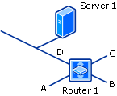
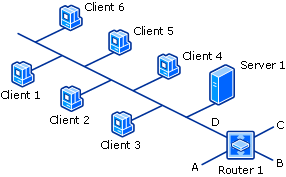
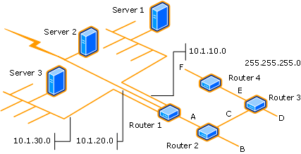

# About discovery methods for Configuration Manager

*Applies to: Configuration Manager (current branch)*

Configuration Manager discovery methods find different devices on your network, devices and users from Active Directory, or users from Microsoft Entra ID. To efficiently use a discovery method, you should understand its available configurations and limitations.

##  Active Directory forest discovery

**Configurable:** Yes

**Enabled by default:** No

**Accounts** you can use to run this method:

- [**Active Directory forest account**](../../../plan-design/hierarchy/accounts.md#active-directory-forest-account) (user defined)

- **Computer account** of the site server

Unlike other Active Directory discovery methods, Active Directory forest discovery doesn't discover resources that you can manage. Instead, this method discovers network locations that are configured in Active Directory. It can convert those locations into boundaries for use throughout your hierarchy.

When this method runs, it searches the local Active Directory forest, each trusted forest, and other forests that you configure in the **Active Directory Forests** node of the Configuration Manager console.

Use Active Directory forest discovery to:

- Discover Active Directory sites and subnets, and then create Configuration Manager boundaries based on those network locations.

- Identify supernets that are assigned to an Active Directory site. Convert each supernet into an IP address range boundary.

- Publish to Active Directory Domain Services (AD DS) in a forest when publishing to that forest is enabled. The specified Active Directory forest account must have permissions to that forest.

You can manage Active Directory forest discovery in the Configuration Manager console. Go to the **Administration** workspace and expand **Hierarchy Configuration**.

- **Discovery Methods**: Enable Active Directory forest discovery to run at the top-level site of your hierarchy. You can also specify a schedule to run discovery. Configure it to automatically create boundaries from the IP subnets and Active Directory sites that it discovers. Active Directory forest discovery can't run at a child primary site or at a secondary site.

- **Active Directory Forests**: Configure the other forests to discover, specify each Active Directory forest account, and configure publishing to each forest. Monitor the discovery process. Add IP subnets and Active Directory sites as Configuration Manager boundaries and members of boundary groups.

To configure publishing for Active Directory forests for each site in your hierarchy, connect your Configuration Manager console to the top-level site of your hierarchy. The **Publishing** tab in an Active Directory site's **Properties** dialog box can show only the current site and its child sites. When publishing is enabled for a forest, and that forest's schema is extended for Configuration Manager, the following information is published for each site that is enabled to publish to that Active Directory forest:

- `SMS-Site-<site code>`

- `SMS-MP-<site code>-<site system server name>`

- `SMS-SLP-<site code>-<site system server name>`

- `SMS-<site code>-<Active Directory site name or subnet>`

> [!NOTE]
> Secondary sites always use the secondary site server computer account to publish to Active Directory. If you want secondary sites to publish to Active Directory, ensure that the secondary site server computer account has permissions to publish to Active Directory. A secondary site cannot publish data to an untrusted forest.

> [!CAUTION]
> When you uncheck the option to publish a site to an Active Directory forest, all previously published information for that site, including available site system roles, is removed from Active Directory.

Actions for Active Directory Forest Discovery are recorded in the following logs:

- All actions, except actions related to publishing, are recorded in the **ADForestDisc.Log** file in the **&lt;InstallationPath>\Logs** folder on the site server.

- Active Directory Forest Discovery publishing actions are recorded in the **hman.log** and **sitecomp.log** files in the **&lt;InstallationPath>\Logs** folder on the site server.

For more information about how to configure this discovery method, see [Configure discovery methods](configure-discovery-methods.md#BKMK_ConfigADForestDisc).

##  Active Directory group discovery

**Configurable:** Yes

**Enabled by default:** No

**Accounts** you can use to run this method:

- [**Active Directory group discovery account**](../../../plan-design/hierarchy/accounts.md#active-directory-group-discovery-account) (user defined)

- **Computer account** of the site server

> [!TIP]
> In addition to the information in this section, see [Common features of Active Directory group, system, and user discovery](#bkmk_shared).

Use this method to search Active Directory Domain Services to identify:

- Local, global, and universal security groups.

- The membership of groups.

- Limited information about a group's member computers and users, even when another discovery method hasn't previously discovered those computers and users.

This discovery method is intended to identify groups and the group relationships of members of groups. By default, only security groups are discovered. If you want to also find the membership of distribution groups, you must check the box for the option **Discover the membership of distribution groups** on the **Option** tab in the **Active Directory Group Discovery Properties** dialog box.

Active Directory group discovery doesn't support the extended Active Directory attributes that can be identified by using Active Directory system discovery or Active Directory user discovery. Because this discovery method isn't optimized to discover computer and user resources, consider running this discovery method after you have run Active Directory system discovery and Active Directory user discovery. This suggestion is because this method creates a full discovery data record (DDR) for groups, but only a limited DDR for computers and users that are members of groups.

You can configure the following discovery scopes that control how this method searches for information:

- **Location**: Use a location if you want to search one or more Active Directory containers. This scope option supports a recursive search of the specified Active Directory containers. This process searches each child container under the container that you specify. It continues until no more child containers are found.

- **Groups**: Use groups if you want to search one or more specific Active Directory groups. You can configure **Active Directory Domain** to use the default domain and forest, or limit the search to an individual domain controller. Additionally, you can specify one or more groups to search. If you don't specify at least one group, all groups found in the specified **Active Directory Domain** location are searched.

> [!CAUTION]
> When you configure a discovery scope, choose only the groups that you must discover. This recommendation is because Active Directory group discovery tries to discover each member of each group in the discovery scope. Discovery of large groups can require extensive use of bandwidth and Active Directory resources.

> [!NOTE]
> Before you can create collections that are based on extended Active Directory attributes, and to ensure accurate discovery results for computers and users, run Active Directory system discovery or Active Directory user discovery, depending on what you want to discover.

Actions for Active Directory group discovery are recorded in the file **adsgdis.log** in the `<InstallationPath>\LOGS` folder on the site server.

For more information about how to configure this discovery method, see [Configure discovery methods](configure-discovery-methods.md#BKMK_ConfigADDiscGeneral).

##  Active Directory system discovery

**Configurable:** Yes

**Enabled by default:** No

**Accounts** you can use to run this method:

- [**Active Directory system discovery account**](../../../plan-design/hierarchy/accounts.md#active-directory-system-discovery-account) (user defined)

- **Computer account** of the site server

> [!TIP]
> In addition to the information in this section, see [Common features of Active Directory group, system, and user discovery](#bkmk_shared).

Use this discovery method to search the specified Active Directory Domain Services locations for computer resources that can be used to create collections and queries. You can also install the Configuration Manager client on a discovered device by using client push installation.

By default, this method discovers basic information about the computer, including the following attributes:

- Computer name

- OS and version

- Active Directory container name

- IP address

- Active Directory site

- Time stamp of last sign in

To successfully create a DDR for a computer, Active Directory system discovery must be able to identify the computer account and then successfully resolve the computer name to an IP address.

In the **Active Directory System Discovery Properties** dialog box, on the **Active Directory Attributes** tab, you can view the full list of default object attributes that it discovers. You can also configure the method to discover extended attributes.

Actions for Active Directory system discovery are recorded in the file **adsysdis.log** in the `<InstallationPath>\LOGS` folder on the site server.

For more information about how to configure this discovery method, see [Configure discovery methods](configure-discovery-methods.md#BKMK_ConfigADDiscGeneral).

##  Active Directory user discovery

**Configurable:** Yes

**Enabled by default:** No

**Accounts** you can use to run this method:

- [**Active Directory user discovery account**](../../../plan-design/hierarchy/accounts.md#active-directory-user-discovery-account) (user defined)

- **Computer account** of the site server

> [!TIP]
> In addition to the information in this section, see [Common features of Active Directory group, system, and user discovery](#bkmk_shared).

Use this discovery method to search Active Directory Domain Services to identify user accounts and associated attributes. By default, this method discovers basic information about the user account, including the following attributes:

- User name

- Unique user name, which includes the domain name

- Domain

- Active Directory container names

In the **Active Directory User Discovery Properties** dialog box, on the **Active Directory Attributes** tab, you can view the full default list of object attributes that it discovers. You can also configure the method to discover extended attributes.

Actions for Active Directory User Discovery are recorded in the file **adusrdis.log** in the `<InstallationPath>\LOGS` folder on the site server.

For more information about how to configure this discovery method, see [Configure discovery methods](configure-discovery-methods.md#BKMK_ConfigADDiscGeneral).

##  Microsoft Entra user discovery

Use Microsoft Entra user discovery to search your Microsoft Entra subscription for users with a modern cloud identity. Microsoft Entra user discovery can find the following attributes:

- `objectId`
- `displayName`
- `mail`
- `mailNickname`
- `onPremisesSecurityIdentifier`
- `userPrincipalName`
- `tenantID`
- `onPremisesDomainName`
- `onPremisesSamAccountName`
- `onPremisesDistinguishedName`

This method supports full and delta synchronization of user attributes from Microsoft Entra ID. This information can then be used along-side discovery data you collect from the other discovery methods.

Actions for Microsoft Entra user discovery are recorded in the **SMS_AZUREAD_DISCOVERY_AGENT.log** file on the top-tier site server of the hierarchy.

To configure Microsoft Entra user discovery, see [Configure Azure Services](azure-services-wizard.md) for Cloud Management. For information about how to configure this discovery method, see [Configure Microsoft Entra user Discovery](configure-discovery-methods.md#azureaadisc).

##  Microsoft Entra user group discovery
<!--3611956-->

You can discover user groups and members of those groups from Microsoft Entra ID. Microsoft Entra user group discovery can find the following attributes:

- `objectId`
- `displayName`
- `mailNickname`
- `onPremisesSecurityIdentifier`
- `tenantID`

Actions for Microsoft Entra user group discovery are recorded in the **SMS_AZUREAD_DISCOVERY_AGENT.log** file on the top-tier site server of the hierarchy. For information about how to configure this discovery method, see [Configure Microsoft Entra user group discovery](configure-discovery-methods.md#bkmk_azuregroupdisco).

##  Heartbeat discovery

**Configurable:** Yes

**Enabled by default:** Yes

**Accounts** you can use to run this method:

- **Computer account** of the site server

Heartbeat discovery differs from other Configuration Manager discovery methods. It's enabled by default and runs on each computer client instead of on a site server to create a DDR. To help maintain the database record of Configuration Manager clients, don't disable heartbeat discovery. In addition to maintaining the database record, this method can force discovery of a computer as a new resource record. It can also repopulate the database record of a computer that was deleted from the database.

Heartbeat discovery runs on a schedule configured for all clients in the hierarchy. The default schedule for heartbeat discovery is set to every seven days. If you change the heartbeat discovery interval, make sure that it runs more frequently than the site maintenance task **Delete Aged Discovery Data**. This task deletes inactive client records from the site database. You can configure the **Delete Aged Discovery Data** task only for primary sites.

You can also manually run heartbeat discovery on a specific client. Run the **Discovery Data Collection Cycle** on the **Action** tab of a client's Configuration Manager control panel.

When heartbeat discovery runs, it creates a DDR that has the client's current information. The client then copies this small file to a management point so that a primary site can process it. The file is about 1 KB in size and has the following information:

- Network location

- NetBIOS name

- Version of the client agent

- Operational status details

Heartbeat discovery is the only discovery method that provides details about the client installation status. It does so by updating the system resource client attribute to set a value equal to **Yes**.

Actions for heartbeat discovery are logged on the client in the **InventoryAgent.log** file in the `%Windir%\CCM\Logs` folder.

For more information about how to configure this discovery method, see [Configure discovery methods](configure-discovery-methods.md#BKMK_ConfigHBDisc).

##  Network discovery

**Configurable:** Yes

**Enabled by default:** No

**Accounts** you can use to run this method:

- **Computer account** of the site server

Use this method to discover the topology of your network and to discover devices on your network that have an IP address. Network discovery searches your network for IP-enabled resources by querying the following sources:

- Servers that run a Microsoft implementation of DHCP
- Address Resolution Protocol (ARP) caches in network routers
- SNMP-enabled devices
- Active Directory domains

Before you can use network discovery, you must specify the *level* of discovery to run. You also configure one or more discovery mechanisms that enable network discovery to query for network segments or devices. You can also configure settings that help control discovery actions on the network. Finally, you define one or more schedules for when network discovery runs.

For this method to successfully discover a resource, network discovery must identify the IP address and the subnet mask of the resource. The following methods are used to identify the subnet mask of an object:

- **Router ARP cache:** Network discovery queries the ARP cache of a router to find subnet information. Typically, data in a router ARP cache has a short time-to-live. Therefore, when network discovery queries the ARP cache, the ARP cache might no longer have information about the requested object.

- **DHCP:** Network discovery queries each DHCP server that you specify to discover the devices for which the DHCP server has provided a lease. Network discovery supports only DHCP servers that run the Microsoft implementation of DHCP.

- **SNMP device:** Network discovery can directly query an SNMP device. For network discovery to query a device, the device must have a local SNMP agent installed. Also configure network discovery to use the community name that the SNMP agent is using.

When discovery identifies an IP-addressable object and can determine the object's subnet mask, it creates a DDR for that object. Because different types of devices connect to the network, network discovery discovers resources that don't support the Configuration Manager client. For example, devices that can be discovered but not managed include printers and routers.

Network discovery can return several attributes as part of the discovery record that it creates. These attributes include:

- NetBIOS name

- IP addresses

- Resource domain

- System roles

- SNMP community name

- MAC addresses

Network discovery activity is recorded in the **Netdisc.log** file in `InstallationPath>\Logs` on the site server that runs discovery.

For more information about how to configure this discovery method, see [Configure discovery methods](configure-discovery-methods.md#BKMK_ConfigNetworkDisc).

> [!NOTE]
> Complex networks and low-bandwidth connections can cause network discovery to run slowly and generate significant network traffic. Run network discovery only when the other discovery methods can't find the resources that you have to discover. For example, use network discovery to discover workgroup computers. Other discovery methods don't discover workgroup computers.

###  Levels of network discovery

When you configure network discovery, you specify one of three levels of discovery:

|Level of discovery|Details|
|------------------------|-------------|
|Topology|This level discovers routers and subnets but doesn't identify a subnet mask for objects.|
|Topology and client|In addition to topology, this level discovers potential clients like computers, and resources like printers and routers. This level of discovery tries to identify the subnet mask of objects that it finds.|
|Topology, client, and client operating system|In addition to topology and potential clients, this level tries to discover the computer operating system name and version. This level uses Windows Browser and Windows Networking calls.|

 With each incremental level, network discovery increases its activity and network bandwidth usage. Consider the network traffic that can be generated before you enable all aspects of network discovery.

 For example, when you first use network discovery, you might start with only the topology level to identify your network infrastructure. Then, reconfigure network discovery to discover objects and their device operating systems. You can also configure settings that limit network discovery to a specific range of network segments. That way, you discover objects in network locations that you require and avoid unnecessary network traffic. This process also allows you to discover objects from edge routers or from outside your network.

###  Network discovery options

To enable network discovery to search for IP-addressable devices, configure one or more of these options.

> [!NOTE]
> Network discovery runs in the context of the computer account of the site server that runs discovery. If the computer account doesn't have permissions to an untrusted domain, the domain and DHCP server configurations can fail to discover resources.

#### DHCP

Specify each DHCP server that you want network discovery to query. Network discovery supports only DHCP servers that run the Microsoft implementation of DHCP.

- Network discovery retrieves information by using remote procedure calls to the database on the DHCP server.

- Network discovery can query both 32-bit and 64-bit DHCP servers for a list of devices that are registered with each server.

- For network discovery to successfully query a DHCP server, the computer account of the server that runs discovery must be a member of the DHCP Users group on the DHCP server. For example, this level of access exists when one of the following statements is true

  - The specified DHCP server is the DHCP server of the server that runs discovery.

  - The computer that runs discovery and the DHCP server are in the same domain.

  - A two-way trust exists between the computer that runs discovery and the DHCP server.

  - The site server is a member of the DHCP Users group.

- When network discovery enumerates a DHCP server, it doesn't always discover static IP addresses. Network discovery doesn't find IP addresses that are part of an excluded range of IP addresses on the DHCP server. It also doesn't discover IP addresses that are reserved for manual assignment.

#### Domains

Specify each domain that you want network discovery to query.

- The computer account of the site server that runs discovery must have permissions to read the domain controllers in each specified domain.

- To discover computers from the local domain, you must enable the Computer Browser service on at least one computer. This computer must be on the same subnet as the site server that runs network discovery.

- Network discovery can discover any computer that you can view from your site server when you browse the network.

- Network discovery retrieves the IP address. It then uses an Internet Control Message Protocol (ICMP) echo request to ping each device that it finds. The **ping** command helps determine which computers are currently active.

#### SNMP devices

Specify each SNMP device that you want network discovery to query.

- Network discovery gets the `ipNetToMediaTable` value from any SNMP device that responds to the query. This value returns arrays of IP addresses that are client computers or other resources like printers, routers, or other IP-addressable devices.

- To query a device, you must specify the IP address or NetBIOS name of the device.

- Configure network discovery to use the community name of the device, or the device rejects the SNMP-based query.

###  Limiting network discovery

When network discovery queries an SNMP device on the edge of your network, it can identify information about subnets and SNMP devices that are outside your immediate network. Use the following information to limit network discovery by configuring the SNMP devices that discovery can communicate with, and by specifying the network segments to query.

#### Subnets

Configure the subnets that network discovery queries when it uses the SNMP and DHCP options. These two options search only the enabled subnets.

For example, a DHCP request can return devices from locations across your whole network. If you want to discover only devices on a specific subnet, specify and enable that specific subnet on the **Subnets** tab in the **Network Discovery Properties** dialog box. When you specify and enable subnets, you limit future DHCP and SNMP discovery tasks to those subnets.

> [!NOTE]
> Subnet configurations don't limit the objects that the **Domains** discovery option discovers.

#### SNMP community names

To enable network discovery to successfully query an SNMP device, configure network discovery with the community name of the device. If network discovery isn't configured by using the community name of the SNMP device, the device rejects the query.

#### Maximum hops

When you configure the maximum number of router hops, you limit the number of network segments and routers that network discovery can query by using SNMP.

The number of hops that you configure limits the number of devices and network segments that network discovery can query.

For example, a topology-only discovery with **0** (zero) router hops discovers the subnet on which the originating server resides. It includes any routers on that subnet.

The following diagram shows what a topology-only network discovery query finds when it runs on Server 1 with 0 router hops specified: subnet D and Router 1.

The following diagram shows what a topology and client network discovery query finds when it runs on Server 1 with 0 router hops specified: subnet D and Router 1, and all potential clients on subnet D.

To get a better idea of how more router hops can increase the amount of network resources that are discovered, consider the following network:

Running a topology-only network discovery from Server 1 with one router hop discovers the following entities:

- Router 1 and subnet 10.1.10.0 (found with zero hops)

- Subnets 10.1.20.0 and 10.1.30.0, subnet A, and Router 2 (found on the first hop)

> [!WARNING]
> Each increase to the number of router hops can significantly increase the number of discoverable resources and increase the network bandwidth that network discovery uses.

##  Server discovery

**Configurable:** No

In addition to the user-configurable discovery methods, Configuration Manager uses a process named **Server Discovery** (`SMS_WINNT_SERVER_DISCOVERY_AGENT`). This discovery method creates resource records for computers that are site systems, like a computer that is configured as a management point.

##  Common features of Active Directory group discovery, system discovery, and user discovery

This section provides information about features that are common to the following discovery methods:

- Active Directory group discovery

- Active Directory system discovery

- Active Directory user discovery

> [!NOTE]
> The information in this section doesn't apply to Active Directory forest discovery.

These three discovery methods are similar in configuration and operation. They can discover computers, users, and information about group memberships of resources that are stored in Active Directory Domain Services. The discovery process is managed by a discovery agent. The agent runs on the site server at each site where discovery is configured to run. You can configure each of these discovery methods to search one or more Active Directory locations as location instances in the local forest or remote forests.

When discovery searches an untrusted forest for resources, the discovery agent must be able to resolve the following to be successful:

- To discover a computer resource by using Active Directory system discovery, the discovery agent must be able to resolve the FQDN of the resource. If it can't resolve the FQDN, it then tries to resolve the resource by its NetBIOS name.

- To discover a user or group resource by using Active Directory user discovery or Active Directory group discovery, the discovery agent must be able to resolve the FQDN of the domain controller name that you specify for the Active Directory location.

For each location that you specify, you can configure individual search options, like enabling a recursive search of the location's Active Directory child containers. You can also configure a unique account to use when it searches that location. This account provides flexibility in configuring a discovery method at one site to search multiple Active Directory locations across multiple forests. You don't have to configure a single account that has permissions to all locations.

When each of these three discovery methods runs at a specific site, the Configuration Manager site server at that site contacts the nearest domain controller in the specified Active Directory forest to locate Active Directory resources. The domain and forest can be in any supported Active Directory mode. The account that you assign to each location instance must have **Read** access permission to the specified Active Directory locations.

Discovery searches the specified locations for objects and then tries to collect information about those objects. A DDR is created when sufficient information about a resource can be identified. The required information varies depending on the discovery method that is being used.

If you configure the same discovery method to run at different Configuration Manager sites to take advantage of querying local Active Directory servers, you can configure each site with a unique set of discovery options. Because discovery data is shared with each site in the hierarchy, avoid overlap between these configurations to efficiently discover each resource a single time.

For smaller environments, consider running each discovery method at only one site in your hierarchy. This configuration reduces administrative overhead and the potential for multiple discovery actions to rediscover the same resources. When you minimize the number of sites that run discovery, you reduce the overall network bandwidth that discovery uses. You can also reduce the overall number of DDRs that are created and must be processed by your site servers.

Many of the discovery method configurations are self-explanatory. Use the following sections for more information about the discovery options that might require additional information before you configure them.

The following options are available for use with multiple Active Directory discovery methods:

- [Delta Discovery](#bkmk_delta)

- [Filter stale computer records by domain sign in](#bkmk_stalelogon)

- [Filter stale records by computer password](#bkmk_stalepassword)

- [Search customized Active Directory attributes](#bkmk_customAD)

###  Delta discovery

Available for:

- Active Directory group discovery

- Active Directory system discovery

- Active Directory user discovery

Delta discovery isn't an independent discovery method but an option available for the applicable discovery methods. Delta discovery searches specific Active Directory attributes for changes that were made since the last full discovery cycle of the applicable discovery method. The attribute changes are submitted to the Configuration Manager database to update the discovery record of the resource.

By default, delta discovery runs on a five-minute cycle. This schedule is much more frequent than the typical schedule for a full discovery cycle. This frequent cycle is possible because delta discovery uses fewer site server and network resources than a full discovery cycle. When you use delta discovery, you can reduce the frequency of the full discovery cycle for that discovery method.

The following are the most common changes that delta discovery detects:

- New computers or users added to Active Directory

- Changes to basic computer and user information

- New computers or users that are added to a group

- Computers or users that are removed from a group

- Changes to system group objects

Although delta discovery can detect new resources and changes to group membership, it can't detect when a resource has been deleted from Active Directory. DDRs created by delta discovery are processed similarly to the DDRs that are created by a full discovery cycle.

You configure delta discovery on the **Polling Schedule** tab in the properties for each discovery method.

###  Filter stale computer records by domain sign in

Available for:

- Active Directory group discovery

- Active Directory system discovery

You can configure discovery to exclude computers with a stale computer record. This exclusion is based on the last domain sign in of the computer. When this option is enabled, Active Directory system discovery evaluates each computer that it identifies. Active Directory group discovery evaluates each computer that is a member of a group that's discovered.

To use this option:

- Computers must be configured to update the `lastLogonTimeStamp` attribute in Active Directory Domain Services.

- The Active Directory domain functional level must be set to Windows Server 2003 or later.

When you're configuring the time after the last sign in that you want to use for this setting, consider the interval for replication between domain controllers.

You configure filtering on the **Option** tab in the **Active Directory System Discovery Properties** and **Active Directory Group Discovery Properties** dialog boxes. Choose to **Only discover computers that have logged on to a domain in a given period of time**.

> [!WARNING]
> When you configure this filter and **Filter stale records by computer password**, discovery excludes computers that meet the criteria of either filter.

###  Filter stale records by computer password

Available for:

- Active Directory group discovery

- Active Directory system discovery

You can configure discovery to exclude computers with a stale computer record. This exclusion is based on the last computer account password update by the computer. When this option is enabled, Active Directory system discovery evaluates each computer that it identifies. Active Directory group discovery evaluates each computer that is a member of a group that is discovered.

To use this option:

- Computers must be configured to update the `pwdLastSet` attribute in Active Directory Domain Services.

When you're configuring this option, consider the interval for updates to this attribute. Also consider the replication interval between domain controllers.

You configure filtering on the **Option** tab in the **Active Directory System Discovery Properties** and **Active Directory Group Discovery Properties** dialog boxes. Choose to **Only discover computers that have updated their computer account password in a given period of time**.

> [!WARNING]
> When you configure this filter and **Filter stale records by domain logon**, discovery excludes computers that meet the criteria of either filter.

###  Search customized Active Directory attributes

Available for:

- Active Directory system discovery

- Active Directory user discovery

Each discovery method supports a unique list of Active Directory attributes that can be discovered.

You can view and configure the list of customized attributes on the **Active Directory Attributes** tab in the **Active Directory System Discovery Properties** and **Active Directory User Discovery Properties** dialog boxes.

## Next steps

[Select discovery methods to use for Configuration Manager](select-discovery-methods-to-use.md)

[Configure discovery methods](configure-discovery-methods.md)
