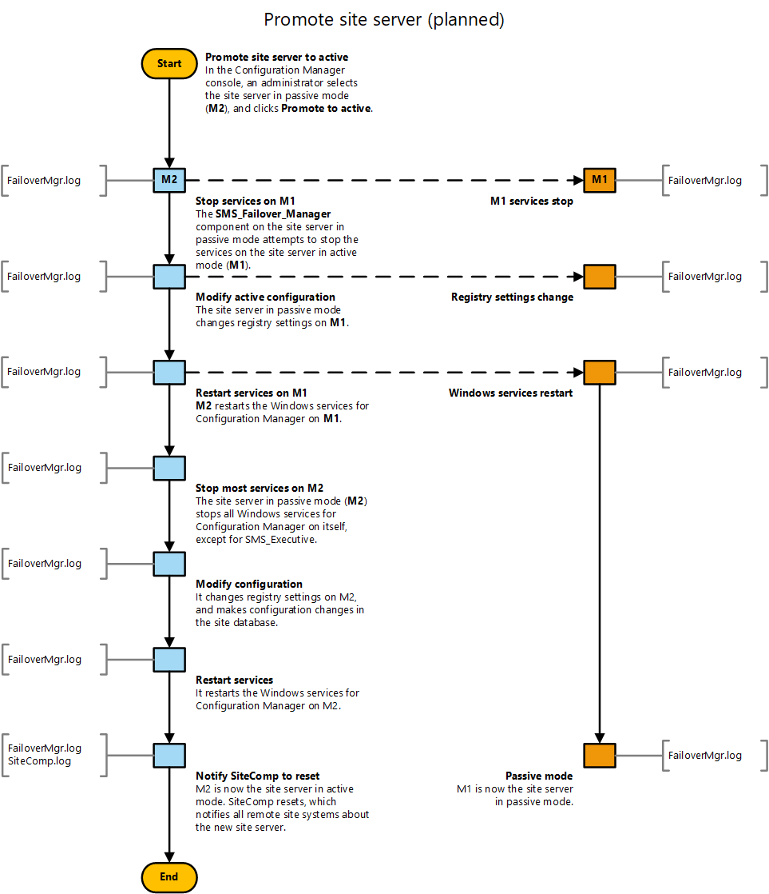

# Flowchart - Promote site server (planned)

*Applies to: Configuration Manager (current branch)*

This flowchart diagram shows the process by which a site server in passive mode is promoted to the site server in active mode. In this example, the administrator plans for the promotion process. Both servers are online and fully functional. For more information, see the following articles:  
- [Site server high availability](site-server-high-availability.md)  
- [Flowchart - Set up a site server in passive mode](passive-site-server-flowchart.md)

