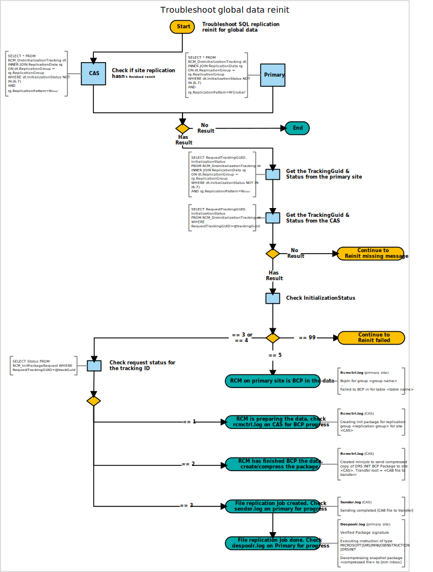

# Troubleshoot global data reinit

In a multi-site hierarchy, Configuration Manager uses SQL Server replication to transfer data between sites. For more information, see [Database replication](../../../plan-design/hierarchy/database-replication.md).

Use the following diagram to start troubleshooting SQL Server replication reinitialization (reinit) for global data in a Configuration Manager hierarchy:



## Queries

This diagram uses the following queries:

### Check if renit isn't finished for site replication

```sql
SELECT * FROM RCM_DrsInitializationTracking dt
INNER JOIN ReplicationData rg
ON dt.ReplicationGroup = rg.ReplicationGroup
WHERE dt.InitializationStatus NOT IN (6,7)
AND rg.ReplicationPattern=N`Global'
```

### Get the TrackingGuid & Status from the primary site

```sql
SELECT RequestTrackingGUID, InitializationStatus
FROM RCM_DrsInitializationTracking dt
INNER JOIN ReplicationData rg
ON dt.ReplicationGroup = rg.ReplicationGroup
WHERE dt.InitializationStatus NOT IN (6,7)
AND rg.ReplicationPattern=N`Global'
```

### Get the TrackingGuid & Status from the CAS

```sql
SELECT RequestTrackingGUID, InitializationStatus
FROM RCM_DrsInitializationTracking dt
WHERE RequestTrackingGUID=@trackingGuid
```

### Check request status for the tracking ID

```sql
SELECT Status FROM RCM_InitPackageRequest
WHERE RequestTrackingGUID=@trackGuid
```

## Next steps

- [Reinit missing message](reinit-missing-message.md)
