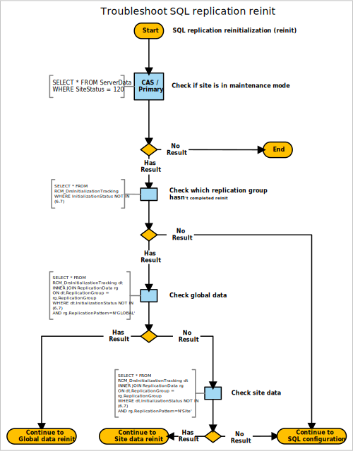

# SQL Server replication reinit

In a multi-site hierarchy, Configuration Manager uses SQL Server replication to transfer data between sites. For more information, see [Database replication](../../../plan-design/hierarchy/database-replication.md).

Use the following diagram to start troubleshooting SQL Server replication reinitialization (reinit):



## Queries

This diagram uses the following queries:

### Check if site is in maintenance mode

```sql
SELECT * FROM ServerData
WHERE Status = 120
```

### Check that reinit isn't completed for which replication group

```sql
SELECT * FROM RCM_DrsInitializationTracking
WHERE InitializationStatus NOT IN (6,7)
```

### Check global data

```sql
SELECT * FROM RCM_DrsInitializationTracking dt
INNER JOIN ReplicationData rg
ON dt.ReplicationGroup = rg.ReplicationGroup
WHERE dt.InitializationStatus NOT IN (6,7)
AND rg.ReplicationPattern=N'GLOBAL'
```

### Check site data

```sql
SELECT * FROM RCM_DrsInitializationTracking dt
INNER JOIN ReplicationData rg
ON dt.ReplicationGroup = rg.ReplicationGroup
WHERE dt.InitializationStatus NOT IN (6,7)
AND rg.ReplicationPattern=N'Site'
```

## Next steps

- [Global data reinit](global-data-reinit.md)
- [Site data reinit](site-data-reinit.md)
- [SQL Server configuration](sql-configuration.md)
