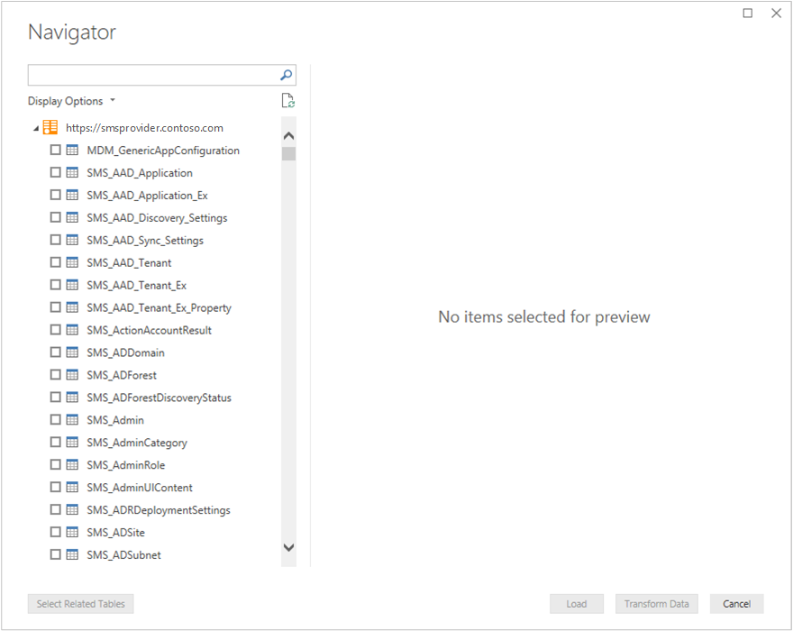

# How to use the administration service in Configuration Manager

*Applies to: Configuration Manager (current branch)*

Configuration Manager uses the administration service REST API in several native [scenarios](overview.md#scenarios). You can also use the administration service for your own custom scenarios.

> [!NOTE]
> The examples in this article all use the FQDN of the server that hosts the SMS Provider role. If you access the administration service remotely through a CMG, use the CMG endpoint instead of the SMS Provider FQDN. For more information, see [Enable internet access](set-up.md#enable-internet-access).

## Direct query

There are several ways that you can directly query the administration service:

- Web browser
- PowerShell
- A third-party tool to send HTTPS GET or PUT requests to the web service

The next sections cover the first two methods.

> [!IMPORTANT]
> The administration service class names are case-sensitive. Make sure to use the proper capitalization. For example, `SMS_Site`.

### Web browser

You can use a web browser to easily query the administration service. When you specify a query URI as the browser's URL, the administration service processes the GET request, and returns the result in JSON format. Some web browsers may not display the result in an easy to read format.

<!-- screenshot -->

### PowerShell

Make direct calls to this service with the Windows PowerShell cmdlet [Invoke-RestMethod](/powershell/module/microsoft.powershell.utility/invoke-restmethod).

For example:

```powershell
Invoke-RestMethod -Method 'Get' -Uri "https://SMSProviderFQDN/AdminService/wmi/SMS_Site" -UseDefaultCredentials
```

This command returns the following output:

```output
@odata.context                                                value
--------------                                                -----
https://SMSProviderFQDN/AdminService/wmi/$metadata#SMS_Site   {@{@odata.etag=FC1; __LAZYPROPERTIES=System.Objec...
```

The following example drills down to more specific values:

```powershell
((Invoke-RestMethod -Method 'Get' -Uri "https://SMSProviderFQDN/AdminService/wmi/SMS_Site" -UseDefaultCredentials).value).Version
```

The output of this command is the specific version of the site: `5.00.8968.1000`

#### Call PowerShell from a task sequence

You can use the **Invoke-RestMethod** cmdlet in a PowerShell script from the **Run PowerShell Script** task sequence step. This action lets you query the administration service during a task sequence.

For more information, see [Task sequence steps - Run PowerShell Script](../../osd/understand/task-sequence-steps.md#BKMK_RunPowerShellScript).

## Power BI Desktop

You can use Power BI Desktop to query data in Configuration Manager via the administration service. For more information, see [What is Power BI Desktop?](/power-bi/desktop-what-is-desktop)

1. In Power BI Desktop, in the ribbon, select **Get Data**, and select **OData feed**.

1. For the **URL**, specify the administration service route. For example, `https://smsprovider.contoso.com/AdminService/wmi/`

1. Choose **Windows Authentication**.

1. In the **Navigator** window, select the items to use in your Power BI dashboard or report.

[](media/powerbi-desktop-navigator.png#lightbox)

## Example queries

### Get more details about a specific device

`https://<ProviderFQDN>/AdminService/wmi/SMS_R_System(<ResourceID>)`

For example: `https://smsprovider.contoso.com/AdminService/wmi/SMS_R_System(16777219)`

### v1 Device class examples

- Get all devices: `https://<ProviderFQDN>/AdminService/v1.0/Device`

- Get single device: `https://<ProviderFQDN>/AdminService/v1.0/Device(<ResourceID>)`

- Run CMPivot on a device:

  ```rest
  Verb: POST
  URI: https://<ProviderFQDN>/AdminService/v1.0/Device(<ResourceID>)/AdminService.RunCMPivot
  Body: {"InputQuery":"<CMPivot query to run>"}
  ```

- See CMPivot job result:

  ```rest
  Verb: GET
  URI: https://<ProviderFQDN>/AdminService/v1.0/Device(<ResourceID>)/AdminService.CMPivotResult(OperationId=<Operation ID of the CM Pivot job>)
  ```

- See which collections a device belongs to: `https://<ProviderFQDN>/AdminService/v1.0/Device(16777219)/ResourceCollectionMembership?$expand=Collection&$select=Collection`

### Filter results with startswith

This example URI only shows collections whose names start with `All`.

`https://<ProviderFQDN>/AdminService/wmi/SMS_Collection?$filter=startswith(Name,'All') eq true`

### Run a static WMI method

This example invokes the **GetAdminExtendedData** method on the **SMS_AdminClass** that takes parameter named **Type** with value `1`.

```rest
Verb: Post
URI: https://<ProviderFQDN>/AdminService/wmi/SMS_Admin.GetAdminExtendedData
Body: {"Type":1}
```

## Next steps

[Custom properties for devices](custom-properties.md)
