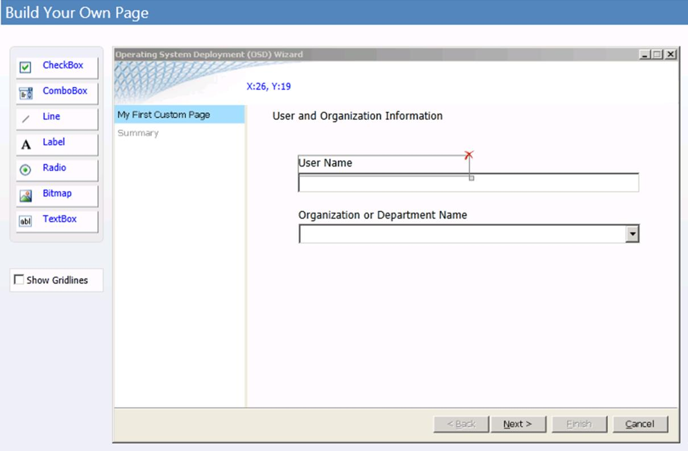

# Quick Start Guide for User-Driven Installation

Microsoft Deployment Toolkit (MDT) 2013 provides technology for deploying Windows operating systems, and Microsoft Office. This quick start guide helps you quickly evaluate MDT 2013 by providing condensed, step-by-step instructions for using it to install the Windows 8.1 operating system and Microsoft Office Professional Plus 2010 with User-Driven Installation (UDI) and Microsoft System Center 2012 R2 Configuration Manager. This quick start guide demonstrates how to perform the MDT New Computer deployment scenario, which covers the deployment of Windows 8.1 to a new computer. This scenario assumes that there is no user data or profile to preserve.

> [!NOTE]
>
> In this document, *Windows* applies to the Windows 8.1, Windows 8, Windows 7, Windows Server® 2012 R2, Windows Server 2012, and Windows Server 2008 R2 operating systems unless otherwise noted. MDT does not support ARM processor-based versions of Windows. Similarly, *MDT* refers to MDT 2013 unless otherwise stated.

 After using this guide to evaluate MDT, review the rest of the MDT guidance to learn more about the technology's advanced features.

> [!NOTE]
>
> The infrastructure setup described here is for evaluation purposes and not intended for a production system.

## Prerequisites

UDI installations using System Center 2012 R2 Configuration Manager have the following prerequisites.

### Required Software

To complete this guide, the following software is required:

- Windows Server 2008 R2

- Microsoft SQL Server® 2008 R2

- SQL Server 2008 R2 Service Pack 1 (SP1)

- SQL Server 2008 R2 SP1 Cumulative Update 6 (CU6)

- Windows 8.1

- System Center 2012 R2 Configuration Manager

- Office Professional Plus 2010 volume license, 32-bit version

- Microsoft .NET Framework version 3.5 with SP1

- Windows PowerShell™ version 2.0

- Windows Preinstallation Environment (Windows PE), which is included in Configuration Manager

- Networking services, including Domain Name System (DNS) and Dynamic Host Configuration Protocol (DHCP)

- Active Directory® Domain Services (AD DS)

> [!NOTE]
>
> The Task Sequencer used in MDT deployments requires that the Create Global Object right be assigned to credentials used to access and run the Deployment Workbench and the deployment process. This right is normally available to accounts with Administrator-level permissions (unless explicitly removed). Also, the Specialized Security - Limited Functionality (SSLF) security profile removes the Create Global Object right and should not be applied to computers deployed using MDT.

### Computer Configuration

To complete this guide, set up the computers listed in Table 1. These computers can be either physical computers or virtual machines (VMs) with the system resources designated.

### Table 1. Computers Used in This Guide

|**Computer** |**Description and system resources** |
|-|-|
|WDG-MDT-01|This computer runs the MDT infrastructure and Configuration Manager. The computer runs Windows Server 2008 R2 with the following networking services installed:<br><br> -   AD DS<br>-   DNS Server<br>-   DHCP Server<br>-   Windows Deployment Services<br><br> The system resources of the computer are as follows:<br><br> -   Quad-core processor running at 2.66 gigahertz (GHz) or faster<br>-   4 gigabytes (GB) or more of physical memory<br>-   A disk partition that has 40 GB or more of available disk space; it will become the drive C partition<br>-   One CD-ROM or DVD-ROM drive that will be assigned the drive letter D<br>-   A disk partition that has 40 GB or more of available disk space; it will become partition E.|
|WDG-REF-01|This is the reference computer, which runs no current operating system. The system resources of the computer are as follows:<br><br> -   Processor running at 1.4 GHz or faster<br>-   1 GB or more of physical memory<br>-   16 GB or more of available disk space|
|WDG-CLI-01|This is the target computer, which runs no current operating system. The system resources of the computer are as follows:<br><br> -   Processor running at 1.4 GHz or faster<br>-   1 GB or more of physical memory<br>-   16 GB or more of available disk space|

 The resources listed in Table 1 reflect the system resources recommended to perform the steps in this guide. For information on the minimum system resource requirements for:

- Windows Server 2008 R2, see [Installing Windows Server 2008 R2](https://technet.microsoft.com/library/dd379511\(WS.10\).aspx)

- SQL Server 2008 R2, see [Hardware and Software Requirements for Installing SQL Server 2008 R2](/sql/sql-server/install/hardware-and-software-requirements-for-installing-sql-server)

> [!NOTE]
>
> This guide assumes that MDT is being evaluated on 64-bit (x64) physical or virtual computers. If evaluating MDT on 32-bit (x86) platforms, download and install the x86 editions of MDT and the components that this guide describes.

## Step 1: Prepare the Prerequisite Infrastructure

For purposes of this guide, all the prerequisite infrastructure services run on the computer named *WDG-MDT-01*. Install the prerequisite software, server roles, and services on this computer before installing MDT.

> [!NOTE]
>
> This section assumes that you are creating a new Configuration Manager infrastructure for MDT. If you are using an existing Configuration Manager infrastructure, review the steps in this section and substitute existing resource names for the resources created in this section (such as the computer name and shared network folders). After reviewing this section, proceed to [Step 2: Prepare the MDT Environment](#PreparetheMDTEnvironment)

 Prepare the prerequisite infrastructure before installing MDT by:

- Installing Windows Server 2008 R2 as described in [Step 1-1: Install Windows Server 2008 R2](#InstallWindowsServer2008)

- Creating the required folders and network shares as described in [Step 1-2: Create the Required Folders and Network Shares](#CreatetheRequiredFoldersandNetworkShares)

- Obtaining the software required to perform the steps in this guide as described in [Step 1-3: Obtain the Required Software](#ObtaintheRequiredSoftware)

- Installing the AD DS server role as described in [Step 1-4: Install the AD DS Server Role](#InstalltheADDSServerRole)

- Installing the DHCP Server server role as described in [Step 1-5: Install the DHCP Server Server Role](#InstalltheDHCPServerServerRole)

- Installing the Web Services (IIS) server role as described in [Step 1-6: Install the Web Services (IIS) Server Role](#InstalltheWebServicesServerRole)

- Adding the required Windows Server 2008 R2 features as described in [Step 1-7: Add the Required Windows Server 2008 R2 Features](#AddtheRequiredWindowsServer2008Features)

- Creating the user and service accounts required to perform the steps in this guide as described in [Step 1-8: Create the Required User and Service Accounts](#CreatetheRequiredUserandServiceAccounts)

- Installing SQL Server 2008 R2 for Configuration Manager to use as described in [Step 1-9: Install SQL Server 2008 R2](#InstallSQLServer2008)

- Adding the site server to the Administrators security group as described in [Step 1-10: Add the Site Server to the Administrators Security Group](#AddtheSiteServertotheAdministratorsSecurityGroup)

- Installing Configuration Manager as described in [Step 1-11: Install Configuration Manager](#InstallConfigurationManager)

- Configuring the Network Access Account that Configuration Manager clients use to access Configuration Manager distribution points as described in [Step 1-12: Configure the Network Access Account](#ConfiguretheNetworkAccessAccount)

- Configuring the Configuration Manager site boundaries and boundary groups as described in [Step 1-13: Configure the Configuration Manager Site Boundaries and Boundary Groups](#ConfiguretheConfigurationManagerSiteBoundaries)

- Configuring the publishing of site information in AD DS and DNS as described in [Step 1-14: Configure the Publishing of Site Information in AD DS and DNS](#ConfigurethePublishingofSiteIntofrmation)

- Configuring discovery of users in AD DS as described in [Step 1-15: Configure Discovery of Active Directory Users](#ConfigureDiscoveryofActiveDirectoryUsers)

###  <a name="InstallWindowsServer2008"></a> Step 1-1: Install Windows Server 2008 R2

Use the information in 2 to install Windows Server 2008 R2. Accept default values unless otherwise specified.

### Table 2. Information for Installing Windows Server 2008 R2

|**When prompted for** |**Provide these values** |
|-|-|
|**Where do you want to install Windows?** |**Disk 0 Unallocated Space** |
|**Password** |Any strong password|
|**Computer name** |**WDG-MDT-01** |
|**Format for volumes C and E** |**NTFS** |
|**TCP/IP configuration** |Configure with a static IP address configuration, with the other TCP/IP configuration options as appropriate for the environment|

###  <a name="CreatetheRequiredFoldersandNetworkShares"></a> Step 1-2: Create the Required Folders and Network Shares

The MDT deployment process requires additional folders that are used as the source for files or to store files created during the MDT deployment process. Some of these folders need to be shared so that they can be accessed from other computers.

 **To create the required folders and shares**

1. Create the folders and shares listed in Table 3 with the permissions specified for each share

    ### Table 3. Folders That the MDT Deployment Process Requires

    |**Create this folder** |**With this share name** |**With these share permissions** |
    |-|-|-|
    |E:\Source$|Source$|**Administrators**: Co-owner<br><br> **Everyone**: Read|
    |E:\Images$|Images$|**Administrators**: Co-owner<br><br> **Everyone**: Read|
    |E:\Capture$|Capture$|**Administrators**: Co-owner<br><br> **Everyone**: Read|
    |E:\Packages$|Packages$|**Administrators**: Co-owner<br><br> **Everyone**: Read|

2. Create the following folders:

    - E:\CMDownloads

    - E:\Source$\CustomSettings

    - E:\Source$\Drivers

    - E:Source$Windows_8-1

    - E:Source$MDT_2013

    - E:Source$SQL2008R2

    - E:Source$SQL2008R2SP1

    - E:Source$SQL2008R2CU6

    - E:Source$OfficeProPlus2010

    - E:Source$ConfigMgr

    - E:Packages$Drivers

3. Copy the device drivers for the reference computer (WDG-REF-01) and the target computer (WDG-CLI-01) to E:\Source$\Drivers.

    > [!NOTE]
    >
    > The processes in this guide assume that the reference computer and target computer have the same devices and do not require different devices drivers.

###  <a name="ObtaintheRequiredSoftware"></a> Step 1-3: Obtain the Required Software

Besides Windows Server 2008 R2, Windows 8.1, and System Center 2012 R2 Configuration Manager, certain software is required to evaluate MDT based on the processes in this guide. Table 4 lists the software required to perform deployments using MDT, where to obtain the software, and where to place the software on WDG-MDT-01.

### Table 4. Additional Software Required for Deployment Using MDT

|**Obtain this software** |**Place in this folder** |
|-|-|
|MDT 2013|E:\Source$\MDT_2013|
|Windows 8.1 distribution files from the product media|E:\Source$\Windows_8-1|
|Device drivers required for the reference and target computers (WDG-REF-01 and WDG-CLI-01)|E:\Source$\Drivers|
|SQL Server 2008 R2 from the product media|E:\Source$\SQL2008|
|SQL Server 2008 R2 SP1, available at [https://www.microsoft.com/download/details.aspx?id=26113](https://www.microsoft.com/download/details.aspx?id=26113)|E:\Source$\SQL2008R2SP1|
|SQL Server 2008 R2 SP1 CU6, available at [https://support.microsoft.com/kb/2679367](https://support.microsoft.com/kb/2679367)|E:\Source$\SQL2008R2SP1CU6|
|System Center 2012 R2 Configuration Manager from the product media|E:\Source$\ConfigMgr|
|Office Professional Plus 2010 32-bit Volume Licensing version from the product media|E:\ Source$\OfficeProPlus2010|

###  <a name="InstalltheADDSServerRole"></a> Step 1-4: Install the AD DS Server Role

AD DS is required to provide authentication and act as a repository for configuration values for the Microsoft products and technologies that MDT uses, such as Microsoft SQL Server and Configuration Manager.

 To install AD DS, run the DCPROMO Wizard to configure the computer as a domain controller. Install AD DS using the information in Table 5, accepting any defaults unless otherwise specified.

### Table 5. Information for Installing AD DS

|**When prompted** |**Do this** |
|-|-|
|For the domain type|Create a new domain in a new forest.|
|For the fully qualified domain name|Type **mdt2013.corp.woodgrovebank.com**.|
|For the forest functional level|Select **Windows Server 2008 R2.** |
|To install the DNS Server service as part of the domain controller installation process|Select **Yes**.|

###  <a name="InstalltheDHCPServerServerRole"></a> Step 1-5: Install the DHCP Server Server Role

The DHCP Server server role is required to provide automatic IP configuration for the target computers. Install DHCP Server using the information in Table 6, accepting any defaults unless otherwise specified.

> [!NOTE]
>
> If you are using a virtualized environment, disable any DHCP configuration that the computer-virtualization software provides. Ensure that the DHCP Server service running WDG-MDT-01 is the only provider of IP configuration using DHCP.

### Table 6. Information for Installing the DHCP Server Server Role

|**On this wizard page** |**Do this** |
|-|-|
|**Authorize DHCP server in Active Directory** |Authorize WDG-MDT-01 to provide client IP configuration.|
|**DHCP scopes** |Create an appropriate scope that can be used to automatically configure TCP/IP for WDG-REF-01 and WDG-CLI-01.|
|**DHCPv6 stateless mode configuration** |Disable DHCPv6 stateless mode for this server.|

###  <a name="InstalltheWebServicesServerRole"></a> Step 1-6: Install the Web Services (IIS) Server Role

Install the Web Services (IIS) server role with the role services listed in Table 7, which are required for SQL Server 2008 R2 and Configuration Manager. Unless otherwise specified, use the default values.

### Table 7. Information for Installing the Web Services (IIS) Server Role

|**Role service** |**Status** |
|-|-|
|Web Server|Installed|
|Common HTTP Features|Installed|
|Static Content|Installed|
|Default Document|Installed|
|Directory Browsing|Installed|
|HTTP Errors|Installed|
|HTTP Redirection|Installed|
|WebDAV Publishing|Installed|
|Application Development|Installed|
|ASP.NET|Installed|
|.NET Extensibility|Installed|
|ASP|Not installed|
|CGI|Not installed|
|ISAPI Extensions|Installed|
|ISAPI Filters|Installed|
|Server Side Includes|Not installed|
|Health and Diagnostics|Installed|
|HTTP Logging|Installed|
|Logging Tools|Installed|
|Request Monitor|Installed|
|Tracing|Installed|
|Custom Logging|Not installed|
|ODBC Logging|Not installed|
|Security|Installed|
|Basic Authentication|Not installed|
|Windows Authentication|Installed|
|Digest Authentication|Not installed|
|Client Certificate Mapping Authentication|Not installed|
|IIS Client Certificate Mapping Authentication|Not installed|
|URL Authorization|Not installed|
|Request Filtering|Installed|
|IP and Domain Restriction|Not installed|
|Performance|Installed|
|Static Content Compression|Installed|
|Dynamic Content Compression|Not installed|
|Management Tools|Installed|
|IIS Management Console|Installed|
|IIS Management Scripts and Tools|Not installed|
|Management Service|Not installed|
|IIS 6 Management Compatibility|Installed|
|IIS 6 Metabase Compatibility|Installed|
|IIS 6 WMI Compatibility|Installed|
|IIS 6 Scripting Tools|Not installed|
|IIS 6 Management Console|Not installed|
|FTP Publishing Service|Not installed|
|FTP Server|Not installed|
|FTP Management Console|Not installed|
|IIS Hostable Web Core|Not installed|

###  <a name="AddtheRequiredWindowsServer2008Features"></a> Step 1-7: Add the Required Windows Server 2008 R2 Features

In addition to installing the required Windows Server 2008 R2 server roles, add the following required features in Server Manager in the **Features Summary** section:

- Background Intelligent Transfer Service

- Remote Differential Compression

###  <a name="CreatetheRequiredUserandServiceAccounts"></a> Step 1-8: Create the Required User and Service Accounts

Configuration Manager and SQL Server 2008 R2 require user accounts during the installation process. Table 8 lists the information needed for creating these accounts.

### Table 8. Information for Creating the Required Accounts

|                      **Create this account**                      |                                                                                                                                                                                                                                                                     **With these settings**                                                                                                                                                                                                                                                                      |
|-------------------------------------------------------------------|------------------------------------------------------------------------------------------------------------------------------------------------------------------------------------------------------------------------------------------------------------------------------------------------------------------------------------------------------------------------------------------------------------------------------------------------------------------------------------------------------------------------------------------------------------------|
|                 SQL Server Agent service account                  |      1. In **First name**, type **SQL Agent**.<br>2. In **Last name**, type **Service Account**.<br>3. In **User logon name**, type **SQLAgent**.<br>4. In **Password** and **Confirm password**, type **P@ssw0rd**.<br>5. Clear the **User must change password at next logon** check box.<br> 6. Select the **Password never expires** check box.<br>7. Make the account a member of the Domain Admins security group.<br>8. In **Description**, type **Service account used to run SQL Server 2008 R2 Agent service**.      |
|            SQL Server Database Engine service account             | 1. In **First name**, type **SQL DB Engine**.<br>2. In **Last name**, type **Service Account**.<br>3. In **User logon name**, type **SQLDBEngine**.<br>4. In **Password** and **Confirm password**, type **P@ssw0rd**.<br>5. Clear the **User must change password at next logon** check box.<br> 6. Select the **Password never expires** check box.<br>7. Make the account a member of the Domain Admins security group.<br>8. In **Description**, type **Service account used to run SQL Server 2008 R2 database engine**.  |
|           SQL Server Reporting Services service account           | 1. In **First name**, type **SQL Reporting**.<br>2. **In Last name**, type **Service Account**.<br>3. In **User logon name**, type **SQLReport**.<br>4. In **Password** and **Confirm password**, type **P@ssw0rd**.<br>5. Clear the **User must change password at next logon** check box.<br> 6. Select the **Password never expires** check box.<br>7. Make the account a member of the Domain Admins security group.<br>8. In **Description**, type **Service account used to run SQL Server 2008 R2 reporting services**. |
| Configuration Manager Client Network Access account |                           1. In **First name**, type **CM 2012**.<br>2. In **Last name**, type **Client Network Access**.<br>3. In **User logon** name, type **CMNetAccess**.<br>4. In **Password** and **Confirm password**, type **P@ssw0rd**.<br>5. Clear the **User must change password at next logon** check box.<br> 6. Select the **Password never expires** check box.<br>7. In **Description**, type **Service account used as the network access account for Configuration Manager Client**.                           |

###  <a name="InstallSQLServer2008"></a> Step 1-9: Install SQL Server 2008 R2

Before installing Configuration Manager, install SQL Server 2008 R2 SP1 and CU6.

> [!NOTE]
>
> To enable all SQL Server 2008 R2 features, install the Web Services (IIS) server role before installing SQL Server 2008 R2.

 **To install SQL Server 2008 R2**

1. Start the SQL Server Installation Center.

2. In the SQL Server Installation Center, in the navigation pane, select **Installation**.

3. In the preview pane, select **New installation or add features to an existing installation**.

    SQL Server 2008 R2 Setup Wizard starts.

4. Install SQL Server 2008 R2 using the information in Table 9, accepting the defaults unless otherwise specified.

   ### Table 9. Information for Installing SQL Server 2008 R2

   |       **On this wizard page**        |                                                                                                                                                                                                                        **Do this**                                                                                                                                                                                                                         |
   |--------------------------------------|------------------------------------------------------------------------------------------------------------------------------------------------------------------------------------------------------------------------------------------------------------------------------------------------------------------------------------------------------------------------------------------------------------------------------------------------------------|
   |       **Setup Support Rules**        |                                                                                                                                                                                                                       Select **OK**.                                                                                                                                                                                                                        |
   |           **Product Key**            |                                                                                                                                                                                                                      Select **Next**.                                                                                                                                                                                                                       |
   |          **License Terms**           |                                                                                                                                                                                       Select the **I accept the license terms** check box, and then select **Next**.                                                                                                                                                                                        |
   |       **Setup Support Files**        |                                                                                                                                                                                                                     Select **Install**.                                                                                                                                                                                                                     |
   |       **Setup Support Rules**        |                                                                                                                                                                                       Ensure that no critical results exist for the rules, and then select **Next**.                                                                                                                                                                                        |
   |            **Setup Role**            |                                                                                                                                                                                            Select **SQL Server Feature Installation**, and then select **Next**.                                                                                                                                                                                             |
   |        **Feature Selection**         |                                                                                                  1. Select the **Database Engine Services** check box.<br>2. Select the **Reporting Services** check box.<br>3. Select the **Full-Text Search** check box.<br>4. Select the **Management Tools - Complete** check box.<br>5. Select **Next**.                                                                                                  |
   |        **Installation Rules**        |                                                                                                                                                                                                                      Select **Next**.                                                                                                                                                                                                                       |
   |      **Instance Configuration**      |                                                                                                                                                                                                                      Select **Next**.                                                                                                                                                                                                                       |
   |     **Disk Space Requirements**      |                                                                                                                                                                                                                      Select **Next**.                                                                                                                                                                                                                       |
   |       **Server Configuration**       | 1. For **SQL Server Agent**, in **Account Name**, type **MDT2013\SQLAgent**, in **Password**, type **P@ssw0rd**.<br>2. For **SQL Server Database Engine**, in **Account Name**, type **MDT2013\SQLDBEngine**, in **Password**, type **P@ssw0rd**.<br>3. For **SQL Server Reporting Services**, in **Account Name**, type **MDT2013\SQLReport**, in **Password**, type **P@ssw0rd**.<br>4. Select **Next**. |
   |  **Database Engine Configuration**   |                                                                                                                                                                                                    Select **Add Current User**, and then select **Next**.                                                                                                                                                                                                    |
   | **Reporting Services Configuration** |                                                                                                                                                                                                                      Select **Next**.                                                                                                                                                                                                                       |
   |         **Error Reporting**          |                                                                                                                                                                                                                      Select **Next**.                                                                                                                                                                                                                       |
   | **Installation Configuration Rules** |                                                                                                                                                                                                                      Select **Next**.                                                                                                                                                                                                                       |
   |         **Ready to Install**         |                                                                                                                                                                                                                     Select **Install**.                                                                                                                                                                                                                     |
   |             **Complete**             |                                                                                                                                                                                                                      Select **Close**.                                                                                                                                                                                                                      |

5. Close the SQL Server Installation Center.

   **To install SQL Server 2008 R2 SP1**

6. In Windows Explorer, go to E:\Source$\SQL2008R2SP1, and double-click **SQLServer2008R2SP1-KB2528583-x64-ENU.exe**.

    The **Extracting Files** dialog box displays the file-extraction process. When the process is complete, the SQL Server 2008 R2 Service Pack 1 Update Setup Wizard starts.

7. Install SQL Server 2008 R2 SP1 using the information in Table 10, accepting the defaults unless otherwise specified.

   ### Table 10. Information for Installing SQL Server 2008 R2 SP1

   |**On this wizard page** |**Do this** |
   |-|-|
   |**SQL Server 2008 R2 update** |Select **Next**.|
   |**License Terms** |Select the **I accept the license terms** check box, and then select **Next**.|
   |**Select Features** |Select **Next**.|
   |**Check Files In Use** |Select **Next**.|
   |**Ready to update** |Select **Update**.|
   |**Update Progress** |The progress is displayed on the wizard page as the update is performed and finishes.|
   |**Complete** |Select **Close**.|

   **To install SQL Server 2008 R2 SP1 CU6**

8. In Windows Explorer, go to E:\Source$\SQL2008R2SP1CU6, and double-click **446622_intl_x64_zip.exe**.

    The **Microsoft Self-Extractor** dialog box appears.

9. In the **Microsoft Self-Extractor** dialog box, select **Continue**.

10. In the **Microsoft Self-Extractor** dialog box, in **Select the folder where you want to unzip the files to**, type **E:\Source$\SQL2008R2SP1CU6**, and then select **OK**.

    > [!NOTE]
    >
    > You can select the ellipsis (**...**) to browse for the E:\Source$\SQL2008R2SP1CU6 folder.

     The extraction process is displayed. When the process is complete, the completion status is displayed.

11. In the **Microsoft Self-Extractor** dialog box, select **OK**.

12. In Windows Explorer, go to E:\Source$\SQL2008R2SP1CU6, and double-click **SQLServer2008R2- KB2679367-x64.exe**.

     The **Extracting Files** dialog box displays the file-extraction process. When the process is complete, the SQL Server 2008 R2 Service Pack 1 CU6 Update Setup Wizard starts.

13. Install SQL Server 2008 R2 SP1 CU6 using the information in Table 11, accepting the defaults unless otherwise specified.

    ### Table 11. Information for Installing SQL Server 2008 R2 SP1 CU6

    |**On this wizard page** |**Do this** |
    |-|-|
    |**SQL Server 2008 R2 update** |Select **Next**.|
    |**License Terms** |Select the **I accept the license terms** check box, and then select **Next**.|
    |**Select Features** |Select **Next**.|
    |**Check Files In Use** |Select **Next**.|
    |**Ready to update** |Select **Update**.|
    |**Update Progress** |The progress is displayed on the wizard page as the update is performed and finishes.|
    |**Complete** |Select **Close**.|

     The **Install a SQL Server 2008 R2 update** dialog box appears prompting you to restart the computer to complete the setup.

14. In the **Install a SQL Server 2008 R2 update** dialog box, select **OK**.

15. Restart the computer.

16. After installing SQL Server 2008 R2 SP1 CU6, the SQL Server build number should be 10.51.2811.0.

     > [!TIP]
     >  You can verify the SQL Server build number by viewing the SQL Server updates applied in the Programs and Features Control Panel item by selecting **View installed updates**.

###  <a name="AddtheSiteServertotheAdministratorsSecurityGroup"></a> Step 1-10: Add the Site Server to the Administrators Security Group

When all computers are in the same forest, manually add the site server computer account to the local Administrators group on each computer. Complete this step before configuring the computer as a site system.

 **To add the site server to the Administrators security group**

1. Select **Start**, point to **Administrative Tools**, and then select **Active Directory Users and Computers**.

2. In the Active Directory Users and Computers console tree, go to mdt2013.corp.woodgrovebank.com/Builtin.

3. In the preview pane, right-click **Administrators**, and then select **Properties**.

4. In the **Administrators Properties** dialog box, select the **Members** tab, and then select **Add**.

5. In the **Select Users, Contacts, Computers, or Groups** dialog box, select **Object Types**.

 6. In the **Object Types** dialog box, in **Object types**, select **Computers**, and then select **OK**.

7. In the **Select Users, Contacts, Computers, or Groups** dialog box, in **Enter the object names to select**, type **WDG-MDT-01**. Select **Check Names**, and then select **OK**.

8. Close any open windows.

###  <a name="InstallConfigurationManager"></a> Step 1-11: Install Configuration Manager

When the other products and technologies have been installed, install Configuration Manager. Before doing so, however, extend the Active Directory schema so that computers can locate the distribution points, service locator points, and other server roles. Also, you can extend the schema after you have installed Configuration Manager. For more information about how to extend the Active Directory schema for Configuration Manager, see the section, "Extend the Active Directory Schema," in the Configuration Manager Documentation Library, which is installed with Configuration Manager.

 After extending the Active Directory schema, install Configuration Manager. The configuration of WDG-MDT-01 supports Configuration Manager for this sample. The configuration of computers in the production network may vary. To find out more about the prerequisites for installing Configuration Manager, see [Supported Configurations for Configuration Manager](/previous-versions/system-center/system-center-2012-R2/gg682077(v=technet.10)).

 **To install Configuration Manager**

1. Start the System Center 2012 R2 Configuration Manager Setup splash screen.

2. On the System Center 2012 R2 Configuration Manager Setup splash screen, select the **Install** link.

    The Microsoft System Center 2012 R2 Configuration Manager Setup Wizard starts.

3. Complete the Microsoft System Center 2012 R2 Configuration Manager Setup Wizard using the information in Table 12. Accept the defaults unless otherwise specified.

   ### Table 12. Information for Installing Configuration Manager

   |                  **On this wizard page**                  |                                                                                                                                         **Do this**                                                                                                                                          |
   |-----------------------------------------------------------|----------------------------------------------------------------------------------------------------------------------------------------------------------------------------------------------------------------------------------------------------------------------------------------------|
   |                   **Before You Begin**                    |                                                                                                                                       Select **Next**.                                                                                                                                        |
   |                    **Getting Started**                    |                                                                                                                                       Select **Next**.                                                                                                                                        |
   |                      **Product Key**                      |                                                                           In **Enter your 25-character product key**, type ***product_key*** (where *product_key* is your product key for Configuration Manager).                                                                            |
   |           **Microsoft Software License Terms**            |                                                                                                       Select the **I accept these license terms** check box, and then select **Next**.                                                                                                        |
   |            **Update Prerequisite Components**             |                                                                        In **Download and use the latest updates. Updates will be saved to the following location**, type **E:\CMDownloads**, and then select **Next**.                                                                        |
   |               **Server Language Selection**               |                                                                                                                                       Select **Next**.                                                                                                                                        |
   |               **Client Language Selection**               |                                                                                                                                       Select **Next**.                                                                                                                                        |
   |            **Site and Installation Settings**             |                                                                                     1. In **Site code**, type **NYC**.<br>2. In **Site name**, type **New York City Site**.<br>3. Select **Next**.                                                                                     |
   |               **Primary Site Installation**               | 1. Select **Install the primary site as a stand-alone site**.<br>2. Select **Next**.<br>     The **Configuration Manager** dialog box appears, confirming that you want to install this site as a stand-alone site.<br>3. In the **Configuration Manager** dialog box, select **Yes**. |
   |                 **Database Information**                  |                                                                                                                                       Select **Next**.                                                                                                                                        |
   |                 **SMS Provider Settings**                 |                                                                                                                                       Select **Next**.                                                                                                                                        |
   |        **Client Computer Communication Settings**         |                                                                                               Select **Configure the communication method on each site system role**, and then select **Next**.                                                                                                |
   |                   **Site System Roles**                   |                                                                                                                                       Select **Next**.                                                                                                                                        |
   | **Customer Experience Improvement Program Configuration** |                                                                             Select the appropriate participation in the Customer Experience Improvement program for your organization, and then select **Next**.                                                                              |
   |                   **Settings Summary**                    |                                                                                                                                       Select **Next**.                                                                                                                                        |
   |                  **Prerequisite Check**                   |                                                                                                                                   Select **Begin Install**.                                                                                                                                   |
   |                        **Install**                        |                                                                                                       Monitor the installation process until it is complete, and then select **Close**.                                                                                                       |

4. Close all open windows and dialog boxes.

   When the wizard is complete, Configuration Manager is installed.

###  <a name="ConfiguretheNetworkAccessAccount"></a> Step 1-12: Configure the Network Access Account

The Configuration Manager client needs an account to provide credentials when accessing the Configuration Manager distribution points, MDT deployment shares, and shared folders. This account is called the *Network Access account*. The CMNetAccess account was created earlier in the process to use as the Network Access account.

 **To configure the Network Access account**

1. Select **Start**, point to **All Programs**, and then point to **Microsoft System Center 2012**. Point to **Configuration Manager**, and then select **Configuration Manager Console**.

2. In the Configuration Manager console, in the navigation pane, select **Administration**.

3. In the Administration workspace, go to Overview/Site Configuration/Sites.

4. In the preview pane, select **NYC - New York City Site**.

5. On the Ribbon, select **Settings**, select **Configure Site Components**, and then select **Software Distribution**.

6. In the **Software Distribution Properties** dialog box, select the **Network Access Account** tab.

7. In **Network Access Account**, select **Specify the account that accessed network locations**, select **Set**, and then select **New Account**.

    The **Windows User Account** dialog box appears.

8. Complete the **Windows User Account** dialog box using the information in Table 13, and then select **OK**.

   ### Table 13. Information Required to Complete the Windows User Account Dialog Box

   |     **For this**     |           **Do this**           |
   |----------------------|---------------------------------|
   |    **User name**     |  Type **MDT2013\CMNetAccess**.  |
   |     **Password**     | Type **P@ssw0rd**. |
   | **Confirm password** | Type **P@ssw0rd**. |

9. In the **Software Distribution Properties** dialog box, select **OK**.

10. Close any open windows.

###  <a name="ConfiguretheConfigurationManagerSiteBoundaries"></a> Step 1-13: Configure the Configuration Manager Site Boundaries and Boundary Groups

The Configuration Manager client needs to know the boundaries for the site. Unless the site boundaries are specified, the client assumes that the computer running Configuration Manager is in a remote site. Add a site boundary based on the IP subnet that WDG-MDT-01, WDG-REF-01, and WDG-CLI-01 use. Then, add the site boundary to a site boundary group.

 **To create a Configuration Manager site boundary**

1. Select **Start**, point to **All Programs**, and then point to **Microsoft System Center 2012**. Point to **Configuration Manager**, and then select **Configuration Manger Console**.

2. In the Configuration Manager console, in the navigation pane, select **Administration**.

3. In the Administration workspace, go to Overview/Hierarchy Configuration/Boundaries.

4. On the Ribbon, select **Create Boundary**.

    The **Create Boundary** dialog box opens.

5. Complete the **Create Boundary** dialog box using the information in Table 14, and then select **OK**.

   > [!NOTE]
   >  For this sample, the site boundary is specified by network address. However, you can also specify site boundaries using an AD DS site name or an IP address range.

   ### Table 14. Information Required to Complete the Create Boundary Dialog Box

   |**For this** |**Do this** |
   |-|-|
   |**Description** |Type **IP Subnet Boundary**.|
   |**Type** |Select **IP subnet**.|
   |Network|Type ***network_address*** (where *network_address* is the network address of the subnet where the computers are installed).|
   |**Subnet mask** |Type ***subnet_mask*** (where *subnet_mask* is the subnet mask of the subnet where the computers are installed).|

   **To add the Configuration Manager site boundary to a site boundary group**

6. In the Configuration Manager console, in the navigation pane, select **Administration**.

7. In the Administration workspace, go to Overview/Hierarchy Configuration/Boundary Groups.

8. On the Ribbon, select **Create Boundary Group**.

    The **Create Boundary Group** dialog box opens.

9. Complete the **General** tab of the **Create Boundary Group** dialog box using the information in Table 15.

   ### Table ARABIC 15. Information Required to Complete the General Tab of the Create Boundary Group Dialog Box

   |  **For this**  |                                                                                                                                                       **Do this**                                                                                                                                                        |
   |----------------|--------------------------------------------------------------------------------------------------------------------------------------------------------------------------------------------------------------------------------------------------------------------------------------------------------------------------|
   |    **Name**    |                                                                                                                                          Type **New York City Boundary Group**.                                                                                                                                          |
   |  Description   |                                                                                                                        Type **Boundary group for the site boundaries at the New York City site**.                                                                                                                        |
   | **Boundaries** | 1. Select **Add**.<br>     The **Add Boundaries** dialog box appears.<br>2. In the **Add Boundaries** dialog box, select ***site_boundary*** (where *site_boundary* is the site boundary you created earlier in the process), and then select **OK**.<br>     The site boundary appears in the list of boundaries. |

10. Complete the **References** tab of the **Create Boundary Group** dialog box using the information in Table 16, and then select **OK**.

    ### Table 16. Information Required to Complete the References Tab of the Create Boundary Group Dialog Box

    |     **For this**     |                                                                                                                                       **Do this**                                                                                                                                       |
    |----------------------|-----------------------------------------------------------------------------------------------------------------------------------------------------------------------------------------------------------------------------------------------------------------------------------------|
    | **Site assignment**  |                                                                                                          Select the **Use this boundary group for site assignment** check box.                                                                                                          |
    | **Content location** | 1. Select **Add**.<br>     The **Add Site Systems** dialog box appears.<br>2. In the **Add Site Systems** dialog box, select **\\\WDG-MDT-01.mdt2013.corp.woodgrovebank.com**, and then select **OK**.<br>     The site system server appears in the list of site system servers. |

11. Close any open windows.

###  <a name="ConfigurethePublishingofSiteIntofrmation"></a> Step 1-14: Configure the Publishing of Site Information in AD DS and DNS

The Configuration Manager client needs to locate the various Configuration Manager server roles. Modify the site properties to publish the site information in AD DS and in DNS.

 **To configure the publishing of site information in AD DS and in DNS**

1. Select **Start**, point to **All Programs**, and then point to **Microsoft System Center 2012**. Point to **Configuration Manager**, and then select **Configuration Manager Console**.

2. In the Configuration Manager console, in the navigation pane, select **Administration**.

3. In the Administration workspace, go to Overview/Site Configuration/Sites.

4. In the preview pane, select **NYC - New York City Site**.

5. On the Ribbon, select **Properties**.

 6. In the **New York City Site Properties** dialog box, on the **Publishing** tab, verify that the **mdt2013.corp.woodgrovebank.com** Active Directory forest is listed, and then select **Cancel**.

7. Close any open windows.

###  <a name="ConfigureDiscoveryofActiveDirectoryUsers"></a> Step 1-15: Configure Discovery of Active Directory Users

In some instances, software will be deployed to user collections that Configuration Manager discovers. Configuration Manager can discovery user accounts stored in AD DS using the Active Directory User Discovery method.

 **To configure discovery of Active Directory users**

1. Select **Start**, point to **All Programs**, and then point to **Microsoft System Center 2012**. Point to **Configuration Manager**, and then select **Configuration Manager Console**.

2. In the Configuration Manager console, in the navigation pane, select **Administration**.

3. In the Administration workspace, go to Overview/Hierarchy/Discovery Methods.

4. In the preview pane, select **Active Directory User Discovery**.

5. On the Ribbon, on the **Home** tab, select **Properties**.

    The **Active Directory User Discovery Properties** dialog box appears.

6. In the **Active Directory User Discovery Properties** dialog box, on the **General** tab, perform the following steps:

   1. Select the **Enable Active Directory User Discovery** check box.

   2. In **Active Directory containers**, select **New**.

       The **New Active Directory Container** dialog box appears.

   3. In the **New Active Directory Container** dialog box, in **Path**, select **Browse**.

       The **Select New Container** dialog box appears.

   4. In the **Select New Container** dialog box, select **mdt2013**, and then select **OK**.

       In the **New Active Directory Container** dialog box, the Lightweight Directory Access Protocol (LDAP) path is displayed in the **Path** box.

   5. In the **New Active Directory Container** dialog box, select OK.

      The LDAP path appears in the **Active Directory containers** list box.

7. In the **Active Directory User Discovery Properties** dialog box, select **OK**.

    The **Configuration Manager** dialog box appears, querying whether you want to perform the discovery as soon as possible.

8. In the **Configuration Manager** dialog box, select **Yes**.

9. In the Configuration Manager console, in the navigation pane, select **Assets and Compliance**.

10. In the Assets and Compliance workspace, go to Overview/Users.

     The list of users discovered in AD DS is displayed in the preview pane.

11. Close any open windows.

##  <a name="PreparetheMDTEnvironment"></a> Step 2: Prepare the MDT Environment

The first step in the deployment process is to prepare the MDT environment. When this step is complete, you can create the reference computer and deploy a captured image of it to the target computer (WDG-CLI-01) using Configuration Manager integration with MDT.

 Prepare the MDT environment by:

- Installing MDT as described in [Step 2-1: Install MDT](#InstallMDT)

- Enabling Configuration Manager console integration by running the Configure ConfigMgr Integration wizard as described in [Step 2-2: Enable Configuration Manager Console Integration](#EnableConfigurationManagerConsoleIntegration)

###  <a name="InstallMDT"></a> Step 2-1: Install MDT

To install MDT, complete the following steps:

1. In Windows Explorer, go to E:\Source$\MDT_2013.

2. Double-click **MicrosoftDeploymentToolkit2013_x64.msi** (for 64-bit operating systems) or **MicrosoftDeploymentToolkit2013_x86.msi** (for 32-bit operating systems), and then select **Install**.

    The Microsoft Deployment Toolkit 2013 Setup Wizard starts.

3. Complete the Microsoft Deployment Toolkit 2013 Setup Wizard using the information in Table 17. Accept the default values unless otherwise specified.

   ### Table 17. Information for Completing the Microsoft Deployment Toolkit 2013 Setup Wizard

   |**On this wizard page** |**Do this** |
   |-|-|
   |**Welcome to the Microsoft Deployment Toolkit 2013 Setup Wizard** |Select **Next**.|
   |**End-User License Agreement** |Select **I accept the terms in the License Agreement**, and then select **Next**.|
   |**Custom Setup** |Select **Next**.|
   |**Ready to install Microsoft Deployment Toolkit 2013** |Select **Install**.|
   |**Installing Microsoft Deployment Toolkit 2013** |The progress for installing MDT is displayed.|
   |**Completed the Microsoft Deployment Toolkit 2013 Setup Wizard** |Select **Finish**.|

   The Microsoft Deployment Toolkit 2013 Setup Wizard finishes, and MDT is installed on WDG-MDT-01.

###  <a name="EnableConfigurationManagerConsoleIntegration"></a> Step 2-2: Enable Configuration Manager Console Integration

Before you can use the Configuration Manager integration features of MDT, run the Configure ConfigMgr Integration wizard. This wizard copies the appropriate integration files to the folder in which Configuration Manager is installed. The wizard also adds Windows Management Instrumentation (WMI) classes for the new MDT custom actions. The classes are added by compiling a new Managed Object Format (.mof) file that contains the new class definitions.

 **To enable Configuration Manager console integration**

> [!NOTE]
>
> Ensure that the Configuration Manager console is closed while performing these steps.

1. Select **Start**, and then point to **All Programs**. Point to **Microsoft Deployment Toolkit**, and then select **Configure ConfigMgr Integration**.

    The Configure ConfigMgr Integration Wizard starts.

2. Complete the Configure ConfigMgr Integration Wizard using the information in Table 18. Accept the default values unless otherwise specified.

   ### Table 18. Information for Completing the Configure ConfigMgr Integration Wizard

   |**On this wizard page** |**Do this** |
   |-|-|
   |**Options** |1. Verify that the **Install the MDT console extensions for ConfigMgr 2012** check box is selected.<br>2. Verify that the **Add the MDT task sequence actions to a ConfigMgr server** check box is selected.<br>3. In **Site server name**, verify that the value is **WDG-MDT-01.mdt2013.corp.woodgrovebank.com**.<br>4. In **Site code**, verify that the value is **NYC**.<br>5. Select **Next**.|
   |**Confirmation** |Select **Finish**.|

   The Configure ConfigMgr Integration Wizard finishes, and MDT is integrated with Configuration Manager.

## Step 3: Create and Configure a Task Sequence to Create a Reference Computer

When you have prepared the MDT environment, create the reference computer. The reference computer is the template for deploying new images to the target computers. Configure this computer (WDG-REF-01) exactly as you will configure the target computers. You will then capture an image of the reference computer and deploy the image to the target computers.

 Create the reference computer, WDG-REF-01, by:

- Creating an MDT task sequence to deploy Windows 8.1 to the reference computer as described in [Step 3-1: Create an MDT Task Sequence for Deploying the Reference Computer](#CreateMDTTaskSequenceforDeployingReferenceComputer)

- Selecting the distribution points for the new packages and images that the Create MDT Task Sequence Wizard creates as described in [Step 3-2: Select the Distribution Points for the New Packages and Images](#SelectDistributionPointsfortheNewPackages)

- Adding the necessary device drivers to a new drive package and to the appropriate boot images as described in [Step 3-3: Add the Necessary Device Drivers](#AddtheNecessaryDeviceDrivers)

- Enable monitoring of the MDT deployment process as described in [Step 3-4: Enable MDT Deployment Process Monitoring](#EnableMDTDeploymentProcessMonitoring)

- Configuring the MDT configuration files for the reference computer—specifically, the CustomSettings.ini file—as described in [Step 3-5: Customize the MDT Configuration Files for the Reference Computer](#CustomizeMDTConfigFilesforReferenceComputer)

- Updating the Configuration Manager distribution points for the Custom Settings Files package as described in [Step 3-6: Update the Distribution Points for the Custom Settings Files Package](#UpdateDistributionPointsforCustomSettings)

- Customizing the task sequence for the reference computer as described in [Step 3-7: Customize the Task Sequence for the Reference Computer](#CustomizeTaskSequenceforReferenceComputer)

###  <a name="CreateMDTTaskSequenceforDeployingReferenceComputer"></a> Step 3-1: Create an MDT Task Sequence for Deploying the Reference Computer

Use the Create MDT Task Sequence Wizard in the Configuration Manager console to create task sequences in Configuration Manager that are integrated with MDT. MDT includes the Standard Client Task Sequence template, which you can use to deploy the reference computer.

 The Create MDT Task Sequence Wizard substitutes the packages and images selected for the placeholders in the task sequence templates. After completing the wizard, the new task sequence references the appropriate packages and images.

> [!NOTE]
>
> Always use the Create MDT Task Sequence Wizard to create task sequences based on the MDT task sequence templates. Although you can manually import the task sequence templates, Microsoft does not recommend this process.

 **To create a task sequence for deploying the reference computer**

1. Select **Start**, point to **All Programs**, and then point to **Microsoft System Center 2012**. Point to **Configuration Manager**, and then select **Configuration Manager Console**.

2. In the Configuration Manager console, in the navigation pane, select **Software Library**.

3. In the Software Library workspace, go to Overview/Operating Systems/Task Sequences.

4. On the Ribbon, on the **Home** tab, in the **Task Sequences** group, select **Create MDT Task Sequence**.

    The Create MDT Task Sequence Wizard starts.

5. Complete the Create MDT Task Sequence Wizard using the information in Table 19. Accept the default values unless otherwise specified.

   ### Table 19. Information for Completing the Create MDT Task Sequence Wizard

   |        **On this wizard page**         |                                                                                                                                                                                                                                                                                                                                         **Do this**                                                                                                                                                                                                                                                                                                                                         |
   |----------------------------------------|---------------------------------------------------------------------------------------------------------------------------------------------------------------------------------------------------------------------------------------------------------------------------------------------------------------------------------------------------------------------------------------------------------------------------------------------------------------------------------------------------------------------------------------------------------------------------------------------------------------------------------------------------------------------------------------------|
   |          **Choose Template**           |                                                                                                                                                                                                                                                                                                                  Select **Client Task Sequence**, and then select **Next**.                                                                                                                                                                                                                                                                                                                  |
   |      **Choose Template: General**      |                                                                                                                                                                                                                             1. In **Task sequence name**, type **Windows 8.1 Reference Deployment**.<br>2. In **Task sequence comments**, type **Task sequence for deploying Windows 8.1 to the reference computer (WDG-REF-01)**, and then select **Next**.                                                                                                                                                                                                                             |
   |      **Choose Template: Details**      |                                                                                                                                                                       1. Select **Join a workgroup**.<br>2. In **Workgroup**, type **WORKGROUP**.<br>3. In **User name**, type **Woodgrove Bank Employee**.<br>4. In **Organization name**, type **Woodgrove Bank**.<br>5. In **Product key**, type ***product_key*** (where *product_key* is the product key for Windows 8.1).<br> 6. Select **Next**.                                                                                                                                                                        |
   | **Choose Template: Capture Settings**  | <ol><li>Select **This task sequence may be used to capture and image**.</li><li>In **Capture destination**, type **\\\WDG-MDT-01\Capture$\WDG-REF-01.wim**.</li><li>In **Capture account**, select **Set**.</li><li>Complete the **Windows User Account** dialog box by performing the following steps:<br><br> <ol><li>In **User name**, type **MDT2013\Administrator**.</li><li>In **Password** and **Confirm password**, type **P@ssw0rd**.</li></ol></li><li>Select **OK**.</li><li>Select **Next**.</li></ol> |
   |             **Boot Image**             |                                                                                                                                                                                                                                                         1. Select **Create a new boot image package**.<br>2. In **Package source folder to be created**, type **\\\WDG-MDT-01\Packages$\WINPE_Custom**, and then select **Next**.                                                                                                                                                                                                                                                         |
   |    **Boot Image: General Settings**    |                                                                                                                                                                                                                        1. In **Name**, type **Windows PE Custom**.<br>2. In **Version**, type **1.00**.<br>3. In **Comments**, type **Customized version of Windows PE to be used in deployment of reference and target computers**, and then select **Next**.                                                                                                                                                                                                                        |
   |        **Boot Image: Options**         |                                                                                                                                                                                                                                                                                                                 Under **Platform**, select **x64**, and then select **Next**.                                                                                                                                                                                                                                                                                                                 |
   |       **Boot Image: Components**       |                                                                                                                                                                                                                                                                                                                                       Select **Next**.                                                                                                                                                                                                                                                                                                                                       |
   |     **Boot Image: Customization**      |                                                                                                                                                                                                                                                                                                                                       Select **Next**.                                                                                                                                                                                                                                                                                                                                       |
   |            **MDT Package**             |                                                                                                                                                                                                                                              1. Select **Create a new Microsoft Deployment Toolkit Files package**.<br>2. In **Package source folder to be created**, type **\\\WDG-MDT-01\Packages$\MDT_Files**, and then select **Next**.                                                                                                                                                                                                                                               |
   |      **MDT Package: MDT Details**      |                                                                                                                                                                                                                                   1. In **Name**, type **MDT Files**.<br>2. In **Version**, type **1.00**.<br>3. In **Comments**, type **Provides access to MDT files during Configuration Manager deployment process**, and then select **Next**.                                                                                                                                                                                                                                    |
   |              **OS Image**              |                                                                                                                                                                                                           1. Select **Create a new OS install package**.<br>2. In **OS installation folder location**, type **\\\WDG-MDT-01\Source$\Windows_8-1**.<br>3. In **Package source folder to be created**, type **\\\WDG-MDT-01\Packages$\Windows_8-1**, and then select **Next**.                                                                                                                                                                                                           |
   |      **OS Image: Image Details**       |                                                                                                                                                                                                                                            1. In **Name**, type **Windows 8.1**.<br>2. In **Version**, type **1.00**.<br>3. In **Comments**, type **Windows 8.1 package used to deploy to reference computers**, and then select **Next**.                                                                                                                                                                                                                                            |
   |         **Deployment Method**          |                                                                                                                                                                                                                                                                                                                                       Select **Next**.                                                                                                                                                                                                                                                                                                                                       |
   |           **Client Package**           |                                                                                                                                                                                                                                                                                                          Select **Create a new ConfigMgr client package**, and then select **Next**.                                                                                                                                                                                                                                                                                                          |
   |            **USMT Package**            |                                                                                                                                                                                                                                                                1. Select **Create a new USMT package**.<br>2. In **Package source folder to be created**, type **\\\WDG-MDT-01\Packages$\USMT**, and then select **Next**.                                                                                                                                                                                                                                                                |
   |     **USMT Package: USMT Details**     |                                                                                                                                                                                                                                        1. In **Name**, type **USMT**.<br>2. In **Version**, type **1.00**.<br>3. In **Comments**, type **USMT files used to capture and restore user state migration information**, and then select **Next**.                                                                                                                                                                                                                                         |
   |          **Settings Package**          |                                                                                                                                                                                                                                                    1. Select **Create a new settings package**.<br>2. In **Package source folder to be created**, type **\\\WDG-MDT-01\Packages$\CustomSettings_Reference**, and then select **Next**.                                                                                                                                                                                                                                                    |
   | **Settings Package: Settings Details** |                                                                                                                                                                                                      1. In **Name**, type **MDT Reference Computer Custom Settings**.<br>2. In **Version**, type **1.00**.<br>3. In **Comments**, type **Configuration settings for MDT deployment process (such as CustomSettings.ini) for the reference computer**, and then select **Next**.                                                                                                                                                                                                       |
   |          **Sysprep Package**           |                                                                                                                                                                                                                                                                                                                                       Select **Next**.                                                                                                                                                                                                                                                                                                                                       |
   |              **Summary**               |                                                                                                                                                                                                                                                                            Review the information in the **Details** box  that you provided while completing the previous wizard pages, and then select **Next**.                                                                                                                                                                                                                                                                            |
   |              **Progress**              |                                                                                                                                                                                                                                                                                                                  The progress for creating the task sequence is displayed.                                                                                                                                                                                                                                                                                                                  |
   |            **Confirmation**            |                                                                                                                                                                                                                                                                                                                                      Select **Finish**.                                                                                                                                                                                                                                                                                                                                      |

   The new task sequence appears in the preview pane.

###  <a name="SelectDistributionPointsfortheNewPackages"></a> Step 3-2: Select the Distribution Points for the New Packages and Images

The Create MDT Task Sequence Wizard creates a number of packages and images. After these packages and images are created, select the distribution points from which the packages and images will be copied and available to target computers.

> [!NOTE]
>
> In this sample, there is only one distribution point (WDG-MDT-01). However, most production networks have multiple distribution points. When performing this step in a production environment, select the appropriate distribution points for the network.

 **To select the distribution points for software distribution packages**

1. Select **Start**, point to **All Programs**, and then point to **Microsoft System Center 2012**. Point to **Configuration Manager**, and then select **Configuration Manager Console**.

2. In the Configuration Manager console, in the navigation pane, select **Software Library**.

3. In the Software Library workspace, go to Overview/Operating Systems/Task Sequences.

4. In the preview pane, select **Windows 8.1 Reference Deployment**.

5. On the Ribbon, on the **Home** tab, in the **Deployment** group, select **Distribute Content**.

     The Distribute Content Wizard starts.

 6. Complete the Distribute Content Wizard using the information in 20. Accept default values unless otherwise specified.

    ### Table 20. Information for Completing the Distribute Content Wizard

    |**On this wizard page** |**Do this** |
    |-|-|
    |**General** |Select **Next**.|
    |**General: Content** |Select **Next**.|
    |**General: Content Destination** |1. Select **Add**, and then select **Distribution Point**.<br>     The **Add Distribution Points** dialog box appears.<br>2. In the **Add Distribution Points** dialog box, select **\\\WDGMDT01.mdt2013.corp.woodgrovebank.com**, and then select **OK**.<br>     \\\WDGMDT01.mdt2013.corp.woodgrovebank.com appears in the **Content destination** list.<br>3. Select **Next**.|
    |**Summary** |Review the information in the **Details** box  that you provided while completing the previous wizard pages, and then select **Next**.|
    |**Progress** |The progress for distributing the software is displayed.|
    |**Completion** |Select **Close**.|

7. Close all open windows and dialog boxes.

###  <a name="AddtheNecessaryDeviceDrivers"></a> Step 3-3: Add the Necessary Device Drivers

When the MDT task sequence has been created, add any device drivers required for the reference computer (WDG-REF-01) to the Windows PE boot image and to the Windows 8.1 image. Add the device drivers in the Drivers node in the Configuration Manager console. Create a package that contains the device drivers, and inject the drivers into the custom Windows PE image created earlier in the process.

 After creating the package that contains the device drivers, select the distribution point to which the package will be deployed.

 **To add the necessary device drivers**

1. Select **Start**, point to **All Programs**, and then point to **Microsoft System Center 2012**. Point to **Configuration Manager**, and then select **Configuration Manager Console**.

2. In the Configuration Manager console, in the navigation pane, select **Software Library**.

3. In the Software Library workspace, go to Overview/Operating Systems/Drivers.

4. On the Ribbon, on the **Home** tab, in the **Create** group, select **Import Driver**.

    The Import New Driver Wizard starts.

5. Complete the Import New Driver Wizard using the information in Table 21. Accept the default values unless otherwise specified.

   ### Table 21. Information for Completing the Import New Driver Wizard

   |**On this wizard page** |**Do this** |
   |-|-|
   |**Locate Driver** |**In Source folder**, type **\\\WDG-MDT-01\Source$\Drivers**, and then select **Next**.|
   |**Locate Driver: Driver Details** |Select **Next**.|
   |**Locate Driver: Add Driver to Package** |<ol><li>Select **New Package**.</li><li>Complete the **New Driver Package** dialog box by performing the following steps:<br><br> <ol><li>In **Name**, type ***device_driver_name*** **Package** (where *device_driver_name* is a descriptive name for the device drivers).</li><li>In **Comment**, type **Device drivers that are necessary for the reference and target computers**.</li></ol></li><li>In **Driver package source**, type **\\\WDG-MDT-01\Packages$\Drivers**, and then select **OK**.</li><li>Select **Next**.</li></ol>|
   |**Locate Driver: Add Driver to Boot Images** |1. In the list of images, select the **Windows PE Custom** check box.<br>2. Select the **Update distribution points when finished** check box, and then select **Next**.|
   |**Summary** |Review the information in the **Details** box  that you provided while completing the previous wizard pages, and then select **Next**.|
   |**Progress** |The progress for importing the device drivers is displayed.|
   |**Confirmation** |Select **Close**.|

   **To select the distribution points for the driver package**

6. Select **Start**, point to **All Programs**, and then point to **Microsoft System Center 2012**. Point to **Configuration Manager**, and then select **Configuration Manager Console**.

7. In the Configuration Manager console, in the navigation pane, select **Software Library**.

8. In the Software Library workspace, go to Overview/Operating Systems/Driver Packages.

9. In the preview pane, select ***device_driver_name*** **Package** (where *device_driver_name* is a descriptive name for the device drivers).

10. On the Ribbon, on the **Home** tab, in the **Deployment** group, select **Distribute Content**.

     The Distribute Content Wizard starts.

11. Complete the Distribute Content Wizard using the information in Table 22. Accept the default values unless otherwise specified.

    ### Table 22. Information for Completing the Distribute Content Wizard

    |     **On this wizard page**      |                                                                                                                                                                                        **Do this**                                                                                                                                                                                         |
    |----------------------------------|--------------------------------------------------------------------------------------------------------------------------------------------------------------------------------------------------------------------------------------------------------------------------------------------------------------------------------------------------------------------------------------------|
    |           **General**            |                                                                                                                                                                                      Select **Next**.                                                                                                                                                                                       |
    |       **General: Content**       |                                                                                                                                                                                      Select **Next**.                                                                                                                                                                                       |
    | **General: Content Destination** | 1. Select **Add**, and then select **Distribution Point**.<br>     The **Add Distribution Points** dialog box appears.<br>2. In the **Add Distribution Points** dialog box, select **\\\WDG-MDT-01.mdt2013.corp.woodgrovebank.com**, and then select **OK**.<br>     \\\WDGMDT01.mdt2013.corp.woodgrovebank.com appears in the **Content destination** list.<br>3. Select **Next**. |
    |           **Summary**            |                                                                                                                           Review the information in the **Details** box  that you provided while completing the previous wizard pages, and then select **Next**.                                                                                                                            |
    |           **Progress**           |                                                                                                                                                                  The progress for distributing the software is displayed.                                                                                                                                                                  |
    |            Completion            |                                                                                                                                                                                      Select **Close**.                                                                                                                                                                                      |

12. Close all open windows and dialog boxes.

###  <a name="EnableMDTDeploymentProcessMonitoring"></a> Step 3-4: Enable MDT Deployment Process Monitoring

Prior to deploying the reference computer (WDG-REF-01) with the task sequence bootable media, enable MDT monitoring of the ZTI deployment process. You enable monitoring on the **Monitoring** tab on the deployment share **Properties** dialog box. Later in the process, you will monitor the ZTI deployment process using the Deployment Workbench or the **Get-MDTMonitorData** cmdlet.

 **To enable MDT monitoring of the ZTI deployment process**

1. Select **Start**, and then point to **All Programs**. Point to **Microsoft Deployment Toolkit**, and then select **Deployment Workbench**.

2. In the Deployment Workbench console tree, go to Deployment Workbench/Deployment Shares.

3. In the Actions pane, **select New Deployment Shares**.

     The New Deployment Share Wizard starts.

4. Complete the New Deployment Share Wizard using the information in Table 23.

    ### Table 23. Information for Completing the New Deployment Share Wizard

    |**On this wizard page** |**Do this** |
    |-|-|
    |**Path** |**In Deployment share path**, type **C:\DeploymentShare$**, and then select **Next**.|
    |**Share** |Select **Next**.|
    |**Descriptive Name** |Select **Next**.|
    |**Options** |Select **Next**.|
    |**Summary** |Select **Next**.|
    |**Progress** |The progress for creating the deployment share is displayed.|
    |**Confirmation** |Select Finish.|

     The New Deployment Share Wizard finishes, and the new deployment share—MDT Deployment Share (C:\DeploymentShare$)—appears in the details pane.

5. In the details pane, select **MDT Deployment Share (C:\DeploymentShare$)**.

 6. In the Actions pane, select Properties.

     The **MDT Deployment Share (C:\DeploymentShare$) Properties** dialog box opens.

7. In the **MDT Deployment Share (C:\DeploymentShare$) Properties** dialog box, on the **Monitoring** tab, select the **Enable monitoring for this deployment share** check box, and then select **Apply**.

8. In the **MDT Deployment Share (C:\DeploymentShare$) Properties** dialog box, on the **Rules** tab, notice that the **EventService** property has been added to the CustomSettings.ini file, and then select **OK**.

     The **EventService** property is as follows:

    ```ini
    EventService=http://WDG-MDT-01:9800
    ```

9. Close all open windows and dialog boxes.

###  <a name="CustomizeMDTConfigFilesforReferenceComputer"></a> Step 3-5: Customize the MDT Configuration Files for the Reference Computer

When the MDT task sequence has been created, customize the MDT configuration files that provide the configuration settings for deploying Windows 8.1 to the target computer. Specifically, customize the CustomSettings.ini file.

 When the CustomSettings.ini file customization is finished, save the updated files to the source folder for the MDT Reference Computer Custom Settings package created earlier in the process (E:\Packages$\CustomSettings_Reference). Then, add the **DoCapture** and **EventService** properties and corresponding values to the CustomSettings.ini file so that the MDT deployment process captures an image of the reference computer (WDG-REF-01) after deploying Windows 8.1.

 **To customize the MDT configuration files for the reference computer**

1. In Windows Explorer, go to E:\Packages$\CustomSettings_Reference, and then double-click **CustomSettings.ini**.

2. Open Microsoft Notepad, and then add the following lines to the end of the CustomSettings.ini file, as shown in Listing 1:

    ```ini
    DoCapture=YES
    EventService=http://WDG-MDT-01:9800
    ```

    > [!NOTE]
    >
    > Ensure that you remove any additional settings other than those shown in Listing 1.

     **Listing 1. CustomSettings.ini File After Adding the DoCapture Property**

    ```ini
    [Settings]
    Priority=Default
    Properties=MyCustomProperty

    [Default]
    OSInstall=Y
    SkipCapture=YES
    SkipAdminPassword=NO
    SkipProductKey=YES
    DoCapture=YES
    EventService=http://WDG-MDT-01:9800
    ```

3. Save the file, and then exit Notepad.

###  <a name="UpdateDistributionPointsforCustomSettings"></a> Step 3-6: Update the Distribution Points for the Custom Settings Files Package

When the source folder has been updated for the MDT Reference Computer Custom Settings package in Configuration Manager, update the distribution points for the MDT Reference Computer Custom Settings Files package. Updating the distribution points copies the updated version of the CustomSettings.ini file to the deployment shares specified in the package.

 **To update the distribution points for the Custom Settings package**

1. Select **Start**, point to **All Programs**, and then point to **Microsoft System Center 2012**. Point to **Configuration Manager**, and then select **Configuration Manager Console**.

2. In the Configuration Manager console, in the navigation pane, select **Software Library**.

3. In the Software Library workspace, go to Overview/Application Management/Packages.

4. In the preview pane, select **MDT Reference Computer Custom Settings**.

5. On the Ribbon, on the **Home** tab, in the **Deployment** group, select **Update Distribution Points**.

    The **Configuration Manager** dialog box opens, notifying you that you are going to update the package on all distribution points.

6. In the **Configuration Manager** dialog box, select **OK**.

7. Close all open windows and dialog boxes.

   Configuration Manager starts updating the distribution points with the latest versions of the CustomSettings.ini file. This process could take several minutes. Check the status of the package until the **Last Update** value of the package status has been updated to a recent date and time.

###  <a name="CustomizeTaskSequenceforReferenceComputer"></a> Step 3-7: Customize the Task Sequence for the Reference Computer

For most deployments, the **Windows 8.1 Reference Deployment** task sequence created earlier in the process performs all the necessary steps without modification. In this sample, modify the task sequence to set the password for the local Administrator account to a known value. By default, the task sequence sets the password for the local Administrator account to a random value. Further customization of the task sequence may be required depending on the environment.

 **To customize the Windows 8.1 Reference Deployment task sequence**

1. Select **Start**, point to **All Programs**, and then point to **Microsoft System Center 2012**. Point to **Configuration Manager**, and then select **Configuration Manager Console**.

2. In the Configuration Manager console, in the navigation pane, select **Software Library**.

3. In the Software Library workspace, go to Overview/Operating Systems/Task Sequences.

4. In the preview pane, select **Windows 8.1 Reference Deployment**.

5. On the Ribbon, on the **Home** tab, in the **Task Sequence** group, select **Edit**.

    The **Windows 8.1 Reference Deployment Task Sequence Editor** dialog box opens.

6. In the **Windows 8.1 Reference Deployment Task Sequence Editor** dialog box, go to PostInstall/Apply Windows Settings.

7. On the **Properties** tab, select **Enable the account and specify the local administrator password**.

8. On the **Properties** tab, in **Password** and **Confirm Password**, type **P@ssw0rd**, and then select **Apply**.

9. Make any additional modifications to the task sequence that the environment requires, and then select **OK**.

10. Close all open windows and dialog boxes.

## Step 4: Deploy Windows 8.1 and Capture an Image of the Reference Computer

When you have created the task sequence to deploy Windows 8.1 to the reference computer and captured an image of the reference computer, start the task sequence. Create the operating system capture by using the Task Sequence Media Wizard in the Configuration Manager console.

 Deploy Windows 8.1 and capture an image of the reference computer by:

- Adding the reference computer to the Configuration Manager site database as described in [Step 4-1: Add the Reference Computer to the Configuration Manager Site Database](#AddReferenceComputertoConfigurationManagerSite)

- Creating a collection that contains the reference computer you just added as described in [Step 4-2: Create a Collection That Contains the Reference Computer](#CreateCollectionthatContainsReferenceComputer)

- Deploy the reference computer task sequence as described in [Step 4-3: Deploy the Reference Computer Task Sequence](#DeployReferenceComputerTaskSequence)

- Using the Task Sequence Media Wizard to create a task sequence bootable media disk as described in [Step 4-4: Create the Task Sequence Bootable Media](#CreateTaskSequenceBootableMedia)

- Starting the reference computer with the task sequence bootable media disk as described in [Step 4-5: Start the Reference Computer with the Task Sequence Bootable Media](#StartReferenceComputerwithTaskSequenceBootableMedia)

###  <a name="AddReferenceComputertoConfigurationManagerSite"></a> Step 4-1: Add the Reference Computer to the Configuration Manager Site Database

To deploy an operating system without stand-alone media to a new computer that Configuration Manager does not currently manage, add the new computer to the Configuration Manager site database prior to initiating the operating system deployment process. Configuration Manager can automatically discover computers on the network that have a Windows operating system installed; however, if the computer has no operating system installed, use the Import Computer Information Wizard to import the new computer information.

 **To add the reference computer to the Configuration Manager site database**

1. Select **Start**, point to **All Programs**, and then point to **Microsoft System Center 2012**. Point to **Configuration Manager**, and then select **Configuration Manager Console**.

2. In the Configuration Manager console, in the navigation pane, select **Assets and Compliance**.

3. In the Assets and Compliance workspace, go to Overview/Devices.

4. On the Ribbon, on the **Home** tab, in the **Create** group, select **Import Computer Information**.

    The Import Computer Information Wizard starts.

5. Complete the Import Computer Information Wizard using the information in 24. Accept the default values unless otherwise specified.

   ### Table 24. Information for Completing Import Computer Information Wizard

   |**On this wizard page** |**Do this** |
   |-|-|
   |**Select Source** |Select **Import single computer**, and then select **Next**.|
   |Select Source: Single Computer|1. In **Computer Name**, type **WDG-REF-01**.<br>2. In **MAC address**, type ***mac_address*** (where *mac_address* is the media access control [MAC] address of the primary network adapter for the reference computer, WDG-REF-01).<br>3. Select **Next**.|
   |**Select Source: Data Preview** |Select **Next**.|
   |**Select Source: Choose Target Collection** |Select **Next**.|
   |**Summary** |Review the information in the **Details** box  that you provided while completing the previous wizard pages, and then select **Next**.|
   |**Progress** |The progress for importing the computer is displayed.|
   |**Confirmation** |Select **Close**.|

   For more information on adding a new computer to the Configuration Manager site database, see the section, "To import computer information for a single computer," in the section, "How to Deploy Operating Systems in Configuration Manager," in the Configuration Manager Documentation Library, which is installed with Configuration Manager.

###  <a name="CreateCollectionthatContainsReferenceComputer"></a> Step 4-2: Create a Collection That Contains the Reference Computer

In the Configuration Manager console, create a collection that includes the reference computer (WDG-REF-01). This computer collection is used later when advertising the task sequence created earlier in the process.

 **To create a collection that includes the reference computer**

1. Select **Start**, point to **All Programs**, and then point to **Microsoft System Center 2012**. Point to **Configuration Manager**, and then select **Configuration Manager Console**.

2. In the Configuration Manager console, in the navigation pane, select **Assets and Compliance**.

3. In the Assets and Compliance workspace, go to Overview/Device Collections.

4. On the Ribbon, on the **Home** tab, in the **Create** group, select **Create**, and then select **Create Device Collection**.

    The Create Device Collection Wizard starts.

5. Complete the Create Device Collection Wizard using the information in Table 25. Accept the default values unless otherwise specified.

   ### Table 25. Information for Completing the Create Device Collection Wizard

   |**On this wizard page** |**Do this** |
   |-|-|
   |**General** |<ol><li>In **Name**, type **Microsoft Deployment - Reference Computer**.</li><li>In **Comment**, type **Computer that is to be the reference computer for the target computers to be deployed**.</li><li>In **Limited Collection**, select **Browse**.<br><br>     The **Select Collection** dialog box appears. Complete the dialog box by performing the following steps:<br><br> <ol><li>In **Name**, select **All Systems**.</li><li>Select **OK**.</li></ol></li><li>Select **Next**.</li></ol>|
   |**Membership Rules** |<ol><li>Select **Add Rule**, and then select **Direct Rule**.<br><br>     The Create Direct Membership Rule Wizard starts.</li><li>Complete the Create Direct Membership Rule Wizard by performing the following steps:<br><br> <ol><li>On the **Welcome** page, select **Next**.</li><li>On the **Search for Resources** page, in **Resource class**, select **System Resource**; in **Attribute name**, select **Name**; in **Value**, type **WDG-REF-01**; and then select **Next**.</li><li>On the **Select Resources** page, select **WDG-REF-01**, and then select **Next**.</li><li>On the **Summary** page, select **Next**.</li><li>On the **Progress** page, view the progress for creating the new membership rule.</li><li>On the **Completion** page, select **Close**.</li></ol></li><li>Select **Next**.</li></ol>|
   |**Summary** |Review the information in the **Details** box  that you provided while completing the previous wizard pages, and then select **Next**.|
   |**Progress** |The progress for creating the device collection is displayed.|
   |**Completion** |Select **Close**.|

   For more information, see the section, "How to Create Collections in Configuration Manager," in the Configuration Manager Documentation Library, which is installed with Configuration Manager.

###  <a name="DeployReferenceComputerTaskSequence"></a> Step 4-3: Deploy the Reference Computer Task Sequence

In the Configuration Manager console, deploy the task sequence created earlier in the process to the device collection that includes the reference computer created earlier in the process.

 **To deploy the task sequence**

1. Select **Start**, point to **All Programs**, and then point to **Microsoft System Center 2012**. Point to **Configuration Manager**, and then select **Configuration Manager Console**.

2. In the Configuration Manager console, in the navigation pane, select **Software Library**.

3. In the Software Library workspace, go to Overview/Operating Systems/Task Sequences.

4. In the preview pane, select **Windows 8.1 Reference Deployment**.

5. On the Ribbon, on the **Home** tab, in the **Deployment** group, select **Deploy**.

    The Deploy Software Wizard starts.

6. Complete the Deploy Software Wizard using the information in Table 26. Accept the default values unless otherwise specified.

   ### Table ARABIC 26. Information for Completing the Deploy Software Wizard

   |**On this wizard page** |**Do this** |
   |-|-|
   |**General** |1. In **Collection**, select **Browse**.<br>2. In the **Browse Collection** dialog box, select **Microsoft Deployment - Reference Computer**, and then select **OK**.<br>3. In **Comment**, type **Deploy Windows 8.1 to the reference computer and then capture an image of the reference computer**.<br>4. Select **Next**.|
   |**Deployment Settings** |1. In **Purpose**, select **Available**.<br>2. Select the **Make available to boot media and PXE** check box.<br>3. Select **Next**.|
   |**Deployment Settings: Schedule** |Select **Next**.|
   |**Deployment Settings: User Experience** |Select **Next**.|
   |**Deployment Settings: Alerts** |Select **Next**.|
   |**Deployment Settings: Distribution Points** |Select **Next**.|
   |**Summary** |Review the information in the **Details** box  that you provided while completing the previous wizard pages, and then select **Next**.|
   |**Progress** |The progress for deploying the task sequence is displayed.|
   |**Completion** |Select **Close**.|

   For more information, see the section, "How to Deploy a Task Sequence," in the Configuration Manager Documentation Library, which is installed with Configuration Manager.

###  <a name="CreateTaskSequenceBootableMedia"></a> Step 4-4: Create the Task Sequence Bootable Media

To initiate the MDT process, provide a method for starting the computer with Windows PE and the necessary software by creating the task sequence bootable media disk. Use the Task Sequence Media Wizard in the Configuration Manager console to create bootable media for storage on a USB flash drive, CD, or DVD.

 **To create a task sequence bootable media disk**

1. Select **Start**, point to **All Programs**, and then point to **Microsoft System Center 2012**. Point to **Configuration Manager**, and then select **Configuration Manager Console**.

2. In the Configuration Manager console, in the navigation pane, select **Software Library**.

3. In the Software Library workspace, go to Overview/Operating Systems/Task Sequences.

4. On the Ribbon, on the **Home** tab, in the **Create** group, select **Create Task Sequence Media**.

    The Create Task Sequence Media Wizard starts.

5. Complete the Create Task Sequence Media Wizard using the information in Table 27. Accept the default values unless otherwise specified.

   ### Table 27. Information for Completing the Create Task Sequence Media Wizard

   |         **On this wizard page**         |                                                                                                                                                                                                  **Do this**                                                                                                                                                                                                  |
   |-----------------------------------------|---------------------------------------------------------------------------------------------------------------------------------------------------------------------------------------------------------------------------------------------------------------------------------------------------------------------------------------------------------------------------------------------------------------|
   |          **Select Media Type**          |                                                                                                                                     1. Select **Bootable media**.<br>2. Clear the **Allow unattended operating system deployment** check box.<br>3. Select **Next**.                                                                                                                                     |
   | **Select Media Type: Media Management** |                                                                                                                                                                             Select **Site-based media**, and then select **Next**.                                                                                                                                                                              |
   |    **Select Media Type: Media Type**    |                                                                                                                                                     In **Media file**, type **\\\WDG-MDT-01\Capture$\CM2012_TS_Boot_Media.iso**, and then select **Next**.                                                                                                                                                     |
   |     **Select Media Type: Security**     |                                                                                                                                                      In **Password** and **Confirm password**, type **P@ssw0rd**, and then select **Next**.                                                                                                                                                       |
   |    **Select Media Type: Boot Image**    | 1. In **Boot image**, select **Browse**.<br>2. In the **Select a Boot Image** dialog box, select **Windows PE Custom**, and then select **OK**.<br>3. In **Distribution point**, select **\\\WDG-MDT-01.mdt2013.corp.woodgrovebank.com**, and then select **OK**.<br>4. In **Management point**, select **\\\WDG-MDT-01.mdt2013.corp.woodgrovebank.com**, and then select **OK**.<br>5. Select **Next**. |
   |  **Select Media Type: Customization**   |                                                                                                                                                                                                Select **Next**.                                                                                                                                                                                                |
   |               **Summary**               |                                                                                                                                     Review the information in the **Details** box  that you provided while completing the previous wizard pages, and then select **Next**.                                                                                                                                     |
   |              **Progress**               |                                                                                                                                                                        The progress for creating the task sequence media is displayed.                                                                                                                                                                        |
   |             **Completion**              |                                                                                                                                                                                               Select **Close**.                                                                                                                                                                                                |

    The wizard creates the CM2012_TS_Boot_Media.iso file in the WDG-MDT-01Capture$ shared folder.

6. If WDG-REF-01 is a physical computer, create a CD or DVD of the International Organization for Standardization (ISO) file. If WDG-REF-01 is a VM, start the VM directly from the ISO file.

   For more information on creating the task sequence bootable media disk, see the section, "How to Create Bootable Media," in the Configuration Manager Documentation Library, which is installed with Configuration Manager.

###  <a name="StartReferenceComputerwithTaskSequenceBootableMedia"></a> Step 4-5: Start the Reference Computer with the Task Sequence Bootable Media

Start the reference computer (WDG-REF-01) with the task sequence bootable media disk created earlier in the process. This medium starts Windows PE on the reference computer and initiates the MDT process. At the end of the MDT process, Windows 8.1 is deployed on the reference computer and an image of the reference computer is saved to \WDG-MDT-01\Capture$\WDG-REF-01.wim.

> [!NOTE]
>
> You can also initiate the MDT process by starting the target computer from Windows Deployment Services.

 **To start the reference computer with the task sequence bootable media**

1. Start WDG-REF-01 with the task sequence bootable media created earlier in the process.

    Windows PE starts, and then the Task Sequence Wizard starts.

2. Complete the Task Sequence Wizard using the information in Table 28. Accept the default values unless otherwise specified.

   ### Table 28. Information for Completing the Task Sequence Wizard

   |         **On this wizard page**         |                                      **Do this**                                       |
   |-----------------------------------------|----------------------------------------------------------------------------------------|
   | **Welcome to the Task Sequence Wizard** |       In **Password**, type **P@ssw0rd**, and then select **Next**.        |
   |       **Select a Task Sequence**        | In the list box, select **Windows 8.1 Reference Deployment**, and then select **Next**. |

   **To monitor the reference computer deployment process using the Deployment Workbench**

3. On WDG-MDT-01, select **Start**, and then point to **All Programs**. Point to **Microsoft Deployment Toolkit**, and then select **Deployment Workbench**.

4. In the Deployment Workbench console tree, go to Deployment Workbench/Deployment Shares/MDT Deployment Share (C:\DeploymentShare$)/Monitoring.

5. In the details pane, view the deployment process for WDG-REF-01.

6. In the Actions pane, periodically select **Refresh**.

    The status of the deployment process is updated in the details pane. Continue to monitor the deployment process until the process is complete.

7. In the details pane, select **WDG-REF-01**.

8. In the Actions pane, select **Properties**.

    The **WDG-REF-01 Properties** dialog box is displayed.

9. In the **WDG-REF-01 Properties** dialog box, on the **Identity** tab, view the monitoring information provided about the deployment process as described in Table 29.

   ### Table 29. Monitoring Information About the Deployment Process

   |                       **Information**                       |                                                                                                                                                                                                                                                                                 **Description**                                                                                                                                                                                                                                                                                  |
   |-------------------------------------------------------------|----------------------------------------------------------------------------------------------------------------------------------------------------------------------------------------------------------------------------------------------------------------------------------------------------------------------------------------------------------------------------------------------------------------------------------------------------------------------------------------------------------------------------------------------------------------------------------|
   |                           **ID**                            |                                                                                                                                                                                                                                                                Unique identifier for the computer being deployed.                                                                                                                                                                                                                                                                |
   |                      **Computer Name**                      |                                                                                                                                                                                                                                                                     The name of the computer being deployed.                                                                                                                                                                                                                                                                     |
   |                      Deployment status                      |                                                             The current status of the computer being deployed; the status can be one of the following:<br><br> -   **Running**. The task sequence is healthy and running.<br>-   **Failed**. The task sequence failed, and the deployment process was unsuccessful.<br>-   **Completed**. The task sequence has finished.<br>-   **Unresponsive**. The task sequence has not updated its status in the past four hours and is assumed to be nonresponsive.                                                             |
   |                          **Step**                           |                                                                                                                                                                                                                                                                    The current task sequence step being run.                                                                                                                                                                                                                                                                     |
   |                        **Progress**                         |                                                                                                                                                                                                         The overall progress of the task sequence. The progress bar indicates how many task sequence steps have been run out of the total number of task sequence steps.                                                                                                                                                                                                         |
   |                          **Start**                          |                                                                                                                                                                                                                                                                     The time the deployment process started.                                                                                                                                                                                                                                                                     |
   |                           **End**                           |                                                                                                                                                                                                                                                                      The time the deployment process ended.                                                                                                                                                                                                                                                                      |
   |                         **Elapsed**                         |                                                                                                                                                                                                                                The length of time the deployment process has been running or took to run if the deployment process has finished.                                                                                                                                                                                                                                 |
   |                         **Errors**                          |                                                                                                                                                                                                                                                         The number of errors encountered during the deployment process.                                                                                                                                                                                                                                                          |
   |                        **Warnings**                         |                                                                                                                                                                                                                                                        The number of warnings encountered during the deployment process.                                                                                                                                                                                                                                                         |
   |                     **Remote Desktop**                      | This button allows you to establish a remote desktop connection with the computer being deployed using the Windows Remote Desktop feature. This method assumes that:<br><br> -   The target operating system is running and has remote desktop support enabled<br>-   **mstsc.exe** is in the path **Note:**  This button is always visible but may not be able to establish a remote desktop session if the monitored computer is running Windows PE, has not completed installation of the target operating system, or does not have the Remote Desktop feature enabled. |
   |                      **VM Connection**                      |                                                          This button allows you to establish a remote desktop connection to a VM running in HyperV®. This method assumes that:<br><br> -   The deployment is being performed to a VM running on Hyper-V<br>-   **vmconnect.exe** is located in the %ProgramFiles%\Hyper-V folder **Note:**  This button appears when ZTIGather.wsf detects that Hyper-V integration components are running on the monitored computer. Otherwise, this button will not be visible.                                                          |
   |                   **DaRT Remote Control**                   |                          This button allows you to establish a remote control session using the remote viewer feature in the Diagnostics and Recovery Toolkit (DaRT).<br><br> This method assumes that:<br><br> -   DaRT has been deployed to the target computer and is currently running<br>-   **DartRemoteViewer.exe** is located in the %ProgramFiles%\Microsoft DaRT 7\v7 folder **Note:**  This button appears when ZTIGather.wsf detects that DaRT is running on the monitored computer. Otherwise, this button will not be visible.                           |
   | **Automatically refresh this information every 10 seconds** |                                                                                                                           Check box that controls whether the information in the dialog box is automatically refreshed. If the check box is:<br><br> -   Selected, the information is refreshed every 10 seconds<br>-   Cleared, the information is not automatically refreshed and must be manually refreshed using the **Refresh Now** button                                                                                                                            |
   |                       **Refresh Now**                       |                                                                                                                                                                                                                                                  This button immediately refreshes the information displayed in the dialog box.                                                                                                                                                                                                                                                  |

10. In the **WDG-REF-01 Properties** dialog box, select **OK**.

11. Close the Deployment Workbench.

    **To monitor the reference computer deployment process using the Get-MDTMonitorData cmdlet**

12. On WDG-MDT-01, select **Start**, point to **Administrative Tools**, and then select **Windows PowerShell Modules**.

     The Windows PowerShell Modules command prompt opens.

13. Create a Windows PowerShell drive that uses the MDT PowerShell provider by running the [New-PSDrive](/powershell/module/microsoft.powershell.management/new-psdrive) cmdlet, as shown in the following example:

    ```powershell
    New-PSDrive -Name DS001 -PSProvider mdtprovider -Root d:\DeploymentShare$
    ```

14. View the MDT monitoring process by running the **Get-MDTMonitorData** cmdlet, as shown in the following example:

    ```powershell
    Get-MDTMonitorData -Path DS001:
    ```

     This command returns the monitoring data collected by the MDT monitoring service running on the same computer that hosts the deployment share, as shown in the following example output:

    ```powershell
    Name               : WDG-REF-01
    PercentComplete    : 96
    Settings           :
    Warnings           : 0
    Errors             : 0
    DeploymentStatus   : 1
    StartTime          : 6/7/2012 6:45:39 PM
    EndTime            :
    ID                 : 1
    UniqueID           : 94a0830e-f2bb-421c-b1e0-6f86f9eb9fa1
    CurrentStep        : 130
    TotalSteps         : 134
    StepName           : Gather
    LastTime           : 6/7/2012 8:46:32 PM
    DartIP             :
    DartPort           :
    DartTicket         :
    VMHost             : XYL-DC-02
    VMName             : WDG-REF-01
    ComputerIdentities : {}
    ```

15. Close the Windows PowerShell console.

    If any problems occur during the deployment, consult the MDT document *Troubleshooting Reference*. When completed, a captured image of the reference computer should exist in \\\WDG-MDT-01\Capture$\WDG-REF-01.wim.

## Step 5: Create and Configure a Task Sequence to Deploy the Target Computer

After the task sequence to deploy the reference computer (WDG-REF-01) finishes, a captured image of the reference computer is stored in \\\WDG-MDT-01\Capture$\WDG-REF-01.wim. Now, create a task sequence that will deploy the captured image of the reference computer to the target computer (WDG-CLI-01). When this step is complete, you can deploy the captured image of the reference computer to the target computer.

 Create and configure a task sequence to deploy the target computer by:

- Importing the .wim file captured in the previous step into Configuration Manager using the Add Operating System Image Wizard as described in [Step 5-1: Import the Captured .wim File into Configuration Manager](#ImportCapturedwimFileintoCOnfigurationManager)

- Using the Create MDT Task Sequence Wizard to create an MDT task sequence template to deploy the captured image of the reference computer to the target computer as described in [Step 5-2: Create an MDT Task Sequence to Deploy the Captured Image](#CreateMDTTaskSequencetoDeployCapturedImage)

- Selecting the distribution points for the new packages and images that the Create MDT Task Sequence Wizard creates as described in [Step 5-3: Select the Distribution Points for the New Packages and Images](#SelectDistributionPointsforNewPackagesandImages)

- Customizing the MDT configuration files for the target computer—specifically, the CustomSettings.ini file—as described in [Step 5-4: Customize the MDT Configuration Files](#CustomizeMDTConfigurationFiles)

- Updating the Configuration Manager distribution points for the Custom Settings package as described in [Step 5-5: Update the Distribution Points for the Custom Settings Package](#UpdateDistributionPointsforCustomSettingsPackage)

- Customizing the task sequence for the target computer as described in [Step 5-6: Customize the Task Sequence for the Target Computer](#CustomizeTaskSequenceforTargetComputer)

- Configuring unattended installation of Office Professional Plus 2010 as described in [Step 5-7: Configure an Unattended Installation of Office Professional Plus 2010](#ConfigureUnattendedInstallationofOfficeProPlus)

- Creating a Configuration Manager application to deploy Office Professional Plus 2010 as described in [Step 5-8: Create an Office Professional Plus 2010 Application](#CreateOfficeProPlusApplication)

- Distributing the Office Professional Plus 2010 application to the distributions points as described in [Step 5-9: Distribute the Office Professional Plus 2010 Application](#DistributeOfficePeoPlusApplication)

- Making the Office Professional Plus 2010 application available to all users as described in [Step 5-10: Make the Office Professional Plus 2010 Application Available to All Users](#MakeOfficeProPlusApplicationAvailable)

- Customizing the UDI Wizard configuration file as described in [Step 5-11: Customize the UDI Wizard Configuration File for the Target Computer](#CustomizeUDIWizardConfigFile)

- Creating a new custom wizard page to collect additional deployment information as described in [Step 5-13: Create a New Custom Wizard Page](#CreateNewCustomWizardPage)

- Adding controls to the new custom wizard page as described in [Step 5-14: Add Controls to New Custom Wizard Page](#AddControlstoNewcustomWizardPage)

- Updating the MDT files package that contains the updated UDI Wizard configuration file as described in [Step 5-15: Update the Distribution Points for the MDT Files Package](#UpdateDistributionPointsforMDTFilesPackage)

###  <a name="ImportCapturedwimFileintoCOnfigurationManager"></a> Step 5-1: Import the Captured .wim File into Configuration Manager

After the image of the reference computer (WDG-REF-01) is captured in to the .wim file, import the captured .wim file into Configuration Manager. Import the captured .wim file into the Operating System Images node using the Add Operating System Image Wizard.

 The captured WIM file contains two images, one for each partition on the reference computer. Identify which of the images has the captured Windows 8.1 operating system using the image description containing Windows 8.1. You use the image index when you create the task sequence for deploying the captured image to the target computer.

 **To import the captured .wim file into Configuration Manager**

1. Select **Start**, point to **All Programs**, and then point to **Microsoft System Center 2012**. Point to **Configuration Manager**, and then select **Configuration Manager Console**.

2. In the Configuration Manager console, in the navigation pane, select **Software Library**.

3. In the Software Library workspace, go to Overview/Operating Systems/Operating System Images.

4. On the Ribbon, in the **Create** group, select **Add Operating System Image**.

     The Add Operating System Image Wizard starts.

5. Complete the Add Operating System Image Wizard using the information in Table 30. Accept the default values unless otherwise specified.

    ### Table 30. Information for Completing the Add Operating System Image Wizard

    |**On this wizard page** |**Do this** |
    |-|-|
    |**Data Source** |In Path, type **\\\WDG-MDT-01\Capture$\WDG-REF-01.wim**, and then select **Next**.|
    |**General** |1. In **Name**, type **Windows 8.1 Reference Image**.<br>2. In **Version**, type **1.00**.<br>3. In **Comments**, type **Windows 8.1 captured image of reference computer (WDG-REF-01) used to deploy to target computers**, and then select **Next**.|
    |**Summary** |Review the information in the **Details** box  that you provided while completing the previous wizard pages, and then select **Next**.|
    |**Progress** |The progress for importing the operating system image is displayed.|
    |**Completion** |Select **Close**.|

 6. In the preview pane, select **Windows 8.1 Reference Image**.

7. In the preview pane, select the **Details** tab.

     The list of operating system partitions captured in the .wim file is displayed. The image index that contains Windows 8.1 is the image index you will specify later during the Create MDT Task Sequence Wizard.

8. Record the image index that contains Windows 8.1.

    > [!TIP]
    >
    > For the purposes of this example, image index 2 should have the Windows 8.1 operating system.

###  <a name="CreateMDTTaskSequencetoDeployCapturedImage"></a> Step 5-2: Create an MDT Task Sequence to Deploy the Captured Image

After the image is captured, create a task sequence to deploy the captured image of the reference computer (WDG-REF-01) to the target computer (WDG-CLI-01). Most of the packages needed for this task sequence were created earlier in the process. However, you must create a new MDT Custom Settings package that has the proper configuration settings for the target computer and creates an operating system image of the captured image of the reference computer.

 **To create a task sequence template to deploy the captured image to the target computer**

1. Select **Start**, point to **All Programs**, and then point to **Microsoft System Center 2012**. Point to **Configuration Manager**, and then select **Configuration Manager Console**.

2. In the Configuration Manager console, in the navigation pane, select **Software Library**.

3. In the Software Library workspace, go to Overview/Operating Systems/Task Sequences.

4. On the Ribbon, on the **Home** tab, in the **Task Sequences** group, select **Create MDT Task Sequence**.

    The Create MDT Task Sequence Wizard starts.

5. Complete the Create MDT Task Sequence Wizard using the information in Table 31. Accept the default values unless otherwise specified.

   ### Table 31. Information for Completing the Create MDT Task Sequence Wizard

   |**On this wizard page** |**Do this** |
   |-|-|
   |**Choose Template** |Select **Client Task Sequence**, and then select **Next**.|
   |**Choose Template: General** |1. In **Task sequence name**, type **UDI - Windows 8.1 Target Deployment**.<br>2. In **Task sequence comments**, type **Task sequence for deploying captured reference computer image to the target computer (WDG-CLI-01) using UDI**, and then select **Next**.|
   |Choose Template: Details|1. In **Use name**, type **Woodgrove Bank Employee**.<br>2. In **Organization name**, type **Woodgrove Bank**.<br>3. Select **Next**.|
   |**Choose Template: Capture Settings** |Select **Next**.|
   |**Boot Image** |1. In **Specify an existing boot image package**, select **Browse**.<br>2. In **Select a Package** dialog box, select **Windows PE Custom**, and then select **OK**.<br>3. Select **Next**.|
   |**MDT Package** |1. In **Specify an existing Microsoft Deployment Toolkit Files package**, select **Browse**.<br>2. In the **Select a Package** dialog box, select **MDT Files**, and then select **OK**.<br>3. Select **Next**.|
   |**OS Image** |1. Select **Specify an existing OS image**.<br>2. In **Specify an existing OS image**, select **Browse**.<br>3. In the **Select a Package** dialog box, select **Windows 8.1 Reference Image**, and then select **OK**.<br>4. Select **Next**.|
   |**OS Image: OS Image Index** |1. In **The selected operating system image (WIM) file contains multiple images. Specify which image you would like to deploy**, select ***image_index*** (where *image_index* is the image index of the image that contains Windows 8.1, which was identified in the [Step 5-1: Import the Captured .wim File into Configuration Manager](#ImportCapturedwimFileintoCOnfigurationManager); for the purposes of this guide, select 2).<br>2. Select **Next**.|
   |**Deployment Method** |Select **Perform a "User-Driven Installation"**, and then select **Next**.|
   |**Client Package** |1. In **Specify an existing ConfigMgr client package**, select **Browse**.<br>2. In the **Select a Package** dialog box, select **Microsoft Configuration Manager Client Upgrade**, and then select **OK**.<br>3. Select **Next**.|
   |**USMT Package** |1. In **Specify an existing USMT package**, select **Browse**.<br>2. In the **Select a Package** dialog box, select **USMT**, and then select **OK**.<br>3. Select **Next**.|
   |Settings Package|1. Select **Create a new settings package**.<br>2. In **Package source folder to be created**, type **\\\WDG-MDT-01\Packages$\UDICustomSettings_Target**, and then select **Next**.|
   |**Settings Package: Settings Details** |1. In **Name**, type **UDI Target Computer Custom Settings**.<br>2. In **Version**, type **1.00**.<br>3. In **Comments**, type **Configuration settings for MDT deployment process using UDI (such as CustomSettings.ini) for the target computer**, and then select **Next**.|
   |**Sysprep Package** |Select **Next**.|
   |**Summary** |Review the information in the **Details** box  that you provided while completing the previous wizard pages, and then select **Next**.|
   |**Progress** |The progress for creating the task sequence is displayed.|
   |**Confirmation** |Select **Finish**.|

   The list of task sequences is displayed. The task sequence that you just created (**UDI - Windows 8.1 Target Deployment**) is listed in the list of task sequences.

###  <a name="SelectDistributionPointsforNewPackagesandImages"></a> Step 5-3: Select the Distribution Points for the New Packages and Images

Running the Create MDT Task Sequence Wizard to create the task sequence for the target generates a new software-distribution package and a new image. When the package and image are created, select the distribution points from which the package and image will be copied and available to target computers.

> [!NOTE]
>
> In this sample, there is only one distribution point (WDG-MDT-01). However, most production networks will have multiple distribution points. When performing this step in a production environment, select the appropriate distribution points for the network.

 Select the distribution points for the software-distribution package (for the new target computer custom settings package called *MDT 2013 Target Computer Custom Settings*) and the operating system image package (for the new captured .wim file of the reference computer called *Windows 8.1 Reference Image*).

 **To select the distribution points for the software-distribution package**

1. Select **Start**, point to **All Programs**, and then point to **Microsoft System Center 2012**. Point to **Configuration Manager**, and then select **Configuration Manager Console**.

2. In the Configuration Manager console, in the navigation pane, select **Software Library**.

3. In the Software Library workspace, go to Overview/Operating Systems/Task Sequences.

4. In the preview pane, select **UDI - Windows 8.1 Target Deployment**.

     On the Ribbon, on the **Home** tab, in the **Deployment** group, select **Distribute Content**.

     The Distribute Content Wizard starts.

5. Complete the Distribute Content Wizard using the information in Table 32. Accept default values unless otherwise specified.

    ### Table 32. Information for Completing the Distribute Content Wizard

    |**On this wizard page** |**Do this** |
    |-|-|
    |**General** |Select **Next**.|
    |**Content** |Select **Next**.|
    |**General: Content Destination** |1. Select **Add**, and then select **Distribution Point**.<br>     The **Add Distribution Points** dialog box appears.<br>2. In the **Add Distribution Points** dialog box, select **\\\WDGMDT01.mdt2013.corp.woodgrovebank.com**, and then select **OK**.<br>     \\\WDGMDT01.mdt2013.corp.woodgrovebank.com appears in the **Content destination** list.<br>3. Select **Next**.|
    |**Summary** |Review the information in the **Details** box  that you provided while completing the previous wizard pages, and then select **Next**.|
    |**Progress** |The progress for distributing the software is displayed.|
    |**Completion** |Select **Close**.|

###  <a name="CustomizeMDTConfigurationFiles"></a> Step 5-4: Customize the MDT Configuration Files

When the task sequence for the target computer has been created, customize the MDT configuration files that provide the configuration settings for deploying Windows 8.1 to the target computer—specifically, CustomSettings.ini.

 When the CustomSettings.ini file has been customized, save the updated files to the source folder for the MDT Custom Settings package created earlier in the process (E:\Packages$\CustomSettings_Target).

 **To customize the MDT configuration files for the target computer**

1. In Windows Explorer, go to E:\Packages$\CustomSettings_Target folder, and then double-click **CustomSettings.ini**.

2. Open Notepad, and then add the following line to the CustomSettings.ini file that the environment requires, as shown in Listing 2:

     This setting configures monitoring of the target computer deployment.

    > [!NOTE]
    >
    > Make any other changes that your environment requires.

     **Listing 2. Default CustomSettings.ini File**

    ```ini
    [Settings]
    Priority=Default
    Properties=MyCustomProperty

    [Default]
    OSInstall=Y
    SkipCapture=YES
    SkipAdminPassword=NO
    SkipProductKey=YES
    EventService=http://WDG-MDT-01:9800
    ```

3. Save the file, and then close Notepad.

###  <a name="UpdateDistributionPointsforCustomSettingsPackage"></a> Step 5-5: Update the Distribution Points for the Custom Settings Package

When the source folder has been updated for the MDT Target Computer Custom Settings package in Configuration Manager, update the distribution points for the MDT Target Computer Custom Settings package. Updating the distribution points copies the updated version of the CustomSettings.ini file to the deployment shares specified in the package.

 **To update the distribution points for the Custom Settings package**

1. Select **Start**, point to **All Programs**, and then point to **Microsoft System Center 2012**. Point to **Configuration Manager**, and then select **Configuration Manager Console**.

2. In the Configuration Manager console, in the navigation pane, select **Software Library**.

3. In the Software Library workspace, go to Overview/Application Management/Packages.

4. In the preview pane, select **MDT Target Computer Custom Settings**.

5. On the Ribbon, on the **Home** tab, in the **Deployment** group, select **Update Distribution Points**.

     The **Configuration Manager** dialog box opens, notifying you that you are going to update the package on all distribution points.

 6. In the **Configuration Manager** dialog box, select **OK**.

7. Close all open windows and dialog boxes.

###  <a name="CustomizeTaskSequenceforTargetComputer"></a> Step 5-6: Customize the Task Sequence for the Target Computer

For most deployments, the Windows 8.1 Target Deployment task sequence created earlier in the process performs all the necessary steps without modification. In this sample, modify the task sequence template to set the password for the local Administrator account to a known value. (By default, the task sequence sets the password for the local Administrator account to a random value.) The task sequence may require further customization depending on the environment.

 **To customize the Windows 8.1 Target Deployment task sequence**

1. Select **Start**, point to **All Programs**, and then point to **Microsoft System Center 2012**. Point to **Configuration Manager**, and then select **Configuration Manager Console**.

2. In the Configuration Manager console, in the navigation pane, select **Software Library**.

3. In the Software Library workspace, go to Overview/Operating Systems/Task Sequences.

4. In the preview pane, select **UDI - Windows 8.1 Target Deployment**.

5. On the Ribbon, on the **Home** tab, in the **Task Sequence** group, select **Edit**.

    The **Windows 8.1 Reference Deployment Task Sequence Editor** dialog box opens.

6. In the **Windows 8.1 Reference Deployment Task Sequence Editor** dialog box, go to PostInstall/Apply Windows Settings.

7. On the **Properties** tab, select **Enable the account and specify the local administrator password**.

8. On the **Properties** tab, in **Password** and **Confirm Password**, type **P@ssw0rd**, and then select **Apply**.

9. Make any additional modifications to the task sequence that the environment requires, and then select **OK**.

10. Close all open windows and dialog boxes.

###  <a name="ConfigureUnattendedInstallationofOfficeProPlus"></a> Step 5-7: Configure an Unattended Installation of Office Professional Plus 2010

Configuration Manager distributes the files and folders used to deploy Office Professional Plus 2010 but does not provide the method for performing an unattended installation after distribution. Instead, the unattended installation must be configured using methods provided in Office Professional Plus 2010. You can configure unattended (silent) installation of Office Professional Plus 2010 using one of the following methods:

- Create an Office Customization Tool (OCT) Setup customization file (.msp file).

- Modify the Config.xml file.

  For more information about each of these methods, see [Customize Setup before installing Office 2010](/previous-versions/office/office-2013-resource-kit/cc179121(v=office.15)).

  For the purposes of this guide, the unattended installation of Office Professional Plus 2010 will be done by creating an OCT Setup customization file (.msp file). You will save the OCT Setup customization file in the Updates folder, which is automatically scanned by the Office Professional Plus 2010 Setup Wizard.

  **To configure an unattended installation of Office Professional Plus 2010**

1. At a command prompt, type the following command, and then press ENTER.

    ```cmd
    e:
    ```

2. At a command prompt, type the following command, and then press ENTER.

    ```cmd
    cd \Source$\OfficeProPlus2010\
    ```

3. At a command prompt, type the following command, and then press ENTER.

    ```cmd
    setup /admin
    ```

     The OCT starts, and the **Select Product** dialog box opens.

4. In the OCT, in the **Select Product** dialog box, select **OK**.

     The OCT loads the appropriate information, and then displays the settings that can be customized in the .msp file.

5. In the OCT, in the navigation pane, go to Setup/Install location and organization name.

 6. In the preview pane, in **Organization name**, type **Woodgrove Bank**.

7. In the OCT, in the navigation pane, go to Setup/Licensing and user interface.

8. In the preview pane, select the **I accept the terms in the License Agreement** check box.

9. In the preview pane, in **Display level**, select **None**.

10. From the **File** menu, select **Save As**.

     The **Save As** dialog box opens.

11. In the **Save As** dialog box, type **E:\Source$\OfficeProPlus2010\Updates\OPP2010_Unattend**, and then select **Save**.

     The OPP2010_Unattend.msp file is saved.

12. Close all open windows and dialog boxes.

###  <a name="CreateOfficeProPlusApplication"></a> Step 5-8: Create an Office Professional Plus 2010 Application

One of the advantages to performing MDT deployments using UDI is the ability for the user to select the applications to install at deployment time. You can add any number of applications to Configuration Manager, and then select the applications when running the UDI Wizard, as described in [Step 6-4: Start the Target Computer with the Task Sequence Bootable Media](#StartTargetComputerwithTaskSequenceBootableMedia).

 You can configure the applications that appear in the UDI Wizard using the UDI Wizard Designer, as described in [Step 5-11: Customize the UDI Wizard Configuration File for the Target Computer](#CustomizeUDIWizardConfigFile).

 **To create an Office Professional Plus 2010 application**

1. Select **Start**, point to **All Programs**, and then point to **Microsoft System Center 2012**. Point to **Configuration Manager**, and then select **Configuration Manager Console**.

2. In the Configuration Manager console, in the navigation pane, select **Software Library**.

3. In the Software Library workspace, go to Overview/Application Management/Applications.

4. On the Ribbon, on the **Home** tab, in the **Create** group, select **Create Application**.

    The Create Application Wizard starts.

5. Complete the Create Application Wizard using the information in Table 33. Accept default values unless otherwise specified.

   ### Table 3. Information for Completing the Create Application Wizard

   |**On this wizard page** |**Do this** |
   |-|-|
   |**General** |Select **Manually specify the application information**, and then select **Next**.|
   |**General: General** |1. In **Name**, type **Microsoft Office Professional Plus 2010 - x86**.<br>2. In **Administrator comments**, type **32-bit version of Microsoft Office Professional Plus 2010**.<br>3. Select the **Allow this application to be installed from Install Application task sequence action instead of deploying it manually** check box.<br>4. Select **Next**.|
   |**General: Application Catalog** |1. In **Localized description**, type **32-bit version of Microsoft Office Professional Plus 2010 for use by Woodgrove Bank Employees**.<br>2. In **Keywords**, **type Office Professional Plus 2010**.<br>3. Select **Next**.|
   |**General: Deployment Type s** |<ol><li>Select **Add**.<br><br>     The Create Deployment Type Wizard Starts.</li><li>In the **Create Deployment Type Wizard**, on the **General** page, select **Manually specify the deployment type information** and then select **Next**.</li><li>On the **General: General Information** page, perform the following steps, and then select **Next**:<br><br> <ol><li>In **Name**, type **Microsoft Office Professional Plus 2010 - x32 (Windows Installer)**.</li><li>In **Administrator comments**, type **Deploy Microsoft Office Professional Plus 2010 using native Windows Installer**.</li></ol></li><li>On the **General: Content** page, perform the following steps, and then select **Next**:<br><br> <ol><li>In **Content location**, type **\\\WDGMDT01\Source$\OfficeProPlus2010**.</li><li>In **Installation program**, type **setup.exe**.</li><li>In **Uninstall program**, type **setup.exe /uninstall PROPLUS**.</li></ol></li><li>On the **General: Detection Method** page, perform the following steps, and then select **Next**:<br><br> <ol><li>Select Add **Clause**,<br><br>         The **Detection Rule** dialog box appears.</li><li>In the **Detection Rule** dialog box, in **Setting Type**, select **Windows Installer**.</li><li>In **Product code**, select **Browse**<br><br>         The **Open** dialog box appears.</li><li>In the **Open dialog** box, in **File name**, type **\\\WDGMDT01\Source$\OfficeProPlus2010\ProPlus.WW\ProPlusWW.msi**, and then select **Open**.<br><br>         The product code for Office Professional Plus 2010 appears in the **Product code** box.</li><li>In the **Detection Rule** dialog box, select **OK**.</li></ol></li><li>On the **General: User Experience** page, perform the following steps, and then select **Next**:<br><br> <ol><li>In **Installation behavior**, select **Install for system**.</li><li>In **Logon requirement**, select **Whether or not a user is logged on**.</li><li>In **Installation program visibility**, select **Normal**.</li><li>In **Estimated installation time**, type **120**.</li></ol></li><li>On the **Requirements** page, select **Next**.</li><li>On the **Dependencies** page, select **Next**.</li><li>On the **Summary** page, select **Next**.</li><li>On the **Completion** page, select **Close**.<br><br>     The Create Application Wizard starts.</li><li>Select **Next**.</li></ol>|
   |**Summary** |Review the information in the **Details** box  that you provided while completing the previous wizard pages, and then select **Next**.|
   |**Progress** |The progress for creating the application is displayed.|
   |**Completion** |Select **Close**.|

   The Office Professional Plus 2010 - x86 application appears in the preview pane.

###  <a name="DistributeOfficePeoPlusApplication"></a> Step 5-9: Distribute the Office Professional Plus 2010 Application

After you have created the Office Professional Plus 2010 application, you need to distribute the application to the distribution points. Doing so allows installation of the application from the distribution points. For the purposes of this guide, there is only one distribution point (WDG-MDT-01). In typical Configuration Manager deployments, there are usually multiple distribution points.

 **To distribute the Office Professional Plus 2010 application**

1. Select **Start**, point to **All Programs**, and then point to **Microsoft System Center 2012**. Point to **Configuration Manager**, and then select **Configuration Manager Console**.

2. In the Configuration Manager console, in the navigation pane, select **Software Library**.

3. In the Software Library workspace, go to Overview/Application Management/Applications.

4. In the preview pane, select **Microsoft Office Professional Plus 2012 - x86**.

5. On the Ribbon, on the **Home** tab, in the **Deployment** group, select **Distribute Content**.

     The Distribute Content Wizard starts.

 6. Complete the Distribute Content Wizard using the information in Table 34. Accept the default values unless otherwise specified.

    ### Table 34. Information for Completing the Distribute Content Wizard

    |**On this wizard page** |**Do this** |
    |-|-|
    |**General** |Select **Next**.|
    |**General: Content** |Select **Next**.|
    |**General: Content Destination** |1. Select **Add**, and then select **Distribution Point**.<br>     The **Add Distribution** Points dialog box appears.<br>2. In the **Add Distribution Points** dialog box, select **\\\WDGMDT01.mdt2013.corp.woodgrovebank.com**, and then select **OK**.<br>     \\\WDGMDT01.mdt2013.corp.woodgrovebank.com appears in the Content destination list.<br>3. Select **Next**.|
    |Summary|Review the information in the **Details** box  that you provided while completing the previous wizard pages, and then select **Next**.|
    |**Progress** |The progress for distributing the application is displayed.|
    |**Completion** |Select **Close**.|

7. Close all open windows and dialog boxes.

###  <a name="MakeOfficeProPlusApplicationAvailable"></a> Step 5-10: Make the Office Professional Plus 2010 Application Available to All Users

After you have created the Office Professional Plus 2010 application, you need to distribute the application to the distribution points. Doing so allows installation of the application from the distribution points. For the purposes of this guide, there is only one distribution point (WDG-MDT-01). In typical Configuration Manager deployments, there are usually multiple distribution points.

 **To make the Office Professional Plus 2010 application available to all users**

1. Select **Start**, point to **All Programs**, and then point to **Microsoft System Center 2012**. Point to **Configuration Manager**, and then select **Configuration Manager Console**.

2. In the Configuration Manager console, in the navigation pane, select **Software Library**.

3. In the Software Library workspace, go to Overview/Application Management/Applications.

4. In the preview pane, select **Microsoft Office Professional Plus 2010 - x86**.

5. On the Ribbon, on the **Home** tab, in the **Deployment** group, select **Deploy**.

     The Deploy Software Wizard starts.

 6. Complete the Deploy Software Wizard using the information in Table 35. Accept the default values unless otherwise specified.

    ### Table 35. Information for Completing the Deploy Software Wizard

    |**On this wizard page** |**Do this** |
    |-|-|
    |**General** |1. In **Collection**, select **Browse**.<br>     The **Select Collection** dialog box appears.<br>2. In the **Select Collection** dialog box, select **All Users**, and then select **OK**.<br>3. In **Comments**, type **Make Microsoft Office Professional Plus 2010 available for deployment to all users**.<br>4. Select **Next**.|
    |**Content** |Select **Next**.|
    |**Deployment Settings** |Select **Next**.|
    |**Scheduling** |Select **Next**.|
    |**Alerts** |Select **Next**.|
    |**Summary** |Review the information in the **Details** box  that you provided while completing the previous wizard pages, and then select **Next**.|
    |**Progress** |The progress for deploying the application is displayed.|
    |**Completion** |Select **Close**.|

7. Close all open windows and dialog boxes.

###  <a name="CustomizeUDIWizardConfigFile"></a> Step 5-11: Customize the UDI Wizard Configuration File for the Target Computer

The User-Driven Installation task sequence template includes a task sequence step that runs the UDI Wizard. When a task sequence step runs the UDI Wizard, the step also references an XML file that determines the configuration of the UDI Wizard. The UDIWizard_Config.xml file in the Scripts folder controls the behavior of the UDI Wizard. Customize the UDIWizard_Config.xml file using the UDI Wizard Designer.

 The UDI Wizard Designer includes predefined stage groups for the UDI Wizard listed in Table 36. You can add or remove the wizard pages that appear in the UDI Wizard and the sequence of each wizard page for each stage group.

### Table 36. Predefined Stage Groups for Each Supported MDT Deployment Scenario

|**Stage group** |**Description** |
|-|-|
|**New Computer** |Use this stage group as the basis for your deployment when a new installation of a Windows operating system is deployed to a new computer and no user state is migrated.|
|**Refresh** |Use this stage group as the basis for your deployment when a computer is refreshed, including computers that must be re-imaged for image standardization or to address a problem.|
|**Replace** |Use this stage group as the basis for your deployment when one computer replaces another computer. The existing user state migration data is saved from the original computer. Then, a new installation of Windows is deployed to a new computer. Finally, the user state data is restored to the new computer.|

 **To customize the UDI Wizard configuration file for the reference computer**

1. Select **Start**, point to **All Programs**, point to **Microsoft Deployment Toolkit**, and then select **UDI Wizard Designer**.

     The UDI Wizard Designer starts.

2. On the Ribbon, on the **Home** tab, in the **File Menu** group, select **Open**.

3. In the **Open** dialog box, in **File name**, type **\\\WDG-MDT-01\Packages$\MDT_Files\Scripts\UDIWizard_Config.xml**, and then select **Open**.

    > [!NOTE]
    >
    > This opens the copy of the UDIWizard_Config.xml file that resides in the MDT Package folder you created when you ran the Create Microsoft Deployment Task Sequence Wizard earlier in the process.

4. In the Page Library, select **Install Programs**.

5. On the Ribbon, on the **Home** tab, in the **Edit Settings** group, select **Configuration Manager**.

     The **Site Settings** dialog box appears.

 6. In the **Site Settings dialog** box, perform the following steps, and then select **OK**:

    1. In **Site Server Name**, type **WDG-MDT-01**.

    2. In **Site Code**, type **NYC**.

    3. Select **Validate Site**.

    4. In **Application Collection**, type **All Users**.

        > [!NOTE]
        >  The Configuration Manager collection you type here must match the Configuration Manager collection to which you deployed your applications. In this guide, you selected the All Users collection in [Step 5-10: Make the Office Professional Plus 2010 Application Available to All Users](#MakeOfficeProPlusApplicationAvailable).

7. In the preview pane, on the **Flow** tab, expand **StageGroup: New Computer**.

     The list of wizard pages used in the StageGroup: New Computer flow is displayed.

    > [!NOTE]
    >
    > Make note of the sequence of the wizard pages in the StageGroup: New Computer flow in the UDI Wizard Designer. You will see the same sequence of wizard pages when you run the UDI Wizard in [Step 6-4: Start the Target Computer with the Task Sequence Bootable Media](#StartTargetComputerwithTaskSequenceBootableMedia).

8. Configure the **StageGroup: New Computer** flow using the information for each page listed in Table 37. Accept the default values unless otherwise specified.

    ### Table 37. Information for Configuring UDI Wizard Designer Pages

    |**Wizard page** |**Select the Configure tab and do the following** |
    |-|-|
    |**BitLocker** |<ol><li>Under **BitLocker Mode**, expand **BitLocker Mode**. In **BitLocker Checkbox**, clear the **Initially check this check box** check box.</li><li>Under **BitLocker Mode**, select **Unlocked** for each of the following configuration options:<br><br> <ul><li>**BitLocker Checkbox**</li><li>**BitLocker Mode Radio Buttons**</li><li>**PIN Text Box**</li></ul></li></ol><br> The status for each configuration option changes to **Locked**, which prevents users from changing these options in the UDI Wizard.|
    |**Volume** |<ol><li>Under **Image Combo Box**, expand **Image Combo Behavior**, under **Image Combo Box Values**, right-click **Windows 8.1 RTM (x86)**, and then select Select an **Operating System Image**.<br><br>     The **Select an Operating System Image** dialog box appears.</li><li>Complete the **Select an Operating System Image** dialog box by performing the following steps, and then select **OK**:<br><br> <ol><li>In **Select an Operating System Image/Installer to add**, select ***image_index*** (where *image_index* is the image index of the image that contains Windows 8.1, which was identified in [Step 5-1: Import the Captured .wim File into Configuration Manager](#ImportCapturedwimFileintoCOnfigurationManager); for the purposes of this guide, select **2**).</li><li>In **Display Name**, type **Windows 8.1 Reference Image - x64**.</li></ol></li><li>Under **Image Combo Box**, expand **Image Combo Behavior**; under **Image Combo Box Values**, right-click **Windows 8.1 RTM (x86)**, and then select **Remove Item**.<br><br>     The **Delete Item Confirmation** dialog box appears.</li><li>In the **Delete Item Confirmation** dialog box, select **Yes**.</li><li>Under **User Data and Settings**, expand **User Data Combo Behavior**, and then select the **Format: Clean all the data on the target volume during install** check box.</li><li>Under **User Data Combo Behavior**, select **Unlocked** for each of the following configuration options:<br><br> <ul><li>**Format Drive**</li><li>**Windows Directory**</li></ul></li></ol><br> The status for each configuration option changes to **Locked**, which prevents users from changing these options in the UDI Wizard.|
    |**New Computer Details** |1. Under **Network Details**, expand **Network Details**; in **Domain or Workgroup Radio Buttons**, select **Domain**.<br>2. Under **Domain or Workgroup Radio Buttons**, select **Unlocked**.<br>     The status changes to **Locked**, which prevents users from changing this option in the UDI Wizard.<br>3. Under **Network Details**, expand **Domains and OUs**, and then select **Add Domain**.<br>     The **Create or Edit Domain Information** dialog box appears.<br>4. In the **Create or Edit Domain Information** dialog box, in **Domain Name** type **mdt2013.corp.woodgrovebank.com**.<br>5. In the **Create or Edit Domain Information** dialog box, in **Friendly Name**, type **Woodgrove Bank Active Directory Domain**, and then select **OK**.|
    |**Install Programs** |<ol><li>Under **Software and Groups**, right-click any blank area, and then select **Add Software Group**.<br><br>     The **Add/Edit a Software Group** dialog box appears.</li><li>In the **Add/Edit a Software Group** dialog box, in **Name**, type **Woodgrove Bank Applications**, and then select **OK**.</li><li>Under **Software and Groups**, select **Woodgrove Bank Applications**.</li><li>On the Ribbon, on the **Home** tab, in the **General Software Item Settings** group, select **Add**, and then select **Add Software to Group**.<br><br>     The Add Software to Group Wizard starts.</li><li>Complete the Add Software to Group Wizard by performing the following steps:<br><br> <ol><li>On the **What type of software item do you want to add** page, select **I want to add an Application**, and then select **Next**.</li><li>On the **Search Configuration Manager for the Software Item to Add** page, in **Display Name**, type **Microsoft Office Professional Plus 2010 - x86**.</li><li>On the **Search Configuration Manager for the Software Item to Add** page, select **Select**.<br><br>         The **Search Applications** dialog box appears.</li><li>In the **Search Applications** dialog box, select **Search**, select **Microsoft Office Professional Plus 2010 - X86**, and then select **OK**.</li><li>On the **Search Configuration Manager for the Software Item to Add page**, select **Finish**.</li></ol><br>     **Microsoft Office Professional Plus 2010 - x86** appears underneath the **Woodgrove Bank Applications** software group.</li><li>Under **Software and Groups**, select **General Software**.</li><li>On the Ribbon, on the **Home** tab, in the **General Software Item Settings** group, select **Add**, and then select **Remove Item**.<br><br>     The **Delete the Selected Item** dialog box appears.</li><li>In the **Delete the Selected Item** dialog box, select **Yes**.</li><li>Under **Software and Groups**, select the check box for **Woodgrove Bank Applications**.<br><br>     The group and Microsoft Office Professional Plus 2010 - x86 are selected.</li></ol>|

9. On the Ribbon, on the **Home** tab, select **Save**.

     The **File Save** dialog box appears.

10. In the **File Save** dialog box, select **OK**.

11. Leave the UDI Wizard Designer open for the next step.

###  <a name="CreateNewCustomWizardPage"></a> Step 5-13: Create a New Custom Wizard Page

You can create custom wizard pages that allow you to collect deployment information in addition to the information collected on other UDI Wizard pages. You create custom wizard pages based on the **Build Your Own Page** wizard page type. After you create the custom wizard page, you can add controls to it and configure the task sequence variables the controls set.

 For this guide, Woodgrove Bank wants to allow users to enter their name and the department in which they work. Woodgrove Bank is departmentalized by geographic location. This information will be used to configure the registered user name and organization in Windows. In this step, you add a new custom wizard page to the New Computer stage group.

 **To create a new custom wizard page**

1. On the Ribbon, on the **Home** tab, in the **Page Library** group, select **Add Page**.The **Add New Page** dialog box appears.

2. In the **Add New Page** dialog box, in the **Page Type** column, select **Build Your Own Page**.

3. In **Display Name**, type **User Information**.

4. In **Page Name**, type **UserInformationPage**, and then select **OK**.

     The **User Information** page appears in the Page Library.

5. In the details pane, select the **Flow** tab.

 6. On the **Flow** tab, expand the New Computer stage group.

     The list of wizard pages in the New Computer stage group is displayed.

7. In the Page Library, drag the **User Information** page to a point immediately before the **BitLocker** page in the New Computer stage group on the **Flow** tab.

8. On the Ribbon, on the **Home** tab, select **Save**.

     The **File Save** dialog box appears.

9. In the **File Save** dialog box, select **OK**.

10. Leave the UDI Wizard Designer open for the next step.

###  <a name="AddControlstoNewcustomWizardPage"></a> Step 5-14: Add Controls to New Custom Wizard Page

After the new UDI custom wizard page has been added to the New Computer stage group, the appropriate controls need to be added to the new custom wizard page. The controls are added to the custom wizard page from the Build Your Own Page toolbox, which is displayed when you view the custom wizard page on the **Configure** tab in the UDI Wizard Designer.

 Table 38 lists the types of controls to your custom wizard page, which is illustrated in Figure 1.

### Table 38. Types of Controls in the UDI Build Your Own Page Toolbox

|**Control type** |**Description** |
|-|-|
|**Checkbox** |This control allows you to select or clear a configuration option and behaves as a traditional user interface (UI) check box. This control has a corresponding label that you can use to describe the purpose of the check box. The state of this control is True when the check box is selected and False when the check box is cleared. The state of the check box is stored in the task sequence variable configured for this control. For more information on this control, see "Checkbox Control" in the MDT document, *Toolkit Reference*.|
|**Combobox** |This control allows you to select an item from a list of items and behaves as a traditional UI drop-down list. This control allows you to add or remove items from the list and provide a corresponding value that will be set in the task sequence variable configured for this control. For more information on this control, see "Combobox Control" in the MDT document, *Toolkit Reference*.|
|**Line** |This control allows you to add a horizontal line to divide one portion of the custom wizard page from another. This control does not collect any configuration values but rather is used to visually enhance the UI. For more information on this control, see "Line Control" in the MDT document, *Toolkit Reference*.|
|**Label** |This control allows you to add descriptive, read-only text to the wizard page. This control does not collect any configuration values but rather is used to visually enhance the UI. For more information on this control, see "Label Control" in the MDT document, *Toolkit Reference*.|
|**Radio** |This control allows you to select one configuration option from a group of two or more options. As with traditional radio buttons, two or more of these controls can be grouped together, and then the user can select one of the options in the radio button group. A unique value is assigned to each option. The value assigned to the selected option control is saved in the task sequence variable configured for this control. For more information on this control, see "Radio Control" in the MDT document, *Toolkit Reference*.|
|**Bitmap** |This control allows you to add a bitmap graphic (.bmp file) to the custom wizard page. This control does not collect any configuration values but rather is used to visually enhance the UI. The path to the .bmp file is relative to the location of the UDI Wizard (OSDSetupWizard.exe). For more information on this control, see "Bitmap Control" in the MDT document, *Toolkit Reference*.|
|**Textbox** |This control allows you to enter text on the custom wizard page. The text typed into this control is saved in the task sequence variable configured for this control. For more information on this control, see "Textbox Control" in the MDT document, *Toolkit Reference*.|

 You can add any combination of these controls to your custom wizard page based on the information you want to collect. In addition, you can use the **Show Gridlines** check box to show or hide gridlines that can be used to assist in visually designing the custom wizard page.

 For the purposes of this example, you will create a custom wizard page as illustrated in Figure 1.

 
Figure 1. Custom wizard page to be created

 **Figure 1. Custom wizard page to be created**

 **To add controls to the new custom wizard page**

1. In the Page Library, select **User Information** page.

2. In the details pane, select the **Configure** tab.

    The Build Your Own Page toolbox and empty wizard page are displayed.

3. In the Build Your Own Page toolbox, drag the **Label** control to the empty wizard page at approximately the following coordinates:

   - *x* = 30

   - *y* = 5

     The label control is placed on the wizard page and named *label1*.

4. On the custom wizard page, select **label1** (the label control added in step 3).

    This control acts as a heading for the custom wizard page and describes the purpose of the page.

5. Configure the layout properties of **label1** on the **Layout** tab using the information in Table 39. Accept the default values unless otherwise stated.

   ### Table 39. label1 Layout Properties

   | **Property** |             **Value**             |
   |--------------|-----------------------------------|
   |  **Label**   | User and organization information |
   |    **X**     |                30                 |
   |    **Y**     |                 5                 |

6. In the Build Your Own Page toolbox, drag the **Label** control to the empty wizard page at approximately the following coordinates:

   - *x* = 60

   - *y* = 60

     The label control is placed on the wizard page and named *label2*.

7. On the custom wizard page, select **label2** (the control added in the previous step).

    This control acts as a label for the text box used to enter the user name.

8. Configure the layout properties of **label2** on the **Layout** tab using the information in Table 40. Accept the default values unless otherwise stated.

   ### Table 40. lable2 Layout Properties

   | **Property** | **Value** |
   |--------------|-----------|
   |  **Label**   | User name |
   |    **X**     |    60     |
   |    **Y**     |    60     |

9. In the Build Your Own Page toolbox, select and drag the **Textbox** control to the empty wizard page at approximately the following coordinates:

   - *x* = 60

   - *y* = 80

     The **Textbox** control is placed on the wizard page and named *text1*.

10. On the custom wizard page, select **text1** (the control added in the previous step).

     This control is the text box used to enter the user name.

11. Configure the layout properties of **text1** on the **Layout** tab using the information in Table 41. Accept the default values unless otherwise stated.

    ### Table 41. text1 Layout Properties

    | **Property** | **Value** |
    |--------------|-----------|
    |    **X**     |    60     |
    |    **Y**     |    80     |
    |  **Width**   |    400    |

12. Configure the settings properties of **text1** on the **Settings** tab using the information in Table 42. Accept the default values unless otherwise stated.

    ### Table 42. text1 Settings Properties

    |                   **Property**                    |      **Value**       |
    |---------------------------------------------------|----------------------|
    |          **Task sequence variable name**          |     **FullName**     |
    | **Friendly display name visible in summary page** | Registered user name |

13. In the Build Your Own Page toolbox, drag the **Label** control to the empty wizard page at approximately the following coordinates:

    - *x* = 60

    - *y* = 60

      The **Label** control is placed on the wizard page and named *label3*.

14. On the custom wizard page, select **label3** (the control added in the previous step).

     This control acts as a label for the combo box used to select the organization or department name for the user.

15. Configure the layout properties of **lable3** on the **Layout** tab using the information in Table 43. Accept the default values unless otherwise stated.

    ### Table 43. lable3 Layout Properties

    | **Property** |            **Value**            |
    |--------------|---------------------------------|
    |  **Label**   | Organization or department name |
    |    **X**     |               60                |
    |    **Y**     |               121               |

16. In the Build Your Own Page toolbox, drag the **Combobox** control to the empty wizard page at approximately the following coordinates:

    - *x* = 60

    - *y* = 140

      The **Combobox** control is placed on the wizard page and named *combo1*.

17. On the custom wizard page, select **combo1** (the control added in the previous step).

     This control is the combo box used to select the organization name.

18. Configure the layout properties of **combo1** on the **Layout** tab using the information in Table 44. Accept the default values unless otherwise stated.

    ### Table 44. combo1 Layout Properties

    | **Property** | **Value** |
    |--------------|-----------|
    |    **X**     |    60     |
    |    **Y**     |    80     |
    |  **Width**   |    400    |

19. Add data items to the layout properties of **combo1** on the **Layout** tab using the information in Table 45. Accept the default values unless otherwise stated.

    ### Table 45. combo1 Data Items

    |             **Value**              |       **Display Value**        |
    |------------------------------------|--------------------------------|
    | **Woodgrove Bank - New York City** | Woodgrove Bank - New York City |
    |    **Woodgrove Bank - Dallas**     |    Woodgrove Bank - Dallas     |
    |    **Woodgrove Bank - Chicago**    |    Woodgrove Bank - Chicago    |
    |    **Woodgrove Bank - Seattle**    |    Woodgrove Bank - Seattle    |

20. Configure the settings properties of **combo1** on the **Settings** tab using the information in Table 46. Accept the default values unless otherwise stated.

    ### Table 46. combo1 Settings Properties

    |                 **Property**                  |          **Value**           |
    |-----------------------------------------------|------------------------------|
    |        **Task sequence variable name**        |         **OrgName**          |
    | Friendly display name visible in summary page | Registered organization name |

21. On the Ribbon, on the **Home** tab, select **Save**.

     The **File Save** dialog box appears.

22. In the **File Save** dialog box, select **OK**.

23. Close the UDI Wizard Designer.

###  <a name="UpdateDistributionPointsforMDTFilesPackage"></a> Step 5-15: Update the Distribution Points for the MDT Files Package

After the UDI Wizard configuration file, UDIWizard_Config.xml, has been updated for the MDT Files package in Configuration Manager, update the distribution points for the MDT Files package. Updating the distribution points copies the updated version of the UDIWizard_Config.xml file to the deployment shares specified in the package.

 **To update the distribution points for the MDT Files package**

1. Select **Start**, point to **All Programs**, and then point to **Microsoft System Center 2012**. Point to **Configuration Manager**, and then select **Configuration Manager Console**.

2. In the Configuration Manager console, in the navigation pane, select **Software Library**.

3. In the Software Library workspace, go to Overview/Application Management/Packages.

4. In the preview pane, select **MDT Files**.

5. On the Ribbon, on the **Home** tab, in the **Deployment** group, select **Update Distribution Points**.

    The **Configuration Manager** dialog box opens, notifying you that you are going to update the package on all distribution points.

6. In the **Configuration Manager** dialog box, select **OK**.

7. Close all open windows and dialog boxes.

   Configuration Manager starts updating the distribution points with the latest versions of the UDIWizard_Config.xml file. This process could take several minutes. Check the status of the package until the **Last Update** value of the package status has been updated to a recent date and time.

## Step 6: Deploy the Captured Image of the Reference Computer to the Target Computer

When you have captured the image of the reference computer and created and configured the task sequence, deploy the captured image. Configure MDT to provide all the necessary configuration settings to deploy to the target computer. After initiating the deployment process, the image of the reference computer running Windows 8.1 is automatically deployed to the target computer and configured with the settings defined.

 Deploy the captured image by:

- Adding the target computer to the Configuration Manager site database as described in [Step 6-1: Add the Target Computer to the Configuration Manager Site Database](#AddTargetComputertoConfigureManagerSite)

- Creating a computer collection that includes the target computer as described in [Step 6-2: Create a Computer Collection That Includes the Target Computer](#CreateComputerCollectionThatIncludesTargetComputer)

- Deploy the task sequence created earlier in the process as described in [Step 6-3: Deploy the Target Computer Task Sequence](#DeployTargetComputerTaskSequence)

- Starting the target computer with the task sequence bootable media as described in [Step 6-4: Start the Target Computer with the Task Sequence Bootable Media](#StartTargetComputerwithTaskSequenceBootableMedia)

###  <a name="AddTargetComputertoConfigureManagerSite"></a> Step 6-1: Add the Target Computer to the Configuration Manager Site Database

To deploy an operating system without stand-alone media to a new computer that Configuration Manager does not currently manage, add the new computer to the Configuration Manager site database prior to initiating the operating system deployment process. Configuration Manager can automatically discover computers on the network that have a Windows operating system installed; however, if the computer has no operating system installed, use the Import Computer Information Wizard to import the new computer information.

 **To add the target computer to the Configuration Manager site database**

1. Select **Start**, point to **All Programs**, and then point to **Microsoft System Center 2012**. Point to **Configuration Manager**, and then select **Configuration Manager Console**.

2. In the Configuration Manager console, in the navigation pane, select **Assets and Compliance**.

3. In the Assets and Compliance workspace, go to Overview/Devices.

4. On the Ribbon, on the **Home** tab, in the **Create** group, select **Import Computer Information**.

    The Import Computer Information Wizard starts.

5. Complete the Import Computer Information Wizard using the information in Table 47. Accept the default values unless otherwise specified.

   ### Table 47. Information for Completing Import Computer Information Wizard

   |On this wizard page |Do this |
   |-|-|
   |**Select Source** |Select **Import single computer**, and then select **Next**.|
   |**Select Source: Single Computer** |1. In **Computer Name**, type **WDG-CLI-01**.<br>2. In *MAC address*, type ***mac_address*** (where *mac_address* is the MAC address of the primary network adapter for the target computer, WDG-CLI-01).<br>3. Select **Next**.|
   |**Select Source: Data Preview** |Select **Next**.|
   |**Select Source: Choose Target Collection** |Select **Next**.|
   |**Summary** |Review the information in the **Details** box  that you provided while completing the previous wizard pages, and then select **Next**.|
   |**Progress** |The progress for importing the computer is displayed.|
   |**Confirmation** |Select **Close**.|

   For more information on adding a new computer to the Configuration Manager site database, see the section, "To import computer information for a single computer," in the section, "How to Deploy Operating Systems in Configuration Manager," in the Configuration Manager Documentation Library, which is installed with Configuration Manager.

###  <a name="CreateComputerCollectionThatIncludesTargetComputer"></a> Step 6-2: Create a Computer Collection That Includes the Target Computer

In the Configuration Manager console, create a collection that includes the target computer (WDG-CLI-01). You use this computer collection later when advertising the task sequence created earlier in the process.

 **To create a computer collection that includes the target computer**

1. Select **Start**, point to **All Programs**, and then point to **Microsoft System Center 2012**. Point to **Configuration Manager**, and then select **Configuration Manager Console**.

2. In the Configuration Manager console, in the navigation pane, select **Assets and Compliance**.

3. In the Assets and Compliance workspace, go to Overview/Device Collections.

4. On the Ribbon, on the **Home** tab, in the **Create** group, select **Create Device Collection**.

    The Create Device Collection Wizard starts.

5. Complete the Create Device Collection Wizard using the information in Table 48. Accept the default values unless otherwise specified.

   ### Table 48. Information for Completing the Create Device Collection Wizard

   |**On this wizard page** |**Do this** |
   |-|-|
   |**General** |<ol><li>In **Name**, type **Microsoft Deployment - Batch 01**.</li><li>In **Comment**, type **Computers that are to be included in the first batch of computers deployed**.</li><li>In **Limited Collection**, select **Browse**.<br><br>     The **Browse Collections** dialog box appears. Complete the dialog box by performing the following steps:<br><br> <ol><li>In the **Browse Collection** dialog box, in **Name**, select **All Systems**.</li><li>Select **OK**.</li></ol></li><li>Select **Next**.</li></ol>|
   |**Membership Rules** |<ol><li>Select **Add Rule**, and then select **Direct Rule**.<br><br>     The Create Direct Membership Rule Wizard starts.</li><li>Complete the Create Direct Membership Rule Wizard by performing the following steps:<br><br> <ol><li>On the **Welcome** page, select **Next**.</li><li>On the **Search for Resources** page, in **Resource class**, select **System Resource**; in **Attribute name**, select **Name**; in **Value**, type **WDG-CLI-01**; and then select **Next**.</li><li>On the **Select Resources** page, select **WDG-CLI-01**, and then select **Next**. **Note:**          The process for adding the target computer (WDG-CLI-01) to All Systems can take a few minutes to finish. If WDG-CLI-01 does not appear in the list, repeat steps b and c until WDGCLI01 appears.</li><li>On the **Summary** page, select **Next**.</li><li>On the **Completion** page, select **Close**.</li></ol></li><li>Select **Next**.</li></ol>|
   |**Summary** |Review the information in the **Details** box  that you provided while completing the previous wizard pages, and then select **Next**.|
   |**Progress** |The progress for creating the device collection is displayed.|
   |**Completion** |Select **Close**.|

   For more information, see the section, "How to Create Collections in Configuration Manager," in the Configuration Manager Documentation Library, which is installed with Configuration Manager.

###  <a name="DeployTargetComputerTaskSequence"></a> Step 6-3: Deploy the Target Computer Task Sequence

In the Configuration Manager console, deploy the task sequence created earlier in the process for the target computers. Deploy the task sequence to the collection of target computers created earlier in the process.

 **To deploy the task sequence**

1. Select **Start**, point to **All Programs**, and then point to **Microsoft System Center 2012**. Point to **Configuration Manager**, and then select **Configuration Manager Console**.

2. In the Configuration Manager console, in the navigation pane, select **Software Library**.

3. In the Software Library workspace, go to Overview/Operating Systems/Task Sequences.

4. In the preview pane, select **UDI - Windows 8.1 Target Deployment**.

5. On the Ribbon, on the **Home** tab, in the **Deployment** group, select **Deploy**.

    The Deploy Software Wizard starts.

6. Complete the Deploy Software Wizard using the information in Table 49. Accept the default values unless otherwise specified.

   ### Table 49. Information for Completing the Deploy Software Wizard

   |**On this wizard page** |**Do this** |
   |-|-|
   |**General** |1. In **Collection**, select **Browse**.<br>2. In the **Browse Collection** dialog box, select **Microsoft Deployment - Batch 01**, and then select **OK**.<br>3. In **Comment**, type **Deploy Windows 8.1 to the first batch of target computers using UDI**.<br>4. Select **Next**.|
   |**Deployment Settings** |1. In **Purpose**, select **Available**.<br>2. Select the **Make available to boot media and PXE** check box.<br>3. Select **Next**.|
   |**Deployment Settings: Schedule** |Select **Next**.|
   |**Deployment Settings: User Experience** |Select **Next**.|
   |**Deployment Settings: Alerts** |Select **Next**.|
   |**Deployment Settings: Distribution Points** |Select **Next**.|
   |**Summary** |Review the information in the **Details** box  that you provided while completing the previous wizard pages, and then select **Next**.|
   |**Progress** |The progress for creating the deploying the task sequence is displayed.|
   |**Completion** |Select **Close**.|

   For more information, see the section, "How to Deploy a Task Sequence," in the Configuration Manager Documentation Library, which is installed with Configuration Manager.

###  <a name="StartTargetComputerwithTaskSequenceBootableMedia"></a> Step 6-4: Start the Target Computer with the Task Sequence Bootable Media

Start the target computer (WDG-CLI-01) with the task sequence bootable media created earlier in the process. This medium starts Windows PE on the reference computer and initiates the MDT process. At the end of the MDT process, Windows 8.1 is deployed on the target computer.

> [!NOTE]
>
> You can also initiate the MDT process by starting the target computer from Windows Deployment Services.

 **To start the target computer with the task sequence bootable media**

1. Start WDG-CLI-01 with the task sequence bootable media created earlier in the process.

    Windows PE starts, and then the Task Sequence Wizard starts.

2. Complete the Task Sequence Wizard using the information in Table 50. Accept the default values unless otherwise specified.

   ### Table 50. Information for Completing the Task Sequence Wizard

   |         **On this wizard page**         |                                        **Do this**                                        |
   |-----------------------------------------|-------------------------------------------------------------------------------------------|
   | **Welcome to the Task Sequence Wizard** |         In **Password**, type **P@ssw0rd**, and then select **Next**.         |
   |       **Select a Task Sequence**        | In the list box, select **UDI - Windows 8.1 Target Deployment**, and then select **Next**. |

    At the appropriate task sequence step, the UDI Deployment Wizard starts.

3. Complete the UDI Deployment Wizard using the information in Table 51. Accept the default values unless otherwise specified.

   ### Table 51. Information for UDI Deployment Wizard

   |  **On this wizard page**   |                                                                                                                                                            **Do this**                                                                                                                                                             |
   |----------------------------|------------------------------------------------------------------------------------------------------------------------------------------------------------------------------------------------------------------------------------------------------------------------------------------------------------------------------------|
   |        **Welcome**         |                                                                                                                                                          Select **Next**.                                                                                                                                                           |
   |    **User Information**    |                                                                           1. In **User Name,** type **Woodgrove Bank Chicago Employee**.<br>2. In **Organization or Department Name**, select **Woodgrove Bank - Chicago**.<br>3. Select **Next**.                                                                           |
   |       **BitLocker**        |                                                                                                                                                          Select **Next**.                                                                                                                                                           |
   |         **Volume**         |                                                                                                                                                          Select **Next**.                                                                                                                                                           |
   |     **Select Target**      |                                                                                                                                                          Select **Next**.                                                                                                                                                           |
   |  **Deployment Readiness**  |                                                                                                   1. Review the configuration checks, and ensure that the status for all checks are set to **Success**.<br>2. Select *Next*.                                                                                                    |
   |  **New Computer Details**  | 1. In **Computer name**, type **WDG-CLI-01**. **Note:**      In unknown computer scenarios, users could change the computer name to the appropriate value.<br>2. In **User name**, type **MDT2013\Administrator**.<br>3. In **Password** and **Confirm password**, type **P@ssw0rd**.<br>4. Select **Next**. |
   | **Administrator Password** |                                                                                                        1. In **Administrator password** and **Confirm password**, type **P@ssw0rd**.<br>2. Select **Next**.                                                                                                        |
   |  **User Device Affinity**  |                                                                                                                                Select the **Set primary user** check box, and then select **Next**.                                                                                                                                 |
   |        **Language**        |                                                                                                                                                          Select **Next**.                                                                                                                                                           |
   |    **Install Programs**    |                                                                                                         Verify that the **Microsoft Office Professional Plus 2010 - x86** check box is selected, and then select **Next**.                                                                                                          |
   |          Summary           |                                                                                                          Review the information  that you provided while completing the previous wizard pages, and then select **Finish**.                                                                                                          |

   **To monitor the reference computer deployment process using the Deployment Workbench**

4. On WDG-MDT-01, select **Start**, and then point to **All Programs**. Point to **Microsoft Deployment Toolkit**, and then select **Deployment Workbench**.

5. In the Deployment Workbench console tree, go to Deployment Workbench/Deployment Shares/MDT Deployment Share (C:\DeploymentShare$)/Monitoring.

6. In the details pane, view the deployment process for WDG-REF-01.

7. In the Actions pane, periodically select **Refresh**.

    The status of the deployment process is updated in the details pane. Continue to monitor the deployment process until the process is complete.

8. In the details pane, select **WDG-REF-01**.

9. In the Actions pane, select **Properties**.

    The **WDG-REF-01 Properties** dialog box is displayed.

10. In the **WDG-REF-01 Properties** dialog box, on the **Identity** tab, view the monitoring information provided about the deployment process as described in Table 52.

    ### Table 52. Monitoring Information About the Deployment Process

    |                       **Information**                       |                                                                                                                                                                                                                                                                                 **Description**                                                                                                                                                                                                                                                                                  |
    |-------------------------------------------------------------|----------------------------------------------------------------------------------------------------------------------------------------------------------------------------------------------------------------------------------------------------------------------------------------------------------------------------------------------------------------------------------------------------------------------------------------------------------------------------------------------------------------------------------------------------------------------------------|
    |                           **ID**                            |                                                                                                                                                                                                                                                                Unique identifier for the computer being deployed.                                                                                                                                                                                                                                                                |
    |                      **Computer Name**                      |                                                                                                                                                                                                                                                                     The name of the computer being deployed.                                                                                                                                                                                                                                                                     |
    |                      Deployment status                      |                                                             The current status of the computer being deployed; the status can be one of the following:<br><br> -   **Running**. The task sequence is healthy and running.<br>-   **Failed**. The task sequence failed, and the deployment process was unsuccessful.<br>-   **Completed**. The task sequence has finished.<br>-   **Unresponsive**. The task sequence has not updated its status in the past four hours and is assumed to be nonresponsive.                                                             |
    |                          **Step**                           |                                                                                                                                                                                                                                                                    The current task sequence step being run.                                                                                                                                                                                                                                                                     |
    |                        **Progress**                         |                                                                                                                                                                                                         The overall progress of the task sequence. The progress bar indicates how many task sequence steps have been run out of the total number of task sequence steps.                                                                                                                                                                                                         |
    |                          **Start**                          |                                                                                                                                                                                                                                                                     The time the deployment process started.                                                                                                                                                                                                                                                                     |
    |                           **End**                           |                                                                                                                                                                                                                                                                      The time the deployment process ended.                                                                                                                                                                                                                                                                      |
    |                         **Elapsed**                         |                                                                                                                                                                                                                                The length of time the deployment process has been running or took to run if the deployment process has finished.                                                                                                                                                                                                                                 |
    |                         **Errors**                          |                                                                                                                                                                                                                                                         The number of errors encountered during the deployment process.                                                                                                                                                                                                                                                          |
    |                        **Warnings**                         |                                                                                                                                                                                                                                                        The number of warnings encountered during the deployment process.                                                                                                                                                                                                                                                         |
    |                     **Remote Desktop**                      | This button allows you to establish a remote desktop connection with the computer being deployed using the Windows Remote Desktop feature. This method assumes that:<br><br> -   The target operating system is running and has remote desktop support enabled<br>-   **mstsc.exe** is in the path **Note:**  This button is always visible but may not be able to establish a remote desktop session if the monitored computer is running Windows PE, has not completed installation of the target operating system, or does not have the Remote Desktop feature enabled. |
    |                      **VM Connection**                      |                                                          This button allows you to establish a remote desktop connection to a VM running in HyperV. This method assumes that:<br><br> -   The deployment is being performed to a VM running on Hyper-V<br>-   **vmconnect.ex**e is located in the %ProgramFiles%\Hyper-V folder **Note:**  This button appears when ZTIGather.wsf detects that Hyper-V integration components are running on the monitored computer. Otherwise, this button will not be visible.                                                           |
    |                   **DaRT Remote Control**                   |                                              This button allows you to establish a remote control session using the remote viewer feature in DaRT.<br><br> This method assumes that:<br><br> -   DaRT has been deployed to the target computer and is currently running<br>-   **DartRemoteViewer.exe** is located in the %ProgramFiles%\Microsoft DaRT 7\v7 folder **Note:**  This button appears when ZTIGather.wsf detects that DaRT is running on the monitored computer. Otherwise, this button will not be visible.                                              |
    | **Automatically refresh this information every 10 seconds** |                                                                                                                           Check box that controls whether the information in the dialog box is automatically refreshed. If the check box is:<br><br> -   Selected, the information is refreshed every 10 seconds<br>-   Cleared, the information is not automatically refreshed and must be manually refreshed using the **Refresh** Now button                                                                                                                            |
    |                       **Refresh Now**                       |                                                                                                                                                                                                                                                  This button immediately refreshes the information displayed in the dialog box.                                                                                                                                                                                                                                                  |

11. In the **WDG-REF-01 Properties** dialog box, select **OK**.

12. Close the Deployment Workbench.

    **To monitor the reference computer deployment process using the Get-MDTMonitorData cmdlet**

13. On WDG-MDT-01, select **Start**, point to **Administrative Tools**, and then select **Windows PowerShell Modules**.

     The Windows PowerShell Modules command prompt opens.

14. Create a Windows PowerShell drive that uses the MDT PowerShell provider by running the [New-PSDrive](/powershell/module/microsoft.powershell.management/new-psdrive) cmdlet as shown in the following example:

    ```powershell
    New-PSDrive -Name DS001 -PSProvider mdtprovider -Root d:\DeploymentShare$
    ```

15. View the MDT monitoring process by running the **Get-MDTMonitorData** cmdlet, as shown in the following example:

    ```powershell
    Get-MDTMonitorData -Path DS001:
    ```

     This command returns the monitoring data collected by the MDT monitoring service running on the same computer that hosts the deployment share as shown in the following example output:

    ```powershell
    Name               : WDG-REF-01
    PercentComplete    : 96
    Settings           :
    Warnings           : 0
    Errors             : 0
    DeploymentStatus   : 1
    StartTime          : 6/7/2012 6:45:39 PM
    EndTime            :
    ID                 : 1
    UniqueID           : 94a0830e-f2bb-421c-b1e0-6f86f9eb9fa1
    CurrentStep        : 130
    TotalSteps         : 134
    StepName           : Gather
    LastTime           : 6/7/2012 8:46:32 PM
    DartIP             :
    DartPort           :
    DartTicket         :
    VMHost             : XYL-DC-02
    VMName             : WDG-REF-01
    ComputerIdentities : {}

    Name               : WDG-CLI-01
    PercentComplete    : 26
    Settings           :
    Warnings           : 0
    Errors             : 0
    DeploymentStatus   : 1
    StartTime          : 6/7/2012 3:07:13 AM
    EndTime            :
    ID                 : 2
    UniqueID           : 94a0830e-f2bb-421c-b1e0-6f86f9eb9fa1
    CurrentStep        : 49
    TotalSteps         : 134
    StepName           : Capture Network Settings using MDT
    LastTime           : 6/7/2012 3:08:32 AM
    DartIP             :
    DartPort           :
    DartTicket         :
    VMHost             :
    VMName             :
    ComputerIdentities : {}
    ```

16. Close the Windows PowerShell console.

    If any problems occur during the deployment, consult the MDT document *Troubleshooting Reference*. When successfully completed, the target computer is running a Windows 8.1 operating system configured like the reference computer.

    At the completion of the deployment process, Windows 8.1 starts for the first time, and the **Welcome** tab in the **Deployment Complete** dialog box is displayed. The **Welcome** tab displays helpful information about the deployment and provides contact information in the event issues with the deployment occur.

    Review the information on the **Deployment Summary** and **Applications Installed** tabs to verify that Windows 8.1 and Office Professional Plus 2010 were installed correctly. When you have finished reviewing these tables, select **Start Windows** to log on to Windows 8.1 for the first time.

> [!NOTE]
>
> Configuration Manager applications are not displayed on the **Applications Installed** tab. Instead, they are detected after the user logs on to the target computer for the first time.
