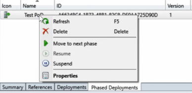
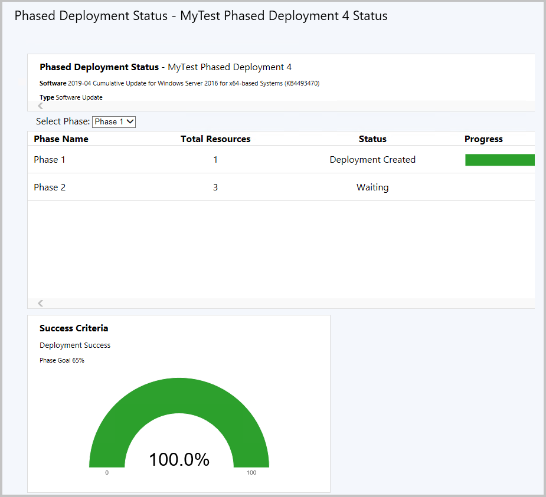
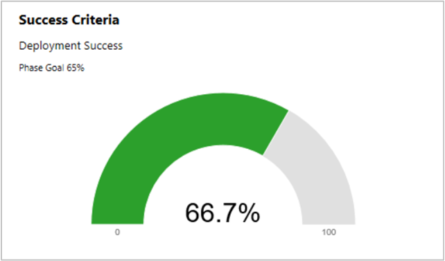
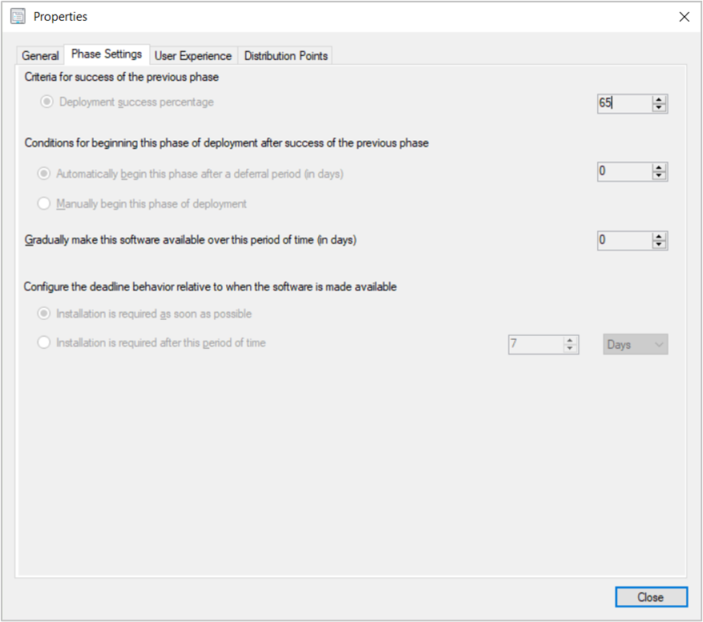

# Manage and monitor phased deployments

This article describes how to manage and monitor phased deployments. Management tasks include manually beginning the next phase, and suspend or resume a phase.

First, you need to create a phased deployment:

- [Application](create-phased-deployment-for-task-sequence.md?toc=/mem/configmgr/apps/toc.json&bc=/mem/configmgr/apps/breadcrumb/toc.json)  
- [Software update](create-phased-deployment-for-task-sequence.md?toc=/mem/configmgr/sum/toc.json&bc=/mem/configmgr/sum/breadcrumb/toc.json)  
- [Task sequence](create-phased-deployment-for-task-sequence.md)  

##  Move to the next phase

When you select the setting, **Manually begin the second phase of deployment**, the site doesn't automatically start the next phase based on success criteria. You need to move the phased deployment to the next phase.  

1. How to start this action varies based on the type of deployed software:  

    - **Application**: Go to the **Software Library** workspace, expand **Application Management**, and select **Applications**.

    - **Software update**: Go to the **Software Library** workspace, and then select one of the following nodes:
        - Software Updates  
            - **All Software Updates**  
            - **Software Update Groups**
        - Windows Servicing, **All Windows Updates**
        - Office 365 Client Management, **Office 365 Updates**  

    - **Task sequence**: Go to the **Software Library** workspace, expand **Operating Systems**, and select **Task Sequences**.

2. Select the software with the phased deployment.  

3. In the details pane, switch to the **Phased Deployments** tab.  

4. Select the phased deployment, and click **Move to next phase** in the ribbon.  

    

Optionally, use the following Windows PowerShell cmdlet for this task: [Move-CMPhasedDeploymentToNext](/powershell/module/configurationmanager/move-cmphaseddeploymenttonext).

##  Suspend and resume phases

You can manually suspend or resume a phased deployment. For example, you create a phased deployment for a task sequence. While monitoring the phase to your pilot group, you notice a large number of failures. You suspend the phased deployment to stop further devices from running the task sequence. After resolving the issue, you resume the phased deployment to continue the rollout.

1. How to start this action varies based on the type of deployed software:  

    - **Application**: Go to the **Software Library** workspace, expand **Application Management**, and select **Applications**.

    - **Software update**: Go to the **Software Library** workspace, and then select one of the following nodes:
        - Software Updates  
            - **All Software Updates**  
            - **Software Update Groups**
        - Windows Servicing, **All Windows Updates**
        - Office 365 Client Management, **Office 365 Updates**  

    - **Task sequence**: Go to the **Software Library** workspace, expand **Operating Systems**, and select **Task Sequences**. Select an existing task sequence, and then click **Create Phased Deployment** in the ribbon.  

2. Select the software with the phased deployment.  

3. In the details pane, switch to the **Phased Deployments** tab.  

4. Select the phased deployment, and click **Suspend** or **Resume** in the ribbon.

> [!NOTE]
> Starting on April 21, 2020, Office 365 ProPlus is being renamed to **Microsoft 365 Apps for enterprise**. For more information, see [Name change for Office 365 ProPlus](/deployoffice/name-change). You may still see the old name in the Configuration Manager product and documentation while the console is being updated.

Optionally, use the following Windows PowerShell cmdlets for this task:

- [Suspend-CMPhasedDeployment](/powershell/module/configurationmanager/suspend-cmphaseddeployment)
- [Resume-CMPhasedDeployment](/powershell/module/configurationmanager/resume-cmphaseddeployment)

##  Monitor
<!--1358577-->

Phased deployments have their own dedicated monitoring node, making it easier to identify phased deployments you have created and navigate to the phased deployment monitoring view. From the **Monitoring** workspace, select **Phased Deployments**, then double-click one of the phased deployments to see the status. <!--3555949-->

This dashboard shows the following information for each phase in the deployment:  

- **Total devices** or **Total resources**: How many devices are targeted by this phase.  

- **Status**: The current status of this phase. Each phase can be in one of the following states:  

  - **Deployment created**: The phased deployment created a deployment of the software to the collection for this phase. Clients are actively targeted with this software.  

  - **Waiting**: The previous phase hasn't yet reached the success criteria for the deployment to continue to this phase.  

  - **Suspended**: An administrator suspended the deployment.  

- **Progress**: The color-coded deployment states from clients. For example: Success, In Progress, Error, Requirements Not Met, and Unknown.

### Success criteria tile

Use the **Select Phase** drop-down list to change the display of the **Success Criteria** tile. This tile compares the **Phase Goal** against the current compliance of the deployment. With the default settings, the phase goal is 95%. This value means that the deployment needs a 95% compliance to move to the next phase.

In the example, the phase goal is 65%, and the current compliance is 66.7%. The phased deployment automatically moved to the second phase, because the first phase met the success criteria.  

   

The phase goal is the same as the **Deployment success percentage** on the Phase Settings for the *next* phase. For the phased deployment to start the next phase, that second phase defines the criteria for success of the first phase. To view this setting:

1. Go to the phased deployment object on the software, and open the Phased Deployment Properties.  

2. Switch to the **Phases** tab. Select **Phase 2** and click **View**.  

3. In the phase Properties window, switch to the **Phase Settings** tab.  

4. View the value for **Deployment success percentage** in the *Criteria for success of the previous phase* group.  

For example, the following properties are for the same phase as the success criteria tile shown above where the criteria is 65%:  

## PowerShell

Use the following Windows PowerShell cmdlets to manage phased deployments:

### Automatically create phased deployments

- [New-CMApplicationAutoPhasedDeployment](/powershell/module/configurationmanager/new-cmapplicationautophaseddeployment)
- [New-CMSoftwareUpdateAutoPhasedDeployment](/powershell/module/configurationmanager/new-cmsoftwareupdateautophaseddeployment)
- [New-CMTaskSequenceAutoPhasedDeployment](/powershell/module/configurationmanager/new-cmtasksequenceautophaseddeployment)

### Manually create phased deployments

- [New-CMSoftwareUpdatePhase](/powershell/module/configurationmanager/new-cmsoftwareupdatephase)
- [New-CMSoftwareUpdateManualPhasedDeployment](/powershell/module/configurationmanager/new-cmsoftwareupdatemanualphaseddeployment)
- [New-CMTaskSequencePhase](/powershell/module/configurationmanager/new-cmtasksequencephase)
- [New-CMTaskSequenceManualPhasedDeployment](/powershell/module/configurationmanager/new-cmtasksequencemanualphaseddeployment)

### Get existing phased deployment objects

- [Get-CMApplicationPhasedDeployment](/powershell/module/configurationmanager/get-cmapplicationphaseddeployment)
- [Get-CMSoftwareUpdatePhasedDeployment](/powershell/module/configurationmanager/get-cmsoftwareupdatephaseddeployment)
- [Get-CMTaskSequencePhasedDeployment](/powershell/module/configurationmanager/get-cmtasksequencephaseddeployment)
- [Get-CMPhase](/powershell/module/configurationmanager/get-cmphase)

### Monitor phased deployment status

- [Get-CMPhasedDeploymentStatus](/powershell/module/configurationmanager/get-cmphaseddeploymentstatus)

### Manage existing phased deployments

- [Move-CMPhasedDeploymentToNext](/powershell/module/configurationmanager/move-cmphaseddeploymenttonext)
- [Resume-CMPhasedDeployment](/powershell/module/configurationmanager/resume-cmphaseddeployment)
- [Suspend-CMPhasedDeployment](/powershell/module/configurationmanager/suspend-cmphaseddeployment)

### Modify existing phased deployments

- [Set-CMApplicationPhasedDeployment](/powershell/module/configurationmanager/set-cmapplicationphaseddeployment)
- [Set-CMSoftwareUpdatePhase](/powershell/module/configurationmanager/set-cmsoftwareupdatephase)
- [Set-CMSoftwareUpdatePhasedDeployment](/powershell/module/configurationmanager/set-cmsoftwareupdatephaseddeployment)
- [Set-CMTaskSequencePhase](/powershell/module/configurationmanager/set-cmtasksequencephase)
- [Set-CMTaskSequencePhasedDeployment](/powershell/module/configurationmanager/set-cmtasksequencephaseddeployment)
- [Remove-CMApplicationPhasedDeployment](/powershell/module/configurationmanager/remove-cmapplicationphaseddeployment)
- [Remove-CMSoftwareUpdatePhasedDeployment](/powershell/module/configurationmanager/remove-cmsoftwareupdatephaseddeployment)
- [Remove-CMTaskSequencePhasedDeployment](/powershell/module/configurationmanager/remove-cmtasksequencephaseddeployment)
