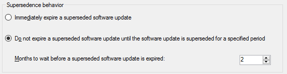
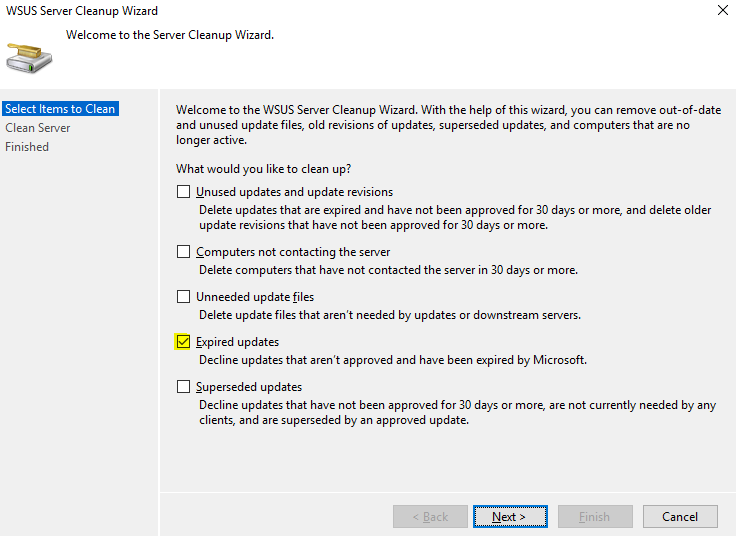

# Software updates maintenance

*Applies to: Configuration Manager (current branch)*

You can schedule and run WSUS cleanup tasks from the Configuration Manager console from the Software Update Point Component properties. When you first select to run the WSUS cleanup task, it will run after the next software updates synchronization.  

## To schedule and run the WSUS cleanup job

Schedule the WSUS cleanup job by running the following steps:

1. In the Configuration Manager console, navigate to **Administration** > **Overview** > **Site Configuration** > **Sites**.
2. Select the site at the top of your Configuration Manager hierarchy.

3. Click **Configure Site Components** in the **Settings** group, and then click **Software Update Point** to open Software Update Point Component Properties.  

4. Review the **Supersedence behavior**. Modify the behavior if needed.

   

5. Click the **Supersedence Rules** tab, select **Run WSUS cleanup wizard**. In version 1806, the option is renamed to **Run WSUS cleanup after synchronization**.

6. Click **OK** (Click **Close** if you're running version 1806).

## WSUS cleanup behavior in version 1802 and earlier

Before Configuration Manager version 1806, the WSUS cleanup option runs the following item:

- The **Expired updates** option from the WSUS cleanup wizard on the top-level site's WSUS server only.

  

- A cleanup for software update configuration items in the Configuration Manager database occurs every seven days and removes unneeded updates from the console.
  - This cleanup won't remove expired updates from the Configuration Manager console if they're currently deployed.

Additional maintenance is still needed on the top-level WSUS database and all other WSUS databases in the environment. For more information and instructions, see [The complete guide to Microsoft WSUS and Configuration Manager SUP maintenance](/troubleshoot/mem/configmgr/wsus-maintenance-guide) blog post.

## WSUS cleanup behavior starting in version 1806

Starting version 1806, the WSUS cleanup option occurs after every sync and does the following cleanup items:
<!--1357898 -->

- The **Expired updates** option for WSUS servers on CAS and primary sites.
  - WSUS servers for secondary sites don't run the WSUS cleanup for expired updates.
- Configuration Manager builds a list of superseded updates from its database. The list is based on the supersedence behavior in the Software Update Point component properties.
  - The update configuration items meeting the supersedence behavior criteria are expired in the Configuration Manager console.
  - The updates are declined in WSUS for CAS and primary sites but not for secondary sites.
- A cleanup for software update configuration items in the Configuration Manager database occurs every seven days and removes unneeded updates from the console.
  - This cleanup won't remove expired updates from the Configuration Manager console if they're currently deployed.

> [!NOTE]
> The "Months to wait before a superseded update is expired" is based on the creation date of the superseding update. For example, if you use 2 months for this setting, then updates that have been superseded will be declined in WSUS and expired in Configuration Manager when the superceding update is 2 months old.

All WSUS maintenance needs to be run manually on secondary site WSUS databases. The following **WSUS Server Cleanup Wizard** options aren't run on the CAS and primary sites:

- Unused updates and update revisions
- Computers not contacting the server
- Unneeded update files

  For more information and instructions, see [The complete guide to Microsoft WSUS and Configuration Manager SUP maintenance](/troubleshoot/mem/configmgr/wsus-maintenance-guide) blog post.

## WSUS cleanup behavior starting in version 1810

Starting version 1810, you can specify supersedence rules for feature updates separately from non-feature updates in the Software Update Point component properties. The WSUS cleanup option occurs after every sync and does the following cleanup items:
<!--2839349,3098809, 2977644-->

- The **Expired updates** option for WSUS servers on CAS, primary, and secondary sites.
- Configuration Manager builds a list of superseded updates from its database. The list is based on the supersedence behavior in the Software Update Point component properties.
  - The update configuration items meeting the supersedence behavior criteria are expired in the Configuration Manager console.
  - The updates are declined in WSUS for CAS, primary, and secondary sites.
- A cleanup for software update configuration items in the Configuration Manager database occurs every seven days and removes unneeded updates from the console.
  - This cleanup won't remove expired updates from the Configuration Manager console if they're currently deployed.

> [!NOTE]
> The "Months to wait before a superseded update is expired" is based on the creation date of the superseding update. For example, if you use 2 months for this setting, then updates that have been superseded will be declined in WSUS and expired in Configuration Manager when the superceding update is 2 months old.

The following **WSUS Server Cleanup Wizard** options aren't run on the CAS, primary, and secondary sites:

- Unused updates and update revisions
- Computers not contacting the server
- Unneeded update files

  For more information and instructions, see [The complete guide to Microsoft WSUS and Configuration Manager SUP maintenance](/troubleshoot/mem/configmgr/wsus-maintenance-guide) blog post.

## WSUS cleanup starting in version 1906
<!--41101009-->

 You have additional WSUS maintenance tasks that Configuration Manager can run to maintain healthy software update points. In addition to declining expired updates in WSUS, Configuration Manager can add non-clustered indexes to the WSUS databases and remove obsolete updates from the WSUS databases. The WSUS maintenance occurs after every synchronization.

### Decline expired updates in WSUS according to supersedence rules

Declining updates in WSUS improves performance by removing those updates from the catalogs sent to clients. Declining updates that Configuration Manager marks as superseded further minimizes the catalogs and improves performance.

1. In the Configuration Manager console, navigate to **Administration** > **Overview** > **Site Configuration** > **Sites**.
2. Select the site at the top of your Configuration Manager hierarchy.
3. Click **Configure Site Components** in the Settings group, and then click **Software Update Point** to open Software Update Point Component Properties.
4. In the **WSUS Maintenance** tab, select **Decline expired updates in WSUS according to supersedence rules**.

### Add non-clustered indexes to the WSUS database to improve WSUS cleanup performance

The addition of non-clustered indexes improves the WSUS cleanup performance that Configuration Manager does.

1. In the Configuration Manager console, navigate to **Administration** > **Overview** > **Site Configuration** > **Sites**.
2. Select the site at the top of your Configuration Manager hierarchy.
3. Click **Configure Site Components** in the Settings group, and then click **Software Update Point** to open Software Update Point Component Properties.
4. In the **WSUS Maintenance** tab, select **Add non-clustered indexes to the WSUS database**.
5. On each SUSDB used by Configuration Manager, indexes are added to the following tables:
   - tbLocalizedPropertyForRevision
   - tbRevisionSupersedesUpdate

#### SQL Server permissions for creating indexes

When the WSUS database is on a remote SQL Server, you might need to add permissions in SQL Server to create indexes. The account used to connect to the WSUS database and create the indexes can vary. If you specify a [WSUS Server Connection Account in the software update point properties](../get-started/install-a-software-update-point.md#wsus-server-connection-account), then ensure the connection account has the SQL Server permissions. If you don't specify a WSUS Server Connection Account, then the site server's computer account needs the SQL Server permissions.

- Creating an index requires `ALTER` permission on the table or view. The account must be a member of the `sysadmin` fixed server role or the `db_ddladmin` and `db_owner` fixed database roles. For more information about creating and index and permissions, see [CREATE INDEX (Transact-SQL)](/sql/t-sql/statements/create-index-transact-sql#permissions).
- The `CONNECT SQL` server permission must be granted to the account. For more information, see [GRANT Server Permissions (Transact-SQL)](/sql/t-sql/statements/grant-server-permissions-transact-sql).

> [!NOTE]  
> - If the WSUS database is on a remote SQL Server using a non-default port, then indexes might not be added. You can create a [server alias using SQL Server Configuration Manager](/sql/database-engine/configure-windows/create-or-delete-a-server-alias-for-use-by-a-client) for this scenario. Once the alias is added and Configuration Manager can make a connection to the WSUS database, indexes will be added.
> - If the Software Update Point is remote to the site server and is using a Windows Internal Database, then the indexes will not be added.

### Remove obsolete updates from the WSUS database

Obsolete updates are unused updates and update revisions in the WSUS database. Generally speaking, an update is considered obsolete once it's no longer in the [Microsoft Update Catalog](https://www.catalog.update.microsoft.com/) and it isn't needed by other updates as a prerequisite or dependency.

1. In the Configuration Manager console, navigate to **Administration** > **Overview** > **Site Configuration** > **Sites**.
2. Select the site at the top of your Configuration Manager hierarchy.
3. Click **Configure Site Components** in the Settings group, and then click **Software Update Point** to open Software Update Point Component Properties.
4. In the **WSUS Maintenance** tab, select **Remove obsolete updates from the WSUS database**.
   - The obsolete update removal will be allowed to run for a maximum of 30 minutes before being stopped. It will start up again after the next synchronization occurs.  

#### SQL Server permissions for removing obsolete updates

When the WSUS database is on a remote SQL Server, the site server's computer account needs the following SQL Server permissions:

- The `db_datareader` and `db_datawriter` fixed database roles. For more information, see [Database-Level Roles](/sql/relational-databases/security/authentication-access/database-level-roles#fixed-database-roles).
- The `CONNECT SQL` server permission must be granted to the site server's computer account. For more information, see [GRANT Server Permissions (Transact-SQL)](/sql/t-sql/statements/grant-server-permissions-transact-sql).

> [!NOTE]  
> If the Software Update Point is remote to the site server and is using a Windows Internal Database, then obsolete updates will not be removed.

#### WSUS cleanup wizard

Starting in version 1906, the following **WSUS Server Cleanup Wizard** options aren't run on the CAS, primary, and secondary sites:

- Computers not contacting the server
- Unneeded update files

  For more information and instructions, see [The complete guide to Microsoft WSUS and Configuration Manager SUP maintenance](/troubleshoot/mem/configmgr/wsus-maintenance-guide) blog post.


## Known issue

Consider the following scenario:
<!--5418148-->
- You are using Configuration Manager version 1906 or later
- You have remote software update points using a Windows Internal Database
- In the **Software Update Point Component Properties**, you have any of the following selected options under the **WSUS Maintenance** tab:
   - Add non-clustered indexes to the WSUS database
   - Remove obsolete updates from the WSUS database

In this scenario, Configuration Manager is unable to perform the above WSUS Maintenance tasks for the remote Software Updates Points using a Windows Internal Database. This issue occurs because Windows Internal Database doesn't allow remote connections. You'll see the following errors in the `WSyncMgr.log` on the site server:

```text
Indexing Failed. Could not connect to SUSDB.
SqlException thrown while connect to SUSDB in Server: <SUP.CONTOSO.COM>. Error Message: A network-related or instance-specific error occurred while establishing a connection to SQL Server. The server was not found or was not accessible. Verify that the instance name is correct and that SQL Server is configured to allow remote connections. (provider: Named Pipes Provider, error: 40 - Could not open a connection to SQL Server)
...
Could not Delete Obselete Updates because ConfigManager could not connect to SUSDB: A network-related or instance-specific error occurred while establishing a connection to SQL Server. The server was not found or was not accessible. Verify that the instance name is correct and that SQL Server is configured to allow remote connections. (provider: Named Pipes Provider, error: 40 - Could not open a connection to SQL Server) UpdateServer: <SUP.CONTOSO.COM>
```

To work around the issue, you can automate the WSUS maintenance for the remote software update points using a Windows Internal Database. For more information and detailed steps, see [The complete guide to Microsoft WSUS and Configuration Manager SUP maintenance](https://support.microsoft.com/help/4490644/complete-guide-to-microsoft-wsus-and-configuration-manager-sup-maint).

## Updates cleanup log entries

You can verify this cleanup by reviewing the wsyncmgr.log for the following entries:

- The decline of superseded updates in WSUS is complete when you see this log entry: `Cleanup processed <number> total updates and declined <number>`
- The WSUS cleanup is starting when you see this entry: `Calling WSUS Cleanup.`
- The WSUS cleanup for expired updates is complete when you see this entry: `Successfully completed WSUS Cleanup.`
- The Configuration Manager expired updates configuration items cleanup is starting when you see this entry: `Deleting old expired updates...`
- The Configuration Manager expired updates configuration items cleanup is complete when you see this entry: `Deleted <number> expired updates total`
