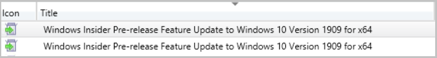

# Configure classifications and products to synchronize

*Applies to: Configuration Manager (current branch)*

Software updates metadata is retrieved during the synchronization process in Configuration Manager based on the settings that you specify in the Software Update Point component properties. After you synchronize software updates for the first time, or when new products and classifications are released, you must go to the properties to select the new items. Use the following procedure to configure classifications and products to synchronize.

> [!NOTE]
>
> Use the procedure from this section only on the top-level site.

## To configure classifications and products to synchronize

1. In the **Configuration Manager** console, navigate to **Administration** > **Site Configuration** > **Sites**.

2. Select the central administration site or the stand-alone primary site.

3. On the **Home** tab, in the **Settings** group, click **Configure Site Components**, and then click **Software Update Point**.

4. On the **Classifications** tab, specify the software update classifications for which you want to synchronize software updates.

    Every software update is defined with an update classification that helps to organize the different types of updates. During the synchronization process, the software updates metadata for the specified classifications are synchronized. Configuration Manager provides the ability to synchronize software updates with the following update classifications:

     - **Critical Updates**: Specifies a widely released fix for a specific problem that addresses a critical, non-security-related bug.
     - **Definition Updates**: Specifies a widely released and frequent software update that contains additions to a product's definition database.
     - **Feature Packs**: Specifies new product functionality that is first distributed outside of a product release and that's typically included in the next full product release.
     - **Security Updates**: Specifies a widely released fix for a product-specific, security-related vulnerability.
     - **Service Packs**: Specifies a tested, cumulative set of all hotfixes, security updates, critical updates, and updates that are applied to a product. Additionally, service packs may contain additional fixes for problems that are found internally since the release of the product.
     - **Tools**: Specifies a utility or feature that helps to complete one or more tasks.
     - **Update Rollups**: Specifies a tested, cumulative set of hotfixes, security updates, critical updates, and updates that are packaged together for easy deployment. An update rollup generally addresses a specific area, such as a security or product component.
     - **Updates**: Specifies a widely released fix for a specific problem. An update addresses a non-critical, non-security-related bug.
     - **Upgrade**: Specifies an  upgrade for Windows 10 or later features and functionality. These updates are also known as feature updates for Windows operating systems. All versions of WSUS running on [currently supported versions](/windows-server/get-started/windows-server-release-info) of Windows Server support the **Upgrade** classification.

    > [!NOTE]
    > You can select the **Include Microsoft Surface drivers and firmware updates** checkbox to synchronize Microsoft Surface drivers.<!--1098490--> All software update points must run Windows Server 2016 or later to successfully synchronize Surface drivers. If you enable a software update point on a computer running Windows Server 2012 after you enable Surface drivers, the scan results for the driver updates are not accurate. This results in incorrect compliance data displayed in the Configuration Manager console and in Configuration Manager reports. For more information, see [Manage Surface drivers with Configuration Manager](../deploy-use/surface-drivers.md).

5. On the **Products** tab, specify the products for which you want to synchronize software updates, and then click **Close**.

    - Configuration Manager stores a list of products and product families from which you can choose when you first install the software update point. Products and product families that are released after Configuration Manager is released might not be available to select until you complete software updates synchronization, which updates the list of available products and product families from which you can choose.

    - The metadata for each software update defines the products for which the update is applicable. A product is a specific edition of an operating system or application, such as Windows Server 2012. A product family is the base operating system or application from which the individual products are derived. An example of a product family is Windows, of which Windows Server 2012 is a member. You can specify a product family or individual products within a product family. The more products that you select, the longer it takes to synchronize software updates.

    - When software updates are applicable to multiple products, and at least one of the products was selected for synchronization, all of the products appear in the Configuration Manager console even if some products weren't selected. For example, if Windows Server 2012 is the only operating system that you selected, and if a software update applies to Windows 8 and Windows Server 2012, both products are displayed in the Configuration Manager console.

    > [!NOTE]
    >
    > **Windows 10, version 1903 and later** was added to Microsoft Update as its own product rather than being part of the **Windows 10** product like earlier versions. This change caused you to do a number of manual steps to ensure that your clients see these updates. We've helped reduce the number of manual steps you have to take for the new product in Configuration Manager version 1906. <!--4682946-->
    >
    > When you have the **Windows 10** product selected for synchronization, the following actions occur automatically:
    >
    > - The **Windows 10, version 1903 and later** product is added for synchronization.
    > - [Automatic Deployment Rules](../deploy-use/automatically-deploy-software-updates.md#bkmk_adr-process) containing the **Windows 10** product will be updated to include **Windows 10, version 1903 and later**.
    > - [Servicing plans](../../osd/deploy-use/manage-windows-as-a-service.md#servicing-plan-workflow) are updated to include the **Windows 10, version 1903 and later** product.

## Configuring products for versions of Windows 10

### Windows 10, version 1909

Windows 10, version 1909 shares a common core operating system with Windows 10, version 1903. Both of these versions are serviced with the same cumulative updates. For more information about Windows 10, version 1909, see the [Windows 10, version 1909 delivery options](https://aka.ms/1909mechanics) blog post.

To make sure both your Windows 10 version 1909 and Windows 10, version 1903 clients install updates from Configuration Manager:

- Approve updates for both the 1909 and 1903 versions of Windows 10.
  - The updates have different titles and applicability rules for each OS version.
  - Approving each update per version and  architecture of the OS maintains the normal approval process for admins.
- The cumulative update installation files are the same for both the 1909 and 1903 versions of Windows 10.
  - Configuration Manager will only download the update source files once.

#### Feature Updates for Windows 10, version 1909

When you approve feature updates for Windows 10, version 1909, there are a few different options you'll see:

- Windows 10, version 1903 clients are offered an [Enablement Package](https://support.microsoft.com/help/4517245/feature-update-via-windows-10-version-1909-enablement-package), released November 12, 2019.
  - The enablement package is a small, quick to install file that activates the Windows 10, version 1909 features and restarts the device.
  - Prerequisites for the enablement package include:
    - A minimum cumulative update of [KB4517389](https://www.catalog.update.microsoft.com/Search.aspx?q=KB4517389), released October 8, 2019.
    - A minimum servicing stack update of [KB4520390](https://www.catalog.update.microsoft.com/Search.aspx?q=KB4520390), released September 24, 2019.
  - This update, like any other Feature Update, isn't available for import from the [Microsoft Update Catalog](https://catalog.update.microsoft.com).
  - The update will automatically synchronize with WSUS if you have the **Windows 10, version 1903 and later** product and **Upgrades** classification selected for synchronization.
  - In the Configuration Manager console, go to the **Software Library** workspace, expand **Windows Servicing**, and select the **All Windows Feature Updates** node. Search for the terms "enablement" or "4517245".

    > [!TIP]
    >
    > Since these are feature updates, they aren't in the **All Software Updates** node.

- Windows 10, version 1809 and earlier clients are upgraded with a single direct feature update.
  - This is just like all other previous installations for Feature Updates that you've done for Windows 10.

> [!NOTE]
>
> Both the enablement package and the traditional feature update for Windows 10, version 1909 will show as "Installed" in reporting, regardless of which path was used to install it.

### Windows 10, version 1903 and later

**Windows 10, version 1903 and later** was added to Microsoft Update as its own product rather than being part of the **Windows 10**  product like earlier versions. This change caused you to do a number of manual steps to ensure that your clients see these updates. We've helped reduce the number of manual steps you have to take for the new product in Configuration Manager version 1906. <!--4682946-->

#### Windows 10, version 1903 and later with Configuration Manager version 1906

When you update to Configuration Manager version 1906 and have the **Windows 10** product selected for synchronization, the following actions occur automatically:

- The **Windows 10, version 1903 and later** product is added for synchronization.
- [Automatic Deployment Rules](../deploy-use/automatically-deploy-software-updates.md#bkmk_adr-process) containing the **Windows 10** product will be updated to include **Windows 10, version 1903 and later**.
- [Servicing plans](../../osd/deploy-use/manage-windows-as-a-service.md#servicing-plan-workflow) are updated to include the **Windows 10, version 1903 and later** product.

#### Windows 10, version 1903 and later with Configuration Manager version 1902

If you're using Configuration Manager 1902 with Windows 10, version 1903 clients, you'll need to:

- Select the **Windows 10, version 1903 and later** product for synchronization.
- Update any [Automatic Deployment Rules](../deploy-use/automatically-deploy-software-updates.md#bkmk_adr-process) for Windows 10, version 1903 clients.
- Update [Servicing plans](../../osd/deploy-use/manage-windows-as-a-service.md#servicing-plan-workflow) for Windows 10, version 1903 clients.

##  Windows Insider Program
<!--3556023-->
You can service and update devices running Windows Insider Preview builds with Configuration Manager. This change means you can manage these devices without changing your normal processes or enabling Windows Update client policies. You can download Feature Updates and Cumulative Updates for Windows Insider Preview builds into Configuration Manager just like any other Windows update or upgrade. For more information, see the [Publishing pre-release Windows Feature Updates to WSUS](https://techcommunity.microsoft.com/t5/Windows-IT-Pro-Blog/Publishing-pre-release-Windows-10-feature-updates-to-WSUS/ba-p/845054) blog post.

For more information about support for Windows Insider in Configuration Manager, see [Support for Windows 11](../../core/plan-design/configs/support-for-windows-11.md#support-for-windows-insider).

### Prerequisites

- Configuration Manager environment that's configured for [software update management](../plan-design/plan-for-software-updates.md).
- Windows devices running [Windows Insider Preview build](/windows-insider/business/).
- A collection containing the Windows Insider devices.

### Enable Windows Insider upgrades and updates

You need to enable the products and classifications for Windows Insider upgrades and updates. Feature Updates, Cumulative updates, and other updates for Windows Insider are under the **Windows Insider Pre-Release** product category.

1. In the **Configuration Manager** console, navigate to **Administration** > **Site Configuration** > **Sites**.
2. Select the central administration site or the stand-alone primary site.
3. On the **Home** tab, in the **Settings** group, click **Configure Site Components**, and then click **Software Update Point**.
4. On the **Products** tab, make sure the following products are selected for synchronization:
    - Windows Insider Pre-Release
    - Windows 10, version 1903 and later
5. On the **Classifications** tab, make sure the following classifications are selected for synchronization:
    - Upgrades
    - Security Updates
    - Updates (optional)
6. Click **OK** to close the  **Software Update Point Component Properties**.

### Upgrading Windows Insider devices

Once the upgrades for Windows Insiders are synchronized, you can see them from **Software Library** > **Windows Servicing** > **All Windows Feature Updates**.

Deploy Feature Updates for Windows Insider to your target collection just like any other upgrade. However, you'll want to keep the following items in mind when you're deploying these Feature Updates:

- These upgrades will be applicable to all Windows 10 clients 1903 or earlier, with matching architecture, edition, and language.
- There are license terms, your deployment must accept the terms in order to install.
- Consider using the [thread priority in client settings](../../core/clients/deploy/about-client-settings.md#bkmk_thread-priority).
- Dynamic Update automatically installs critical updates, including the latest Cumulative Update, directly from Microsoft Update. This behavior started with Feature Updates for Windows 10 version 1903.
  - You can explicitly [disable Dynamic Update in client settings](../../core/clients/deploy/about-client-settings.md#bkmk_du) or with a [setupconfig.ini file](/windows-hardware/manufacture/desktop/windows-setup-command-line-options).
  - For more information, see the [Windows 10 Dynamic Update](https://techcommunity.microsoft.com/t5/Windows-IT-Pro-Blog/The-benefits-of-Windows-10-Dynamic-Update/ba-p/467847) blog post.

For more information on how to deploy upgrades, see [Manage Windows as a service](../../osd/deploy-use/manage-windows-as-a-service.md).

### Keeping Insider devices up-to-date

Cumulative Updates for Windows Insider will be available for WSUS and by extension for Configuration Manager. These Cumulative Updates will be released at a frequency similar to Windows Cumulative Updates. The Windows Insider Cumulative updates are in the **Windows Insider Pre-Release** product category and classified as either **Security Updates** or **Updates**. You can deploy the Cumulative Updates for Windows Insider using your regular software update process like using [automatic deployment rules](../deploy-use/automatically-deploy-software-updates.md) or [phased deployments](../../osd/deploy-use/create-phased-deployment-for-task-sequence.md?toc=/mem/configmgr/sum/toc.json&bc=/mem/configmgr/sum/breadcrumb/toc.json).

##  Extended Security Updates and Configuration Manager

The [Extended Security Updates (ESU)](https://support.microsoft.com/help/4497181/lifecycle-faq-extended-security-updates) program is a last resort option for customers who need to run certain legacy Microsoft products past the end of support. It includes Critical and/or Important security updates (as defined by the [Microsoft Security Response Center (MSRC)](https://www.microsoft.com/msrc)) for a maximum of three years after the product's End of Extended Support date.

Products that are beyond their support lifecycle aren't supported for use with Configuration Manager. This includes any products that are covered under the ESU program. For example, Windows 7. Security updates released under the ESU program will be published to Windows Server Update Services (WSUS). These updates will appear in the Configuration Manager console. While products that are covered under the ESU program are no longer supported for use with Configuration Manager, the [latest released version of Configuration Manager current branch](../../core/servers/manage/updates.md#version-details) can be used to deploy and install Windows security updates released under the program.

Client management features not related to Windows software update management or OS deployment will no longer be tested on the operating systems covered under the ESU program and we don't guarantee that they'll continue to function. It's highly recommended to upgrade or migrate to a current version of the operating systems as soon as possible to receive client management support.

> [!TIP]
>
> Starting in Configuration Manager 2010, you'll be notified in-console about devices with operating systems that are past the end of support date and that are no longer eligible to receive security updates. For more information, see [Console notifications](../../core/servers/manage/admin-console-notifications.md#bkmk_2010). This information is provided for your convenience and only for use internally within your company. You should not solely rely on this information to confirm update or license compliance. Be sure to verify the accuracy of the information provided to you.

## Next steps

Start software updates synchronization to retrieve software updates based on the new criteria. For more information, see [Synchronize software updates](synchronize-software-updates.md).
