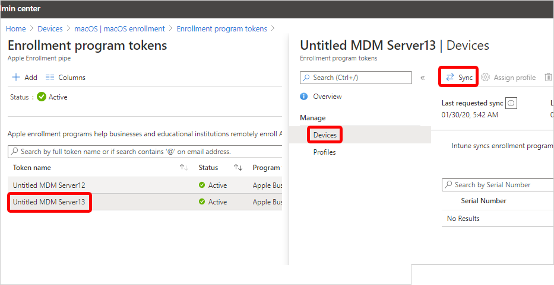

# Manage macOS ADE devices and tokens

*Applies to macOS*

Use this article to sync macOS devices with Apple Business, manage your enrollment tokens, and distribute devices to users.

> [!NOTE]
> The steps in this article are the same whether you're using Apple Business or Apple School Manager. For brevity, this article refers to *Apple Business* only, except where clarification is necessary.

## Prerequisites

Before completing the tasks in this article:

- [Set up a macOS ADE token](setup-macos-token.md)
- [Create an enrollment policy for macOS and assign it to devices](setup-automated-macos.md)

## Sync managed devices

Syncing refreshes existing device status and imports new devices assigned to the Apple MDM server. After creating a token, sync Intune with Apple to see your managed devices in the admin center.

1. In the [Microsoft Intune admin center](https://go.microsoft.com/fwlink/?linkid=2109431), go to **Devices** > **Enrollment**.
1. Select the **Apple** tab.
1. Under **Bulk Enrollment Methods**, select **Enrollment program tokens**.
1. Select a token from the list.
1. Select **Devices** > **Sync**.

   

## Sync restrictions

To comply with Apple's terms for acceptable enrollment program traffic, Microsoft Intune imposes the following restrictions:

- A *full sync* can run no more than once every seven days. During a full sync, Intune fetches the most recent, updated list of serial numbers assigned to the connected Apple MDM server. If you delete a device from Intune without unassigning it from the MDM server in Apple Business or Apple School Manager, it won't be reimported to Intune until the full sync runs.

  > [!IMPORTANT]
  > If you delete a device from Intune but it remains assigned to the ADE token in Apple Business, the device reappears in Intune on the next full sync. If you don't want the device to reappear, unassign it from the Apple MDM server in Apple Business first.

- If a device is released from Apple Business, it can take up to 45 days for it to be automatically deleted from the **Devices** page in Intune. You can manually delete released devices one by one if needed. Released devices are reported as *removed* from Apple Business in Intune until they're automatically deleted within 30–45 days.

- A sync runs automatically every 24 hours. You can also trigger a sync manually by selecting **Sync**, no more than once every 15 minutes. All sync requests have 15 minutes to finish. The **Sync** button becomes inactive until the sync completes.

## Distribute devices

> [!IMPORTANT]
> Users associated with devices that have user affinity must be assigned an Intune license. Devices without user affinity require a device license.

Distribute prepared Mac devices throughout your organization.

- **New or wiped Macs**: New or wiped Macs configured in Apple Business or Apple School Manager automatically enroll in Microsoft Intune during Setup Assistant when someone turns on the device. If you assigned the device to a macOS enrollment policy with user affinity, the device user must sign in to the Company Portal after Setup Assistant is done to finish Microsoft Entra registration and Conditional Access requirements.

- **Existing Macs**: You can enroll devices that already went through Setup Assistant. Complete these steps to enroll corporate-owned Macs running macOS 10.13 and later.

  1. Ensure that:
     - The device is imported to Apple Business or Apple School Manager.
     - The device is assigned a macOS enrollment policy in the admin center.
  1. Sign in to the device with a local administrator account.
  1. To trigger enrollment, from the **Home** page open **Terminal**, and run the following command:

     `sudo profiles renew -type enrollment`
  1. Enter the device password for the local administrator account.
  1. On **Device enrollment**, select **Details**.
  1. On **System preferences**, select **Profiles**.
  1. Follow the onscreen prompts to download the Microsoft Intune management profile, certificates, and policies.
     > [!TIP]
     > You can confirm which profiles are on the device anytime by returning to **System Preferences** > **Profiles**.
  1. If you assigned the device to a macOS enrollment policy with user affinity, sign in to the Company Portal app to complete Microsoft Entra registration and Conditional Access requirements, and finish enrollment.

## Next steps

- To renew or delete your enrollment program token, see [Set up a macOS ADE token](setup-macos-token.md).
- Use [Remote Device Actions in Microsoft Intune](../../device-management/actions/index.md) to remotely manage enrolled Macs.
