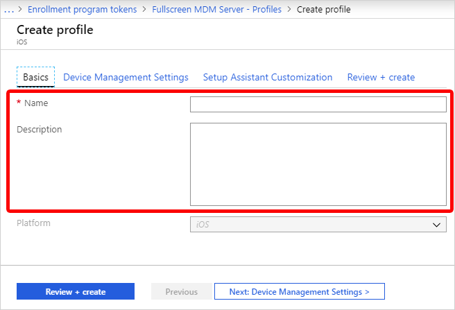

# Create an Apple enrollment policy for school devices
After you get your Apple token, you can create an enrollment policy for school devices. An essential part of setup is creating enrollment policies. The policies contain the settings that apply to devices during device enrollment.

## Create a policy

1. In the [Microsoft Intune admin center](https://go.microsoft.com/fwlink/?linkid=2109431), go to **Devices**.
1. Expand **Device onboarding**, and then select **Enrollment**.
1. Select the **Apple mobile** tab.
1. Under **Bulk Enrollment Methods**, choose **Enrollment program tokens**.
1. Choose a token, and then select **Enrollment policies**.
1. Select **Create policy** and choose the platform you're configuring: 
    - iOS/iPadOS
    - tvOS
    - visionOS  

1. For **Basics**, give the policy a **Name** and **Description** for administrative purposes. Users don't see these details.

   

   You can use the name you enter here to create a dynamic group in Microsoft Entra ID. To assign devices with this enrollment policy to a group, for example, enter the name in the *enrollmentPolicyName* parameter in your dynamic group rules. For more information, see [Microsoft Entra dynamic groups](/azure/active-directory/active-directory-groups-dynamic-membership-azure-portal#rules-for-devices).

1. For **User Affinity**, decide if devices with this policy must enroll with an assigned user or without an assigned user. User affinity isn't supported on tvOS and visionOS devices.  
    - **Enroll with User Affinity** - Choose this option for devices that belong to users and that want to use the company portal for services like installing apps. This option also lets users authenticate their devices by using the company portal. If using Active Directory Federation Services (AD FS), user affinity requires [WS-Trust 1.3 Username/Mixed endpoint](/previous-versions/windows/it-pro/windows-server-2008-R2-and-2008/ff608241(v=ws.10)). [Learn more](/powershell/module/adfs/get-adfsendpoint).   Apple School Manager's Shared iPad mode requires user enroll without user affinity.

    - **Enroll without User Affinity** - Choose this option for devices unaffiliated with a single user, such as a shared device. Use this option for devices that perform tasks without accessing local user data. Apps like the Company Portal app don't work.

1. If you chose **Enroll with User Affinity**, select how users must authenticate: Company Portal, Setup Assistant (legacy), or Setup Assistant with modern authentication. For more information about authentication methods, see [Authentication methods for automated device enrollment in Intune](ref-automated-authentication-methods.md).

    > [!NOTE]
    > If you want any of the following features, set **Authenticate with Company Portal instead of Apple Setup Assistant** to **Yes**.
    >    - use multifactor authentication
    >    - prompt users who need to change their password when they first sign in
    >    - prompt users to reset their expired passwords during enrollment
    >
    > These features aren't supported when authenticating with Apple Setup Assistant.

1. Choose **Device Management Settings**. Choose if you want locked enrollment for devices using this policy. **Locked enrollment** disables Apple settings that allow the management profile to be removed from the **Settings** menu. After device enrollment, you can't change this setting without wiping the device. 

1. You can let multiple users sign on to enrolled iPads by using a managed Apple ID. To do so, choose **Yes** under **Shared iPad** (this option requires **Enroll without User Affinity** set to **Yes**.) Managed Apple IDs are created in the Apple School Manager portal. Learn more about [shared iPad](../../solutions/education/ref-classroom-settings-ios-shared.md) and [shared iPad requirements for Apple](https://help.apple.com/classroom/ipad/2.0/#/cad7e2e0cf56).

1. Choose if you want the devices using this policy to be able to **Sync with computers**. **Deny All** means that devices using this policy can't sync with any data on any computer.

1. If you chose **Allow Apple Configurator by certificate** in the previous step, choose an Apple Configurator Certificate to import.

1. You can specify a naming format for devices that is automatically applied when they enroll. To do so, select **Yes** under **Apply device name template**. Then, in the **Device Name Template** box, enter the template to use for the names using this policy. You can specify a template format that includes the device type and serial number.

1. Select **OK**.

1. Select **Setup Assistant Settings** to configure the following policy settings:

    |Setting |Description  |
    |------------------------------------------|---------------------------------------------------------------------------------------------------------------------------------------------------------------------------------------------------------|
    |**Department Name**    |  Appears when users tap <strong>About Configuration</strong> during activation. |
    | **Department Phone**  | Appears when the user selects the <strong>Need Help</strong> button during activation.                                                          |
    |**Setup Assistant Options** | The following optional settings can be set up later in the iOS/iPadOS <strong>Settings</strong> menu. |
    |**Passcode** | Prompt for passcode during activation. Always require a passcode for unsecured devices unless access is controlled in some other manner (like kiosk mode that restricts the device to one app). |
    |**Location Services**   | If enabled, Setup Assistant prompts for the service during activation. |
    |**Restore** |If enabled, Setup Assistant prompts for iCloud backup during activation.                                                                 |
    | **iCloud and Apple ID**  | If enabled, Setup Assistant prompts the user to sign in with an Apple ID, and the Apps & Data screen allows the device to be restored from iCloud backup.                         |
    | **Terms and Conditions**|If enabled, Setup Assistant prompts users to accept Apple's terms and conditions during activation.|
    |**Touch ID**|If enabled, Setup Assistant prompts for this service during activation. |
    |**Apple Pay** | If enabled, Setup Assistant prompts for this service during activation.                                                                 |
    | **Zoom**  |If enabled, Setup Assistant prompts for this service during activation. |
    | **Siri**|If enabled, Setup Assistant prompts for this service during activation.  |
    | **Diagnostic Data** |If enabled, Setup Assistant prompts for this service during activation. |

1. Choose **OK**.

1. To save the policy, choose **Create**.

## Next steps
This series of articles describes how to set up Microsoft Intune for devices purchased through Apple School Manager.

1. [Prerequisites](school-manager.md)
1. [Get an Apple token for school devices](school-manager-step-1.md).
1. 🡺 Create an Apple enrollment policy (*You are here*).
1. [Sync and distribute devices](school-manager-step-3.md).

