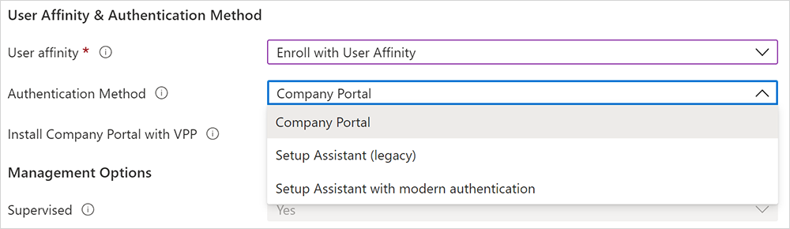

# Set up automated device enrollment for iOS/iPadOS   

*Applies to iOS/iPadOS*

This article describes how to create an enrollment policy for iOS/iPadOS automated device enrollment (ADE) in Microsoft Intune. For an overview of ADE and prerequisite setup, see [Overview of Apple Automated Device Enrollment](overview-automated-enrollment-apple.md).  

## Prerequisites
Before you create the enrollment profile, you must have:

* Access to [Apple Business portal](https://business.apple.com/) or [Apple School Manager portal](https://school.apple.com/).
* An active Apple token (.p7m file). For steps, see [Set up an ADE token](setup-apple-token.md).  
* An [Apple MDM push certificate in Intune](create-mdm-push-certificate.md).
* New or wiped devices purchased from Apple Business or Apple School Manager.
     > [!Tip]
     > Automated device enrollment applies device configurations that a device user may not be able to remove. Wipe all devices prior to enrollment to return them to an out-of-box state.  

## Deploy the Company Portal app

When using automated device enrollment (ADE), deploy the Intune Company Portal app through Intune — not through the App Store. Deploying through Intune is the only way to:

- Ensure all ADE devices, including already-enrolled ones, receive the app.
- Enable automatic app updates for the Company Portal on ADE devices.

> [!IMPORTANT]
> Don't use the App Store version of the Company Portal app. It isn't compatible with automated device enrollment and doesn't provide the automatic updates and availability that deployment does.

### Deploy Company Portal as a VPP app

Deploy the app as a required VPP app [with device licensing](../../intune-service/apps/vpp-apps-ios.md#how-are-purchased-apps-licensed). For information about how to sync, assign, and manage a VPP app, see [Assign a volume-purchased app](../../intune-service/apps/vpp-apps-ios.md#assign-a-volume-purchased-app).

To enable automatic app updates for Company Portal, go to your app token settings in the admin center and change **Automatic app updates** to **Yes**. See [Upload an Apple VPP or Apple Business location token](../../intune-service/apps/vpp-apps-ios.md#upload-an-apple-vpp-or-apple-business-manager-location-token) for the steps to access your token settings. If you don't enable automatic updates, the device user must manually check for them.

### Stage a device (transition from userless to user affinity)

*Device staging* is used to transition a device without user affinity to a device with user affinity. To stage a device, set up VPP deployment as described earlier. Then configure and deploy an [app configuration policy](../../intune-service/apps/app-configuration-policies-use-ios.md#configure-the-company-portal-app-to-support-ios-and-ipados-devices-enrolled-with-automated-device-enrollment). Make sure the policy only targets those ADE devices without user affinity.

> [!IMPORTANT]
> During initial enrollment, Intune automatically pushes app configuration policy settings for devices enrolled with Setup Assistant with modern authentication. This happens when the enrollment profile setting **Install Company Portal** is set to **Yes**. Don't deploy this configuration manually to users — it causes a conflict with the configuration sent during initial enrollment. If both are deployed, Intune incorrectly prompts device users to sign in to the Company Portal and download a management profile they've already installed.

## Create an Apple enrollment profile

Create an enrollment profile for automated device enrollment. A device enrollment profile defines the settings applied to a group of devices during enrollment. There's a limit of 1,000 enrollment profiles per enrollment token.  

> [!NOTE]
> Devices will be blocked from enrolling if there aren't enough Company Portal licenses for a VPP token or if the token expires. Intune alerts you when a token is about to expire or licenses are running low.

1. In [Microsoft Intune admin center](https://go.microsoft.com/fwlink/?linkid=2109431), go to   **Devices**.
1. Expand **Device onboarding**, and then select **Enrollment**.
1. Select the **Apple** tab.
1. Choose **Enrollment program tokens**.
1. Choose a token, and then select **Profiles**.
1. Select **Create profile** > **iOS/iPadOS**.
1. For **Basics**, give the profile a **Name** and **Description** for administrative purposes. Users don't see these details.
1. Select **Next**.

   > [!IMPORTANT]
   > You must assign an enrollment policy to your devices before the devices become active. We recommend that you set a default enrollment policy as soon as possible so that as devices sync from Apple Business or Apple School Manager, and then turn on, they can enroll correctly through automated device enrollment. If a device you synced from Apple isn't assigned an enrollment policy and someone turns it on to set it up, enrollment fails.

    > [!IMPORTANT]
    > If you make changes to an existing enrollment profile, the new settings won't take effect on assigned devices until devices are reset back to factory settings and reactivated. The device name template setting is the only setting you can change that doesn't require a factory reset to take effect. Changes to the naming template take effect at the next check-in.

1. In the **User Affinity** list, select an option that determines whether devices with this profile must enroll with or without an assigned user.

    - **Enroll with User Affinity**: Select this option for devices that belong to users who want to use the Company Portal for services like installing apps. Enrolling with user affinity is also referred to as enrolling with a *user*.
    - **Enroll without User Affinity**: Select this option for devices that aren't affiliated with a single user. Use this option for devices that don't access local user data. This option is typically used for kiosk, point of sale (POS), or shared-utility devices. Enrolling without user affinity is also referred to as enrolling *userless*.

      In some situations, you might want to associate a primary user with devices enrolled without user affinity. To do this task, you can send the `IntuneUDAUserlessDevice` key to the Company Portal app in an app configuration policy for managed devices. The first user that signs in to the Company Portal app is established as the primary user. If the first user signs out and a second user signs in, the first user remains the primary user of the device. For more information, see [Configure the Company Portal app to support iOS and iPadOS ADE devices](../../app-management/configuration/configure-managed-ios.md#configure-the-company-portal-app-to-support-ios-and-ipados-devices-enrolled-with-automated-device-enrollment).
    - **Enroll with Microsoft Entra ID shared mode**: Select this option to enroll devices that will be in shared mode.

1. If you selected **Enroll with User Affinity** for the **User Affinity** field, you have the option to choose the authentication method employees must use. For more information about each authentication method, see [Authentication methods for automated device enrollment](ref-automated-authentication-methods.md).

   

    Your options:

   - **Company Portal**  
   - **Setup Assistant with modern authentication**

   > [!IMPORTANT]
   > We recommend using **Setup Assistant with modern authentication** for your Apple devices for ADE (automated device enrollment) scenarios with user device affinity. While use of the legacy authentication remains available, we don't recommend its use.

1. If you selected **Setup Assistant (legacy)** for the authentication method but you also want to use Conditional Access or deploy company apps on the devices, you need to install Company Portal on the devices and sign in to complete the Microsoft Entra registration. To do so, select **Yes** for **Install Company Portal**. If you want users to receive Company Portal without having to authenticate into the App Store, in **Install Company Portal with VPP**, select a VPP token. Make sure the token doesn't expire and that you have enough device licenses for the Company Portal app to deploy correctly.

1. If you select a token for **Install Company Portal with VPP**, you can lock the device in Single App Mode (specifically, the Company Portal app) right after the Setup Assistant completes. Select **Yes** for **Run Company Portal in Single App Mode until authentication** to set this option. To use the device, the user must first authenticate by signing in to the Company Portal.

    > [!NOTE]
    > Multifactor authentication isn't supported on a single device locked in Single App Mode. This limitation exists because the device can't switch to a different app to complete the second factor of authentication. If you want multifactor authentication on a Single App Mode device, the second factor must be on a different device.

    This feature is supported only for iOS/iPadOS 11.3.1 and later.

   :::image type="content" source="./media/setup-automated-ios/single-app-mode.png" alt-text="Screenshot that shows the Run Company Portal in Single App Mode option.":::

1. If you want devices using this profile to be supervised, select **Yes** in the **Supervised** list.

    :::image type="content" source="./media/setup-automated-ios/supervisedmode.png" alt-text="Screenshot that shows the Supervised option.":::

    Supervised devices give you more management options and disabled Activation Lock by default. We recommend that you use ADE as the mechanism for enabling supervised mode, especially if you're deploying large numbers of iOS/iPadOS devices. Apple Shared iPad for Business devices must be supervised.  

    Users are notified that their devices are supervised in the **Settings** app. In the app at the top of their screen, a static message tells them **This iPhone is supervised and managed by *`<your organization>`***.

     > [!NOTE]
     > If a device is enrolled without supervision, you need to use Apple Configurator if you want to set it to supervised. To reset the device in this way, you need to connect it to a Mac with a USB cable. For more information, see [Apple Configurator Help](https://support.apple.com/guide/apple-configurator-mac).

1. In the **Locked enrollment** list, select **Yes** or **No**. Locked enrollment disables iOS/iPadOS settings that allow the management profile to be removed. If you enable locked enrollment, the button in the Settings app that lets users remove a management profile will be hidden and users won't be able to unenroll their device. If you're setting up devices in Microsoft Entra ID shared mode, select **Yes**.

    Locked enrollment works a little differently, at first, on devices not originally purchased through Apple Business but later added to be a part of automated device enrollment: users on these devices can see the remove management button in the Settings app for the first 30 days after activating their device. After that provisional period, this option is hidden. For more information, see [Prepare devices manually](https://help.apple.com/configurator/mac/2.8/#/cad99bc2a859) (opens Apple Configurator Help docs).

    > [!IMPORTANT]
    > This setting is different from the remove and reset options in the Company Portal app. Regardless of how you configure locked enrollment, the **Remove Device** or **Factory Reset** options in the Company Portal app remain unavailable on devices enrolled through automated device enrollment. Users won't be able to remove the device on the Company Portal website either. For more information about the self-service actions available on enrolled devices, see [Self-service actions](../../app-management/configuration/configure-company-portal.md#self-service-actions).

1. If you selected **Enroll without User Affinity** and **Supervised** in the previous steps, you need to decide whether to configure the devices to be [Apple Shared iPad for Business devices](https://support.apple.com/guide/deployment/shared-ipad-overview-dep9a34c2ba2/web). Select **Yes** for **Shared iPad** to enable multiple users to sign in to a single device. Users authenticate by using their Managed Apple IDs and federated authentication accounts or by using a temporary session (like the Guest account). This option requires iOS/iPadOS 13.4 or later. With Shared iPad, all Setup Assistant panes after activation are automatically skipped.

    > [!NOTE]
    >
    >- A device wipe will be required if an iOS/iPadOS enrollment profile with Shared iPad enabled is sent to an unsupported device. Unsupported devices include any iPhone models, and iPads running iPadOS/iOS 13.3 and earlier. Supported devices include iPads running iPadOS 13.3 and later.
    >- To set up Apple Shared iPad for Business, configure these settings:
    >   - In the **User Affinity** list, select **Enroll without User Affinity**.
    >   - In the **Supervised** list, select **Yes**.
    >   - In the **Shared iPad** list, select **Yes**.

    If you're setting up Apple Shared iPad for Business devices, also configure:

    * **Maximum cached users**: Enter the number of users that you expect to use the shared iPad. You can cache up to 24 users on a 32-GB or 64-GB device. If you choose a low number, it might take a while for your users' data to appear on their devices after they sign in. If you choose a high number, your users could run out of disk space.

    * **Maximum seconds after screen lock before password is required**: Enter the amount of time in seconds. Accepted values include: 0, 60, 300, 900, 3600, and 14400. If the screen lock exceeds this amount of time, a device password will be required to unlock the device. Available for devices in Shared iPad mode running iPadOS 13.0 and later.

    * **Maximum seconds of inactivity until user session logs out**: The minimum allowed value for this setting is 30. If there isn't any activity after the defined period, the user session ends and signs the user out. If you leave the entry blank or set it to zero (0), the session will never end due to inactivity. Available for devices in Shared iPad mode running iPadOS 14.5 and later.

    * **Require Shared iPad temporary session only**: Configures the device so that users only see the guest version of the sign-in experience and must sign in as guests. They can't sign in with a Managed Apple ID. Available for devices in Shared iPad mode running iPadOS 14.5 and later.

        When set to **Yes**, this setting cancels out the following shared iPad settings, because they aren't applicable in temporary sessions:

        - Maximum cached users
        - Maximum seconds after screen lock before password is required
        - Maximum seconds of inactivity until user session logs out

    * **Maximum seconds of inactivity until temporary session logs out**: The minimum allowed value for this setting is 30. If there isn't any activity after the defined period, the temporary session ends and signs the user out. If you leave the entry blank or set it to zero (0), the session will never end due to inactivity. Available for devices in Shared iPad mode running iPadOS 14.5 and later.

        This setting is available when **Require Shared iPad temporary session only** is set to **Yes**.

    > [!NOTE]
    >
    >- If temporary sessions are enabled, all of the user's data is deleted when they sign out of the session. This means that all targeted policies and apps will come down to the user when they sign-in, and they'll be erased when the user sign outs.
    >-  To alter a Shared iPads configuration to not have temporary sessions, the device will need to be fully reset and a new enrollment profile with the updated configurations will need to be sent down to the iPad.

1. In the **Sync with computers** list, select an option for the devices that use this profile. If you select **Allow Apple Configurator by certificate**, you need to choose a certificate (.cer extension) under **Apple Configurator Certificates**.

    > [!NOTE]
    > If you set **Sync with computers** to **Deny all**, the port will be limited on iOS and iPadOS devices. The port will be limited to only charging. It will be blocked from using iTunes or Apple Configurator 2.
    >
    >If you set **Sync with computers** to **Allow Apple Configurator by certificate**, make sure you have a local copy of the certificate that you can use later. You won't be able to make changes to the uploaded copy, and it's important to retain a copy of this certificate. If you want to connect to the iOS/iPadOS device from a Mac device, the same certificate must be installed on the device making the connection to the iOS/iPadOS device.

1. If you selected **Allow Apple Configurator by certificate** in the previous step, choose an Apple Configurator certificate (.cer extension) to import. The limit is 10 certificates.
1. For **Await final configuration**, your options are:
      * **Yes**: Enable a locked experience at the end of Setup Assistant to ensure your most critical device configuration policies are installed on the device. Just before the home screen loads, Setup Assistant pauses and lets Intune check in with the device. The end-user experience locks while users await final configurations.

         The amount of time that users are held on the Awaiting final configuration screen varies, and depends on the total number of policies and apps you apply to the device. The more policies and apps assigned to the device, the longer the waiting time. Setup Assistant and Microsoft Intune don't enforce a minimum or maximum time limit during this portion of setup. During product validation, most devices we tested were released and able to access the home screen within 15 minutes. If you enable this feature and are using someone outside of Microsoft to help you provision devices, tell them about the potential for increased provisioning time.

           >[!NOTE]
           > Only device configuration policies start installing during the awaiting final  configuration screen, and applications aren't included in this.

         The locked experience works on devices targeted with new and existing enrollment profiles. Supported devices include:
         * iOS/iPadOS 13 and later devices enrolling with Setup Assistant with modern authentication
         * iOS/iPadOS 13 and later devices enrolling without user affinity
         * iOS/iPadOS 13 and later devices enrolling with Microsoft Entra ID shared mode

         This setting is applied once during the out-of-box automated device enrollment experience in Setup Assistant. The device user doesn't experience it again unless they re-enroll their device. **Yes** is the default setting for new enrollment profiles.

      * **No**: The device is released to the home screen when Setup Assistant ends, regardless of policy installation status. Device users might be able to access the home screen or change device settings before all policies are installed. **No** is the default setting for existing enrollment profiles.

      The await configuration setting is unavailable in profiles with this combination of configurations:
      * User affinity: **Enroll without user affinity** (Step 6 in this section)
      * Shared iPad: **Yes**  (Step 12 in this section)

1. Optionally, create a device name template to quickly identify devices assigned this profile in the admin center. Intune uses your template to create and format device names. The names are given to devices when they enroll and upon each successive check-in. To create a template:
 1. Under **Apply device name template**, select **Yes** .
 2. In the **Device Name Template** box, enter the template you want to use to construct device names. The template can include the device type and serial number. It can't contain more than 63 characters, including the variables. Example: `{{DEVICETYPE}}-{{SERIAL}}`

1. You can activate a cellular data plan. This setting applies to devices running iOS/iPadOS 13.0 and later. Configuring this option sends a command to activate cellular data plans for your eSim-enabled cellular devices. Your carrier must provision activations for your devices before you can activate data plans using this command. To activate cellular data plan, select **Yes**, and then enter your carrier's activation server URL.

1. Select **Next**.

1. On the **Setup Assistant** tab, configure the following profile settings:

    | Department setting | Description |
    |---|---|
    | **Department** | Appears when users tap **About Configuration** during activation. |
    |    **Department Phone**     | Appears when users tap the **Need Help** button during activation. |

    You can hide Setup Assistant screens on the device during user setup. For a description of all screens, see [Setup Assistant screen reference](#setup-assistant-screen-reference) (in this article).
    - If you select **Hide**, the screen isn't shown during setup. After setting up the device, the user can still go to the **Settings** menu to set up the feature.
    - If you select **Show**, the screen is shown during setup, but only if there are steps to complete after the restore or after the software update. Users can sometimes skip the screen without taking action. They can then later go to the device's **Settings** menu to set up the feature.
    - With Shared iPad, all Setup Assistant panes after activation are automatically skipped regardless of the configuration.

1. Select **Next**.

1. To save the profile, select **Create**.

### Dynamic groups in Microsoft Entra ID

You can use the enrollment **Name** field to create a dynamic group in Microsoft Entra ID. For more information, see [Microsoft Entra dynamic groups](/azure/active-directory/users-groups-roles/groups-dynamic-membership).

You can use the profile name to define the [enrollmentProfileName parameter](/azure/active-directory/users-groups-roles/groups-dynamic-membership#rules-for-devices) to assign devices with this enrollment profile.

Before device setup, and to ensure quick delivery to devices with user affinity, make sure the enrolling user is a member of a Microsoft Entra user group.

If you assign dynamic groups to enrollment profiles, there might be a delay in delivering applications and policies to devices after the enrollment.

### Setup Assistant screen reference
The following table describes the Setup Assistant screens shown during automated device enrollment for iOS/iPadOS. You can show or hide these screens on supported devices during enrollment. For more information about how each Setup Assistant screen affects the user experience, see these Apple resources:

- [Apple Platform Deployment guide: Manage Setup Assistant for Apple devices](https://support.apple.com/en-mide/guide/deployment/depdeff4a547/web)
- [Apple Developer documentation: SkipKeys](https://developer.apple.com/documentation/devicemanagement/skipkeys)

| Setup Assistant screen | What happens when visible |
|------------------------------------------|------------------------------------------|
| **Passcode** | Shows the passcode and password lock pane to users, and prompts users for a passcode. Always require a passcode for unsecured devices unless access is controlled in some other way (such as through a kiosk mode configuration that restricts the device to one app). This screen is available for iOS/iPadOS 7.0 and later, with some limitations. For more information, see [Limitations](#limitations) in this article. |
| **Location Services** | Shows the location services setup pane, where users can enable location services on their device. For iOS/iPadOS 7.0 and later. |
| **Restore** | Shows the apps and data setup pane. On this screen, users setting up devices can restore or transfer data from iCloud Backup. For iOS/iPadOS 7.0 and later. |
| **Apple ID** | Shows the Apple ID setup pane, which gives users to the option to sign in with their Apple ID and use iCloud. For iOS/iPadOS 7.0 and later. |
| **Terms and conditions** | Shows the Apple terms and conditions pane, and requires users to accept them. For iOS/iPadOS 7.0 and later. |
| **Touch ID and Face ID** | Shows the biometric setup pane, which gives users the option to set up fingerprint or facial identification on their devices. For iOS/iPadOS 8.1 and later, with some limitations. For more information, see [Limitations](#limitations) in this article.  |
| **Apple Pay** | Shows the Apple Pay setup pane, which gives users the option to set up Apple Pay on their devices. For iOS/iPadOS 7.0 and later. |
| **Zoom** | Shows the zoom setup pane, which gives users the option to configure zoom settings. For iOS/iPadOS 8.3 and later, and deprecated in iOS/iPadOS 17.  |
| **Siri** | Shows the Siri setup pane to users. For iOS/iPadOS 7.0 and later. |
| **Diagnostics Data** | Shows the diagnostics pane where users can opt in to send diagnostic data to Apple. For iOS/iPadOS 7.0 and later. |
| **Display Tone** | Shows the display tone setup pane, where users can configure the display's white balance settings. For iOS/iPadOS 9.3.2 and later, and deprecated in iOS/iPadOS 15. |
| **Privacy** | Shows the privacy setup pane to the user. For iOS/iPadOS 11.3 and later. |
| **Android Migration** | Shows a setup pane meant for previous Android users. On this screen, users can migrate data from an Android device. For iOS/iPadOS 9.0 and later.|
| **iMessage & FaceTime** | Shows the setup pane for iMessage and FaceTime. For iOS/iPadOS 9.0 and later. |
| **Onboarding** | Shows onboarding informational screens for user education, such as Cover Sheet and Multitasking and Control Center. For iOS/iPadOS 11.0 and later. |
| **Screen Time** | Shows the Screen Time screen. For iOS/iPadOS 12.0 and later. |
| **SIM Setup** | Shows the cellular setup pane, where users can add a cellular plan. For iOS/iPadOS 12.0 and later. |
| **Software Update** | Shows the mandatory software update screen. For iOS/iPadOS 12.0 and later. |
| **Watch Migration** | Shows the Apple Watch migration pane, where users can migrate data from an Apple Watch. For iOS/iPadOS 11.0 and later.|
| **Appearance** | Shows the appearance setup pane. For iOS/iPadOS 13.0 and later. |
| **Device to Device Migration** | Shows the device-to-device migration pane. On this screen, users can transfer data from an old device to their current device. The option to transfer data directly from a device isn't available for devices running iOS 13 or later.
| **Restore Completed** | Shows users the Restore Completed screen after a backup and restore is performed during Setup Assistant. |
| **Software Update Completed** | Shows users all software updates that happen during Setup Assistant.|
| **Get Started**| Shows users the Get Started pane.
| **Terms of Address**| Shows the terms of address pane, which gives users the option to choose how they want to be addressed throughout the system: feminine, masculine, or neutral. This Apple feature is available for select languages. For more information, see [Key Features and Enhancements](https://www.apple.com/ios/ios-16/features/)(opens Apple website). For iOS/iPadOS 16.0 and later.
| **Emergency SOS**| Shows the safety setup pane. For iOS/iPadOS 16.0 and later.
| **Action button**| Shows the configuration pane for the action button. For iOS/iPadOS 17.0 and later.
| **Intelligence**| Shows the Apple Intelligence setup pane, where users can configure Apple Intelligence features. For iOS/iPadOS 18.0 and later.  
| **Camera button**| Shows the camera button pane. For iOS/iPadOS 18.0 and later.  
| **Web content filtering**| Shows the web content filtering pane. For iOS/iPadOS 18.2 and later.  
| **App Store**| Shows the Apple App Store pane. For iOS/iPadOS 14.3 and later.  
| **Safety and handling**| Shows the safety and handling pane. For iOS/iPadOS 18.4 and later.  
| **Multitasking**| Shows the multitasking pane. For iOS/iPadOS 26.0 and later.  
| **OS Showcase**| Shows the OS showcase pane. For iOS/iPadOS 26.0 and later.  

## Assign an enrollment profile to devices

Before devices can be enrolled, you need to assign an enrollment profile to them.

>[!NOTE]
>You can also assign serial numbers to profiles in the **Apple Serial Numbers** pane.

1. In [Microsoft Intune admin center](https://go.microsoft.com/fwlink/?linkid=2109431), go to **Devices**.
1. Expand **Device onboarding**, and then select **Enrollment**.
1. Select the **Apple** tab.
1. Choose **Enrollment program tokens**.
2. Select an enrollment token.
3. Select **Devices**.
5. Select all devices you want to assign, and then select **Assign profile**.
4. Under **Assign profile**, choose the automated device enrollment profile you created for the devices, and then select **Assign**.

### Assign a default profile

You can pick a default profile to be applied to all devices that enroll with a specific token.

1. In the admin center, return to **Enrollment program tokens**.
2. Select an enrollment token.
2. Select **Set Default Profile**.
4. Select a profile in the list, and then select **Save**. From here, Intune applies the profile to all devices that enroll with the selected enrollment token.

> [!NOTE]
> Ensure that **Device Type Restrictions** under **Enrollment Restrictions** doesn't have the default **All Users** policy set to block the iOS/iPadOS platform. This setting causes automated enrollment to fail and your device shows as Invalid Profile, regardless of user attestation. To permit enrollment only by company-managed devices, block only personally owned devices, which permits corporate devices to enroll. Microsoft defines a corporate device as a device that's enrolled through a Device Enrollment Program or a device that's manually entered under **Corporate device identifiers**.  

## Re-enroll a device
Complete these steps to re-enroll a device that already went through automated device enrollment.

1. There are two options for resetting the device:
    * Wipe the device in the Microsoft Intune admin center.
    * Retire the device in the admin center, and then reset the device to factory settings using the Settings app, Apple Configurator 2, or iTunes.
2. Turn on the device and follow the onscreen steps in Setup Assistant to retrieve the remote management profile.  

## Limitations

These Setup Assistant screens don't work correctly on devices running iOS/iPadOS 14.5 and later:  

  * Passcode  
  * Touch ID and Face ID  

Hide both screens on devices running iOS/iPadOS 14.5 and later. If you want to require passcodes on those devices, create a device configuration policy or a compliance policy with passcode requirements. After the user enrolls and receives the policy, the passcode requirement takes effect.  

## Next steps  

- To sync devices, assign enrollment profiles, and distribute devices to users, see [Manage ADE devices](manage-devices-tokens-apple.md).
- To renew or delete your enrollment program token, see [Set up an ADE token](setup-apple-token.md).
- For troubleshooting, see [Troubleshoot iOS/iPadOS device enrollment problems](/troubleshoot/mem/intune/troubleshoot-ios-enrollment-errors#error-messages).
