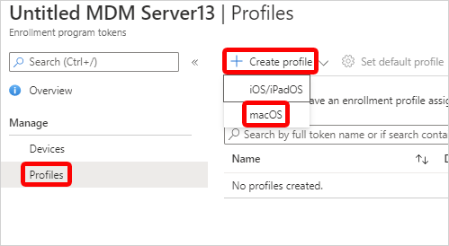
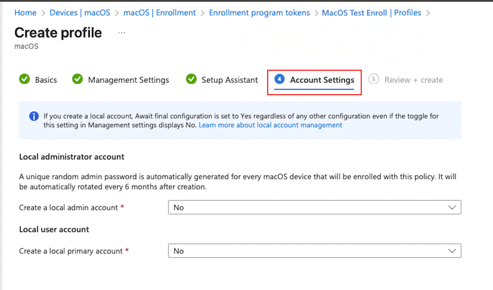

# Set up automated device enrollment for macOS   

*Applies to macOS*

This article describes how to create an enrollment policy for macOS automated device enrollment (ADE) in Microsoft Intune. For an overview of ADE and prerequisite setup, see [Overview of Apple Automated Device Enrollment for macOS](overview-automated-enrollment-macos.md).

> [!NOTE]
> The steps in this article are the same whether you're using Apple Business or Apple School Manager. For brevity, we refer to *Apple Business* only throughout the steps in this article, except where clarification is necessary.  

## Prerequisites

:::row:::
:::column span="1":::
[!INCLUDE [platform](../../includes/requirements/platform.md)]

:::column-end:::
:::column span="3":::

> New or wiped macOS devices purchased through Apple Business or Apple School Manager.

:::column-end:::
:::row-end:::

:::row:::
:::column span="1":::
[!INCLUDE [tenant-configuration](../../includes/requirements/tenant-configuration.md)]

:::column-end:::
:::column span="3":::

> - Access to [Apple Business portal](https://business.apple.com/) or [Apple School Manager portal](https://school.apple.com/).
> - An active Apple token (.p7m file). For steps, see [Set up a macOS ADE token](setup-macos-token.md).
> - An [Apple MDM push certificate in Intune](create-mdm-push-certificate.md).

:::column-end:::
:::row-end:::

> [!TIP]
> Automated device enrollment applies device configurations that a device user may not be able to remove. Wipe all devices prior to enrollment to return them to an out-of-box state.  

When enrolling macOS devices using ADE with user affinity and Setup Assistant with modern authentication, users must sign in to the Company Portal app with their Microsoft Entra credentials to complete device registration in Microsoft Entra ID. To add the Company Portal app to macOS devices, see [Add the Company Portal for macOS app](../../app-management/deployment/add-company-portal-macos.md).  

To make Microsoft Entra ID single sign-on (SSO) available during Setup Assistant, create a platform SSO policy before devices enroll. Platform SSO policies are deployed to enrolling macOS devices during automated device enrollment (ADE) and allow users to sign in with their organization credentials during device setup. This configuration enables users to automatically access Microsoft Entra–protected apps and resources after enrollment. For more information, see [Configure platform SSO during automated device enrollment for macOS](../../device-configuration/settings-catalog/configure-platform-sso-during-enrollment.md).  

## Create an enrollment policy

Create an automated device enrollment policy in the admin center. The policy defines the enrollment experience for your organization's Mac devices, and enforces enrollment policies and settings on enrolling devices. The policy is deployed to assigned devices over-the-air.

At the end of this procedure, you can assign this policy to Microsoft Entra device groups.

1. In the [admin center](https://go.microsoft.com/fwlink/?linkid=2109431), go to **Devices** > **Enrollment**.
1. Select the **macOS** tab.
1. Under **Bulk Enrollment Methods**, select **Enrollment program tokens**.
1. Select an enrollment program token.
1. Select **Enrollment policies** > **Create policy** > **macOS**.

    

   > [!IMPORTANT]
   > You must assign an enrollment policy to your devices before the devices become active. We recommend that you set a default enrollment policy as soon as possible so that as devices sync from Apple Business or Apple School Manager, and then turn on, they can enroll correctly through automated device enrollment. If a device you synced from Apple isn't assigned an enrollment policy and someone turns it on to set it up, enrollment fails.

1. For **Basics**, enter a name and description for the policy so that you can distinguish it from other enrollment policies. These details aren't visible to device users.

     >[!TIP]
     > You can use the name field to create a dynamic group in Microsoft Entra ID, and assign devices to the enrollment policy automatically. Use the policy name to define the *enrollmentProfileName* parameter. For more information, see [Microsoft Entra dynamic groups](/azure/active-directory/users-groups-roles/groups-dynamic-membership#rules-for-devices).

1. Select **Next**.

1. On the **Management Settings** page, configure **User Affinity**. *User affinity* determines whether devices enroll with or without an assigned user. Your options:

    * **Enroll without User Affinity**:  Enroll devices that aren't associated with a single user. Choose this option for shared devices and devices that don't need to access local user data. The Company Portal app doesn't work on these types of devices. Enrolling without user affinity is also referred to as enrolling *userless*.
    * **Enroll with User Affinity**: Enroll devices that are associated with an assigned user. Choose this option for work devices that belong to users, and if you want to require users to have the Company Portal app to install apps. Multifactor authentication (MFA) is available with this option. Enrolling with user affinity is also referred to as enrolling with a *user*.

      Option 2 requires more configurations. Users must authenticate themselves before enrollment to confirm their identity. Select one of the following authentication methods:

      - **Setup Assistant with modern authentication** (recommended): This method requires users to complete all Setup Assistant screens and sign in to the Company Portal app with their Microsoft Entra credentials before they can access resources. After they sign in to Company Portal, the device:

        - Registers with Microsoft Entra ID.
        - Is added to the user's device record in Microsoft Entra ID.
        - Can be evaluated for device compliance.
        - Gains access to resources protected by Conditional Access.

        If the user doesn't sign in to the Company Portal to complete registration, they'll be redirected to the Company Portal app each time they try to open a managed app with Conditional Access protection.

        Devices running macOS 10.15 and later can use this method. Older macOS devices fall back to using the legacy Setup Assistant method. For more information about how to get the Company Portal app to Mac users, see [Add the Company Portal for macOS app](../../app-management/deployment/add-company-portal-macos.md).

      > [!IMPORTANT]
      > We recommend using **Setup Assistant with modern authentication** for your Apple devices for ADE (automated device enrollment) scenarios with user device affinity. While use of the legacy authentication remains available, we don't recommend its use.

      - **Setup Assistant (legacy)** (no longer recommended): Use the legacy Setup Assistant if you want users to experience the typical out-of-box-experience for Apple products. This method installs standard preconfigured settings when the device enrolls with Intune management. If you're using Active Directory Federation Services and you're using Setup Assistant to authenticate, a [WS-Trust 1.3 Username/Mixed endpoint](/previous-versions/windows/it-pro/windows-server-2008-R2-and-2008/ff608241(v=ws.10)) is required. For more information about retrieving the ADFS endpoint, see [Get-ADfsEndpoint](/powershell/module/adfs/get-adfsendpoint?view=win10-ps&preserve-view=true).

 1. **Await final configuration** enables a locked experience at the end of Setup Assistant to ensure your most critical device configuration policies are installed on the device. This setting is applied once during the out-of-box Apple automated device enrollment experience in Setup Assistant. The device user doesn't experience it again unless they re-enroll their Mac.

    Your options:
       * **Yes**:  Just before the home screen loads, Setup Assistant pauses and lets Intune check in with the device. The end-user experience locks while users await final configurations. This option is the default configuration for new enrollment policies.

       * **No**: The device is released to the home screen when Setup Assistant ends, regardless of policy installation status. Device users might be able to access the home screen or change device settings before all policies are installed. This option is the default configuration for existing enrollment policies.

    The amount of time that users are held on the Awaiting final configuration screen varies, and depends on the total number of policies and apps you assign to the device. Users can see the device configuration policies downloading in Setup Assistant as they wait. The more policies and apps assigned, the longer the waiting time. Setup Assistant and Intune don't enforce a minimum or maximum time limit during this portion of setup. During product validation, most devices we tested were released and able to access the home screen within 15 minutes. If you enable this feature and are working with a Microsoft partner or non-Microsoft service to help you provision devices, tell them about the potential for increased provisioning time.

    The locked experience is supported on Macs running macOS 10.11 or later. It works on Macs targeted with new or existing enrollment policies set up for these scenarios:
       * Enrollment via Setup Assistant with modern authentication
       * Enrollment with Setup Assistant (legacy)
       * Enrollment without user device affinity

1. You can enforce **Locked enrollment** to prevent users from unenrolling their devices from Intune. Select **Yes** to disable the Mac settings in System Preferences and Terminal that allow users to remove the management policy. After the device enrolls, you can't change this setting without wiping the device.

1. Select **Next**.

1. Optionally, on the **Account Settings** page, you can configure the local administrator and user accounts on targeted Macs.

   When a supported macOS device enrolls with Intune through an automated device enrollment (ADE) policy that configures the local administrator, the device is enabled for macOS local account configuration with the Microsoft local admin password solution (LAPS). With this capability, newly enrolled devices receive a unique local administrator account that has a strong, encrypted, and randomized admin password (15 alphanumeric characters), which is also stored and encrypted by Intune. After enrollment, Intune automatically rotates a LAPS-managed administrator password every six months by default and supports look up and manual rotation of the admin password by Intune administrators with sufficient permissions.

   For information about configuring and then managing this capability, [Setup macOS account configuration with LAPS](../../device-security/laps/setup-macos.md).

   > [!div class="mx-imgBorder"]
   > 

   The following settings for the local user account are supported on devices running macOS 12 or later. Keep in mind while you configure the primary account that this account is going to be an *admin* account. Having at least one admin account is a Mac setup requirement. If you're also configuring the local administrator password through this policy, see [local administrator account](../../device-security/laps/setup-macos.md) in the *Setup macOS account configuration with LAPS* article, and then return here.

   Your options:

   * **Create a local user account**: Select **Yes** to configure local user account settings for targeted Macs. Select **Not configured** to skip all account setting configurations.
   * **Prefill account info**: The default configuration, **Not configured**, requires the device user to enter their account username and full name in Setup Assistant. To prefill the account information for them instead, select **Yes**. Then enter the primary account name and full name:

   * **Local user account username**:
     * {{serialNumber}} - for example, F4KN99ZUG5V2
     * {{partialupn}} - for example, John
     * {{managedDeviceName}} - for example, F2AL10ZUG4W2_14_4/15/2025_12:45PM
     * {{OnPremisesSamAccountName}} - for example, contoso\John

   * **Local user account full name:**:
     * {{username}} - for example, John@contoso.com
     * {{serialNumber}} - for example, F4KN99ZUG5V2
     * {{OnPremisesSamAccountName}} - for example, contoso\John

   * **Restrict editing**: The default configuration is set to **Yes** so that device users can't edit the account name and full name configured for them. To allow device users to edit the account name and full name, select **Not configured**. If you're only using Setup Assistant (legacy) to enroll devices running macOS 10.15 and later, you can expect the following end user experience:
     * **Yes**: The account creation screen in Setup Assistant never appears. Instead, the local user account is automatically created based on the other setting configurations, and the password is automatically populated from the Microsoft Entra authentication screen. The device user can't edit these fields.
     * **Not configured**: The local user account screen is shown to the end user in Setup Assistant and is populated with the configured account values, and the password from the Microsoft Entra authentication screen. The device user can edit these fields during Setup Assistant.

   For account settings to work as intended, your enrollment policy must have the following configurations:
   * **User affinity**: Select **Enroll with User affinity**.
   * **Authentication method**: Select **Setup Assistant with modern authentication** or **Setup Assistant (legacy)**.
   * **Await final configuration**: Select **Yes**.

   Local accounts depend on the await final configuration feature when they're being created. As a result, if you configure any local admin or user account settings, this setting is always enabled. Even if you don't touch the await final configuration setting, it's always enabled in the background and applied to the enrollment policy.

1. Select **Next**.

1. On the **Setup Assistant** page, configure the Setup Assistant experience.
    1. Enter your department information so that users know who to contact for support:
        * **Department Name**: This name appears when device users select **About Configuration** during activation.
        * **Department Phone**: This phone number appears when device users select **Need Help** during activation.
    2. Select the Setup Assistant screens you want to show or hide during device setup. For a description of all screens, [see Setup Assistant screen reference](#setup-assistant-screen-reference) (in this article). Your options:
        * **Hide**: The screen doesn't appear to users during device setup. After device setup, the user can go to their device settings to set up the feature.
        * **Show**: The screen appears to users during device setup. The user can still skip screens that don't require immediate action. After device setup, the user can go to their device settings to set up the feature.
1. Select **Next**.

1. On the **Device group** tab, optionally select a Microsoft Entra security group to use for enrollment time grouping. The group maps directly to this enrollment policy, and you can edit it after policy creation.

   This tab is only available in new enrollment policies and doesn't appear in existing enrollment profiles. Only static Microsoft Entra security groups are available for selection. To configure this setting, you must have the *enrollment time device membership assignment* permission in a custom RBAC role (under **Enrollment programs**).

   For more information, see [Enrollment time grouping in Microsoft Intune](../setup-time-grouping.md).

1. Select **Next**.

1. Review the summary of changes, and then select **Create** to finish creating the policy.

### Setup Assistant screen reference
The following table describes the Setup Assistant screens shown during automated device enrollment for Macs. You can show or hide these screens on supported devices during enrollment. For more information about how each Setup Assistant screen affects the user experience, see these Apple resources:

- [Apple Platform Deployment guide: Manage Setup Assistant for Apple devices](https://support.apple.com/en-mide/guide/deployment/depdeff4a547/web)
- [Apple Developer documentation: ShipKeys](https://developer.apple.com/documentation/devicemanagement/skipkeys)

| Setup Assistant screen | What happens when visible  |
|------------------------------------------|------------------------------------------|
| **Location Services** | Shows the location services setup pane, where users can enable location services on their device. For macOS 10.11 and later. |
| **Restore** | Shows the apps and data setup pane. On this screen, users setting up devices can restore or transfer data from iCloud Backup. For macOS 10.9-15.3. For macOS 15.4 and later, this screen can't be hidden and the user receives an alert after enrollment that they're unable to transfer data from another device because MDM controls the setting. |
| **Apple ID** | Shows the Apple ID setup pane, which gives users to the option to sign in with their Apple ID and use iCloud. For macOS 10.9 and later.   |
| **Terms and conditions** |Shows the Apple terms and conditions pane, and requires users to accept them. For macOS 10.9 and later. |
| **Touch ID and Face ID** | Shows the biometric setup pane, which gives users the option to set up fingerprint or facial identification on their devices. For macOS 10.12.4 and later. |
| **Apple Pay** | Shows the Apple Pay setup pane, which gives users the option to set up Apple Pay on their devices. For macOS 10.12.4 and later. |
| **Siri** | Shows the Siri setup pane to users. For macOS 10.12 and later. |
| **Diagnostics Data** | Shows the diagnostics pane where users can opt-in to send diagnostic data to Apple. For macOS 10.9 and later. |
| **Display Tone** |Shows the setup pane for the display tone. This screen gives users the option to turn on true tone display. For macOS 10.13.6 and later. |
| **FileVault** | Shows the FileVault 2 encryption screen to users. For macOS 10.10 and later. |
| **iCloud Diagnostics** | Shows the iCloud Analytics screen to users. For macOS 10.12.4 and later. |
| **Registration** | Shows the registration screen to users. For macOS 10.9 and later. |
| **iCloud Storage** | Shows the iCloud Documents and Desktop screen to the user. For macOS 10.13.4 and later. |
| **Appearance** | Shows the appearance pane where users can select an appearance mode. For macOS 10.14 and later. |
| **Screen Time** | Shows the macOS Screen Time setup pane, a feature users can enable to gain insight on screen-time, and app and website activity. For macOS 10.15 and later. |
| **Privacy** | Shows the privacy setup pane to the user. For macOS 10.13.4 and later. |
| **Accessibility** | Shows the accessibility setup screen to the user. If this screen is hidden, the user can't use the macOS Voice Over feature. Voice Over is supported on devices that: - Run macOS 11. - Are connected to the internet using Ethernet. - Have a serial number in Apple School Manager or Apple Business. |
| **Auto unlock with Apple Watch**| Shows the macOS Unlock with Apple Watch pane, where users can configure their Apple Watch to unlock their Mac. For macOS 12.0 and later.
| **Terms of Address**| Shows the terms of address pane, which gives users the option to choose how they want to be addressed throughout the system: feminine, masculine, or neutral. This Apple feature is available for select languages. For more information, see [Change Language & Region settings on Mac](https://support.apple.com/guide/mac-help/intl163/mac)(opens Apple website). For macOS 13.0 and later.|
| **Wallpaper**| Shows the macOS Sonoma wallpaper setup pane after devices complete a software upgrade. If you hide this screen, devices get the default macOS Sonoma wallpaper. For macOS 14.1 and later.|
| **Lockdown mode**| Shows the lockdown mode setup pane to users who set up an Apple ID. For macOS 14.0 and later.|
| **Intelligence**| Shows the Apple Intelligence setup pane, where users can configure Apple Intelligence features. For macOS 15.0 and later.|  
| **App Store**| Shows the Apple App Store pane. For macOS 11.1 and later.  |
| **Software update**| Shows the the mandatory software update screen. For macOS 15.4 and later.  |
| **Additional privacy settings**| Shows the additional privacy settings pane. For macOS 26.0 and later.  |
| **OS Showcase**| Shows the OS showcase pane. For macOS 26.1 and later.  |
|**Update completed**| Shows the software update complete pane. For macOS 26.1 and later.  |
|**Get started**| Shows the get started pane. For macOS 15.0 and later. |  

## Assign an enrollment policy to devices

Assign an enrollment policy to Apple devices.

1. Return to **Enrollment program tokens** and select a token.
1. Select **Devices**.
1. Choose your devices from the list, and then select **Assign policy**.
1. Choose a policy to assign, and then select **Assign**.

Optionally, you can select a default enrollment policy. The default policy is deployed to all enrolling devices associated with the token.

1. Return to **Enrollment program tokens** and select a token.
1. Select **Set Default Policy**.
1. Choose a policy, and then select **Save**.

## Next steps

- To sync devices, distribute devices to users, and manage tokens, see [Manage macOS ADE devices and tokens](manage-devices-tokens-macos.md).
- To renew or delete your enrollment program token, see [Set up a macOS ADE token](setup-macos-token.md).  
- Use [Remote Device Actions in Microsoft Intune](../../device-management/actions/index.md) to remotely manage enrolled Macs.  
