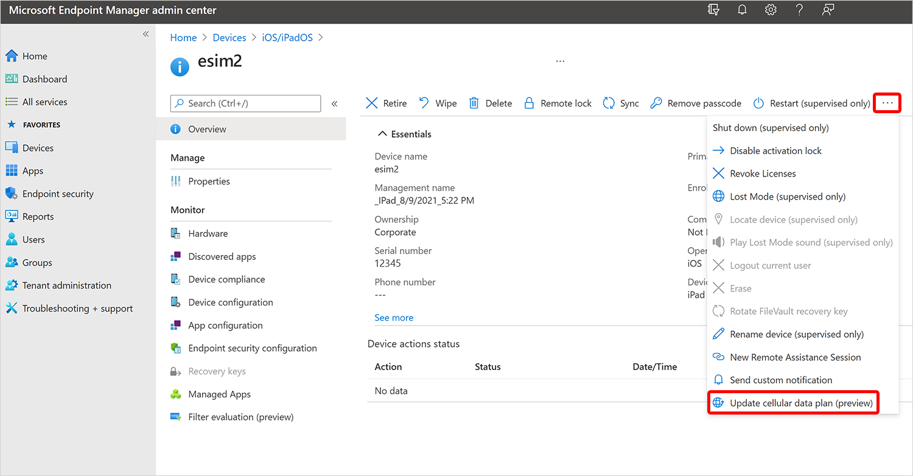

# Manage eSIM cellular plans with Microsoft Intune device actions

The *update cellular data plan* action lets you remotely activate an eSIM cellular plan on supported iOS/iPadOS devices, making it easier to manage connectivity for users without physical SIM cards. You can also activate eSIMs on supported Android Enterprise devices and remove an eSIM from a single supported Android Enterprise device.

## Prerequisites

::: zone pivot="ios"

:::row:::
:::column span="1":::
[!INCLUDE [platform](../../includes/requirements/platform.md)]

:::column-end:::
:::column span="3":::

> This action supports the following platforms:
>
> - iOS/iPadOS

:::column-end:::
:::row-end:::

:::row:::
:::column span="1":::

[!INCLUDE [rbac](../../includes/requirements/rbac.md)]
:::column-end:::
:::column span="3":::
> To run this action, at a minimum, use an account that has one of the following roles:
>
> - [Help Desk Operator]
> - [School Administrator]
> - [Custom role] that includes:
>   - The permission **Remote tasks/Update cellular data plan**
>   - Permissions that provide visibility into and access to managed devices in Intune (for example, Organization/Read, Managed devices/Read)
:::column-end:::
:::row-end:::

::: zone-end

::: zone pivot="android"

Android Enterprise eSIM actions support corporate-owned devices only. Personally owned devices with a work profile (BYOD) aren't supported.

| Action | Corporate-owned fully managed (COBO) | Corporate-owned dedicated (COSU) | Corporate-owned work profile (COPE) |
| --- | --- | --- | --- |
| Activate an eSIM on one device | Android 15 or later | Android 15 or later | Android 15 or later |
| Remove an eSIM from one device | Android 15 or later | Android 15 or later | Android 17 or later |

The devices must support eSIM. Get the activation code from your carrier before you activate an eSIM.

To remove an eSIM, its ICCID must be available in the [device hardware inventory](../inventory-and-status/device-details.md#hardware-device-details). Use the ICCID to identify the eSIM that you want to remove.

To use an eSIM device action, at a minimum, use an account that has one of the following roles:

- [Help Desk Operator]
- [School Administrator]
- [Custom role] that includes:
  - **Remote tasks/Update cellular data plan** to activate eSIMs
  - **Remote tasks/Remove eSIM** to remove an eSIM
  - Permissions that provide visibility into and access to managed devices in Intune (for example, Organization/Read, Managed devices/Read)

::: zone-end

::: zone pivot="ios"

## Update the cellular data plan from the Intune admin center

1. In the [Microsoft Intune admin center], select [**Devices**] > [**All devices**].
1. From the devices list, select a device.
1. At the top of the device overview pane, find the row of action icons. Select **Update cellular data plan**.
    
1. Enter the activation server URL for your mobile carrier and select **Update cellular plan**.

::: zone-end

::: zone pivot="android"

## Activate an eSIM on one Android Enterprise device

The single-device action is available only in the new device view.

1. In the [Microsoft Intune admin center], select [**Devices**] > [**All devices**].
1. Set **Preview new device view** to **On**, and then select a supported Android Enterprise device.
1. At the top of the device overview pane, select **Activate eSIM**.
1. Enter the carrier-provided activation code, and confirm the action.

Intune sends the activation request without first blocking it based on reported eSIM slot capacity. If Google can't complete the activation, Intune surfaces the error returned by Google.

## Remove an eSIM from one Android Enterprise device

Removal depends on the ICCID reported in device inventory, and the single-device action is available only in the new device view.

1. In the [Microsoft Intune admin center], select [**Devices**] > [**All devices**].
1. Set **Preview new device view** to **On**, and then select a supported Android Enterprise device.
1. In the device inventory, find and copy the ICCID for the eSIM that you want to remove. If the ICCID isn't available in inventory, you can't submit the removal action.
1. At the top of the device overview pane, select **Remove eSIM**.
1. Enter the ICCID, and confirm the action.

::: zone-end

::: zone pivot="ios"

## User experience

When you select the **Update cellular data plan** action, the device receives a command to activate the eSIM cellular data plan. The user experience on the device is as follows:

- Cellular data starts working.
- The active cellular data plan is listed in the cellular section of the **Settings** app on the device.

For more information about devices that support eSIM, see the Apple support article [Using Dual SIM with an eSIM](https://support.apple.com/HT209044).

::: zone-end

::: zone pivot="android"

## User experience

When you activate an eSIM on a supported corporate-owned Android Enterprise device, the eSIM is downloaded and activated automatically. When you remove an eSIM, the device removes the eSIM identified by the ICCID that you entered.

::: zone-end

## Reference links

- Microsoft Graph API: [activateDeviceEsim action][GRAPH-1]

[Microsoft Intune admin center]: https://go.microsoft.com/fwlink/?linkid=2109431
[**Devices**]: https://go.microsoft.com/fwlink/?linkid=2109431#view/Microsoft_Intune_DeviceSettings/DevicesMenu/~/overview
[**All devices**]: https://go.microsoft.com/fwlink/?linkid=2109431#view/Microsoft_Intune_DeviceSettings/DevicesMenu/~/allDevices

[Help Desk Operator]: /intune/fundamentals/role-based-access-control/ref-built-in-roles#help-desk-operator
[School Administrator]: /intune/fundamentals/role-based-access-control/ref-built-in-roles#school-administrator
[Endpoint Security Manager]: /intune/fundamentals/role-based-access-control/ref-built-in-roles#endpoint-security-manager
[Custom role]: /intune/fundamentals/role-based-access-control/create-custom-role

[GRAPH-1]: /graph/api/intune-devices-manageddevice-activateDeviceEsim
