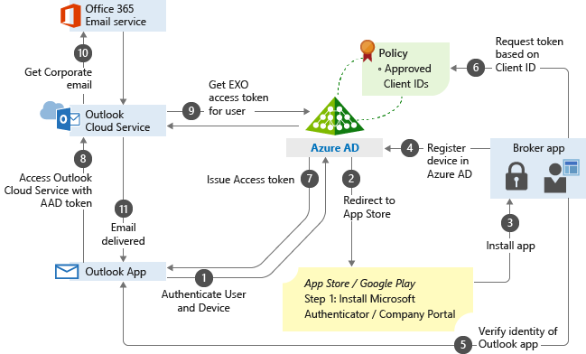

# Use app-based Conditional Access policies with Intune

Microsoft Intune app protection policies work with Microsoft Entra Conditional Access to help protect your organizational data on devices your employees use. These policies work on devices that enroll with Intune and on employee owned devices that don't enroll. Combined, they're referred to as app-based Conditional Access.

App-based Conditional Access with client app management adds a security layer that makes sure only client apps that support Intune app protection policies can access Exchange Online and other Microsoft 365 services.

> [!TIP]
> In addition to app-based Conditional Access policies, you can use [device-based Conditional Access with Intune](./device-based-policies.md).

## Requirements

:::row:::
:::column span="1":::
[!INCLUDE [licensing](../../includes/requirements/licensing.md)]

:::column-end:::
:::column span="3":::

> Before you create an app-based Conditional Access policy, you must have a **Microsoft Entra ID P1 or P2** license. Users must also be licensed for Microsoft Entra ID. For more information, see [Microsoft Entra pricing](https://www.microsoft.com/security/business/microsoft-entra-pricing).

:::column-end:::
:::row-end:::

:::row:::
:::column span="1":::
[!INCLUDE [rbac](../../includes/requirements/rbac.md)]

:::column-end:::
:::column span="3":::

> Your account must have one of the following roles in Microsoft Entra:
> - Security administrator
> - Conditional Access administrator

:::column-end:::
:::row-end:::

:::row:::
:::column span="1":::
[!INCLUDE [platform](../../includes/requirements/platform.md)]

:::column-end:::
:::column span="3":::

> - Android
> - iOS/iPadOS

:::column-end:::
:::row-end:::

## Supported apps

A list of apps that support app-based Conditional Access can be found in [Conditional Access: Conditions](/entra/identity/conditional-access/concept-conditional-access-conditions#client-apps) in the Microsoft Entra documentation.

App-based Conditional Access [also supports line-of-business (LOB) apps](./block-no-modern-auth.md), but these apps need to use [Microsoft 365 modern authentication](/microsoft-365/enterprise/modern-auth-for-office-2013-and-2016?view=o365-worldwide&preserve-view=true).

## How app-based Conditional Access works

App-based Conditional Access works by requiring a broker app to register the device with Microsoft Entra ID. The broker app can be Microsoft Authenticator on iOS, or Company Portal on Android. During authentication, Microsoft Entra ID checks whether the app is on the policy-approved list before granting access. The following diagram illustrates this process:

For a detailed technical overview, see [Client apps](/entra/identity/conditional-access/concept-conditional-access-conditions#client-apps) in the Microsoft Entra documentation.

## Create app-based Conditional Access policies

Conditional Access is a Microsoft Entra technology. The Conditional Access node you access from the Microsoft Intune admin center is the same node you access from Microsoft Entra ID, so you don't need to switch between them to configure policies.

Before you create Conditional Access policies, you need to have [Intune app protection policies](../../app-management/protection/create-policy.md) applied to your apps.

> [!IMPORTANT]
> This section walks through the steps to add a simple app-based Conditional Access policy. You can use the same steps for other cloud apps. For more information, see [Plan Conditional Access deployment](/entra/identity/conditional-access/plan-conditional-access).

1. Sign in to the [Microsoft Intune admin center](https://go.microsoft.com/fwlink/?linkid=2109431).

2. Select **Endpoint security** > **Conditional Access** > **Create new policy**.

3. Enter a policy **Name**, and then under **Assignments**, configure **Users and groups** to apply the policy to users and groups. Use the **Include** or **Exclude** options to add your groups.

4. Under **Assignments**, configure **Target resources**. Apply the policy to **Cloud apps**. Use the **Include** or **Exclude** options to select the apps to protect. For example, choose **Select apps**, and select **Office 365**.

5. Select **Conditions** > **Client apps** to apply the policy to apps and browsers. For example, select **Yes**, and then enable **Browser** and **Mobile apps and desktop clients**.

6. Under **Access controls**, configure **Grant**. For example, select **Grant access** > **Require approved client app** and **Require app protection policy**, then select **Require one of the selected controls**.

7. Under **Enable policy**, select **On**, and then select **Create**.

## Next steps

- [Device-based Conditional Access with Intune](./device-based-policies.md)
- [Block apps that don't use modern authentication](./block-no-modern-auth.md)
- [Protect app data with app protection policies](../../app-management/protection/create-policy.md)
- [Plan Conditional Access deployment](/entra/identity/conditional-access/plan-conditional-access)
