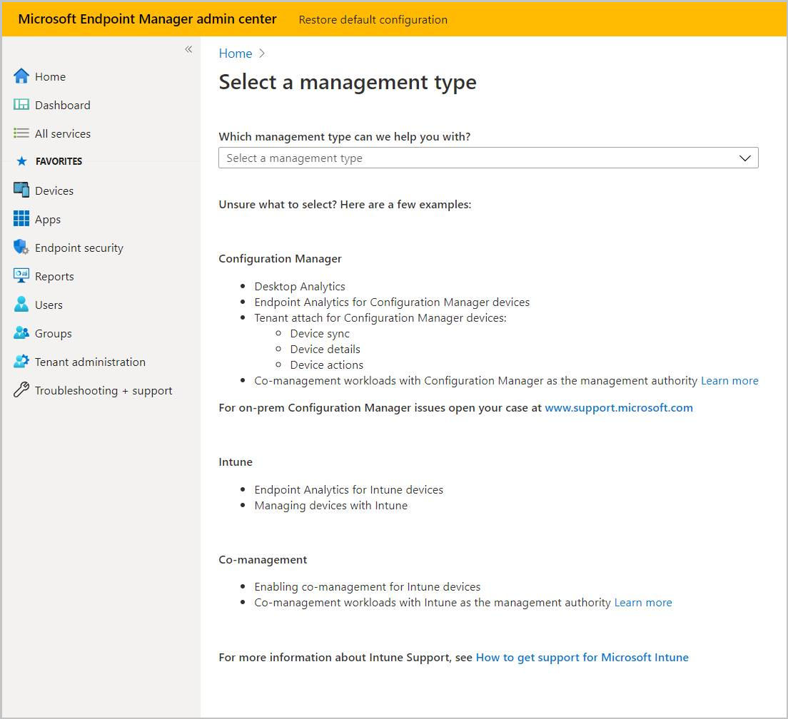

# Get support for endpoint analytics

Microsoft provides global technical, pre-sales, billing, and subscription support for endpoint analytics. Support is available both online and by phone for paid and trial subscriptions. Online technical support is available in English and Japanese. Phone support and online billing support are available in other languages too.

Before contacting Microsoft Support, first review the following articles:

- [Prerequisites](index.md#prerequisites)
- [Troubleshoot endpoint analytics](troubleshoot.md)

## Help and support

To request help for endpoint analytics, use the **Help and Support** option in the portal under **Troubleshooting + support**. This action files an online support ticket for endpoint analytics. To create and manage a support incident, your account must have a Microsoft Entra role that includes the action **microsoft.office365.supportTickets/tickets/manage**. For more information about the required roles, see [Administrator roles in Microsoft Entra ID](/azure/active-directory/users-groups-roles/directory-assign-admin-roles).

If the issue is more broadly for Intune than just endpoint analytics, see [How to get support in Microsoft Intune](../fundamentals/it-pro-support/get-support-admin-center.md) to open a new support request. For an issue that is more broadly for Configuration Manager than just endpoint analytics, open a support request at [Microsoft support for Configuration Manager](https://aka.ms/cmcbsupport).

## Share product feedback

<!-- 5451636 -->

To share your feedback about endpoint analytics, select the **Feedback** icon at the top of the Intune admin center. Use the text box to provide your feedback and select **Submit** when done.

### See also

- [Find help for Configuration Manager](../configmgr/core/understand/find-help.md)
- [Support for Microsoft Intune](../fundamentals/it-pro-support/get-support-admin-center.md)
