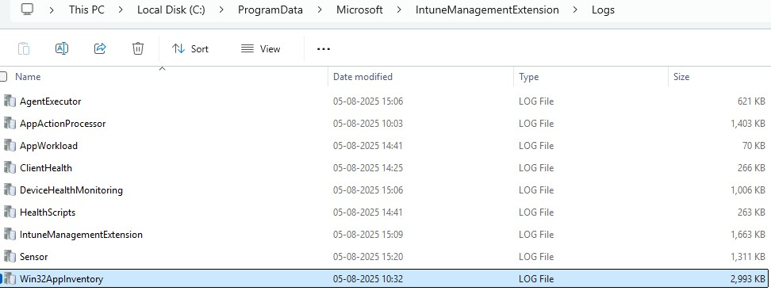

# Troubleshoot Win32 App Issues

[!INCLUDE [windows-10-support](../includes/windows-10-support.md)]

When you're troubleshooting Win32 apps used in Microsoft Intune, you can use a number of methods. This article provides troubleshooting details and information to help you solve Win32 app problems. For more information, see [Win32 app installation troubleshooting](/troubleshoot/mem/intune/troubleshoot-app-install#win32-app-installation-troubleshooting) resources.

> [!NOTE]
> This app management capability supports 32-bit Windows, 64-bit Windows, and ARM64 operating system architectures for Windows applications.

> [!IMPORTANT]
> When you're deploying Win32 apps, consider using the [Intune Management Extension](../apps/intune-management-extension.md) approach exclusively, particularly when you have a multiple-file Win32 app installer. If you mix the installation of Win32 apps and line-of-business (LOB) apps during Windows Autopilot enrollment, the app installation might fail. However, mixing of Win32 and line-of-business apps during Windows Autopilot device preparation is supported. The Intune management extension is installed automatically when a PowerShell script or Win32 app is assigned to the user or device.
>
> For the scenario when a Win32 app is deployed and assigned based on user targeting, if the Win32 app requires device admin privileges or any other permissions that the standard user of the device does not have, the app will fail to install.

## App troubleshooting details

You can view installation issues, such as when the app was created, modified, targeted, and delivered to a device. The [Microsoft Intune admin center](https://go.microsoft.com/fwlink/?linkid=2109431) provides these and other details on the **Troubleshoot + support** pane. For more information, see [App troubleshooting details](/troubleshoot/mem/intune/troubleshoot-app-install#app-troubleshooting-details).

## Troubleshooting app issues by using logs

Viewing the details of logs can help you determine the cause of the issues that you're seeing and help resolve them. You can choose to view the [logs displayed in Intune](apps-win32-troubleshoot.md#logs-displayed-in-intune), or view the [logs displayed through CMTrace](apps-win32-troubleshoot.md#logs-displayed-through-cmtrace).

### Logs displayed in Intune

When an installation issue occurs with a Win32 app, you can choose the **Collect logs** option in the **Installation details** pane for the app in Intune. For more details, see [Win32 app installation troubleshooting](/troubleshoot/mem/intune/troubleshoot-app-install#win32-app-installation-troubleshooting).

### Logs displayed through CMTrace

Agent logs on the client machine are commonly in *C:\ProgramData\Microsoft\IntuneManagementExtension\Logs*. You can use *CMTrace.exe* to view these log files. For more information, see [CMTrace](/configmgr/core/support/cmtrace).



| Log File | Description |
|----------|-------------|
| IntuneManagementExtension.log | Main client log. Contains agent check in, policy request, policy processing and reporting activities |
| AgentExecutor.log | Tracks PowerShell script execution details |
| ClientHealth.log | Tracks SideCar agent client heath activities |
| _IntuneManagementExtension.log | Saved copy of IntuneManagementExtension.log after log rolls over |
| AppActionProcessor.log | Tracks the Application Action Processor. This includes information about detection and applicability checks |
| AppWorkload.log | Main app workload log. This includes apps check-ins, app installs, app applicability and app detection logging |
| HealthScripts.log | Tracks Remediation script execution details. All workloads that leverage Remediation scripts would find logging for their features here, including custom compliance scripts, managed installer, hardware configuration, and on-demand proactive remediations. |

> [!IMPORTANT]
> To allow proper installation and execution of LOB Win32 apps, antimalware settings should exclude the following directories from being scanned:<p>
> **On x64 client machines**:<br>
> *C:\Program Files (x86)\Microsoft Intune Management Extension\Content*<br>
> *C:\windows\IMECache*
>
> **On x86 client machines**:<br>
> *C:\Program Files\Microsoft Intune Management Extension\Content*<br>
> *C:\windows\IMECache*
>
> For more information, see [Virus scanning recommendations for enterprise computers that are running currently supported versions of Windows](https://support.microsoft.com/help/822158/virus-scanning-recommendations-for-enterprise-computers).

## Detecting the Win32 app file version by using PowerShell

If you have difficulty detecting the Win32 app file version, consider using or modifying the following PowerShell command:

``` PowerShell

$FileVersion = [System.Diagnostics.FileVersionInfo]::GetVersionInfo("<path to binary file>").FileVersion
#The below line trims the spaces before and after the version name
$FileVersion = $FileVersion.Trim();
if ("<file version of successfully detected file>" -eq $FileVersion)
{
#Write the version to STDOUT by default
$FileVersion
exit 0
}
else
{
#Exit with non-zero failure code
exit 1
}
```

In the preceding PowerShell command, replace the `<path to binary file>` string with the path to your Win32 app file. An example path would be similar to the following:

`C:\Program Files (x86)\Microsoft SQL Server Management Studio 18\Common7\IDE\ssms.exe`

Also, replace the `<file version of successfully detected file>` string with the file version that you need to detect. An example file version string would be similar to the following:

`2019.0150.18118.00 ((SSMS_Rel).190420-0019)`

If you need to get the version information of your Win32 app, you can use the following PowerShell command:

``` PowerShell

[System.Diagnostics.FileVersionInfo]::GetVersionInfo("<path to binary file>").FileVersion

```

In the preceding PowerShell command, replace `<path to binary file>` with your file path.

## Additional troubleshooting areas to consider
- Check targeting to make sure the agent is installed on the device. A Win32 app targeted to a group or a PowerShell Script targeted to a group will create an agent installation policy for a security group.
- Check the OS version: Windows 10 1607 and later.
- Check the Windows SKU. Windows S, or Windows versions running with S-mode enabled, doesn't support MSI installation.

For more information about troubleshooting Win32 apps, see [Win32 app installation troubleshooting](/troubleshoot/mem/intune/troubleshoot-app-install#win32-app-installation-troubleshooting). For information about app types on ARM64 devices, see [App types supported on ARM64 devices](/troubleshoot/mem/intune/troubleshoot-app-install#app-types-supported-on-arm64-devices).

## Next steps

- [Troubleshoot app installation issues](/troubleshoot/mem/intune/app-management/troubleshoot-win32-app-install)
