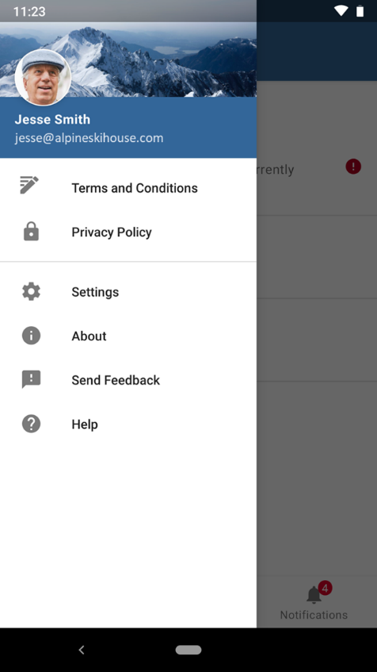
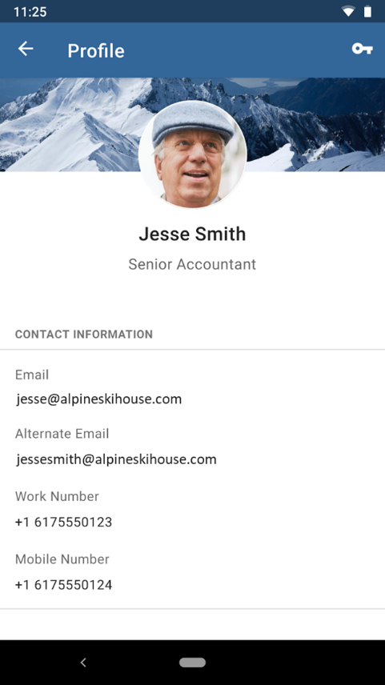
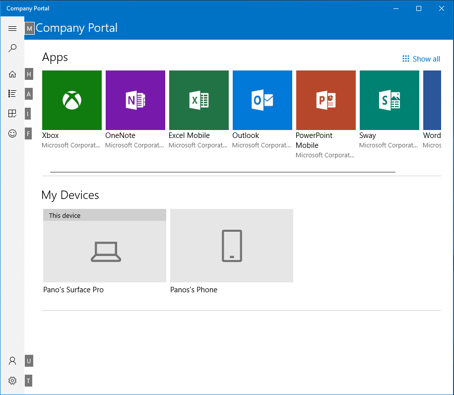

# How to Configure the Intune Company Portal Apps, Company Portal Website, and Intune App

The Company Portal apps, Company Portal website, and Intune app on Android are where users access company data and do common tasks. Common tasks include enrolling devices, installing apps, and locating information for IT assistance. Users securely access company resources. The end-user experience provides several pages: Home, Apps, App details, Devices, and Device details. To quickly find apps, filter them on the Apps page.

> [!NOTE]
> The Company Portal supports Configuration Manager applications. This feature allows end users to see both Configuration Manager and Intune deployed applications in the Company Portal for co-managed customers. The Company Portal displays Configuration Manager deployed apps for all co-managed customers. This support helps administrators consolidate their different end user portal experiences. For more information, see [Use the Company Portal app on co-managed devices](../../configmgr/comanage/company-portal.md).
>
> The minimum supported version of the iOS Company Portal app is v5.2311.1. If users are running an older version, they're prompted for an update at sign in.

## Customizing the user experience

By customizing the end-user experience, you help provide a familiar and helpful experience for your end users. To configure these customizations, sign in as an [Intune administrator](../fundamentals/role-based-access-control-reference.md) with sufficient permissions. Navigate to the [Microsoft Intune admin center](https://go.microsoft.com/fwlink/?linkid=2109431) and select **Tenant Administration** > **Customization**. Here you edit the default policy or create up to 25 user group targeted policies. Targeting policies to device groups isn't supported. These settings apply to the Company Portal apps, Company Portal website, and Intune app on Android.

## Branding

This table provides the branding customization details for the end-user experience:

| Field name | More information |
|---|---|---|
| **Organization name** | The end-user experience displays this name throughout the messaging. Set this name to display in headers using the **Show in header** setting. Max length   is 40 characters. |
| **Color** | Choose **Standard** to choose from five standard colors. Choose **Custom** to select a specific color   based on a hex code value. |
| **Theme color** | Set theme color to show across end-user experience. We automatically set the text color to black or white so that it's most visible over your selected theme color. |
| **Show in header** | Select whether the header in the end-user experiences displays the **Organization logo and name**, the **Organization logo only**, or the **Organization name only**. Preview boxes show only the logos, not the   name.  |
| **Upload logo for theme color background** | Upload the logo you want to show over your selected   theme color. For the best appearance, upload a logo with a transparent   background. View how this looks in the preview box.
Recommended image height: Greater than 72 px Maximum file size:   750KB File type: PNG, JPG, or JPEG |
| **Upload logo for white or light background** | Upload the logo you want to show over white or light-colored backgrounds. For the best appearance, upload a logo with a   transparent background. View how this looks in the preview box.
Recommended image height: Greater than 72 px Maximum file size: 750KB File type: PNG, JPG, or JPEG |
| **Upload brand image** | Upload an image that reflects   your organization's brand.
<ul><li>Recommended image   width: Greater than 1125 px</li><li>Maximum image size: 1.3 MB</li><li>File   type: PNG, JPG, or JPEG</li><li>The brand image displays in these   locations:</li><ul><li>iOS/iPadOS Company Portal: Background image on   the user's profile page.</li><li>Windows Company Portal: Background image on the user's profile page.</li><li>Company Portal website:   Background image on the user's profile page.</li><li>Android   Intune app: In the drawer and as a background image on the user's profile   page.</li></ul></ul> |

> [!NOTE]
> When a user installs an iOS/iPadOS application from the Company Portal, they receive a prompt. This prompt occurs when the app is linked to the app store, volume-purchase program (VPP), or line-of-business (LOB) app. The prompt lets users accept the action or permit app management. The prompt displays your company name or **Company Portal** when your name is unavailable.

### Brand image best practices

The right brand image enhances the user's trust by presenting a strong sense of your organization's brand. Consider these tips for acquiring, choosing, and optimizing the image for the display locations.

- Reach out to your marketing or art department. They often have an approved set of brand images. They also help you optimize images as needed.
- Consider both landscape and portrait composition. The image has sufficient background surrounding the focal point. The image gets cropped differently based on device size, orientation, and platform.
- Avoid using a generic, stock image. The image reflects your organization's brand and feels familiar to users. If you don't have one, leave this field blank rather than use a generic image that has no meaning to your user.
- Remove unnecessary metadata. Image files include metadata such as camera profile, geo location, title, caption, and so on. Use an image optimization tool to strip out this information to maintain quality while meeting file size limit.

### Brand image examples

This example shows the brand image on an iPhone:

This example shows the brand image in the Intune app for Android:

## Support information

Enter your organization's support information, so employees reach out with questions. The **Support**, **Help & Support**, and **Helpdesk** pages display this support information across the end-user experience.

| Field name | Maximum length | More information |
|------------------------|----------------|-----------------------------------------------------------------------------------------------------------------------------------------------------------------------------------------------------------------------------------|
| Contact name | 40 | This name is who users reach when they contact support. |
| Phone number | 20 | This number enables users to call for support. |
| Email address | 40 | This email address is where users send emails for   support. Enter a valid email address in the format `alias@domainname.com`. |
| Website name | 40 | This friendly name appears in some   locations for the URL to the support website. If you specify a support   website URL and no friendly name, then the end-user experiences display the URL itself. This setting doesn't apply to the Intune app for Android.  |
| Website URL | 150 | The support website for users. Enter the URL in the format `https://www.contoso.com`.  |
| Additional information | 120 | Include any extra support-related messaging to users here. |

## Configuration

Configure the Company Portal experience specifically for enrollment, privacy, notifications, device categories, app sources, and self-service actions.

### Enrollment

This table provides enrollment-specific configuration details:

| Field name | Maximum length | More information |
|------------------------------------------------------|----------------|----------------------------------------------------------------------------------------------------------------------------------------------------------------------------------------------------------|
| Device enrollment | N/A | Specify if and how users get prompted to enroll into mobile device management. For more information, see [Device enrollment setting options](../apps/company-portal-app.md#device-enrollment-setting-options). |

#### Device enrollment setting options

Support for the device enrollment setting requires end users have these Company Portal versions:
- Company Portal on iOS/iPadOS: version 4.4 or later
- Company Portal on Android: version 5.0.5421.0 or later

[!INCLUDE [android-company-portal-version-support](../includes/android-company-portal-version-support.md)]

> [!IMPORTANT]
> These settings don't apply to iOS/iPadOS devices configured to enroll with [Automated Device Enrollment](../enrollment/device-enrollment-program-enroll-ios.md). Regardless of configuration, these devices enroll during the out of box flow. The Company Portal prompts users to sign in when they launch it.
>
> These settings do apply to Android devices configured with [Samsung Knox Mobile Enrollment](../enrollment/android-samsung-knox-mobile-enroll.md) (KME). If a device is configured for KME and device enrollment is set to Unavailable, the device doesn't enroll during the out of box flow.
>
> For the Android Company Portal app, Intune detects if the user's device is set up for [app protection policies without enrollment](../fundamentals/deployment-guide-enrollment-mamwe.md). In this case, the user doesn't get prompted to enroll in the Company Portal. This behavior happens even if you configure the device enrollment setting to prompt enrollment. This behavior applies to all Android device types except Surface Duo devices.

|    Device enrollment   options    |    Description    |    Checklist prompts    |    Notification    |    Device details status    |    App visibility (for an app that requires enrollment)    |
|-----------------------------------|-------------------------------------------------------------------------------------------------------------------------|-------------------------|--------------------|-----------------------------|--------------------------------------------------------------------|
|    Available, with prompts    |    The default experience with prompts to enroll in all   possible locations.    |    Yes    |    Yes    |    Yes    |    Yes    |
|    Available, no prompts    |    User enrolls via the status in device details for   their current device or from apps that require enrollment.    |    No    |    No    |    Yes    |    Yes    |
|    Unavailable    |    There's no way for users to enroll. Apps requiring enrollment are hidden.    |    No    |    No    |    No    |    No    |

### Privacy

This table provides privacy-specific configuration details:

| Field name | Maximum length | More information |
|------------------------------------------------------|----------------|----------------------------------------------------------------------------------------------------------------------------------------------------------------------------------------------------------|
| Privacy statement URL | 79 | Set your organization's privacy statement to appear when   users open privacy links. Enter a valid URL in the format `https://www.contoso.com`. |
| Privacy message about what support can't see or do (iOS/iPadOS) | 520 | Keep the default message or customize the message to list the items that your organization can't see on managed iOS/iPadOS devices. Use markdown to add bullets, bolding, italics, and links.  |
| Privacy message about what support sees or does (iOS/iPadOS) | 520 | Keep the default message or customize the message to list the items that your organization sees on managed iOS/iPadOS devices. Use markdown to add bullets, bolding, italics, and links.  |

For more information, see [Configure feedback settings for Company Portal and Microsoft Intune apps](../apps/company-portal-app.md#configure-feedback-settings-for-company-portal-and-microsoft-intune-apps).

### Device categories

Show or hide the device category prompt in Intune Company Portal.

| Field name | Maximum length | More information |
|------------------------------------------------------|----------------|----------------------------------------------------------------------------------------------------------------------------------------------------------------------------------------------------------|
| Let users select device categories in the Company Portal| N/A | If your tenant has device categories set up, users on targeted devices are prompted to choose a category when they sign in to Company Portal. Select **Block** to hide the prompt across all platforms. Select **Show** to display the prompt.       The category selection prompt goes away once someone chooses a category, and doesn't reappear. This setting is intended to be used with device categories. If there are no device categories in your tenant, no selection prompt appears. For more information about creating device categories, see [Categorize devices into groups](../enrollment/device-group-mapping.md).

### App sources

Choose which other app sources to show in Company Portal.

> [!NOTE]
> The Company Portal supports Configuration Manager applications. This feature allows end users to see both Configuration Manager and Intune deployed applications in the Company Portal for co-managed customers. For more information, see [Use the Company Portal app on co-managed devices](../../configmgr/comanage/company-portal.md).

This table provides app source specific configuration details:

| Field name | Maximum length | More information |
|------------------------------------------------------|----------------|----------------------------------------------------------------------------------------------------------------------------------------------------------------------------------------------------------|
| Microsoft Entra Enterprise Applications | N/A | Select **Hide** or **Show** to display **Microsoft Entra Enterprise applications** in the Company Portal for each end user. For more information, see [App source setting options](../apps/company-portal-app.md#app-source-setting-options). |
| Office Online Applications | N/A | Select **Hide** or **Show** to display **Office Online applications** in the Company Portal for each end user. For more information, see [App source setting options](../apps/company-portal-app.md#app-source-setting-options). |
| Configuration Manager Applications | N/A | Select **Hide** or **Show** to display **Configuration Manager applications** in the Company Portal for each end user. For more information, see [App source setting options](../apps/company-portal-app.md#app-source-setting-options). |

#### App source setting options

> [!NOTE]
> The display of apps from the **Configuration Manager Applications** app source is only displayed in the Windows Company Portal. The display of apps from either the **Microsoft Entra Enterprise Applications** app source or the **Office Online Applications** app source is displayed in the Windows Company Portal and the Company Portal website.

Hide or show **Microsoft Entra Enterprise applications**, **Office Online applications**, and **Configuration Manager applications** in the Company Portal for each end user. **Show** causes the Company Portal to display the entire applications catalog from the chosen Microsoft services assigned to the user. Register and assign **Microsoft Entra Enterprise applications** via the [Microsoft Intune admin center](https://go.microsoft.com/fwlink/?linkid=2109431). Assign **Office Online applications** via the [Microsoft 365 Apps admin center](https://config.office.com/). Register and assign **Configuration Manager applications** via Configuration Manager.

### Customizing Remove and Reset device actions

Customize visibility of the **Remove** and **Reset** self-service device actions for Windows and iOS devices. These actions appear to end users across platforms in the Company Portal app, Company Portal website, and Intune app on Android. To prevent users from removing or resetting corporate Windows and iOS devices, hide these actions in **Tenant Administration** > **Customization**.

These actions are available:
- Hide **Remove** button on corporate Windows devices. (This setting always shows as disabled because the **Remove** button for corporate Windows devices is always hidden.)
- Hide **Reset** button on corporate Windows devices.
- Hide **Remove** button on corporate iOS/iPadOS devices.
- Hide **Reset** button on corporate iOS/iPadOS devices.

> [!NOTE]
> These actions restrict device actions in the Company Portal app and website and don't implement any device restriction policies. To restrict users from performing factory reset or MDM (Mobile Device Management) removal from settings, configure device restriction policies.
>
> Also, these customizations are only available in the default Customization policy, not in the group targeted Customization policies.

### Device compliance status in Company Portal website
End users see the compliance status of their devices from the Company Portal website. End users navigate to the [Company Portal](https://portal.manage.microsoft.com/devices) website and select the **Devices** page to see device status. Devices show a status of **Access to company resources**, **Checking access**, or **No access to company resources**. For related information, see [Manage apps from the Company Portal website](../user-help/manage-apps-cpweb.md).

## Opening Web Company Portal applications
For Web Company Portal applications, if the end user has the Company Portal application installed, the end users see a dialog box asking how they want to open the application when opening outside of the browser. If the app isn't in the path of the Company Portal, then the Company Portal opens the homepage. If the app is in the path, then the Company Portal opens the specific app.

Upon selecting the Company Portal, the user is directed to the corresponding page in the application when the URI path matches one of these patterns:

- `/apps` - The Web Company Portal opens the Apps page that lists all of the apps.
- `/apps/[appID]` - The Web Company Portal opens the Details page of the corresponding app.
- *The URI path is different or unexpected* - The Web Company Portal home page is displayed.

If the user doesn't have the Company Portal app installed, the user is taken to the Web Company Portal.

> [!NOTE]
> To improve page load performance on the Company Portal website, app icons now load in batches. End users temporarily see a placeholder icon for some applications while loading the Company Portal website.

For more information, see [Configure feedback settings for Company Portal and Microsoft Intune apps](../apps/company-portal-app.md#configure-feedback-settings-for-company-portal-and-microsoft-intune-apps).

## Company Portal and Apple Setup Assistant for iOS/iPadOS

For iOS/iPadOS devices running 13.0 and later, when creating an Automated Device Enrollment profile, you choose a new authentication method: **Setup Assistant with modern authentication**. This authentication method provides all the security from authenticating with the Company Portal. It avoids the issue of leaving end users stuck on a device that they can't use while the Company Portal installs on the device.

The user has to authenticate using Microsoft Entra credentials during the setup assistant screens. This authentication method requires a Microsoft Entra sign in post-enrollment in the Company Portal app to gain access to corporate resources protected by Conditional Access and for Intune to assess device compliance. The correct Company Portal version is automatically sent down as a required app to the device for iOS/iPadOS, which we recommend choosing a VPP token for from the enrollment profile.

Enrollment is completed once the user lands on the home screen, and users can freely use the device for resources not protected by Conditional Access. User affinity is established when users complete the Microsoft Entra sign in into the Company Portal app on the device. If the tenant has multifactor authentication turned on for these devices or users, the users are asked to complete multifactor authentication during enrollment during Setup Assistant. Multifactor authentication isn't required, but Conditional Access supports this authentication method if needed.

## Company Portal derived credentials for iOS/iPadOS devices

Intune supports Personal Identity Verification (PIV) and Common Access Card (CAC) Derived Credentials in partnership with credential providers DISA Purebred, Entrust, and Intercede. End users go through extra steps post-enrollment of their iOS/iPadOS device to verify their identity in the Company Portal application. To enable Derived Credentials for users, first set up a credential provider for your tenant, then target a profile that uses Derived Credentials to users or devices.

> [!IMPORTANT]
> **Purebred App Update (2025):** With Apple's release of iOS 26 and iPadOS 26, Purebred (version 3) introduces a new and improved derived credentials experience. Organizations using Purebred need to know:
>
> - **New Purebred App (Version 3)**: Features a white logo and simplified workflow that doesn't require configuration profile installation
> - **Legacy Purebred App**: Features a black logo and requires configuration profile installation during setup
> - **Company Portal Compatibility**: Update to Company Portal version 5.2509.0 for compatibility with the new Purebred experience
> - **Installation**: Only install ONE Purebred app version at a time to avoid conflicts
> - **Backwards Compatibility**: Organizations continuing to use the older version of Purebred experience no changes to their derived credentials workflow—even after upgrading Company Portal
>
> The enrollment workflow varies significantly between app versions. Users must follow the correct instructions for their installed Purebred app version.

> [!NOTE]
> The user sees instructions about derived credentials based on the link that you specify via Intune.

For more information about derived credentials for iOS/iPadOS devices, see [Use derived credentials in Microsoft Intune](../protect/derived-credentials.md).

## Dark Mode for the Company Portal

Dark Mode is available for the iOS/iPadOS, macOS, and Windows Company Portal. Users can download apps, manage their devices, and get IT support in the color scheme of their choice based on device settings. The iOS/iPadOS, macOS, and Windows Company Portal automatically match the end user's device settings for dark or light mode.

## Windows Company Portal keyboard shortcuts

End users can trigger navigation, app, and device actions in the Windows Company Portal using keyboard shortcuts (accelerators).

These keyboard shortcuts are available in the Windows Company Portal app.

| Area | Description | Keyboard shortcut |
|--------------------|----------------|-------------------|
| Navigation menu | Navigation | Alt+M |
|  | Home | Alt+H |
|  | All apps | Alt+A |
|  | All devices | Alt+D |
|  | Downloads & updates | Alt+U |
|  | Send feedback | Alt+F |
|  | My profile | Alt+P |
|  | Settings | Alt+T |
| Device tile | Rename | F2 |
|  | Remove | Ctrl+D or Delete |
|  | Check access | Ctrl+M or F9 |
| Device details | Rename | F2 |
|  | Remove | Ctrl+D or Delete |
|  | Check access | Ctrl+M or F9 |
| App details | Install | Ctrl+I |
| Apps list tile | Install | Ctrl+I |
| Apps list item | Install | Ctrl+I |

End users can also view shortcuts in the Windows Company Portal app.

## User self-service device actions from the Company Portal

Users can perform actions on their local or remote devices via the Company Portal app, Company Portal website, or the Intune app on Android. The actions that a user can perform vary based on device platform and configuration. In all cases, only the device's Primary User can perform the remote device actions.

Available self-service device actions include:

- **Retire** – Removes the device from Intune Management. In the company portal app and website, this shows as **Remove**.
- **Wipe** – This action initiates a device reset. The company portal website displays this action as **Reset**, or **Factory Reset** in the iOS/iPadOS Company Portal App.
- **Rename** – This action changes the device name that the user can see in the Company Portal. It doesn't change the local device name, only the listing in the Company Portal.
- **Sync** – This action initiates a device check-in with the Intune service. This action shows as **Check Status** in the Company Portal.
- **Remote Lock** – This locks the device, requiring a PIN to unlock it.
- **Reset Passcode** – This action is used to reset device passcode. On iOS/iPadOS devices, the passcode is removed and the end user is required to enter a new code in settings. On supported Android devices, Intune generates a new passcode and temporarily displays it in the Company Portal.
- **Key Recovery** – This action is used to recover a personal recovery key for encrypted macOS devices from the Company Portal website.

To customize the available user self-service actions, see [Customizing user self-service actions for the Company Portal](../apps/company-portal-app.md#customizing-remove-and-reset-device-actions).

### Self-Service Actions

Some platforms and configurations don't support self-service device actions. This table provides further details about self-service actions:

| Action | Windows(3) | iOS/iPadOS(3) | macOS(3) | Android(3) |
|----------------------|--------------------------|-------------------|-----------------------------------|-------------------------|
| Retire | Available(1) | Available(9) | Available | Available(7) |
| Wipe | Available | Available(5)(9) | NA | Available(7) |
| Rename(4) | Available | Available | Available | Available |
| Sync | Available | Available | Available | Available |
| Key Recovery | NA | NA | Available(2) | NA |

(1) **Retire** is always blocked on Microsoft Entra joined Windows devices. 
(2) **Key Recovery** for macOS is only available via the Web Portal. 
(3) All remote actions are disabled if using a Device Enrollment Manager enrollment. 
(4) **Rename** only changes the device name in the Company Portal app or Web Portal, not on the device. 
(5) **Wipe** isn't available on User Enrolled iOS/iPadOS devices. 
(6) **Reset Passcode** isn't supported on some Android and Android Enterprise configurations. For more information, see [Reset a device passcode using Intune](../remote-actions/device-passcode-reset.md). 
(7) **Retire** and **Wipe** aren't available on Android Enterprise Device Owner scenarios (COPE, COBO, COSU). 
(8) **Reset Passcode** isn't supported on User Enrolled iOS/iPadOS devices. 
(9)All iOS/iPadOS Automated Device Enrollment devices (formerly known as DEP)  have **Retire** and **Wipe** options disabled.

### App logs

App users can share their logs with you when requesting help through the Intune Company Portal app or Microsoft Intune app. If you're using Azure Government, users get to select their sharing preference when they initiate the sharing process. If you're not using Azure Government, user-submitted logs are sent directly to Microsoft support or the admin center.

You can download user-submitted mobile app diagnostics in the admin center for the Android, AOSP, and Windows versions of the Company Portal app. To download user-submitted logs, go to **Troubleshooting + support** > **Diagnostics**. For more information, see [Use the troubleshooting dashboard to help users at your company](../fundamentals/help-desk-operators.md).

> [!NOTE]
> Consistent with Microsoft and Apple policy, we don't sell any data collected by our service to any third parties for any reason.

## Company Portal app notifications

The Company Portal app stores and displays push notifications sent to your users' devices from the Microsoft Intune admin center. Users who opt in to receive Company Portal push notifications can view and manage the customized stored messages that you send to their devices in the **Notifications** tab of the Company Portal.

Notifications from the iOS/iPadOS Company Portal app are now delivered to devices using the default Apple sound, rather than being delivered silently. To turn the notification sound off from the iOS/iPadOS Company Portal app, select **Settings** > **Notifications** > **Comp Portal** and select the **Sound** toggle.

For more information about notifications, see [Receive a custom notification](../remote-actions/custom-notifications.md).

## Configure feedback settings for Company Portal and Microsoft Intune apps

Several Microsoft 365 enterprise policies affect whether feedback gets enabled or disabled for currently logged users. These policies are available via the [Microsoft 365 Apps admin center](https://config.office.com/). For Microsoft Intune, these policies affect feedback and surveys for the Intune Company Portal app, the Web Company Portal, and Microsoft Intune app.

Microsoft 365 feedback policies include these policies:

| Policy   Name | Default State | Policy Summary |
|---|---|---|
| Allow the use of connected experiences in Office | Enabled | Controls whether clients can use the suite of connected experiences, including feedback. |
| Allow users to submit feedback to Microsoft | Enabled | Controls the feedback entry points across applications. |
| Allow users to receive and respond to in-product surveys from Microsoft | Enabled | Controls the survey prompts within the product. |
| Allow users to include screenshots and attachments when they submit feedback to Microsoft | Disabled | Controls the metadata the user can decide to submit with the feedback and survey. |
| Allow Microsoft to follow up on feedback submitted by users | Disabled | Controls whether the user can share contact info with the feedback and survey. |
| Allow users to include log files and content samples when feedback is submitted to Microsoft | Disabled | Controls the metadata the user can decide to submit with the feedback and survey. |

To configure feedback policy settings:

1. Go to [Microsoft 365 Apps admin center](https://config.office.com/) and sign in.
2. Select **Customization** > **Policy Management** > **Create**.
3. Enter **name** and **description**.
4. Choose the type of user that this policy applies to.
5. Choose the group for your tenant that this policy applies to.
6. Search for **Feedback** and **Survey** to find and select the policies.
7. For each policy listed, set the value to either **Enabled** or **Disabled**.

## Next steps

- [Configure your organization's logo and brand color for new tab pages in Microsoft Edge for iOS and Android](manage-microsoft-edge.md#organization-logo-and-brand-color)
- [Add apps](apps-add.md)
