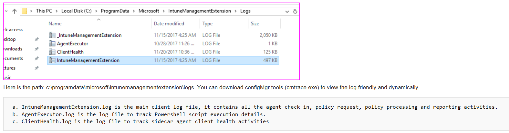

---
# required metadata

title: Understand Microsoft Intune management extension
description: Understand Microsoft Intune management extension for Windows.
keywords:
author: Erikre
ms.author: erikre
manager: dougeby
ms.date: 04/17/2025
ms.topic: how-to
ms.service: microsoft-intune
ms.subservice: apps
ms.localizationpriority: high
ms.assetid: 

# optional metadata

#ROBOTS:
#audience:
ms.reviewer: bryanke
ms.suite: ems
search.appverid: MET150
#ms.tgt_pltfrm:
ms.custom: intune-azure
ms.collection:
- tier1
- M365-identity-device-management
- Windows
- highpri
- FocusArea_Apps_Win32
---

# Intune management extension for Windows

The Intune Management Extension (IME) is installer agent. The management extension enhances Windows device management (MDM). The Intune management extension supplements the standard Windows MDM feature by enabling advanced device management capabilities.

> [!NOTE]
> For information about PowerShell scripts, see [Use PowerShell scripts on Windows 10/11 devices in Intune](../apps/powershell-scripts.md).

> [!IMPORTANT]
> To support expanded functionality and bug fixes, use .NET Framework 4.7.2 or higher with the Intune Management Extension on Windows clients. If a Windows client continues to use an earlier version of the .NET Framework, the Intune Management Extension continues to function. The .NET Framework 4.7.2 is available from Windows Update as of July 10, 2018, which is included in Win10 1809 (RS5) and newer. Note that multiple versions of the .NET Framework versions can coexist on a device.

This feature applies to:

- Windows 10 and later (excluding Windows 10 Home and Windows devices running in S mode).

> [!NOTE]
> Once the Intune management extension prerequisites are met, the Intune management extension is installed automatically when a PowerShell script or Win32 app, Microsoft Store apps, Custom compliance policy settings or proactive remediations is assigned to the user or device. For more information, see Intune Management Extensions [prerequisites](../apps/intune-management-extension.md#prerequisites).

## Prerequisites

The Intune management extension has the following prerequisites. Once they're met, the Intune management extension installs automatically when a PowerShell script or Win32 app is assigned to the user or device.

- Devices running Windows 10 version 1607 or later. If the device is enrolled using [bulk auto-enrollment](../enrollment/windows-bulk-enroll.md), devices must run Windows 10 version 1709 or later. The Intune management extension isn't supported on Windows 10 in S mode, as S mode doesn't allow running nonstore apps.

- Devices joined to Microsoft Entra ID, including:

  - Microsoft Entra hybrid joined: Devices joined to Microsoft Entra ID, and also joined to on-premises Active Directory (AD). See [Plan your Microsoft Entra hybrid join implementation](/azure/active-directory/devices/hybrid-azuread-join-plan) for guidance.

  - Microsoft Entra registered/Workplace joined (WPJ): Devices [registered](/azure/active-directory/user-help/user-help-register-device-on-network) in Microsoft Entra ID, see [Workplace Join as a seamless second factor authentication](/windows-server/identity/ad-fs/operations/join-to-workplace-from-any-device-for-sso-and-seamless-second-factor-authentication-across-company-applications#BKMK_DRS) for more information. Typically, these are Bring Your Own Device (BYOD) devices which have had a work or school account added via **Settings** > **Accounts** > **Access work or school**.

- Devices enrolled in Intune, including:

  - Devices enrolled in a group policy (GPO). See [Enroll a Windows device automatically using Group Policy](/windows/client-management/mdm/enroll-a-windows-10-device-automatically-using-group-policy) for guidance.

  - Devices manually enrolled in Intune, which is when:

    - [Auto-enrollment to Intune](../enrollment/quickstart-setup-auto-enrollment.md) is enabled in Microsoft Entra ID. Users sign in to devices using a local user account, and manually join the device to Microsoft Entra ID. Then, they sign in to the device using their Microsoft Entra account.

    OR  

    - User signs in to the device using their Microsoft Entra account, and then enrolls in Intune.

  - Co-managed devices that use Configuration Manager and Intune. When installing Win32 apps, make sure the **Apps** workload is set to **Pilot Intune** or **Intune**. PowerShell scripts will be run even if the **Apps** workload is set to **Configuration Manager**. The Intune management extension will be deployed to a device when you target a PowerShell script to the device. Remember, the device must be a Microsoft Entra ID or Microsoft Entra hybrid joined device. And, it must be running Windows 10 version 1607 or later. See the following articles for guidance:
  
    - [What is co-management](/configmgr/comanage/overview)
    - [Client apps workload](/configmgr/comanage/workloads#client-apps)
    - [How to switch Configuration Manager workloads to Intune](/configmgr/comanage/how-to-switch-workloads)

> [!NOTE]
> For information about using Window 10/11 VMs, see [Using Windows 10/11 virtual machines with Intune](../fundamentals/windows-10-virtual-machines.md).

## Understand Intune management extension agent installation

For devices that meet the prerequisites, the Intune management extension is installed automatically when certain features are assigned to a user or device. Installation commonly occurs when the following features are assigned:

- [PowerShell scripts](../apps/powershell-scripts.md)
- [Remediations](../fundamentals/remediations.md)
- [Discovery scripts for custom compliance](../protect/compliance-custom-script.md)
- [Win32 apps](../apps/apps-win32-add.md)
- [Endpoint analytics](../../analytics/settings.md)
- [Remote Help](../fundamentals/remote-help-windows.md)
- [Managed Installers in Intune](../protect/endpoint-security-app-control-policy.md)
- [Update Windows BIOS using configuration MDM policy](../configuration/bios-configuration.md)

> [!NOTE]
> For information about how the IME is rolled out and updated, see [Service information for Microsoft Intune release updates](../fundamentals/intune-service-servicing-information.md).

The agent is installed at `C:\ProgramData\Microsoft\IntuneManagementExtension\Logs` when applicable and doesn't appear in the start menu on Windows devices. The agent appears as **IntuneManagementExtension** under **Services** in **Task Manager** when running on Windows devices. 

### Intune management extension functionality 

- The IME silently authenticates with Intune services before checking in to receive assigned installations for the Windows device. 
- The IME checks for new or updated installations with Intune services usually every 8 hours. This check-in process is independent of the MDM check-in. 

### Manually initiate an Intune management IME check-in from a Windows device

On a Windows Device that has the IME installed, open **Company Portal**, select **Settings** > **Sync**. This initiates an MDM check-in as well as an IME check-in. 

Alternatively, you can open **Task Manager**, find the service **IntuneManagementExtension**, right-click and select **Restart**. The IntuneManagementExtension service restarts immediately, which will initiate a check-in with Intune. 

> [!NOTE]
> The **Sync** actions from either the **Settings** app (Windows 10 or later), or **Devices** in Microsoft Intune admin center, initiates an MDM check-in and doesn't force an IME check-in. 

### Intune management extension removal

There are several conditions that can cause the IME to be removed from the device, For example: 

- Shell scripts are no longer assigned to the device. 
- The Windows device is no longer managed. 
- The IME is in an irrecoverable state for more than 24 hours (device-awake time). 

## Common issues and resolutions

### Issue: Intune management extension doesn't download.

**Possible resolutions**:

- The device isn't joined to Microsoft Entra ID. Be sure the devices meet the [prerequisites](#prerequisites) (in this article).
- There are no PowerShell scripts or Win32 apps assigned to the groups that the user or device belongs.
- The device can't check in with the Intune service. For example, there's no internet access, no access to Windows Push Notification Services (WNS), and so on.
- The device is in S mode. The Intune management extension isn't supported on devices running in S mode.

To see if the device is auto-enrolled, you can:

  1. Go to **Settings** > **Accounts** > **Access work or school**.
  2. Select the joined account > **Info**.
  3. Under **Advanced Diagnostic Report**, select **Create Report**.
  4. Open the `MDMDiagReport` in a web browser.
  5. Search for the **MDMDeviceWithAAD** property. If the property exists, the device is auto-enrolled. If this property doesn't exist, then the device isn't auto-enrolled.

[Enable Windows automatic enrollment](../enrollment/windows-enroll.md#enable-windows-automatic-enrollment) includes the steps to configure automatic enrollment in Intune.

## Intune management extension logs

IME logs on the client machine are typically in `C:\ProgramData\Microsoft\IntuneManagementExtension\Logs`. You can use [CMTrace.exe](/configmgr/core/support/cmtrace) to view these log files.

  

In addition, you can use the log file *AppWorkload.log* to help troubleshoot and analyze Win32 app management events on the client. This log file contains all logging information related to app deployment activities conducted by the IME.

IME log related files:

**IntuneManagementExtension.log**: This is the main log file. It contains all the IME check-ins, policy requests, policy processing and reporting activities. 
**AgentExecutor.log**: This file tracks PowerShell script executions (deployed by Intune). 
**AppActionProcessor.log**: This file tracks detection and applicability checks actions for assigned apps 
**AppWorkload.log**:  This file helps troubleshoot and analyze Win32 app deployment activities. 
**ClientCertCheck.log**: This file tracks device client certificate checks 
**ClientHealth.log**: This file tracks the health of the Intune management extension. 
**DeviceHealthMonitoring.log**: This file tracks the health of hardware readiness, device inventory and other data collectors.  
**HealthScripts.log**: This file tracks the health of remediations that run on a regular schedule 
**Sensor.log**: This file tracks the health of the Endpoint analytics data collector, including boot performance, app reliability and more. 
**Win32AppInventory.log**:** This file tracks the health of the app inventory collector. 

## Next steps

- The app you've created is displayed in the apps list. You can now assign it to the groups you choose. For more information, see [Assign apps to groups with Microsoft Intune](../apps/apps-deploy.md). 
- Learn more about the ways in which you can monitor the properties and assignment of your app. For more information, see [Monitor app information and assignments with Microsoft Intune](../apps/apps-monitor.md). 
- Learn more about the context of your app in Intune. For more information, see [Overview of the Microsoft Intune mobile device management (MDM) lifecycle](../fundamentals/device-lifecycle.md). 