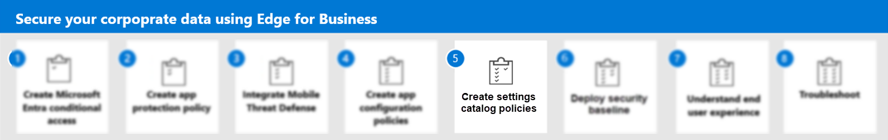

---
# required metadata

title: Step 4. Create app configuration policies for Microsoft Edge for Business
titleSuffix:
description: Step 4. Create app configuration policy for Microsoft Edge for Business.
keywords:
author: Erikre
ms.author: erikre
manager: dougeby
ms.date: 03/26/2024
ms.topic: how-to
ms.service: microsoft-intune
ms.subservice: apps
ms.localizationpriority: high

# optional metadata

#audience:
#ROBOTS: 
ms.reviewer: samarti
ms.suite: ems
search.appverid: MET150
#ms.tgt_pltfrm:
ms.custom: 
ms.collection:
- tier1
- highpri
- highseo
- FocusArea_Apps_AppManagement
---

# Step 4. Create app configuration policies for Microsoft Edge for Business

Microsoft Edge for iOS, Android, and Windows supports app settings that allow Microsoft Intune administrators to customize the behavior of the app and implement browser configuration.

App configuration can be delivered either through the mobile device management (MDM) OS channel on enrolled devices [Managed App Configuration](https://developer.apple.com/library/content/samplecode/sc2279/Introduction/Intro.html) channel for iOS or the [Android in the Enterprise](https://developer.android.com/work/managed-configurations) channel for Android or through the MAM (Mobile Application Management) channel. 

Microsoft Edge for iOS and Android supports the following configuration scenarios:

- Only allow work or school accounts
- General app configuration settings
- Data protection settings
- Additional app configuration for managed devices

> [!IMPORTANT]
> For configuration scenarios that require device enrollment on Android, the devices must be enrolled in Android Enterprise and Microsoft Edge for Android must be deployed via the Managed Google Play store. For more information, see [**Set up enrollment of Android Enterprise personally-owned work profile devices**](../enrollment/android-work-profile-enroll.md) and [**Add app configuration policies for managed Android Enterprise devices**](app-configuration-policies-use-android.md).

You'll now review the following key items that need to be configured. Then, you'll create an app configuration policy in Microsoft Intune admin center.

## Microsoft Edge app configuration values

Reference the following table when setting app configuration values for Microsoft Edge:

| Key | Value | Example | Notes |
|---|---|---|---|
| com.microsoft.intune.mam.managedbrowser.PasswordSSO | TRUE |  |  |
| com.microsoft.intune.mam.managedbrowser.disableShareUsageData | TRUE |  |  |
| com.microsoft.intune.mam.managedbrowser.disabledFeatures | Option include: <ul><li>`password`</li><li>`inprivate`</li><li>`autofill`</li><li>`translator`</li><li>`drop`</li><li>`developer tools`</li></ul> | `password|inprivate|autofill|translator|drop|developer tools` | To disable a feature, include it as part of the value. |
| com.microsoft.intune.mam.managedbrowser.disableImportPasswords | TRUE |  |  |
| com.microsoft.intune.mam.managedbrowser.SmartScreenEnabled | TRUE |  |  |
| com.microsoft.intune.mam.managedbrowser.account.syncDisabled | TRUE |  |  |
| com.microsoft.intune.IntuneMAMOnly.AdvancedEncryption | enabled |  |  |

For related information, see [Manage Microsoft Edge on iOS and Android with Intune](manage-microsoft-edge.md).

### Configure the app configuration policy for Android and iOS

Use the following steps to configure the app:

1. Navigate to the [Microsoft Intune admin center](https://go.microsoft.com/fwlink/?linkid=2109431).

2. Select **Apps** > **Configuration** > **Create** > **Managed apps**.

3. On the **Create app configuration policy**, pane enter the following information:

    - **Name**: Secure Enterprise Browser ACP
    - **Description**: Microsoft Edge for Business ACP Configuration - Mobile
    - **Target Policy to**: Selected apps

    :::image type="content" alt-text="Apps - App configuration policies - Microsoft Intune admin center." source="./media/securing-data-edge-for-business/securing-data-edge-for-business49.png" lightbox="./media/securing-data-edge-for-business/securing-data-edge-for-business49.png":::

4. Click **Select public apps** to display the **Selected apps to target** pane.

5. Select the **Microsoft Edge** app for **iOS/iPadOS** and click **Select**.

    > [!NOTE]
    > You will need to follow the same steps for both Android. iOS and Windows. However, the steps for Windows differ after a certain point in the process. For this reason, separate instructions for Windows are included later in the documentation.

6. Select **Next** to display the **Settings catalog** step. Don't change settings on the **Settings catalog** step.

7. Select **Next** to display the **Settings** step.

8. Enter the **name** and **value** for each configuration setting you want to add. For details, see the [Microsoft Edge app configuration values](#microsoft-edge-app-configuration-values) table.
    
    For example, set **com.microsoft.intune.mam.managedbrowser.PasswordSSO** to `TRUE`.

    :::image type="content" alt-text="Apps  -  App configuration policies  -  Create app configuration policy- Microsoft Intune admin center" source="./media/securing-data-edge-for-business/securing-data-edge-for-business50.png" lightbox="./media/securing-data-edge-for-business/securing-data-edge-for-business50.png":::
    
9. Review each value and select **Next**.

10. Add a **Scope tag** and select **Next**.

11. Review Assignment and select **Next**.

12. Select **Review + create**.

### Configure the App Configuration policy for Windows 

Use the following steps to configure the app:

1. Navigate to the [Microsoft Intune admin center](https://go.microsoft.com/fwlink/?linkid=2109431).

2. Select **Apps** > **Configuration** > **Create** > **Managed apps**.

3. On the **Create app configuration policy**, pane enter the following information:

    - **Name**: Secure Enterprise Browser ACP - Windows
    - **Description**: Microsoft Edge for Business ACP Configuration - Windows
    - **Target Policy to**: Selected apps

4. Select **Select public apps** to display the **Selected apps to target** pane.

5. Select the **Microsoft Edge** app for **Windows* and click **Select**.

6. Select **Next** to display the **Settings catalog** step.
7. Click **Add settings** to display the **Settings picker** pane.
8. Expand Microsoft Edge or you can type the setting on the search menu > select **Password manager and protection** select the following options:
   - **Allow users to be alerted if their passwords are found to be unsafe**
   - **Configure password protection warning trigger**
9. Type on the **Search for a setting** the following **StartUp** and select **Microsoft Edge\StartUp, home page and new tab page** select the following options:
   - **Configure the home page URL**
   - **Configure the new tab page URL**
   - **Hide App Launcher on Microsoft Edge new tab page**
10. Under Microsoft Edge, configure each item for this example by entering the following details:
    - **Hide App Launcher on Microsoft Edge new tab page:** Enabled
    - **Configure the new tab url:** *Add a URL, such as `https://www.contoso.com`.*
    - **Configure the new tab page url:** *Add a URL, such as `https://www.contoso.com`.*
    - **Allow users to be alerted if their passwords are found to be unsafe:** Enabled
   -  **Configure password protection warning trigger:** Enabled
11. Select **Next** to display the **Assignments** page.
12. Click **Select groups to include**.
13. Select a group in the **Select groups to include** pane and click **Select**.
14. Click **Select groups to exclude** to display the related pane.
15. Choose the groups you want to exclude and then click **Select**.
    >[!NOTE]
    >When adding a group, if any other group has already been included for a given assignment type, it is pre-selected and unchangeable for other include assignment types. Therefore, that group that has been used, cannot be used as an excluded group.
18. Select **Next** to display the **Review + create** page.
19. Select **Create** to add the app configuration policy to Intune.

You have now created an App Configuration Policy for Windows and Microsoft Edge.

## Next step

Continue with [Step 5](mamedge-5-end-user-experience.md) to understand the end user experience for Microsoft Edge for Business.