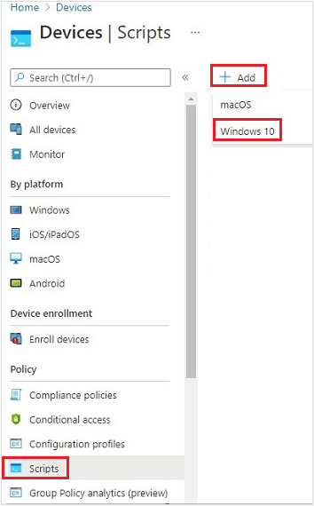
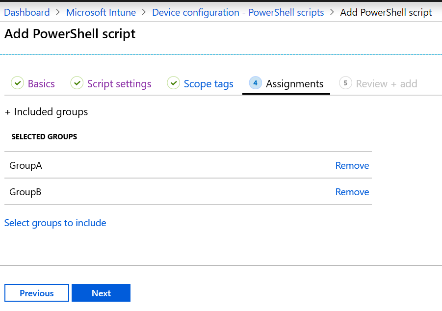

# Use PowerShell Scripts on Windows Devices in Intune

[!INCLUDE [windows-10-support](../includes/windows-10-support.md)]

Use the Microsoft Intune management extension to upload PowerShell scripts in Intune. Then, run these scripts on Windows devices. The management extension enhances MDM, and makes it easier to move to modern management.

> [!NOTE]
> For information about the Intune management extension for Windows, see [Intune management extension for Windows](../apps/intune-management-extension.md).

## Before you begin

- Scripts set to user context with administrator rights run PowerShell by default under administrator privilege.

- End users aren't required to sign in to the device to execute PowerShell scripts.

- The Intune management extension checks after every reboot for any new scripts or changes. After you assign the policy to the Microsoft Entra groups, the PowerShell script runs, and the run results are reported. Once the script executes, it doesn't execute again unless there's a change in the script or policy. If the script fails, the Intune management extension retries the script three times for the next three consecutive Intune management extension check-ins.

- PowerShell scripts assigned to the device run for every new user that signs in, except on multi-session SKUs where user check-in is disabled.

- PowerShell scripts are executed before Win32 apps run. In other words, PowerShell scripts execute first. Then, Win32 apps execute.

- PowerShell scripts time out after 30 minutes.

> [!IMPORTANT]
> Best practices for privacy awareness when using PowerShell scripts and Remediation scripts include:
> - Don't include any type of sensitive information in scripts (such as passwords)
> - Don't include personal data in scripts
> - Don't use scripts to collect personal data from devices
> - Always follow privacy best practices
>
> For related information, see [Remediations](../fundamentals//remediations.md).

## Prerequisites

- Intune management extension installs automatically when a PowerShell script app is assigned to the user or device. For more information, see [Intune management extension for Windows](../apps/intune-management-extension.md).

> [!IMPORTANT]
> Scripts deployed to clients running the Intune management extension fails to run if the device's system clock is exceedingly out of date by months or years. Once the system clock is brought up to date, script runs as expected.

## Create a script policy and assign it

1. Sign in to the [Microsoft Intune admin center](https://go.microsoft.com/fwlink/?linkid=2109431).
2. Select **Devices** > **Scripts and remediations** > **Platform scripts** > **Add** > **Windows 10 and later**.

    

3. In **Basics**, enter the following properties, and select **Next**:
    - **Name**: Enter a name for the PowerShell script.
    - **Description**: Enter a description for the PowerShell script. This setting is optional, but recommended.
4. In **Script settings**, enter the following properties, and select **Next**:
    - **Script location**: Browse to the PowerShell script. The script must be less than 200 KB (ASCII).
    - **Run this script using the logged on credentials**: Select **Yes** (default) to run the script with the user's credentials on the device. Choose **No** to run the script in the system context. Many administrators choose **Yes**. If the script is required to run in the system context, choose **No**.
    - **Enforce script signature check**: Select **Yes** (default) if the script must be signed by a trusted publisher. Select **No** if there isn't a requirement for the script to be signed.
    - **Run script in 64-bit PowerShell host**: Select **Yes** to run the script in a 64-bit PowerShell host on a 64-bit client architecture. Select **No** (default) runs the script in a 32-bit PowerShell host.

      When setting to **Yes** or **No**, use the following table for new and existing policy behavior:

      | Run script in 64-bit host | Client architecture | New script | Existing policy script |
      | --- | --- | --- | --- |
      | No | 32-bit  | 32-bit PowerShell host supported | Runs only in 32-bit PowerShell host, which works on 32-bit and 64-bit architectures. |
      | Yes | 64-bit | Runs script in 64-bit PowerShell host for 64-bit architectures. When ran on 32-bit, the script runs in a 32-bit PowerShell host. | Runs script in 32-bit PowerShell host. If this setting changes to 64-bit, the script opens (it doesn't run) in a 64-bit PowerShell host, and reports the results. When ran on 32-bit, the script runs in 32-bit PowerShell host. |

5. Select **Scope tags**. Scope tags are optional. [Use role-based access control and scope tags for distributed IT](../fundamentals/scope-tags.md) has more information.

    To add a scope tag:

    - Choose **Select scope tags** > select an existing scope tag from the list > **Select**.

    - When finished, select **Next**.

6. Select **Assignments** > **Select groups to include**. An existing list of Microsoft Entra groups is shown.

    - Select one or more groups that include the users whose devices receive the script. Choose **Select**. The groups you chose are shown in the list, and receive your policy.

        > [!NOTE]
        > PowerShell scripts in Intune can be targeted to Microsoft Entra device security groups or Microsoft Entra user security groups.
        > However, when targeting workplace joined (WPJ) devices, only Microsoft Entra device security groups can be used (user targeting is ignored).

    - Select **Next**.

        

7. In **Review + add**, a summary is shown of the settings you configured. Select **Add** to save the script. When you select **Add**, the policy is deployed to the groups you chose.

### Scenario - Failure to run script

**8 AM**

- Check in
- Run script **ConfigScript01**
- Script fails

**9AM**

- Check in
- Run script **ConfigScript01**
- Script fails (retry count = 1)

**10 AM**

- Check in
- Run script **ConfigScript01**
- Script fails (retry count = 2)

**11 AM**

- Check in
- Run script **ConfigScript01**
- Script fails (retry count = 3)

**12 PM**

- Check in
- No other attempts are made to run **ConfigScript01**script.
- If no other changes are made to the script, then no other attempts are made to run the script.

## Monitor run status

You can monitor the run status of PowerShell scripts for users and devices in the portal.

In **PowerShell scripts**, select the script to monitor, choose **Monitor**, and then choose one of the following reports:

- **Device status**
- **User status**

[!INCLUDE [platform-scripts-export-api](../includes/platform-scripts-export-api.md)]

## Delete a script

In **PowerShell scripts**, right-click the script, and select **Delete**.

## Common issues and resolutions

### Issue: PowerShell scripts don't run

**Possible resolutions**:

- The PowerShell scripts don't run at every sign in. They run:

  - When the script is assigned to a device
  - If you change the script, upload it, and assign the script to a user or device

    > [!TIP]
    > The **Microsoft Intune Management Extension** is a service that runs on the device, just like any other service listed in the Services app (services.msc). After a device reboots, this service might restart, and check for any assigned PowerShell scripts with the Intune service. If the **Microsoft Intune Management Extension** service is set to Manual, then the service might not restart after the device reboots.

- Be sure devices are [joined to Microsoft Entra ID](/azure/active-directory/user-help/user-help-join-device-on-network). Devices that are only [registered](/azure/active-directory/user-help/user-help-register-device-on-network) with your workplace or organization in Microsoft Entra ID don’t receive the scripts.
- Confirm the Intune management extension is downloaded to `%ProgramFiles(x86)%\Microsoft Intune Management Extension`.
- Scripts don't run on Surface Hubs or Windows in S mode.
- Review the logs for any errors. See [Intune management extension logs](../apps/intune-management-extension.md#intune-management-extension-logs) (in this article).
- For possible permission issues, be sure the properties of the PowerShell script are set to `Run this script using the logged on credentials`. Also check that the signed in user has the appropriate permissions to run the script.

- To isolate scripting problems, you can:

  - Review the PowerShell execution configuration on your devices. See the [PowerShell execution policy](/powershell/module/microsoft.powershell.security/set-executionpolicy) for guidance.
  - Run a sample script using the Intune management extension. For example, create the `C:\Scripts` directory, and give everyone full control. Run the following script:

    ```powershell
    write-output "Script worked" | out-file c:\Scripts\output.txt
    ```

    If it succeeds, output.txt should be created, and should include the "Script worked" text.

  - To test script execution without Intune, run the scripts in the System account using the [psexec tool](/sysinternals/downloads/psexec) locally:

    `psexec -i -s`

  - If the script reports that it succeeded, but it didn't actually succeed, then it's possible your antivirus service might be sandboxing AgentExecutor. The following script always reports a failure in Intune. As a test, you can use this script:

    ```powershell
    Write-Error -Message "Forced Fail" -Category OperationStopped
    mkdir "c:\temp"
    echo "Forced Fail" | out-file c:\temp\Fail.txt
    ```

    If the script reports a success, look at the `AgentExecutor.log` to confirm the error output. If the script executes, the length should be >2.

  - To capture the `.error` and `.output` files, the following snippet executes the script through AgentExecutor to PowerShell x86 (`C:\Windows\SysWOW64\WindowsPowerShell\v1.0`). It keeps the logs for your review. Remember, the Intune Management Extension cleans up the logs after the script executes:

    ```powershell
    $scriptPath = read-host "Enter the path to the script file to execute"
    $logFolder = read-host "Enter the path to a folder to output the logs to"
    $outputPath = $logFolder+"\output.output"
    $errorPath =  $logFolder+"\error.error"
    $timeoutPath =  $logFolder+"\timeout.timeout"
    $timeoutVal = 60000
    $PSFolder = "C:\Windows\SysWOW64\WindowsPowerShell\v1.0"
    $AgentExec = "C:\Program Files (x86)\Microsoft Intune Management Extension\agentexecutor.exe"
    &$AgentExec -powershell  $scriptPath $outputPath $errorPath $timeoutPath $timeoutVal $PSFolder 0 0
    ```

### Issue: Why are scripts running even though Windows is no longer managed?

When a Windows device with assigned scripts is no longer managed, the IME isn't removed immediately. The IME detects that the Windows isn't managed at the next IME check-in (usually every 8 hours) and cancels script-runs. In the meantime, any locally stored scripts could run. When the IME is unable to check in, it retries checking in for up to 24 hours (device-awake time) and then removes itself from the Windows device.

## Next steps

[Monitor](../configuration/device-profile-monitor.md) and [troubleshoot](../configuration/device-profile-troubleshoot.md) your profiles.
