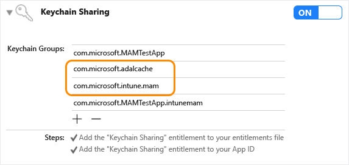

# Stage 3: Intune SDK Integration Into Your iOS App

> [!NOTE]
> This guide is divided into several distinct stages. Start by reviewing [Plan the Integration](./app-sdk-ios-phase1.md).

## Stage Goals

- Download the Intune App SDK.
- Learn what files are included in the Intune App SDK.
- Reference the Intune App SDK in your application.
- Confirm that the Intune App SDK is properly included in your build.
- Register new accounts for MAM management after authenticating with MSAL.
- To remove corporate data, unregister accounts on sign out
- (Recommended) Incorporate MAM logging into your app.

## Prerequisites

- You need a macOS computer, with Xcode 16.0 or later.

- Your app must be targeted for iOS 16.0 or later.

- Review the [Intune App SDK for iOS License Terms](https://github.com/msintuneappsdk/ms-intune-app-sdk-ios/blob/master/Microsoft%20License%20Terms%20Intune%20App%20SDK%20for%20iOS.pdf). Print and retain a copy of the license terms for your records. By downloading and using the Intune App SDK for iOS, you agree to such license terms. If you don't accept them, don't use the software.

- Download the files for the Intune App SDK for iOS on [GitHub](https://github.com/msintuneappsdk/ms-intune-app-sdk-ios).

## What's in the SDK Repository

* **IntuneMAMSwift.xcframework**: The Intune App SDK dynamic framework. It's recommended that you link this framework to your app/extensions to enable Intune client application management. However, some developers might prefer the performance benefits of the static framework (IntuneMAMStatic.xcframework).

* **IntuneMAMStatic.xcframework**: The Intune App SDK static framework. Developers might choose to link the static framework instead of the dynamic framework. Because the executable code from a static framework is embedded directly into the app/extension binary at build time, there are some launch-time performance benefits to using the static library. However, if your app includes any extensions, linking the static framework to the app and extensions results in a larger app bundle size. The executable code is embedded into each app/extension binary. In contrast, when using the dynamic framework, apps and extensions can share the same Intune SDK binary, resulting in a smaller app size.

* **IntuneMAMSwiftStub.xcframework**: The Intune App SDK Swift Stub framework. This framework is a required dependency of both IntuneMAMSwift.xcframework and IntuneMAMStatic.xcframework, which apps/extensions must link.

* **IntuneMAMConfigurator**: A tool used to configure the app or extension's Info.plist with the minimum required changes for Intune management. Depending on the functionality of your app or extension, you might need to make more manual changes to the Info.plist.

* **libIntuneMAMSwift.xcframework**: The Intune App SDK static library. This variant of the Intune MAM iOS SDK is deprecated and removed in a future update. We recommend that you don't link the static library, and instead link your app/extensions to either the dynamic framework (IntuneMAMSwift.xcframework) or static framework (IntuneMAMStatic.xcframework) previously mentioned.

* **IntuneMAMResources.bundle**: A resource bundle that contains resources that the SDK relies on. The resources bundle is required only for apps that integrate the deprecated static library (libIntuneMAMSwift.xcframework), and removes it in a future update.

## How the Intune App SDK works

The objective of the Intune App SDK for iOS is to add management capabilities to iOS applications with minimal code changes. The fewer the code changes the less time to market, but without affecting the consistency and stability of your mobile application.

### Process flow

The following diagram provides the Intune App SDK for iOS process flow:

:::image type="content" source="media/app-sdk-ios/intune-app-sdk-ios-process-flow.svg" alt-text="High-level architectural diagram for Microsoft Intune." lightbox="media/app-sdk-ios/intune-app-sdk-ios-process-flow.png" :::

## Build the SDK into your mobile app

> [!IMPORTANT]
> Intune regularly releases updates to the Intune App SDK. Regularly check the [Intune App SDK for iOS](https://github.com/msintuneappsdk/ms-intune-app-sdk-ios) for updates and incorporate into your software development release cycle  to ensure your apps support the latest App Protection Policy settings.

To enable the Intune App SDK, follow these steps:

1. Link either `IntuneMAMSwift.xcframework` or `IntuneMAMStatic.xcframework` to your target: Drag the xcframework bundle to the **Frameworks, Libraries, and Embedded Content** list of the project target. Repeat these steps for `IntuneMAMSwiftStub.xcframework`. For your main app, select "Embed & Sign" in the "Embed" column for both the xcframeworks added. For any extensions, select "Do Not Embed."

    :::image type="content" source="media/app-sdk-ios/intune-app-sdk-ios-linked-framework.png" alt-text="Intune App SDK iOS Framework: Xcode Frameworks, Libraries, and Embedded Content sample":::

2. Add these iOS frameworks to the project:
   -  MessageUI.framework
   -  Security.framework
   -  CoreServices.framework
   -  SystemConfiguration.framework
   -  libsqlite3.tbd
   -  libc++.tbd
   -  ImageIO.framework
   -  LocalAuthentication.framework
   -  AudioToolbox.framework
   -  QuartzCore.framework
   -  WebKit.framework
   -  MetricKit.framework

3. Enable keychain sharing (if it isn't already enabled) by choosing **Capabilities** in each project target and enabling the **Keychain Sharing** switch. Keychain sharing is required for you to proceed to the next step.

   > [!NOTE]
   > Your provisioning profile needs to support new keychain sharing values. The keychain access groups should support a wildcard character. You can check this by opening the .mobileprovision file in a text editor, searching for **keychain-access-groups**, and ensuring that you have a wildcard character. For example:
   >
   >  ```xml
   >  <key>keychain-access-groups</key>
   >  <array>
   >  <string>YOURBUNDLESEEDID.*</string>
   >  </array>
   >  ```

4. After you enable keychain sharing, follow the steps to create a separate access group in which the Intune App SDK stores its data. You can create a keychain access group by using the UI or by using the entitlements file. If you're using the UI to create the keychain access group, make sure to follow these steps:

    1. If your mobile app doesn't have any keychain access groups defined, add the app's bundle ID as the **first** group.

    1. Add the shared keychain group `com.microsoft.intune.mam` to your existing access groups. The Intune App SDK uses this access group to store data.

    1. Add `com.microsoft.adalcache` to your existing access groups.

       
       > [!NOTE]
       > If you configured MSAL to use a custom keychain access group rather than the default of `com.microsoft.adalcache`, you don't need to specify this keychain access group here. Instead, specify the custom keychain group. You should also [configure Intune](#configure-settings-for-the-intune-app-sdk) to use the same custom access group via the ADALCacheKeychainGroupOverride setting within the IntuneMAMSettings Info.plist dictionary.

    1. If you're editing the entitlements file directly, rather than using the Xcode UI to create the keychain access groups, prepend the keychain access groups with `$(AppIdentifierPrefix)` (Xcode handles this automatically). For example:

       - `$(AppIdentifierPrefix)com.microsoft.intune.mam`
       - `$(AppIdentifierPrefix)com.microsoft.adalcache`

       > [!NOTE]
       > An entitlements file is an XML file that's unique to your mobile application. It's used to specify special permissions and capabilities in your iOS app. If your app didn't previously have an entitlements file, enabling keychain sharing (step 3) should have caused Xcode to generate one for your app. Ensure the app's bundle ID is the first entry in the list.

5. Include each protocol that your app passes to `UIApplication canOpenURL` in the `LSApplicationQueriesSchemes` array of your app's Info.plist file. For each protocol listed in this array, add a copy of the protocol appended with `-intunemam` to the array. Also, add these values to the array: `http-intunemam`, `https-intunemam`, `microsoft-edge-http-intunemam`, `microsoft-edge-https-intunemam`,  `smart-ns`,  `zips`,  `lacoonsecurity`,  `wandera`,  `lookoutwork-ase`,  `skycure`,  `betteractiveshield`,  `smsec`, `mvisionmobile`, `scmx`, and `intunemam-mtd`. If your app uses the mailto: protocol, also add `ms-outlook-intunemam` to the array. Save your changes before proceeding to the next step.

   If the app runs out of space in its LSApplicationQueriesSchemes list, it can remove the "-intunemam" schemes for apps that are known to also implement the Intune MAM SDK. When the app removes  "scheme-intunemam" from the LSApplicationQueriesSchemes list, `canOpenURL()` can return incorrect responses for those schemes. To fix this problem, call `[IntuneMAMPolicy isURLAllowed:url isKnownManagedAppScheme:YES]` for that scheme instead. This call returns `NO` if the policy blocks the URL from being opened. If it returns true, the app can call `canOpenURL()` with an empty identity to determine if the url can be opened. For example:

   ```objc
   BOOL __block canOpen = NO;
   if([policy isURLAllowed:urlForKnownManagedApp isKnownManagedAppScheme:YES])
   {
       [[IntuneMAMPolicyManager instance] setCurrentThreadAccountId:"" forScope:^{
       canOpen = [[UIApplication sharedApplication] canOpenURL:urlForKnownManagedApp];
       }];
   }
   ```

6. If your app doesn't use FaceID already, ensure the [NSFaceIDUsageDescription Info.plist key](https://developer.apple.com/library/archive/documentation/General/Reference/InfoPlistKeyReference/Articles/CocoaKeys.html#//apple_ref/doc/uid/TP40009251-SW75) is configured with a default message. This step is required so iOS can let the user know how the app intends to use FaceID. An Intune app protection policy setting allows for FaceID to be used as a method for app access when configured by the IT admin.

7. Use the IntuneMAMConfigurator tool that is included in the [SDK repo](https://github.com/msintuneappsdk/ms-intune-app-sdk-ios) to finish configuring your app's Info.plist. The tool has three parameters:

   |Property|How to use it|
   |---------------|--------------------------------|
   |- i |  `<Path to the input plist>` |
   |- e | `<Path to the entitlements file>` |
   |- o |  (Optional) `<Path to the output plist>` |

   If the '-o' parameter isn't specified, the input file is modified in-place. The tool is idempotent, and should be rerun whenever you make changes to the app's Info.plist or entitlements. You should also download and run the latest version of the tool when updating the Intune SDK, in case Info.plist config requirements changed in the latest release.

> [!NOTE]
> If you have a SwiftUI app, ensure that `UISceneConfigurations` dictionary within the `UIApplicationSceneManifest` in the Info.pist file isn't missing or empty. Failure to configure this setting can prevent the Intune SDK from protecting your app despite app protection policies being applied successfully.
> If you don't have a specific value set for the `UISceneConfigurations` then you can use this default configuration:
   >
   >  ```xml
   >  <key>UISceneConfigurations</key>
   >  <dict>
   >  <key>UIWindowSceneSessionRoleApplication</key>
   >  <array>
   >  <dict>
   >  <key>UISceneConfigurationName</key>
   >  <string>Default Configuration</string>
   >  <key>UISceneDelegateClassName</key>
   >  <string>$(PRODUCT_MODULE_NAME).SceneDelegate</string>
   >  </dict>
   >  </array>
   >  </dict>
   >  ```
 
### Xcode Build Settings and Capabilities
The app should have both "Strip Swift Symbols"(STRIP_SWIFT_SYMBOLS) and "Enable Bitcode"(ENABLE_BITCODE) set to NO in the Xcode build settings. If your application includes the "Enhanced Security" capability available in Xcode 26+, you MUST disable the "Authenticate pointers", and "Enable Read-only Platform Memory" options.

### Integrating a File Provider extension
File Provider extensions have certain memory requirements that might make integrating the full SDK difficult. To make it easier, there's a static library `libIntuneMAMSwiftFileProvider.xcframework`, which is a stripped down version of the SDK specifically for File Provider extensions. Note this library is for the non-UI portion of the FileProvider extension. You need to integrate the full SDK into the file-provider UI extension.

To integrate the one of these libraries with your File Provider extension, follow the steps for integrating the SDK as a static library. Make sure to include `ContainingAppBundleId` setting.

#### Integrating a Non-Replicated File Provider extension
Your app is using a Non-Replicated File Provider if it implements the NSFileProviderExtension protocol. All file providers created before iOS 16.0 are nonreplicated.

In - startProvidingItemAtURL:completionHandler: check if you should encrypt files using [[IntuneMAMPolicy instance]shouldFileProviderEncryptFiles]. Use encryptFile:forAccountId: API in IntuneMAMFileProtectionManager for actual file encryption. Also, share out a copy of the file when encryption is required since you wouldn’t want to store an encrypted copy of the file in your cloud storage.

In - importDocumentAtURL:toParentItemIdentifier:completionHandler: check whether the file is encrypted using the isFileEncrytped: API in IntuneMAMFileProtectionManager. If it is, decrypt it using the decryptFile:toCopyPath: API of IntuneMAMFileProtectionManager. In multi-identity apps, also check against the canReceiveSharedFile: API in the destination owner's IntuneMAMPolicy to determine if the owner can receive the file.

#### Integrating a Replicated File Provider extension
Your app is using a Replicated File Provider if it implements the NSFileProviderReplicatedExtension protocol (added in iOS 16.0).

In - fetchContentsForItemWithIdentifier:version:request:completionHandler: check if you should encrypt files using [[IntuneMAMPolicy instance]shouldFileProviderEncryptFiles]. Use the encryptFile:forAccountId: API in IntuneMAMFileProtectionManager for actual file encryption. Share out a copy of the file when encryption is required, because you don't want to store an encrypted copy of the file in your cloud storage.

In - createItemBasedOnTemplate:fields:contents:options:request:completionHandler: check whether the file is encrypted using the isFileEncrypted: API in IntuneMAMFileProtectionManager. If it is, decrypt it using the decryptFile:toCopyPath: API of IntuneMAMFileProtectionManager. In multi-identity apps, also check against the canReceiveSharedFile: API in the destination owner's IntuneMAMPolicy to determine if the owner can receive the file.

Anywhere that the Replicated File Provider creates and passes an NSFileProviderItem to the system, call the IntuneMAMFileProtectionManager's protectFileProviderItem:forAccountId: API with the item's owner identity. Depending on where the NSFileProviderItem object is created and persisted within your extension, you might need to do this in each of the NSFileProviderReplicatedExtension's protocol methods.

## Configure settings for the Intune App SDK

You can use the **IntuneMAMSettings** dictionary in the application's Info.plist file to set up and configure the Intune App SDK. If the IntuneMAMSettings dictionary isn't seen in your Info.plist file, you should create it.

Under the IntuneMAMSettings dictionary, you can define the following supported settings to configure the Intune App SDK.

Previous sections cover some of these settings, and some don't apply to all apps.

| Setting | Type | Definition | Required? |
|--------|------|------------|-----------|
| ADALClientId | String | The app's Microsoft Entra client identifier. | Required for all apps. |
| ADALAuthority | String | The app's Microsoft Entra authority in use. You should use your own environment where Microsoft Entra accounts are configured. For more information, see [Application configuration options](/azure/active-directory/develop/msal-client-application-configuration). | Required if the app is a custom line-of-business application built for use within a single organization / Microsoft Entra tenant. If this value is absent, the common Microsoft Entra authority is used (only supported for multitenant apps). |
| ADALRedirectUri | String | The app's Microsoft Entra redirect URI. | ADALRedirectUri or ADALRedirectScheme is required for all apps. |
| ADALRedirectScheme | String | The app's Microsoft Entra ID redirect scheme. This can be used in place of ADALRedirectUri if the application's redirect URI is in the format `scheme://bundle_id`. | ADALRedirectUri or ADALRedirectScheme is required for all apps. |
| ADALLogOverrideDisabled | Boolean | Specifies whether the SDK routes all MSAL logs (including MSAL calls from the app, if any) to its own log file. Defaults to NO. Set to YES if the app sets its own MSAL log callback. | Optional. |
| ADALCacheKeychainGroupOverride | String | Specifies the keychain group to use for the MSAL cache, instead of `"com.microsoft.adalcache"`. The system prefixes this automatically at runtime. | Optional. |
| AppGroupIdentifiers | Array of strings | Array of app groups from the app's entitlements `com.apple.security.application-groups` section. | Required if the app uses application groups. |
| ContainingAppBundleId | String | Specifies the bundle ID of the extension's containing application. | Required for iOS extensions. |
| AutoEnrollOnLaunch | Boolean | Specifies whether the app should attempt to automatically enroll on launch if an existing managed identity is detected and it hasn't yet done so. Defaults to NO.<br><br>**Note:** If no managed identity is found or no valid token is available in the MSAL cache, enrollment silently fails unless `MAMPolicyRequired` is YES. | Optional. Defaults to NO. |
| MAMPolicyRequired | Boolean | Specifies whether the app is blocked from starting if it doesn't have an Intune app protection policy. Defaults to NO.<br><br>**Note:** Apps can't be submitted to the App Store with this set to YES. When setting it to YES, `AutoEnrollOnLaunch` should also be YES. | Optional. Defaults to NO. |
| MAMPolicyWarnAbsent | Boolean | Specifies whether the app warns the user during launch if no Intune app protection policy is present.<br><br>**Note:** Users can still continue after dismissing the warning. | Optional. Defaults to NO. |
| MultiIdentity | Boolean | Specifies whether the app is multi-identity aware. For more information, see the [multi-identity documentation](./app-sdk-ios-phase5.md). | Optional. Defaults to NO. |
| MultiIdentityCancelDisabled | Boolean | Disables the cancel button on Intune conditional launch UI screens in multi-identity applications. If this isn't set to YES, the app must handle the `IntuneMAMSwitchIdentityResultCanceled` failure code. See [Switch identities](./app-sdk-ios-phase5.md#switch-identities). | Optional. Defaults to NO. |
| SafariViewControllerBlockedOverride | Boolean | Disables Intune's SafariViewController hooks to enable MSAL auth through SFSafariViewController, SFAuthSession, or ASWebAuthSession.<br><br>**Note:** A configured activity button appears only if the view is unmanaged and this is set to YES. | Optional. Defaults to NO.<br><br>**Warning:** Can cause data leakage if used incorrectly. |
| SplashIconFile<br>SplashIconFile~ipad | String | Specifies the Intune splash (startup) icon file. | Optional. |
| SplashDuration | Number | Minimum time in seconds that the Intune startup screen is shown. Defaults to 1.5. | Optional. |
| BackgroundColor | String | Specifies the background color for Intune SDK UI components. Accepts `#XXXXXX` or a hex value without the pound sign. | Optional. Defaults to system background color. |
| ForegroundColor | String | Specifies the foreground/text color for UI components. Accepts `#XXXXXX` or hex without pound sign. | Optional. Defaults to system label color. |
| AccentColor | String | Specifies the accent color for UI components (buttons, PIN box highlight). Accepts `#XXXXXX` or hex without pound sign. | Optional. Defaults to system blue. |
| SecondaryBackgroundColor | String | Specifies the secondary background color for MTD screens. Accepts `#XXXXXX` or hex without pound sign. | Optional. Defaults to white. |
| SecondaryForegroundColor | String | Specifies the secondary foreground color for MTD screens. Accepts `#XXXXXX` or hex without pound sign. | Optional. Defaults to gray. |
| SupportsDarkMode | Boolean | Specifies whether UI colors follow system Dark Mode when explicit colors aren't set. | Optional. Defaults to YES. |
| MAMTelemetryDisabled | Boolean | Specifies whether telemetry is sent to the backend. | Optional. Defaults to NO. |
| MAMTelemetryUsePPE | Boolean | Sends telemetry to PPE backend. Useful for testing apps so data doesn't mix with customer data. | Optional. Defaults to NO. |
| MaxFileProtectionLevel | String | Specifies the maximum `NSFileProtectionType` the app supports. Overrides policy if the service sends a higher level.<br><br>Possible values: `NSFileProtectionComplete`, `NSFileProtectionCompleteUnlessOpen`, `NSFileProtectionCompleteUntilFirstUserAuthentication`, `NSFileProtectionNone`.<br><br>**Notice:** With `NSFileProtectionComplete`, the app loses access to protected files ~10 seconds after the device locks, which can break components such as local databases. Apps with lock-screen UI should use `NSFileProtectionCompleteUntilFirstUserAuthentication`. | Optional. Defaults to `NSFileProtectionComplete`. |
| OpenInActionExtension | Boolean | Set to YES for Open in Action extensions. See [Sharing Data via UIActivityViewController](./app-sdk-ios-phase4.md#share-data-via-uiactivityviewcontroller). | Optional. |
| TreatAllWebViewsAsUnmanaged | Boolean | Treats all WebViews as unmanaged for cut/copy/paste enforcement. See [Displaying web content](./app-sdk-ios-phase7.md#displaying-web-content-within-an-application). | Optional. Defaults to NO. |
| WebViewHandledURLSchemes | Array of strings | URL schemes handled by the app’s WebView. | Required if your WebView handles links or JavaScript navigation. |
| DocumentBrowserFileCachePath | String | If using `UIDocumentBrowserViewController`, set a path (relative to app home directory) for decrypted managed files. | Optional. Defaults to `/Documents/`. |
| VerboseLoggingEnabled | Boolean | Enables verbose logging. | Optional. Defaults to NO. |
| FinishLaunchingAtStartup | Boolean | Required when using `[BGTaskScheduler registerForTaskWithIdentifier:]`; must be YES. | Optional. Defaults to NO. |
| ValuesToScrubFromLogging | Array of strings | Application Configuration values that should be removed from logs. Can also be set via `valuesToScrubFromLogging` on `IntuneMAMSettings`. | Optional. |

## Receive app protection policy

### Overview

To receive Intune app protection policy, apps must initiate an enrollment request with the Intune MAM service. Apps can be configured in the Intune admin center to receive app protection policy with or without device enrollment. [Mobile Application Management (MAM)](../apps/android-deployment-scenarios-app-protection-work-profiles.md#mam), allows apps to be managed by Intune without the need for the device to be enrolled in Intune mobile device management (MDM). In both cases, enrolling with the Intune MAM service is required to receive policy.

> [!Important]
> The Intune App SDK for iOS uses 256-bit encryption keys when encryption is enabled by app protection policies. All apps need to have a current SDK version to allow protected data sharing.

### Apps that already use ADAL or MSAL

> [!NOTE]
> Azure AD Authentication Library (ADAL) and Azure AD Graph API are deprecated. For more information, see [Update your applications to use Microsoft Authentication Library (MSAL) and Microsoft Graph API](https://techcommunity.microsoft.com/t5/azure-active-directory-identity/update-your-applications-to-use-microsoft-authentication-library/ba-p/1257363).

Apps that already use MSAL should call the `registerAndEnrollAccountId` method on the `IntuneMAMEnrollmentManager` instance after the user is successfully authenticated:

```objc
/*
 *  This method adds the account to the list of registered accounts.
 *  An enrollment request starts immediately.
 *  @param accountId The Entra object ID of the account to be registered with the SDK
 */

(void)registerAndEnrollAccountId:(NSString *_Nonnull)accountId;
```
On successful sign in MSAL sends back the result in MSALResult object. Use tenantProfile.identifier within MSALResult as the accountId parameter for the API.

By calling the `registerAndEnrollAccountId` method, the SDK registers the user account and attempts to enroll the app on behalf of this account. If the enrollment fails for any reason, the SDK automatically retries the enrollment 24 hours later. For debugging purposes, the app can receive [notifications](#status-result-and-debug-notifications), via a delegate, about the results of any enrollment requests.

After this API is invoked, the app can continue to function as normal. If the enrollment succeeds, the SDK notifies the user that an app restart is required. At that time, the user can immediately restart the app.

```objc
[[IntuneMAMEnrollmentManager instance] registerAndEnrollAccountId:@"3ec2c00f-b125-4519-acf0-302ac3761822"];
```

### Apps that don't use ADAL or MSAL

Apps that don't sign in the user using ADAL or MSAL can still receive app protection policy from the Intune MAM service by calling the API to have the SDK handle that authentication. Apps should use this technique when they haven't authenticated a user with Microsoft Entra ID but still need to retrieve app protection policy to help protect data. An example is if another authentication service is being used for app sign-in, or if the app doesn't support signing in at all. To do this, the application can call the `loginAndEnrollAccount` method on the `IntuneMAMEnrollmentManager` instance:

```objc
/**
 *  Creates an enrollment request, which starts immediately.
 *  If no token can be retrieved for the identity, the user is prompted
 *  to enter their credentials, after which enrollment is retried.
 *  @param identity The UPN of the account to be logged in and enrolled.
 */
 (void)loginAndEnrollAccount: (NSString *)identity;
```

By calling this method, the SDK prompts the user for credentials if no existing token can be found. The SDK then tries to enroll the app with the Intune MAM service on behalf of the supplied user account. The method can be called with "nil" as the identity. In that case, the SDK enrolls with the existing managed user on the device (if MDM), or prompts the user for a user name if no existing user is found.

If the enrollment fails, the app should consider calling this API again at a future time, depending on the details of the failure. The app can receive [notifications](#status-result-and-debug-notifications), via a delegate, about the results of any enrollment requests.

After this API is invoked, the app can continue functioning as normal. If the enrollment succeeds, the SDK notifies the user that an app restart is required.
Once the app is managed, the Microsoft Entra object ID value needs to be queried using `enrolledAccountId` in the `IntuneMAMEnrollmentManager`. Use this for all the MAM SDK APIs that the app uses for this enrolled account.

Example:

```objc
[[IntuneMAMEnrollmentManager instance] loginAndEnrollAccount:@"user@foo.com"];
```

### Let Intune handle authentication and enrollment at launch

If you want the Intune SDK to handle all authentication with ADAL/MSAL and enrollment before your app finishes launching, and your app always requires app protection policies, you don't have to use `loginAndEnrollAccount` API. You can set the following settings to YES in the IntuneMAMSettings dictionary in the app's Info.plist.

| Setting            | Type    | Definition |
|--------------------|---------|------------|
| AutoEnrollOnLaunch | Boolean | Specifies whether the app should attempt to automatically enroll on launch if an existing managed identity is detected and it hasn't yet done so. Defaults to **NO**.<br><br>**Note:** If no managed identity is found or no valid token for the identity is available in the ADAL/MSAL cache, the enrollment attempt silently fails without prompting for credentials unless the app also sets `MAMPolicyRequired` to **YES**. |
| MAMPolicyRequired  | Boolean | Specifies whether the app is blocked from starting if the app doesn't have an Intune app protection policy. Defaults to **NO**.<br><br>**Note:** Apps can't be submitted to the App Store with `MAMPolicyRequired` set to **YES**. When setting `MAMPolicyRequired` to **YES**, `AutoEnrollOnLaunch` should also be set to **YES**. |


If you choose this option for your app, you don't have to handle restarting your app after enrolling.

### Deregister user accounts

Before a user is signed out of an app, the app should deregister the user from the SDK. This process ensures:

1. Enrollment retries no longer happen for the user's account.

2. App protection policy is removed.

3. Corporate data is deleted if the app initiates a selective wipe (optional).

Before the user is signed out, the app should call the following method on the  `IntuneMAMEnrollmentManager` instance:

```objc
/*
 *  This method removes the provided account from the list of
 *  registered accounts. Once removed, if the account enrolled
 *  the application, the account is un-enrolled.
 *  @note In the case where an un-enroll is required, this method blocks
 *  until the Intune APP AAD token is acquired, then returns. This method must be called before
 *  the user is removed from the application (so that required AAD tokens are not purged
 *  before this method is called).
 *  @param accountId The object ID of the account to be removed.
 *  @param doWipe  If YES, a selective wipe if the account is un-enrolled
 */
(void)deRegisterAndUnenrollAccountId:(NSString *)accountId withWipe:(BOOL)doWipe;
```

This method must be called before the user account's Microsoft Entra tokens are deleted. The SDK needs the user account's Microsoft Entra tokens to make specific requests to the Intune MAM service on behalf of the user.

If the app deletes the user's corporate data on its own, the `doWipe` flag can be set to false. Otherwise, the app can have the SDK initiate a selective wipe. This action results in a call to the app's selective wipe delegate.

Example:

```objc
[[IntuneMAMEnrollmentManager instance] deRegisterAndUnenrollAccountId:@"3ec2c00f-b125-4519-acf0-302ac3761822" withWipe:YES];
```

## Status, result, and debug notifications

The app can receive status, result, and debug notifications about the following requests to the Intune MAM service:

* Enrollment requests
* Policy update requests
* Unenrollment requests

The notifications are presented via delegate methods in `IntuneMAMEnrollmentDelegate.h`:

```objc
/**
 *  Called when an enrollment request operation is completed.
 * @param status status object containing debug information
 */

(void)enrollmentRequestWithStatus:(IntuneMAMEnrollmentStatus *)status;

/**
 *  Called when a MAM policy request operation is completed.
 *  @param status status object containing debug information
 */
(void)policyRequestWithStatus:(IntuneMAMEnrollmentStatus *)status;

/**
 *  Called when a un-enroll request operation is completed.
 *  @Note: when a user is un-enrolled, the user is also de-registered with the SDK
 *  @param status status object containing debug information
 */

(void)unenrollRequestWithStatus:(IntuneMAMEnrollmentStatus *)status;
```

These delegate methods return an `IntuneMAMEnrollmentStatus` object that has the following information:

* The accountId (Object ID) of the account associated with the request
* The identity (UPN) of the account associated with the request
* A status code that indicates the result of the request
* An error string with a description of the status code
* An `NSError` object. This object is defined in `IntuneMAMEnrollmentStatus.h`, along with the specific status codes that can be returned.

### Sample code

The following are example implementations of the delegate methods:

```objc
- (void)enrollmentRequestWithStatus:(IntuneMAMEnrollmentStatus*)status
{
    NSLog(@"enrollment result for identity %@ with status code %ld", status.accountId, (unsigned long)status.statusCode);
    NSLog(@"Debug Message: %@", status.errorString);
}

- (void)policyRequestWithStatus:(IntuneMAMEnrollmentStatus*)status
{
    NSLog(@"policy check-in result for identity %@ with status code %ld", status.accountId, (unsigned long)status.statusCode);
    NSLog(@"Debug Message: %@", status.errorString);
}

- (void)unenrollRequestWithStatus:(IntuneMAMEnrollmentStatus*)status
{
    NSLog(@"un-enroll result for identity %@ with status code %ld", status.accountId, (unsigned long)status.statusCode);
    NSLog(@"Debug Message: %@", status.errorString);
}
```

## Application restart

When an app receives MAM policies for the first time, it must restart to apply the required hooks. To notify the app that a restart needs to happen, the SDK provides a delegate method in `IntuneMAMPolicyDelegate.h`.

```objc
 - (BOOL) restartApplication
```

The return value of this method tells the SDK if the application must handle the required restart:

* If true is returned, the application must handle the restart.

* If false is returned, the SDK restarts the application after this method returns. The SDK immediately shows a dialog box that tells the user to restart the application.

>[!NOTE]
>.NET MAUI apps don't require a restart.

## Exit Criteria

After you configured the build plugin or integrated the command line tool into your build process, validate that it's running successfully:

- Ensure that your build compiles and builds successfully.
- Launch your compiled app, sign in with a Microsoft Entra user that isn't targeted with App Protection Policy, and confirm that app functions as expected.
- Sign out and repeat this test *with a Microsoft Entra user that is targeted with App Protection Policy* and confirm that app is now managed by Intune and restarted.

At this point in the integration, your app can now receive and enforce App Protection Policy.
Execute the following tests to validate the integration.

### First Policy Application Test

Execute the following test first to get familiar with the complete end user experience of policy application within your app:

1. Create an iOS App Protection Policy in the Microsoft Intune admin center. For this test, configure the policy:
    - Under Access Requirements, leave the default settings. Notably, "PIN for Access" should be "Require".
2. Ensure the App Protection Policy is targeted to your application. You might need to manually add the bundle ID of the application in the policy creation wizard.
3. Assign the App Protection Policy to a user group containing your test account.
4. Install your application.
5. Sign in to your application with your test account that is targeted with App Protection Policy.
6. Confirm that you're prompted with an Intune managed screen and confirming the prompt restarts the app. This screen indicates that the SDK successfully retrieves policy for this account.
7. Create a PIN when you're prompted to set an app PIN.
8. Log the managed account out of your application.
9. Navigate around your application and confirm your app works as expected if possible without logging in.

This list of steps is a *bare minimum- test to confirm that your app properly registers the account, registers the authentication callback, and unregisters the account.
Execute the following tests to more thoroughly validate how other App Protection Policy settings modify the behavior of your application.

## Next Steps

After you complete all the [Exit Criteria], continue to [Stage 4: App participation features].

<!-- Stage 3 links -->
<!-- internal links -->
[Exit Criteria]:#exit-criteria
[Stage 4: App participation features]:app-sdk-ios-phase4.md
