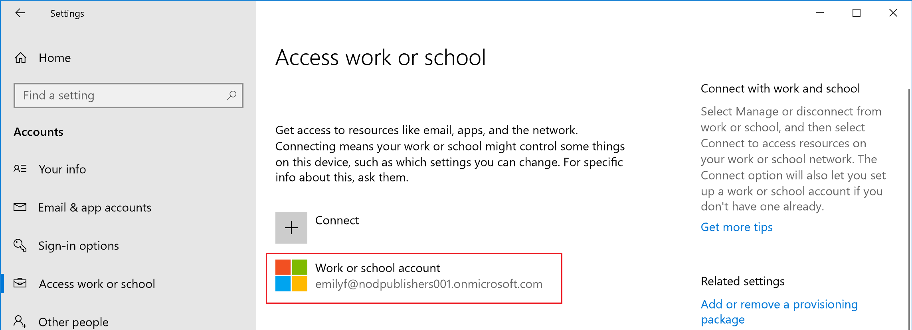

# Step 5: Enroll a device  

Employees and students who want remote access to work or school resources can enroll their devices into Microsoft Intune. Enrollment ensures that all devices trying to access data within your organization are secure and compliant with your policies and requirements. Upon enrollment, the device gets access to resources like work email, files, VPN, and Wi-Fi.

[!INCLUDE [intune-evaluate](../includes/intune-evaluate.md)]

In this task, you will:

* Try out the device user experience by enrolling a device running Windows into Microsoft Intune.
* Try out the admin user experience by verifying the enrollment in the Microsoft Intune admin center.

If you don't have an Intune subscription, [sign up for a free trial account](../fundamentals/free-trial-sign-up.md).

## Prerequisites

To complete this evaluation step, you must be running a supported version of Windows and must:  

- Have a Microsoft Intune subscription: [Sign up for a free trial account](../fundamentals/free-trial-sign-up.md)
- Complete the evaluation step for [setting up automatic enrollment in Intune](quickstart-setup-auto-enrollment.md).
- Use the built-in **[Intune Administrator](/entra/identity/role-based-access-control/permissions-reference#intune-administrator)** Microsoft Entra role.

  If you created an Intune Trial subscription, the account that created the subscription is a Microsoft Entra [Global Administrator](/entra/identity/role-based-access-control/permissions-reference#global-administrator).

  > [!CAUTION]
  > [!INCLUDE [global-admin](../includes/global-admin.md)]

Additionally, before you begin enrollment, confirm the version of Windows running on your device.

1. Open the **Settings** app.

2. Select **System** > **About**.

   

3. Under **Windows specifications**, find **Version**.

4. Confirm that the device version is:

  * For Windows 10: 1607 or later
  * For Windows 11: 21H2 or later

    > [!IMPORTANT]
    > [!INCLUDE [windows-10-support](../includes/windows-10-support.md)]

## Enroll device

1. In the Settings app, select **Accounts**.

2. Select **Access work or school**.

3. Select **Connect** to add a work or school account.

    

4. Enter the username and password for your work account. If you followed the [create a user and assign a license](../fundamentals/quickstart-create-user.md) evaluation step, you can use the user account that you created.

5. Wait for your device to finish registering. When you see the **You're all set!** screen, select **Done**. Your work account should now be visible under **Accounts**.

   

    If you followed the previous steps, but still can't access your work or school email account and files, see [Troubleshoot Windows device access](../user-help/troubleshoot-your-windows-10-device-windows.md).

## Confirm device enrollment

1. Sign in to the [Microsoft Intune admin center](https://go.microsoft.com/fwlink/?linkid=2109431).
2. Select **Devices** > **All devices** to view the enrolled devices in Intune.
3. Verify that you have an additional device enrolled within Intune.

## Clean up resources

To unenroll the device, see [Remove your Windows device from management](../user-help/unenroll-your-device-from-intune-windows.md).

## Next steps

In this task, you learned how to enroll a device running Windows into Intune. For more information about the device user experience, see these resources:
 * [Windows device enrollment with Intune Company Portal](../user-help/device-enrollment-overview-windows.md)
 * [What info can your company see when you enroll your device?](../user-help/what-info-can-your-company-see-when-you-enroll-your-device-in-intune.md)

To continue to evaluate Microsoft Intune, go to the next step:

> [!div class="nextstepaction"]
> [Step 6: Set a required password length for Android devices](../protect/quickstart-set-password-length-android.md)
