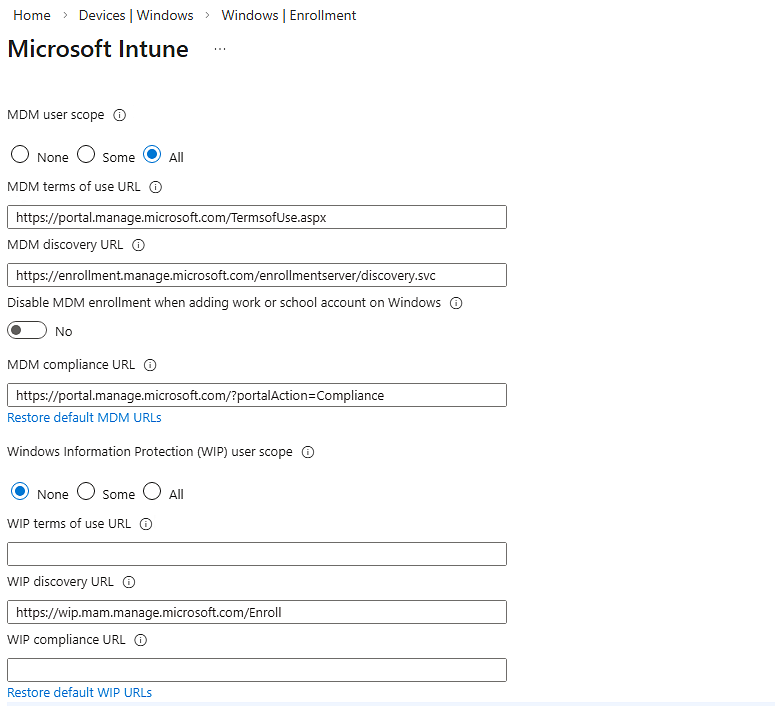

# Set up automatic enrollment for Windows devices  

Simplify device enrollment by enabling *automatic enrollment* in Microsoft Intune. This enrollment method enables devices to enroll automatically when they join or register in Microsoft Entra ID. Enrollment in Intune occurs when:

* A Microsoft Entra user adds their work or school account to their personal device.
* A corporate-owned device joins to your Microsoft Entra ID.

Automatic enrollment can be used in the following device management and provisioning scenarios:

* Bring-your-own-device (BYOD), personal devices
* Bulk enrollment
* Group Policy
* Windows Autopilot (user driven and self-deploying)
* Co-management with Configuration Manager

This article describes how to enable automatic mobile device management (MDM) enrollment for personal and corporate-owned devices.

## Prerequisites  

:::row:::
:::column span="1":::
[!INCLUDE [licensing](../../includes/requirements/licensing.md)]
:::column-end:::
:::column span="3":::
> - A Microsoft Intune subscription. [Sign up for a free trial account](../fundamentals/free-trial-sign-up.md).
> - [Microsoft Entra ID P1 or P2](/azure/active-directory/active-directory-get-started-premium) or the [Premium trial subscription](https://go.microsoft.com/fwlink/?LinkID=816845). You can activate a free Premium trial subscription during setup.
:::column-end:::
:::row-end:::

:::row:::
:::column span="1":::
[!INCLUDE [rbac](../../includes/requirements/rbac.md)]
:::column-end:::
:::column span="3":::
> Sign in to the [Microsoft Intune admin center](https://go.microsoft.com/fwlink/?linkid=2109431) with the following role:
> - Built-in **[Intune Administrator](/entra/identity/role-based-access-control/permissions-reference#intune-administrator)** Microsoft Entra role
:::column-end:::
:::row-end:::

## Enable Windows automatic enrollment

1. Sign in to the [Microsoft Intune admin center](https://go.microsoft.com/fwlink/?linkid=2109431).
1. Go to **Devices**.
1. Expand **Device onboarding** and select  **Enrollment**.
1. Go to the **Windows** tab. Then select **Automatic Enrollment**.

   > [!NOTE]
   >  Automatic MDM enrollment is a premium Microsoft Entra feature available for Microsoft Entra ID Premium subscribers. If you can't see the automatic enrollment settings, select **Automatic MDM enrollment is available only for Microsoft Entra ID Premium subscribers** to activate a free trial.
1. Configure the **MDM user scope** for Microsoft Intune. This setting enables automatic MDM enrollment for Microsoft Entra users so that you can manage their devices in Intune.

   > [!div class="mx-imgBorder"]
   > 

    Your options are:

   - **None** - Automatic MDM enrollment is disabled for all users. You can still manage devices in Microsoft Intune but users must initiate MDM enrollment.
   - **Some** - Automatic MDM enrollment is enabled for the users you select.
   - **All** - Automatic MDM enrollment is enabled for all users. Their devices automatically enroll in Intune when they join or register with Microsoft Entra ID.

   > [!TIP]
   > If your intent is to enable automatic MDM enrollment for Windows BYOD devices, select **All** or **Some** for the MDM user scope. Then make sure the WIP user scope is **None** or **Some**, and that users are not members of both user scopes.

1. Use the default values for these URLs:
   - **MDM Terms of use URL**
   - **MDM Discovery URL**
   - **MDM Compliance URL**

1. You have the option to control if users in an automatic enrollment configuration on Microsoft Entra registered devices are prompted to MDM enroll their device in the work or school account registration flow (referring to [Add Your Work or School Account to a Windows Device](https://support.microsoft.com/windows/add-your-work-or-school-account-to-a-windows-device-a6505ceb-1a20-4b15-889c-250175481506)). To control the behavior of the flow, use the **Disable MDM enrollment when adding work or school account** setting.

   > [!NOTE]
   > This feature is in public preview.  
   
   This setting is turned off by default. If you're enforcing Windows MAM for your work or school accounts, enable this setting. This setting applies to:  
    - Users in the **Some** or **All** category in the MDM auto-enrollment configuration.  
    - Users on Entra registered and workplace joined devices.  
    - Users who add their account for the first time via Microsoft Edge or a native app such as Teams.
   
   This setting doesn't apply to users adding their account through the Settings flow.   

   > [!NOTE]  
   > This setting only blocks the MDM enrollment option from users during the work or school account registration flow. Users can still MDM enroll their device through Windows Settings if they are in scope for MDM automatic enrollment, and through prompts they receive when they try to access a resource that requires MDM enrollment.   

1. For **WIP user scope**, select **None**. If the WIP user scope is set to any other value, make sure the selected users aren't a part of the MDM user scope.

   > [!IMPORTANT]
    > When a user is in both the MDM user scope and WIP user scope:
    > - The MDM user scope takes precedence if they're on a corporate-owned device. The device automatically enrolls in Microsoft Intune when they set it up for work.
    > - The WIP user scope takes precedence if they bring their own device. The device doesn't enroll in Microsoft Intune for device management. Microsoft Purview Information Protection policies are applied if you configured them.

1. Select **Save**.

## Multifactor authentication

Two-factor authentication is not enabled for automatic enrollment by default. We recommend requiring multifactor authentication during device registration. For more information, see [Getting started with the Azure Multi-Factor Authentication Server](/azure/multi-factor-authentication/multi-factor-authentication-get-started-cloud).

## Support for device users

The Microsoft Intune user help docs provide conceptual information, tutorials, and how-to guides for employees and students setting up their devices for work. You can point people directly to the Intune docs, or use these articles as guidance when developing and updating your own device management docs.

Users on personal devices running Windows can automatically enroll by adding their work or school account on their device, or by using the Intune Company Portal app. Devices running earlier versions of Windows must enroll using the Intune Company Portal app.  For more information, see [Enroll Windows devices](../user-help/enroll-windows-10-device.md).

You can also let unlicensed admins sign in to the Intune admin center to help with troubleshooting and support. For more information, see [Unlicensed admins](../fundamentals/unlicensed-admins.md).

## Best practices and troubleshooting

* Device users must access the Company Portal website through Microsoft Edge to view apps assigned for specific versions of Windows. Other browsers such as Google Chrome, Mozilla Firefox, and Internet Explorer do not support this type of filtering.

* After enrollment, you'll see two records in the Microsoft Intune admin center if automatic MDM enrollment is disabled and devices are joined to Microsoft Entra ID. To stop the duplicate records, instruct users on joined devices to **Settings** > **Accounts** > **Access work or school**. Then they can **Connect** using the same account.

## Known issues  

This section lists the known issues with MDM enrollment.  

## Next steps

For information about how to integrate and use automatic enrollment when provisioning devices, see:

* [Windows Autopilot scenarios](/autopilot/tutorial/autopilot-scenarios)
* [Enroll a Windows client device automatically using Group Policy](/windows/client-management/mdm/enroll-a-windows-10-device-automatically-using-group-policy)
* [Enable co-management in Configuration Manager](../../configmgr/comanage/how-to-enable.md)

If you're not using automatic enrollment as part of your enrollment or provisioning solution, we recommend creating a domain name server (DNS) alias (known as a *CNAME* record type) that redirects enrollment requests to Intune servers. For more information, see [Enable automatic discovery of Intune enrollment server](../enrollment/windows-enrollment-create-cname.md).
