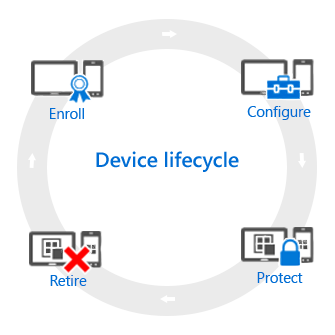

# Overview of the Microsoft Intune mobile device management (MDM) lifecycle

All devices that you manage have a *lifecycle*. Intune can help you manage this lifecycle: from enrollment, through configuration and protection, to retiring the device when it's no longer required. Here's an example: an iPad bought by your company first needs to be enrolled with your Microsoft Intune account to allow your company to manage it; then, it needs to be configured to your company's liking; then, the data that's stored on it by a user needs to be protected; and finally, when that iPad is no longer needed, you must [retire or wipe](../remote-actions/devices-wipe.md) all sensitive data on it.

## Enroll

Today's mobile device management (MDM) strategies deal with a variety of phones, tablets, and PCs (iOS/iPadOS, Android, Windows, and macOS). If you need to be able to manage the device, which is commonly the case for corporate-owned devices, the first step is to [set up device enrollment](deployment-guide-enrollment.md). You can also manage Windows PCs by enrolling them with Intune (MDM).

## Configure

Getting your devices enrolled is just the first step. To take advantage of all that Intune offers and to ensure that your devices are secure and compliant with company standards, you can choose from a wide range of policies. These let you configure almost every aspect of how managed devices operate. For example, should users have a password on devices that have company data? You can require one. Do you have corporate Wi-Fi? You can automatically configure it.

Here are the types of configuration options that are available:

- [**Device configuration profiles**](../configuration/device-profiles.md). These policies let you configure the features and capabilities of the devices that you manage. For example, you could require the use of a password on Android phones or disable the use of the camera on iPhones.
- [**Company resource access**](../configuration/device-profiles.md). When you let your users access their work on their personal device, this can present you with challenges. For example, how do you ensure that all devices that need to access company email are configured correctly? How can you ensure that users can access the company network with a VPN connection without having to know complex settings? Intune can help to reduce this burden by automatically configuring the devices that you manage to access common company resources.
- [**Windows PC management policies (with the Intune client software)**](./intune-legacy-pc-client.md). While enrolling Windows PCs with Intune gives you the most device management capabilities, Intune continues to support managing Windows PCs with the Intune client software. If you need information about some of the tasks that you can perform with PCs, start here.

## Protect

In the modern IT world, protecting devices from unauthorized access is one of the most important tasks that you perform. In addition to the items in the **Configure** step of the device lifecycle, Intune provides these capabilities that help protect devices you manage from unauthorized access or malicious attacks:

- [**Multi-factor authentication**](../enrollment/multi-factor-authentication.md). Adding an extra layer of authentication to user sign-ins can help make devices even more secure. Many devices support multi-factor authentication that requires a second level of authentication, such as a phone call or text message, before users can gain access.
- [**Windows Hello for Business settings**](../protect/windows-hello.md). Windows Hello for Business is an alternative sign-in method that lets users use a *gesture*—such as a fingerprint or Windows Hello—to sign in without needing a password.
- [**Policies to protect Windows PCs (with the Intune client software)**](./intune-legacy-pc-client.md). When you manage Windows PCs by using the Intune client software, policies are available that let you control settings for Endpoint Protection, software updates, and Windows Firewall on PCs that you manage.

## Retire

When a device gets lost or stolen, when it needs to be replaced, or when users move to another position, it's usually time to [retire or wipe](../remote-actions/device-management.md) the device. There are a number of ways you can do this—including resetting the device, removing it from management, and wiping the corporate data on it.

## Next steps

- Learn about [device management in Microsoft Intune](../remote-actions/device-management.md)
