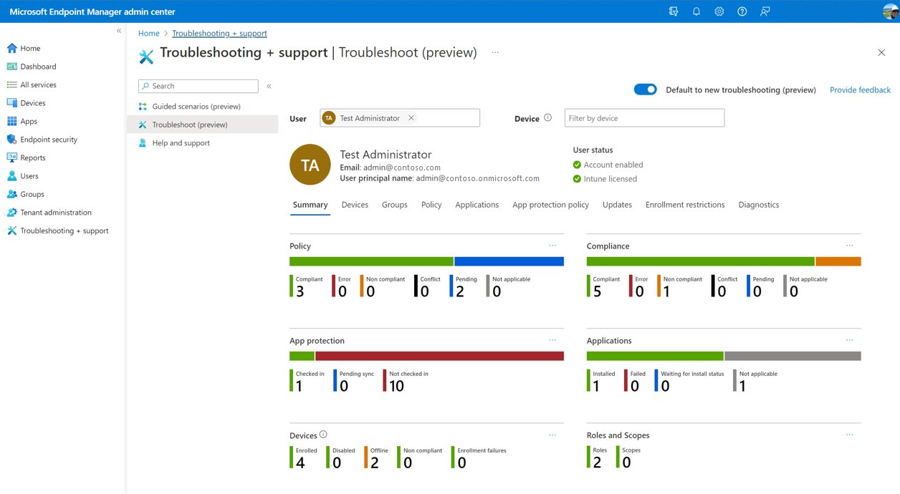

# Use the troubleshooting dashboard to help users at your company

[!INCLUDE [azure_portal](../includes/azure_portal.md)]

The troubleshooting pane lets help desk operators and Intune administrators view user information to address user help requests. Organizations that include a help desk can assign the [Help desk operator role](role-based-access-control.md#built-in-roles) to a group of Intune users. The help desk operator role can use the **Troubleshooting + support** pane help end users.

The **Troubleshooting + support** pane provides three options:

- [Guided scenarios](guided-scenarios-overview.md) to provide a customized series of steps centered around one end-to-end use-case. For more information, see [Guided scenarios](guided-scenarios-overview.md).
- **Troubleshooting** to help determine any issues with **Assignments**, **App protection status**, and **Enrollment failures**.
- [Help and support](../../get-support.md?toc=%2Fmem%2Fintune%2Ftoc.json&bc=%2Fmem%2Fintune%2Fbreadcrumb%2Ftoc.json) to provide global technical, pre-sales, billing, and subscription support for device management cloud-based services related to Intune. For more information, see [Help and support](../../get-support.md?toc=%2Fmem%2Fintune%2Ftoc.json&bc=%2Fmem%2Fintune%2Fbreadcrumb%2Ftoc.json).

Details about the issue and suggested remediation steps can help administrators and help desk operators troubleshoot problems. Certain enrollment issues aren't captured and some errors might not have remediation suggestions.

> [!NOTE]
> For steps on adding a help desk operator role, see [Role-based administration control (RBAC) with Intune](role-based-access-control.md)

When a user contacts support with a technical issue with Intune, the help desk operator enters and finds the user's name. Additionally, the help desk operator can filter by device if the user has multiple managed devices.

The **Troubleshooting** pane provides the following tabs for a selected user and allows you to quickly narrow the troubleshooting focus:

- **Summary** - Provides specific counts of issues related to policy, compliance, app protection, applications, devices, roles, and scopes.
- **Devices** - Provides details for devices, such as OS, OS Version, Intune compliance, and last check-in.
- **Groups** - Provides details for groups, such as membership type.
- **Policy** - Provides policy details, such as assignment, type, platform, and last modified.
- **Applications** - Provides app install status, assigned, platform, type, and last modified.
- **App protection policy** - Provides the name, platform, and enrollment details for app protection policies.
- **Updates** - Provides the name, platform, and update type.
- **Enrollment restrictions** - Provides the policy type, name, platform, and device limit.
- **Diagnostics** - Provides the device name or application, platform, created date, and diagnostic log.
- **ServiceNow incidents** - Provides a list of associated incidents for the selected user. For more information, go to [ServiceNow integration with Intune](service-now-integration.md).

## View user troubleshooting details

In the **Troubleshooting** pane provides specific details for each Intune end-user. User information can help you understand the current state of users and their devices.  

1. Sign in to [Microsoft Intune admin center](https://go.microsoft.com/fwlink/?linkid=2109431).
2. Select **Troubleshooting + support** > **Troubleshoot**.
3. Find and select a **User** by entering a display name or email.
4. If the user has multiple devices, filter by **Device**.
5. Review the provided information to help troubleshoot end-user issues.

## Areas of the troubleshooting dashboard

You can use the **Troubleshooting + support** pane to review a variety of managed user and device information.

### Summary

The **Summary** tab provides overall details for the user who is managed by Intune.

| Column | Description |
|---|---|
| Policy             | The status of the policies available for the user or device. |
| Compliance         | The compliance status for the user or device.  |
| App protection     | App protection details. |
| Applications       | The state of the applications for the user or device.  |
| Devices            | The status of the device(s) related to the user.  |
| Role and scope     | The role and scope for the user. |

### Devices

The **Devices** tab provides details for devices, such as OS, OS Version, Intune compliance, and last check-in.

| Column | Description |
|---|---|
| Name               | The name of the device. |
| Managed by         | Identifies how the device is managed. For more information, see [Available details by management type](../protect/endpoint-security-manage-devices.md#available-details-by-management-type). |
| Ownership          | The type of device ownership (**Company**, **Personal**, or **Unknown**). |
| Intune compliant   | Identifies whether the device is compliant with Intune. Should be **Yes**. If **No** is shown, there may be an issue with compliance policies, or the device isn't connecting to the Intune service. For example, the device may be turned off, or may not have a network connection. Eventually, the device becomes non-compliant, possibly after 30 days. For more information, see [Use compliance policies to set rules for devices you manage with Intune](../protect/device-compliance-get-started.md). |
| Microsoft Entra compliant      | Identifies whether the device is compliant with Microsoft Entra ID. Should be **Yes**. If **No** is shown, there may be an issue with compliance policies, or the device isn't connecting to the Intune service. For example, the device may be turned off, or may not have a network connection. Eventually, the device becomes non-compliant, possibly after 30 days. For more information, see [Use compliance policies to set rules for devices you manage with Intune](../protect/device-compliance-get-started.md). |
| App lifecycle status | Denotes whether an app install failure or success has occurred on the individual device. |
| OS                 | The Operating System installed on the device. |
| OS version         | The Operating System version number of the device. |
| Last check-in      | The timestamp of the last time the device checked in.  |

### Groups

The **Groups** tab provides the group membership of all Microsoft Entra groups for a specific managed device. For related information, see [Device group membership report](reports.md#device-group-membership-report-organizational).

| Column | Description |
|---|---|
| Name               | The name of the group. |
| Object ID          | The Object ID is used by Microsoft Entra ID. Intune commonly refers to them as Group ID. |
| Membership type    | Provides how you assign and add users. **Assigned** denotes you manually assign users or devices to the group, and manually remove users or devices. **Dynamic User** denotes you create membership rules to automatically add and remove members. **Dynamic Device** denotes you create dynamic group rules to automatically add and remove devices.  |
| Direct or Transitive      | Identifies whether the device is a direct member or a transitive member.  |

### Policy

The **Policy** tab provides the policies applied to devices, which include policy details, such as assignment, type, platform, and last modified.

| Column | Description |
|---|---|
| Name          | The name of the device policy. |
| Assignment    | Identifies the assignment status of the device.  |
| Type          | The type of policy.  |
| Platform      | The type of device platform. |
| Last Modified | The timestamp of the last time the device synchronized with Intune.  |

### Applications

The **Applications** tab provides managed app install status, assigned, platform, type, and last modified.

| Column | Description |
|---|---|
| Name        | The name of the application.  |
| App install status        | The installation status of the app. |
| Assigned    | Provides whether the app has been assigned. |
| Platform | The type of device platform.  |
| Type | You can choose an assignment type for each app. **Available** denotes that users install the app from the Company Portal app or website. **Not Applicable** denotes that the app is not installed or shown in the Company Portal. **Uninstall** denotes that the app is uninstalled from devices in the selected groups. **Available with or without enrollment** denotes that this app is assigned to groups of users whose devices are not enrolled with Intune. |
| Last modified   | The timestamp of the last time the device synchronized with Intune.  |

### App protection policy

The **App protection policy** tab provides the name, platform, and enrollment details for app protection policies. An app protection policy is available to mobile apps that integrate with EMS technologies. These policies give a baseline of protection for your corporate data when it is downloaded to mobile apps, including the Office mobile apps. 

| Column | Description |
|---|---|
| Name        | The name of the app protection policy. |
| Platform       | The platform of the device. |
| Enrollment    | The enrollment status of the device. |

### Updates

The **Updates** tab provides an overall view of updates that are deployed to users. This information also provides filtering, searching, paging, and sorting.

| Column | Description |
|---|---|
| Name        | The update name. |
| Platform       | The platform of the device intended for the update. |
| Update type    | The type of update. |

## Enrollment restrictions

The **Enrollment restrictions** tab provides the policy type, name, platform, and device limit. Enrollment restrictions are use to prevent (block) personally owned devices from enrolling, you will need to add the devices using corporate device identifiers, prior to enrollment.

### Properties

| Column | Description |
|---|---|
| Policy type | The type of policy. |
| Name        | The name of the policy. |
| Platform    | The platform of the device. |
| Device limit | The enrollment restriction to limit the number of devices a user can enroll in Microsoft Intune. |

### Diagnostics

The **Diagnostics** tab provides the device name or application, platform, created date, and diagnostic log.

> [!NOTE]
> To collect and access diagnostics you must have the Collect diagnostics permission added to your role. For more information, see [Role-based administration control (RBAC) with Intune](role-based-access-control.md).

| Column | Text |
|---|---|
| Device name or application       | The name of the device or application. |
| Platform    | The platform of the device. |
| Created date      | The timestamp of when the event occurred. |
| Diagnostic log     | The diagnostic log file. |

## Collect available data from mobile device

Use the following resources to help collect device data when troubleshooting user's device issues:

- [Report a problem in Company Portal for iOS](../user-help/send-logs-to-microsoft-ios.md)
- [Report a problem in Company Portal or Intune app for Android](../user-help/send-logs-to-your-it-admin-by-email-android.md)  

You can access and download user-submitted logs under [**Diagnostics**](#diagnostics).  

## Next steps

You can learn more about Role-based administration control (RBAC) to define roles in your organizational device, mobile application management, data protection tasks. For more information, see [Role-based administration control (RBAC) with Intune](role-based-access-control.md).

Learn about any known issues in Microsoft Intune. For more information, see [Known issues in Microsoft Intune](https://techcommunity.microsoft.com/t5/Intune-Customer-Success/bg-p/IntuneCustomerSuccess).

Learn how to create a support ticket a get help when you need it. [Get support](../../get-support.md).
