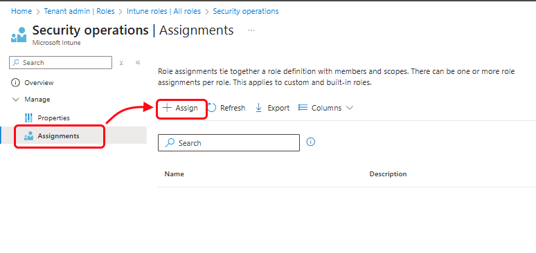

# Step 10: Create and assign a custom role

This article guides you through creating a custom role for Intune role-based access control (RBAC) that has specific permissions for a security operations department and assign the role to a group of such operators. When you assign Intune RBAC roles and follow the principles of least privilege access, your admins can perform tasks on only those users and devices that they should are empowered to manage. 

Although Intune includes several built-in RBAC roles that you can use right away, we recommend using the least-privileged role that can complete the task an administrator is expected to manage. This approach minimizes security risks and operational errors by avoiding over-privileged accounts like Global Administrator or Intune Administrator for routine work.

[!INCLUDE [intune-evaluate](../includes/intune-evaluate.md)]

If you don't have an Intune subscription, [sign up for a free trial account](free-trial-sign-up.md).

## Prerequisites

To complete this evaluation step, you must have a group with at least one user. Creating a group is covered in [Step 3 - Create a group](quickstart-create-group.md) of this evaluation guide.

## Sign in to Intune

Sign in to the [Microsoft Intune admin center](https://go.microsoft.com/fwlink/?linkid=2109431) using an account that is assigned the Microsoft Entra role of **[Intune Administrator](/entra/identity/role-based-access-control/permissions-reference#intune-administrator)**.

However, if this is a new trial subscription, sign in with the account that created the subscription, which is a Microsoft Entra [Global Administrator](/entra/identity/role-based-access-control/permissions-reference#global-administrator).

> [!CAUTION]
> [!INCLUDE [global-admin](../includes/global-admin.md)]

## Create a custom role

When you create a custom role, you can set permissions for a wide range of actions. For the security operations role, you'll enable *Read* permissions for a few categories so that the operator can review a device's configurations and policies.

1. In the Intune admin center, go to **Tenant administrator** > **Roles**, and select **Create**. From the drop-down box, select **Intune role**. The *Add Custom Role* workflow opens.
   

2. On the **Basics** page:
   - For Name, enter *Security operations*.
   - For **Description**, enter *This role lets a security operator monitor device configuration and compliance information.*
   Select **Next** to continue.

3. On the **Permissions** page, expand the *Corporate device identifiers* category and set *Read* to **Yes**:
   

   After configuring Read for Corporate device identifiers, expand the following additional categories, and make the same configuration; setting *Read* to **Yes**.

   - *Device compliance policies*
   - *Device configurations*
   - *Organization*.

   After the four categories are configured, select **Next** to continue.

4. On **Scope tags**, select **Next**. You don't need to configure scope tags for this evaluation scenario.

5. On **Review + Create**, select *Create*. Intune creates the custom role, which now appears on the **Intune roles | All roles** page of the admin center, with a **Type** of *Custom Intune role*. 

## Assign the role to a group

1. Sign in to the Microsoft Intune admin center and go to **Tenant administration** > **Roles** > **All roles**.

2. On the **Intune roles - All roles** page, select the custom role you created, **Security operations**  to open the roles *Overview*. Select **Assignments** and then select **Assign**.

   

3. On the **Basics** page, for Name enter *Sec ops*, and then select **Next** to continue.

4. On the **Admin Groups** page, select **Add groups** and then choose a group that contains the users you want to assign the roles permissions to. If you created the **Contoso Testers** group in [Step 3](quickstart-create-group.md) of this evaluation guide, select that group.

   After adding a group, choose **Select**, and then **Next** to continue to the next page of the workflow.

5. On the **Scope Groups** page, select **Add groups** and then add the same group you added in the previous step. As before, choose **Select**, and then **Next** to continue to the next page of the workflow. 

6.  On **Scope tags**, select **Next**. You don't need to configure scope tags for this evaluation scenario.

7. On the **Review + Create** page, when you're done, select **Create**.

   The new assignment is displayed in the list of assignments.

Now everyone in the group is a member of the *Security operations* role and can review the following information about a device: corporate device identifiers, device compliance policies, device configurations, and organization information.

## Clean up resources

If you don't want to use the new custom role anymore, you can delete it. In the admin center, got to  **Tenant administration** > **Roles** > **All roles**, locate the role and select the ellipses (...) to the left of the roles description, and then select **Delete**.

## Next steps

In this evaluation step, you created a custom security operations role and assigned it to a group. For more information about roles in Intune, see [Role-based administration control (RBAC) with Microsoft Intune](role-based-access-control.md)

To continue to evaluate Microsoft Intune, go to the next step:

> [!div class="nextstepaction"]
> [Step 11: Create an email device profile for iOS/iPadOS](../configuration/quickstart-email-profile.md)
