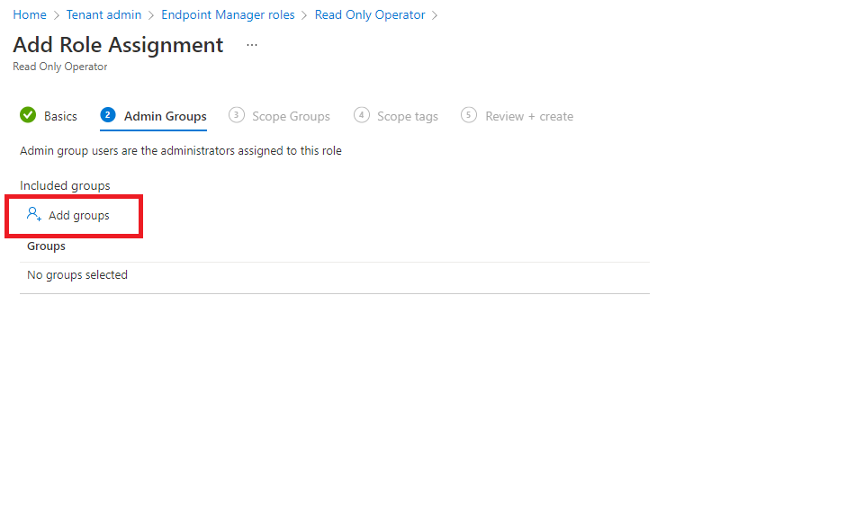

# Use role-based access control (RBAC) and scope tags for distributed IT

You can use role-based access control and scope tags to make sure that your Intune admins have the correct access and visibility to the Intune objects you expect them to manage. Roles determine what access admins have to which objects. Scope tags determine which objects admins can see.

For example, let's say a Seattle regional office admin has the *Policy and Profile Manager* role. You want this admin to see and manage only the profiles and policies that only apply to *Seattle* devices, a group of devices that are all located at the Seattle office. To set up this access, you would:

1. Create a scope tag called *Seattle*.
2. Create a role assignment for the Policy and Profile Manager role with:
    - Members (Groups) = A security group named Seattle IT admins. All admins in this group have  permission to manage policies and profiles for users/devices in the Scope (Groups).
    - Scope (Groups) = A security group named Seattle users. All users/devices in this group can have their profiles and policies managed by the admins in the Members (Groups).
    - Scope (Tags) = Seattle. Admins in the Member (Groups) can see Intune objects that also have the Seattle scope tag.
3. Add the Seattle scope tag to policies and profiles that you want admins in Members (Groups) to have access to.
4. Add the Seattle scope tag to devices that you want visible to admins in the Members (Groups).

## Default scope tag

The default scope tag is automatically added to all untagged objects that support scope tags.

The default scope tag feature is similar to the security scopes feature in Microsoft Configuration Manager.

> [!NOTE]
> When you configure or edit Intune policies, some policy types might not display the Scope Tags configuration page if there are no custom defined scope tags for the tenant.
> If you don't see the Scope Tag option, ensure that at least one tag in addition to the default scope tag is defined.

## To create a scope tag

Creating, updating, or deleting scope tags requires an administrator assigned the [Intune Administrator](/entra/identity/role-based-access-control/permissions-reference#intune-administrator) :::image type="icon" source="../../media/icons/16/privileged-label.svg" border="false"::: Microsoft Entra role. Because it's a privileged role, Microsoft recommends using it only when necessary. Administrators with a scope tag in their role assignment can't update or delete the scope tag from the master list of scope tags.

1. In the [Microsoft Intune admin center](https://go.microsoft.com/fwlink/?linkid=2109431), choose **Tenant administration** > **Roles** > **Scope (Tags)** > **Create**.
2. On the **Basics** page, provide a **Name** and optional **Description**. Choose **Next**.
3. On the **Assignments** page, choose the groups containing the devices that you want to assign this scope tag. Choose **Next**.
4. On the **Review + create** page, choose **Create**.

   > [!IMPORTANT]
   > Auto scope tags assignments overwrite manually assigned scope tags.
   > If a device is assigned multiple scope tags through group assignment, all scope tags apply.

## To assign a scope tag to a role

1. In the [Microsoft Intune admin center](https://go.microsoft.com/fwlink/?linkid=2109431), choose **Tenant administration** > **Roles** > **All roles** > choose a role > **Assignments** > **Assign**.
2. On the **Basics** page, provide an **Assignment name** and **Description**. Choose **Next**.
3. On the **Admin Groups** page, choose **Add groups**, and select the groups that you want as part of this assignment. Users in these groups have permissions to manage users/devices in the Scope (Groups). Choose **Next**.

    

4. On the **Scope Groups** page, select one of the following options for **Included groups**:
    - **Add groups**: Select the groups containing the users/devices that you want to manage. All users/devices in the selected groups are managed by the users in the Admin Groups.
    - **Add All users**: Users in the Admin Groups can manage all users.
    - **Add All devices**: Users in the Admin Groups can manage all devices.

   > [!TIP]
   > If you specify an exclude group for an assignment such as a policy or app assignment, it needs to either be nested in one of the RBAC assignment [scope groups](role-based-access-control.md#about-intune-role-assignments), or it needs to be separately listed as a scope group in the RBAC role assignment.

5. Choose **Next**
6. On the **Scope tags** page, select the tags that you want to add to this role. Users in the Admin Groups have access to Intune objects that also have the same scope tag. You can assign a maximum of 100 scope tags to a role.
7. Choose **Next** to go to the **Review + create** page and then choose **Create**.

## Assign scope tags to other objects

For objects that support scope tags, scope tags usually appear under **Properties**. For example, to assign a scope tag to a configuration profile, follow these steps:

1. In the [Microsoft Intune admin center](https://go.microsoft.com/fwlink/?linkid=2109431), choose **Devices** > **Manage devices** > **Configuration** > choose a profile.

2. Choose **Properties** > **Scope (Tags)** > **Edit** > **Select scope tags** > choose the tags that you want to add to the profile. You can assign a maximum of 100 scope tags to an object.
3. Choose **Select** > **Review + save**.

## Scope tag details

When working with scope tags, remember these details:

- You can assign scope tags to an Intune object type if the tenant can have multiple versions of that object (such as role assignments or apps).
  The following Intune objects are exceptions to this rule and don't currently support scope tags:
  - Corp Device Identifiers
  - Windows Autopilot Devices
  - Device compliance locations
  - Jamf devices
- Volume Purchase Program (VPP) apps and ebooks associated with the VPP token inherit the scope tags assigned to the associated VPP token.
- When an admin creates an object in Intune, all scope tags assigned to that admin are automatically assigned to the new object.
- Intune RBAC doesn't apply to Microsoft Entra roles. So, the Intune Service Admins role has full admin access to Intune no matter what scope tags they have.
- If a role assignment has no scope tag, that IT admin can see all objects based on the IT admins permissions. Admins that have no scope tags essentially have all scope tags.
- You can only assign a scope tag that you have in your role assignments.
- You can only target groups that are listed in the Scope (Groups) of your role assignment.
- If you have a scope tag assigned to your role, you can't delete all scope tags on an Intune object. At least one scope tag is required.

## Permission behavior across role assignments

The following sections describe Intune's existing and default behavior for scoped permissions, and an improved opt-in public preview behavior that will become the default behavior for all tenants in a future release.

> [!IMPORTANT]
> In March 2026, Intune introduced an opt-in public preview for **Scoped permissions**. This new behavior changes how permissions apply when an admin has multiple role assignments with different scope tags. Until you enable this setting, your tenant continues to use the [default behavior](#default-behavior). Review both behaviors and use the [Permissions Assessment Report](#permissions-assessment-report) to understand the impact before opting in, as this change can't be reversed.

### Default behavior

By default, when an admin belongs to multiple role assignments that use different scope tags and share the same permission category (for example, Mobile Apps), Intune merges the permissions across those assignments. This can result in an admin receiving broader access than intended. For example:

- The *App Admins* security group is assigned a role that grants only **Read** permissions for **Mobile Apps**, scoped to *Headquarters*, intended to give them read-only access there.
- The same group is also assigned a role that grants full permissions (Create, Read, Update, Delete) for **Mobile Apps**, scoped to *Regional Office*.
- Because both assignments share the **Mobile Apps** permission category, Intune merges them. The result: *App Admins* members have full permissions on Mobile Apps under both *Headquarters* and *Regional Office*, not the read-only access intended for *Headquarters*.

If this isn't the access you intended, use the [Permissions Assessment Report](#permissions-assessment-report) to see exactly how your current assignments will change before you opt in to [Scoped permissions](#scoped-permissions-opt-in-public-preview).

### Scoped permissions (opt-in public preview)

Available as an opt-in public preview, you can use the **Scoped permissions** setting to gain precise control over what each admin can actually do within each scope tag. Rather than having Intune silently merge permissions across role assignments, each assignment's permissions stay contained to its own scope. Admins get exactly the access you intended, no more.

When scoped permissions are enabled, each role assignment's permissions apply only within its own scope tag context. In the same example, *App Admins* members would have read-only access to Mobile Apps tagged *Headquarters* and full permissions for Mobile Apps tagged *Regional Office*, exactly as intended.

Enabling **scoped permissions** is a one-time tenant action that cannot be undone. Before enabling this setting, use the [Permissions Assessment Report](#permissions-assessment-report) to preview exactly how permissions will change for each affected admin in your tenant. The report is available at **Tenant administration** > **Roles** > **Settings** and can be run as many times as needed.

To enable Scoped permissions, go to **Tenant administration** > **Roles** > **Settings** and turn on the **Scoped permissions** toggle, using an account with one of the following roles:

- **Custom Intune role (recommended)** - Create a [custom role](create-custom-role.md) that includes the **Update** action for **Organization**. No built-in Intune role includes this permission.
- **[Intune Administrator](/entra/identity/role-based-access-control/permissions-reference#intune-administrator)** :::image type="icon" source="../../media/icons/16/privileged-label.svg" border="false"::: - This Microsoft Entra role provides full read/write access to Intune. Because it's a privileged role, Microsoft recommends using a least-privileged custom Intune role instead.

## Permissions Assessment Report

Before enabling Scoped permissions, use the **Permissions Assessment Report** to preview exactly how permissions will change for each affected admin in your tenant. The report is available at **Tenant administration** > **Roles** > **Settings**, and can be run as often as needed, before or after enabling the setting.

The report shows each affected security group, the roles and scope tags involved, and a comparison of current (merged) permissions versus the permissions that would apply after Scoped permissions is enabled.

To review the impact on your tenant and enable Scoped permissions:

1. Go to **Tenant administration** > **Roles** > **Settings**.

2. Select **Generate Report** to run the Permissions Assessment Report.

   The report displays the current permissions for each affected security group (as *Old Permissions*) and what those permissions would be after enabling Scoped permissions (as *New Permissions*). Review the results, adjust role assignments as needed, and communicate any permission reductions to affected admins.

   You can also export this report to Excel for later review.

3. When ready, enable the **Scoped permissions** toggle.

   > [!IMPORTANT]
   > Do not enable scoped permissions until you're ready to implement this change. Enabling Scoped permissions is a one-way action that can't be reversed.

## Next steps

Learn how scope tags behave when there are [multiple role assignments](role-based-access-control.md#multiple-role-assignments).
Manage your [roles](role-based-access-control.md) and [profiles](../configuration/device-profile-assign.md).
