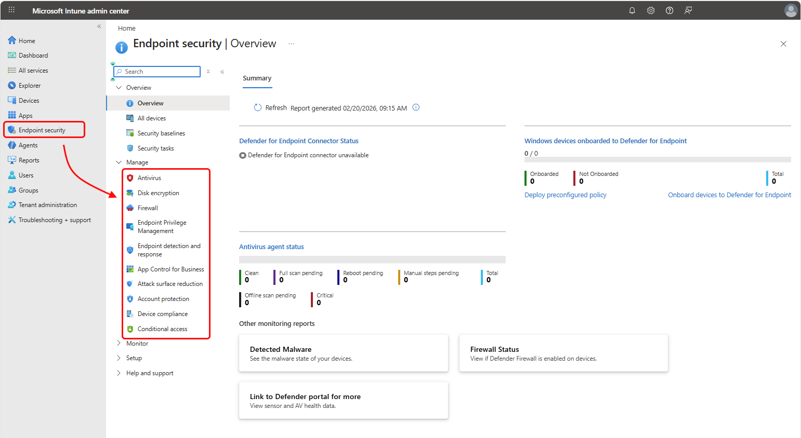

# Endpoint security in Microsoft Intune

Endpoint security in Microsoft Intune helps you protect devices and data in today's hybrid work environment. Use the *Endpoint security* node to implement zero trust security, protect against ransomware and malware, enforce compliance requirements, and respond to security threats across all managed devices.

As a Security Admin, you can configure focused security policies, deploy security baselines, integrate with Microsoft Defender for Endpoint, and manage security tasks, all without navigating complex configuration profiles. The Endpoint security policies help you quickly establish protection, identify at-risk devices, remediate vulnerabilities, and maintain compliance.

## Endpoint security capabilities

The Endpoint security node provides focused tools to protect devices and respond to threats:

- **All devices view**. Monitor device compliance across your organization. View compliance status at a glance, drill into specific devices to identify policy violations, and take remediation actions like restarting devices, initiating malware scans, or rotating encryption keys. See [Manage devices](#manage-devices).

- **Security baselines**. Deploy Microsoft-recommended security configurations for Windows devices and applications including Microsoft Defender for Endpoint and Microsoft Edge. Security baselines provide preconfigured groups of settings that establish comprehensive security posture aligned with industry best practices. See [Manage Security baselines](#manage-security-baselines).

- **Endpoint security policies**. Configure focused security settings for antivirus, disk encryption, firewalls, endpoint detection and response, attack surface reduction, and account protection. These policies provide targeted configuration options without navigating extensive device configuration settings. See [Use policies to manage device security](#use-policies-to-manage-device-security).

- **Device compliance policies**. Define minimum security requirements that devices and users must meet to access corporate resources. Establish rules for OS versions, password requirements, device threat levels, and security features. Combine with Conditional Access to enforce zero trust security. See [Use device compliance policy](#use-device-compliance-policy).

- **Conditional Access integration**. Verify device security posture before granting access to corporate resources. Use compliance data to control access for both managed and unmanaged devices, implementing zero trust principles. See [Configure Conditional Access](#configure-conditional-access).

- **Microsoft Defender for Endpoint integration**. Gain advanced threat detection, security tasks, device risk signals for compliance policies, tamper protection, and unified security management. This integration is foundational for modern endpoint protection. See [Set up Integration with Microsoft Defender for Endpoint](#set-up-integration-with-microsoft-defender-for-endpoint).

- **Security tasks**. Enable seamless collaboration between Defender for Endpoint security teams and Intune administrators. When Defender identifies vulnerabilities, security tasks provide workflows to remediate issues through Intune, keeping both teams aligned on devices at risk. See [Review Security tasks from Microsoft Defender for Endpoint](#review-security-tasks-from-microsoft-defender-for-endpoint).

The following sections describe common scenarios these capabilities address, followed by detailed guidance for each feature.

## Common security scenarios

Endpoint security capabilities in Intune help you address these security challenges:

**Protect against ransomware and malware**. Deploy antivirus policies with real-time protection, configure attack surface reduction to block common attack vectors, enable controlled folder access, and implement defense-in-depth through security baselines. Learn more: [Manage device security with endpoint security policies](../protect/endpoint-security-policy.md).

**Implement zero trust security**. Require device compliance for resource access, integrate with Conditional Access to verify security posture, use device risk signals from Microsoft Defender for Endpoint, and deploy disk encryption across all devices. Learn more: [Configure Conditional Access](#configure-conditional-access).

**Secure remote and hybrid work**. Monitor compliance for remote devices, deploy VPN profiles to secure network connections, onboard devices to Microsoft Defender for Endpoint through EDR policies, and configure firewall rules to protect devices on untrusted networks. Learn more: [Manage devices with endpoint security](../protect/endpoint-security-manage-devices.md).

**Meet compliance and regulatory requirements**. Deploy standardized security configurations using baselines aligned to industry frameworks, monitor compliance status and generate audit reports, automate remediation actions for non-compliant devices, and track security posture over time. Learn more: [Set rules on devices to allow access to resources](../protect/device-compliance-get-started.md).

**Respond to security threats**. Review security tasks from your Defender for Endpoint team, remediate at-risk devices using remote actions, isolate compromised devices, rotate encryption keys, and monitor threat detection through dashboards. Learn more: [Use Intune to remediate vulnerabilities identified by Microsoft Defender for Endpoint](../protect/atp-manage-vulnerabilities.md).

The following sections provide detailed guidance for implementing these capabilities.

## Endpoint security dashboard

The Endpoint security dashboard provides a consolidated view of your security posture. Access it by navigating to **Endpoint security** in the Microsoft Intune admin center.

Use this dashboard to quickly assess device security status and identify areas requiring attention. The Overview displays information from multiple endpoint security areas including *Antivirus*, *Endpoint detection and response*, and *Microsoft Defender for Endpoint*:

- **Defender for Endpoint Connector status**. This view displays the current status for the tenant-wide *Defender for Endpoint Connector*. The label for this view also serves as a link to open the Microsoft Defender for Endpoint portal.

  This same view is available on the Summary tab of the *Endpoint detection and response* policy node.

- **Windows devices onboarded to Defender for Endpoint**. This table displays the tenant-wide status for *endpoint detection and response* (EDR) onboarding, with counts of devices that are and aren't onboarded. The label for this view is a link that opens the Summary tab of the Endpoint detection and response policy node.

  Two additional links are included:
  - **Deploy preconfigured policy**. This link opens the policy node for *Endpoint detection and response* where you can deploy a policy to onboard devices to Defender.

  - **Onboard devices to Defender for Endpoint**. A link to open the Defender portal, where you can take other steps to onboard devices outside of Intune's streamlined workflow.

- **Antivirus agent status**. This view displays the summary details of Intune's *Antivirus agent status* report, otherwise available in the Intune admin center by going to *Reports* > *Microsoft Defender Antivirus* where the report is on the *Summary* tab.

- **Other Monitoring reports**. This section includes tiles that open additional Microsoft Defender Antivirus reports, including *Detected Malware Firewall Status*. Another tile opens the *Defender portal* where you can view sensor and antivirus health data.

## Endpoint security features

The following sections describe key endpoint security features and how to use them effectively.

### Device management

The *All devices* view in Endpoint security displays all devices from your Microsoft Entra ID that are available in Microsoft Intune. From this centralized view, you can monitor device compliance status across your organization, drill into specific devices to identify policy violations, and take immediate remediation actions such as restarting devices, initiating malware scans, rotating encryption keys, or reviewing security recommendations.

This consolidated device view provides Security Admins with a single location to assess and remediate security issues across the entire fleet, regardless of platform or enrollment method. For more information, see [Manage devices with endpoint security in Microsoft Intune](../protect/endpoint-security-manage-devices.md).

### Security baselines

Security baselines provide preconfigured groups of Windows settings with defaults recommended by Microsoft security teams. These baselines enable you to quickly establish comprehensive security posture aligned with industry best practices and security frameworks. Intune supports security baselines for Windows devices, Microsoft Edge, Microsoft Defender for Endpoint, and other Microsoft products.

Each baseline contains Microsoft-recommended settings organized by functional area. You can deploy baselines with default settings or customize them to meet specific organizational requirements. Microsoft recommends minimizing customizations to maintain alignment with security best practices and simplify baseline updates when Microsoft releases new versions. For more information, see [Use security baselines to configure Windows devices in Intune](../protect/security-baselines.md).

### Security tasks

Security tasks enable collaboration between your Microsoft Defender for Endpoint security team and Intune administrators. When Defender identifies vulnerabilities during threat analysis, security teams can create tasks in Intune that identify affected devices, describe the vulnerability, and provide remediation guidance. Intune administrators review these tasks, deploy appropriate policies or configurations to address the vulnerabilities, and mark tasks as complete once remediation is verified.

This workflow ensures both teams stay aligned on which devices are at risk and provides clear accountability for remediation. Security tasks bridge the gap between threat detection in Defender for Endpoint and configuration management in Intune. For more information, see [Use Intune to remediate vulnerabilities identified by Microsoft Defender for Endpoint](../protect/atp-manage-vulnerabilities.md).

### Endpoint security policies

Endpoint security policies provide focused configuration options for specific security features without requiring navigation through extensive device configuration settings. These targeted policies simplify security management by surfacing only the settings relevant to each security capability.

Available policy types include Antivirus (Microsoft Defender Antivirus settings), Disk encryption (BitLocker for Windows, FileVault for macOS), Firewall (Windows Firewall rules), Endpoint detection and response (EDR onboarding to Defender), Attack surface reduction (rules to reduce vulnerabilities), and Account protection (Windows Hello for Business, Credential Guard). Each policy type offers platform-specific templates with preconfigured settings you can customize before assigning to device or user groups.

Endpoint security policies work alongside device configuration profiles and security baselines, so understanding which method to use for each scenario helps prevent configuration conflicts. For more information, see [Manage device security with endpoint security policies](../protect/endpoint-security-policy.md).

### Device compliance policies

Device compliance policies define the minimum security requirements that devices and users must meet to access corporate resources. Unlike configuration policies that *set* device settings, compliance policies *evaluate* whether devices meet your requirements and report compliance status. This distinction allows compliance policies to work alongside any configuration method without creating conflicts.

Common compliance rules include OS version requirements, password policies, device health conditions (encryption, jailbreak detection), threat level limits from Microsoft Defender for Endpoint or Mobile Threat Defense partners, and required security features. Compliance policies support automated actions for noncompliance that execute on a schedule, including user notifications, marking devices noncompliant after a grace period, remote lock, or device retirement after extended noncompliance.

When integrated with Microsoft Entra Conditional Access, compliance data controls access to corporate resources for both managed and unmanaged devices, enabling zero trust security models. For more information, see [Set rules on devices to allow access to resources in your organization using Intune](../protect/device-compliance-get-started.md).

### Conditional Access

Conditional Access policies work with Intune to implement zero trust security by verifying device security posture before granting access to corporate resources. The integration works through a continuous evaluation loop: Intune assesses device compliance against your policies, passes compliance status to Microsoft Entra ID, and Microsoft Entra Conditional Access policies use that status to allow or block access to resources.

Conditional Access supports both device-based scenarios (requiring managed, compliant devices with specific security features) and app-based scenarios (protecting corporate data in mobile apps on unmanaged BYOD devices using app protection policies). You can configure policies to require specific compliance conditions, enforce multifactor authentication, block access from high-risk devices, or require approved apps for accessing sensitive data.

Conditional Access policies are created in the Microsoft Entra admin center and can leverage compliance data from Intune-managed devices as well as Mobile Threat Defense partners for comprehensive threat detection across all platforms. For more information, see [Learn about Conditional Access and Intune](../protect/conditional-access.md).

### Microsoft Defender for Endpoint integration

Integrating Microsoft Defender for Endpoint with Intune provides advanced threat detection, security task workflows, device risk signals for compliance policies, tamper protection, and unified security management. This integration is foundational for modern endpoint protection, combining Defender's threat intelligence and behavioral analysis with Intune's configuration and compliance capabilities.

Key benefits include seamless security task collaboration between teams, simplified device onboarding through EDR policies, device risk levels that feed into compliance and app protection policies, and protection against attackers disabling security features. After enabling the integration in the Endpoint security node, you can deploy EDR policies to onboard devices, create compliance policies that use Defender threat levels, and monitor threat detection through the Endpoint security dashboard.

While Intune supports integration with several Mobile Threat Defense partners, Microsoft Defender for Endpoint provides the deepest integration with native Microsoft capabilities across Windows, macOS, iOS, and Android platforms. For more information, see [Enforce compliance for Microsoft Defender for Endpoint with Conditional Access in Intune](../protect/microsoft-defender-with-intune.md).

## Role-based access control requirements

To manage tasks in the Endpoint security node of the Microsoft Intune admin center, an account must:

- Be assigned a license for Intune.
- Have role-based access control (RBAC) permissions equal to the permissions provided by the built-in Intune role of **Endpoint Security Manager**. The *Endpoint Security Manager* role grants access to the Microsoft Intune admin center. This role can be used by individuals who manage security and compliance features, including security baselines, device compliance, Conditional Access, and Microsoft Defender for Endpoint.

For more information about RBAC in Intune, see [Role-based access control (RBAC) with Microsoft Intune](../fundamentals/role-based-access-control.md).

For a complete list of permissions included in the Endpoint Security Manager role, see [Endpoint Security Manager](../fundamentals/role-based-access-control-reference.md#endpoint-security-manager) in the built-in roles reference.

## Choose the right policy type

Intune offers multiple ways to configure device security. Understanding when to use each approach helps you manage settings efficiently and avoid conflicts.

### Policy comparison

| Policy type | Best for | Scope | Management complexity | Update frequency |
| --- | --- | --- | --- | --- |
| **Endpoint security policies** | Focused security configurations (antivirus, firewall, disk encryption) | Specific security features | Low: Targeted settings only | Configure once, adjust as needed |
| **Security baselines** | Establishing comprehensive best-practice security posture | Broad Windows security settings | Medium: Preconfigured groups of settings | Review and deploy updated baselines when they become available |
| **Device configuration profiles** | General device settings and configurations | All device settings including non-security | High: Large number of settings | Configure as business needs change |
| **Compliance policies** | Defining minimum security requirements for access | Device and user requirements | Low: Rules-based evaluation | Configure once, adjust for new threats |
| **App protection policies** | Protecting company data in apps on unmanaged devices | Apps and data, not device settings | Medium: App-specific policies | Configure for each protected app |

### Decision guidance: When to use each policy type

**Use Endpoint security policies when:**

- You need to quickly configure specific security features like antivirus or firewall.
- You want to manage security settings separately from general device configuration.
- You're responding to a specific security threat or vulnerability.
- You need a focused view without navigating extensive configuration options.

**Use Security baselines when:**

- You're setting up newly managed devices and want Microsoft-recommended configurations.
- You need to align with security frameworks like CIS or NIST.
- You want to quickly establish comprehensive security posture.
- You prefer to accept Microsoft's best-practice defaults and customize minimally.

**Use Device configuration profiles when:**

- You need to configure settings not available in endpoint security policies.
- You're managing general device features beyond security (like Wi-Fi, email, certificates).
- You have specific configuration requirements that differ from baseline recommendations.

**Use Compliance policies when:**

- You need to define minimum security requirements for accessing corporate resources.
- You're implementing Conditional Access based on device state.
- You want to monitor and report on device security posture.
- You need automated actions for non-compliant devices.

**Can you use multiple policy types together?**

Yes, but plan carefully to avoid conflicts:

- **Best practice**. Use endpoint security policies OR security baselines for the same settings, not both.
- Compliance policies work alongside any configuration method. They evaluate the resulting state.
- App protection policies complement device policies for defense-in-depth.
- Use Intune's conflict detection tools to identify and resolve setting conflicts.

The following section provides detailed guidance on preventing and resolving policy conflicts.

## Avoid policy conflicts

When configuring endpoint security features, multiple policy types can manage the same security settings. Understanding how Intune resolves conflicts helps you plan deployments and troubleshoot issues.

### Policy types that can manage security settings

Multiple Intune features can configure the same device settings:

- Endpoint security policies
- Security baselines
- Device configuration policies
- Windows enrollment policies
- Settings catalog policies

For example, Microsoft Defender Antivirus settings are available in endpoint security antivirus policies, Windows security baselines, device configuration endpoint protection profiles, and the settings catalog. If you deploy multiple policies that configure the same antivirus setting with different values to the same device, a conflict occurs.

### How Intune resolves conflicts

When two or more policies are assigned to the same device, the setting that applies depends on the policy types involved:

- **Compliance policies take precedence over configuration policies**. When the same setting appears in both a compliance policy and a configuration policy (including endpoint security policies, security baselines, or device configuration), the compliance policy value applies.

- **Multiple compliance policies use most restrictive setting**. When multiple compliance policies configure the same setting, Intune applies the most restrictive value.

- **Configuration policy conflicts require manual resolution**. When multiple configuration policies (endpoint security, security baselines, device configuration, settings catalog) set different values for the same setting, the conflict must be identified and resolved manually. The setting might fail to apply and be flagged as conflicted.

For more information, see [Compliance and device configuration policies that conflict](../configuration/device-profile-troubleshoot.md#compliance-and-device-configuration-policies-that-conflict) and [Troubleshoot policies and profiles in Intune](/troubleshoot/mem/intune/troubleshoot-policies-in-microsoft-intune).

### Planning to avoid conflicts

**When deploying security baselines:**

- Security baselines use Microsoft-recommended configurations and often set values that override *Not configured* defaults in other policies.
- Review all settings in a baseline before deployment to identify potential conflicts with existing policies.
- The default settings in security baselines are typically the most restrictive. Confirm these settings don't conflict with other policies or features in your environment.

**When using multiple policy types:**

- Review settings across all policy types to identify overlaps before assignment.
- When deploying multiple security baselines that include the same settings with different default values, understand the defaults and modify each baseline to fit your organizational needs.
- Use Intune's built-in reporting features to monitor for conflicts after deployment.

For more information, see [Avoid conflicts](../protect/security-baselines.md#avoid-conflicts) in the security baselines documentation.

### Identifying and resolving conflicts

**To identify conflicts:**

1. Navigate to **Devices** > **All devices** > select a device > **Device configuration**.
2. Review the setting status. Intune shows which policies affect each setting and identifies conflicts.
3. For security baselines, use per-setting status reports to see all policies that configure the same setting. See [Monitor your security baselines](../protect/security-baselines-monitor.md#troubleshoot-using-per-setting-status).

**To resolve conflicts:**

1. Determine which policy should manage each setting.
2. Remove the setting from other policies, or adjust assignments so policies target different device groups.
3. Verify the setting applies successfully after making changes.

## Frequently asked questions

### What's the difference between endpoint security policies and device configuration profiles?

Endpoint security policies provide focused views with only security-related settings, making them easier to configure and manage. Device configuration profiles include all device settings (Wi-Fi, email, browser, etc.) and require navigating more options. Where both exist, prefer endpoint security policies for security configurations.

### Do I need Microsoft Defender for Endpoint to use endpoint security in Intune?

No. You can use endpoint security policies, security baselines, and compliance policies without Defender for Endpoint. However, Defender integration provides significant benefits including threat detection, security tasks, device risk signals for compliance, and tamper protection. For comprehensive endpoint protection, Defender integration is strongly recommended.

### Can I use security baselines and endpoint security policies together?

Yes, but be careful to avoid configuring the same settings in both. Security baselines provide comprehensive Microsoft-recommended configurations. Use endpoint security policies for specific settings you need to manage separately or settings not included in baselines. See [Avoid policy conflicts](#avoid-policy-conflicts) for guidance.

### How do compliance policies differ from configuration policies?

Configuration policies (endpoint security, baselines, device configuration) *set* device settings. Compliance policies *evaluate* whether devices meet your requirements. Compliance policies don't configure devices. They check the resulting state and report compliance status. Use them together: configure settings with endpoint security policies, then validate devices meet requirements with compliance policies.

### Which devices can I protect with endpoint security?

Endpoint security supports:

- **Windows 10 and later** - Full support for all endpoint security policy types.
- **macOS** - Antivirus (Defender), disk encryption (FileVault), firewall.
- **iOS/iPad** - Compliance, EDR, app protection.
- **Android** - Compliance, EDR, app protection, antivirus (on supported Samsung Knox devices).

Capabilities vary by platform. Review platform-specific documentation for details.

### How long does it take for policies to apply to devices?

Devices check for policy updates every 8 hours by default (Windows) or periodically based on platform. You can trigger immediate sync from the device or through the Intune admin center. Security-critical policies typically apply within minutes after sync, but full application depends on the setting complexity and device state.

### What happens if a device becomes non-compliant?

Actions depend on your compliance policy configuration:

1. The device is marked as non-compliant in Intune.
2. Scheduled actions for noncompliance execute (notifications, remote lock, etc.).
3. If integrated with Conditional Access, access to corporate resources may be blocked.
4. Users receive notifications with instructions to remediate issues.
5. Once issues are resolved and the device syncs, compliance status updates.

## Related content

Configure:

- [Security baselines](../protect/security-baselines.md)
- [Compliance policies](../protect/device-compliance-get-started.md)
- [Conditional Access policies](#configure-conditional-access)
- [Integration with Microsoft Defender for Endpoint](../protect/microsoft-defender-with-intune.md)
