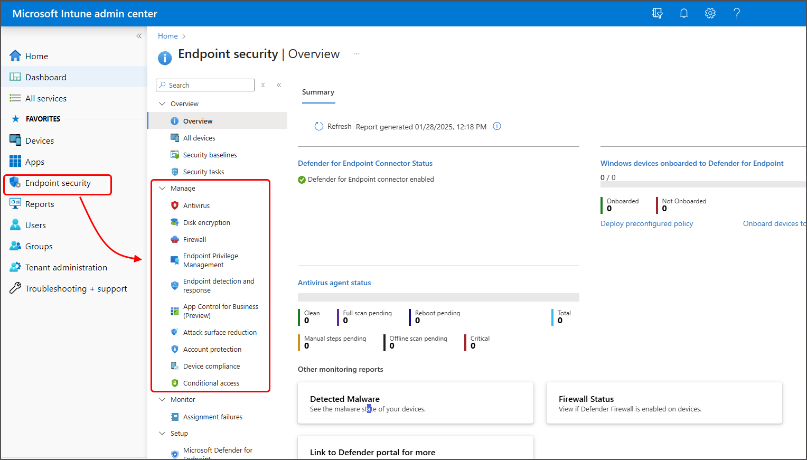

# Manage endpoint security in Microsoft Intune

Endpoint security in Intune provides focused tools to protect devices and data in today's hybrid work environment. The *Endpoint security* node in the admin center groups these capabilities in one place, giving security admins a central location to apply Zero Trust principles, protect against ransomware and malware, enforce compliance requirements, and respond to security threats across all managed devices.

From the Endpoint security node, you can configure policies, deploy security baselines, integrate with Microsoft Defender for Endpoint, and manage security tasks. This consolidated approach helps you quickly establish protection, identify at-risk devices, remediate vulnerabilities, and maintain compliance without navigating complex configuration profiles.

## Common security scenarios

Use the Endpoint security node to address common security challenges:

- **Protect against ransomware and malware** - Deploy antivirus policies with real-time protection, configure attack surface reduction rules, enable controlled folder access, and apply security baselines. For more information, see [Manage device security with endpoint security policies](../protect/endpoint-security-policy.md).

- **Apply zero trust principles** - Require device compliance for resource access, integrate with Conditional Access to verify security posture, use device risk signals from Defender for Endpoint, deploy disk encryption, and enforce least privilege access with Endpoint Privilege Management (EPM). For more information, see [Zero Trust with Microsoft Intune](../fundamentals/zero-trust-with-microsoft-intune.md).

- **Secure remote and hybrid work** - Monitor compliance for remote devices, onboard devices to Defender for Endpoint through EDR policies, configure firewall policies, and use Conditional Access to block access from noncompliant devices. For more information, see [Protect data and devices with Microsoft Intune](../protect/device-protect.md).

- **Meet compliance requirements** - Deploy standardized security configurations using baselines aligned to industry frameworks, monitor compliance status through reporting, and configure automated actions for noncompliant devices. For more information, see [Use security baselines to configure Windows devices in Intune](../protect/security-baselines.md).

- **Respond to security threats** - Review security tasks from your Defender for Endpoint team, use remote actions to remediate at-risk devices, rotate encryption keys, and monitor threat detection through dashboards. For more information, see [Use Intune to remediate vulnerabilities identified by Microsoft Defender for Endpoint](../protect/atp-manage-vulnerabilities.md).

## Endpoint security dashboard

The Endpoint security dashboard provides a consolidated view of your security posture.

To access the dashboard, sign in to the [Microsoft Intune admin center](https://go.microsoft.com/fwlink/?linkid=2109431) and go to **Endpoint security** > **Overview**.

The dashboard helps you quickly assess device security status and identify areas requiring attention. It displays information from multiple endpoint security areas including *Antivirus*, *Endpoint detection and response*, and *Defender for Endpoint*:

- **Defender for Endpoint Connector status** - View the connection status between Intune and Defender for Endpoint. If not connected, see [Connect Microsoft Defender for Endpoint to Intune](../protect/microsoft-defender-integrate.md#connect-microsoft-defender-for-endpoint-to-intune) to set up the integration. The status label also links to the Microsoft Defender portal.

- **Windows devices onboarded to Defender for Endpoint** - View counts of devices onboarded and not onboarded for endpoint detection and response (EDR). Select **Deploy preconfigured policy** to onboard devices through Intune, or **Onboard devices to Defender for Endpoint** to use the Defender portal workflow.

- **Antivirus agent status** - View summary details from the Microsoft Defender Antivirus status report, which is also available at **Reports** > *Microsoft Defender Antivirus* > **Summary**.

- **Other Monitoring reports** - Access additional Microsoft Defender Antivirus reports including *Detected Malware* and *Firewall Status*. There's also a link to the Defender portal for sensor and antivirus health data.

## Endpoint security features

The following sections provide details on how each capability works and link to dedicated articles for configuration guidance. Most features are available without additional prerequisites. Security tasks require integration with Defender for Endpoint, which is covered in [Set up integration with Microsoft Defender for Endpoint](#set-up-integration-with-microsoft-defender-for-endpoint).

### Device management

The *All devices* view in Endpoint security displays all devices from your Microsoft Entra ID that are available in Intune. From this centralized view, you can monitor device compliance status across your organization, drill into specific devices to identify policy violations, and take immediate remediation actions such as restarting devices, initiating malware scans, or rotating encryption keys.

This consolidated device view provides security admins with a single location to assess and remediate security issues across the entire fleet, regardless of platform or enrollment method. For more information, see [Manage devices with endpoint security in Microsoft Intune](../protect/endpoint-security-manage-devices.md).

### Security baselines

Security baselines provide preconfigured groups of Windows settings with defaults recommended by Microsoft security teams. These baselines enable you to quickly establish a comprehensive security posture aligned with industry best practices and security frameworks. Intune supports multiple security baselines, including Windows devices, Defender for Endpoint, Microsoft Edge, and more.

Each baseline contains Microsoft-recommended settings organized by functional area. You can deploy baselines with default settings or customize them to meet your organization's requirements. For more information, see [Use security baselines to configure Windows devices in Intune](../protect/security-baselines.md).

### Security tasks

Security tasks enable collaboration between Defender for Endpoint and Intune teams. When Defender for Endpoint identifies vulnerabilities, Defender for Endpoint security admins create tasks in the Defender for Endpoint portal specifying affected devices, the vulnerability, and remediation guidance. These tasks appear in Intune, where Intune administrators accept them, deploy appropriate policies or configurations, then mark complete after remediation is verified. Completion status synchronizes to the Defender for Endpoint portal for validation.

This workflow ensures both teams stay aligned on which devices are at risk and provides clear accountability for remediation. Security tasks require integration with Defender for Endpoint. See [Set up integration with Microsoft Defender for Endpoint](#set-up-integration-with-microsoft-defender-for-endpoint). For more information on the workflow, see [Use Intune to remediate vulnerabilities identified by Microsoft Defender for Endpoint](../protect/atp-manage-vulnerabilities.md).

### Endpoint security policies

Endpoint security policies provide streamlined configuration options for specific security features without requiring navigation through extensive device configuration settings. Use these policies to configure device security aspects like antivirus, disk encryption, firewall, and more. They simplify security management by surfacing only the settings relevant to each security capability.

The Endpoint security node also includes device compliance and Conditional Access policies. While these policies aren't focused security policies for configuring endpoints, they're essential tools for managing device security posture and controlling access to corporate resources. Endpoint security also includes Endpoint Privilege Management policies that allow you to enforce least privilege access on Windows devices.

Endpoint security policies work alongside device configuration profiles and security baselines, so understanding which method to use for each scenario helps prevent configuration conflicts. For more information, see [Manage device security with endpoint security policies](../protect/endpoint-security-policy.md).

### Device compliance policies

Device compliance policies establish the conditions that devices and users must meet to access corporate resources. These policies define compliance rules and evaluate whether devices meet those requirements. They report compliance status to Intune and Entra ID.

Common compliance rules include OS version requirements, password requirements, device health conditions (encryption, jailbreak detection), threat level limits from Defender for Endpoint or Mobile Threat Defense partners, and required security features. Compliance policies also support [actions for noncompliance](../protect/actions-for-noncompliance.md) that execute on a schedule, including user notifications, marking devices noncompliant after a grace period, remote lock, or adding devices to a retire list for admin review.

When integrated with Microsoft Entra Conditional Access, compliance status controls access to corporate resources. Conditional Access can use compliance data to gate access for both managed devices and devices that aren't managed. For more information, see [Set rules on devices to allow access to resources in your organization using Intune](../protect/device-compliance-get-started.md).

### Conditional Access

Conditional Access policies work with Intune to control which devices and apps can access corporate resources. Intune passes device compliance status to Entra ID, which then uses Conditional Access policies to enforce access requirements. Conditional Access policies can also gate access for devices that aren't managed by using Intune, and they can use compliance details from [Mobile Threat Defense partners](../protect/mobile-threat-defense.md) you integrate with Intune.

The following are two common methods of using Conditional Access with Intune:

- **Device-based Conditional Access** - Ensure only managed and compliant devices can access network resources.
- **App-based Conditional Access** - Use app protection policies to manage access to network resources by users on devices that aren't managed by using Intune.

For more information, see [Learn about Conditional Access and Intune](../protect/conditional-access.md).

### Endpoint Privilege Management

Endpoint Privilege Management enforces least privilege access by allowing users to run as standard accounts while enabling temporary elevation for IT-approved applications. This least privilege capability reduces attack surface by preventing blanket administrative access while maintaining user productivity for tasks that require elevated permissions, such as installing applications, updating drivers, or running Windows diagnostics.

You deploy Endpoint Privilege Management by creating elevation rules that define which applications can run with administrative privileges and under what conditions. Elevation rules support multiple validation methods including file hashes, publisher certificates, and file paths. You can configure automatic elevation for trusted applications, user-confirmed elevation with optional authentication requirements, support-approved elevation where administrators review requests, or deny rules to block specific files. EPM includes detailed reporting for both managed elevations and unmanaged elevations, helping you identify elevation patterns, refine rules, and plan the transition of users from administrator to standard user accounts.

> [!IMPORTANT]
> Endpoint Privilege Management is available as an [Intune add-on](../fundamentals/intune-add-ons.md) that requires an additional license beyond Microsoft Intune. You can license EPM as a standalone add-on or as part of the Microsoft Intune Suite. EPM policies are only available for Windows devices.

For more information, see [Endpoint Privilege Management](../protect/epm-overview.md).

## Set up integration with Microsoft Defender for Endpoint

Integrating Defender for Endpoint with Intune unlocks additional capabilities in the Endpoint security node that aren't otherwise available. While Intune supports integration with several [Mobile Threat Defense partners](../protect/mobile-threat-defense.md), Defender for Endpoint offers the widest integration with Intune across Windows, macOS, iOS, and Android platforms.

Integration benefits include:

- **Security tasks** - Collaborate between Defender and Intune teams to identify and remediate device vulnerabilities.
- **Streamlined device onboarding** - Deploy EDR policies from Intune to onboard devices to Defender for Endpoint.
- **Device risk signals** - Use Defender threat levels in compliance policies and app protection policies.
- **Tamper protection** - Prevent attackers from disabling security features.

For more information, see [Integrate Microsoft Defender for Endpoint with Intune for Device Compliance](../protect/microsoft-defender-with-intune.md).

## Role-based access control requirements

To manage tasks in the Endpoint security node of the Intune admin center, an account must:

- Be assigned a license for Intune.
- Have role-based access control (RBAC) permissions equal to the built-in Intune role of **Endpoint Security Manager**. This role grants access to the Intune admin center to manage security and compliance features, including security baselines, device compliance, Conditional Access, and Defender for Endpoint.

For more information, see [Role-based access control (RBAC) with Microsoft Intune](../fundamentals/role-based-access-control.md) and the [Endpoint Security Manager](../fundamentals/role-based-access-control-reference.md#endpoint-security-manager) role reference.

## Choose the right policy type

Intune offers multiple ways to configure device security. Understanding when to use each approach helps you manage settings efficiently and avoid conflicts.

### Policy comparison

| Policy type | Best for | Scope | Management complexity | Ongoing management |
| --- | --- | --- | --- | --- |
| **Endpoint security policies** | Targeted security configurations (antivirus, firewall, disk encryption, and more) | Specific security features | Low: Targeted settings only | Configure once, adjust as needed |
| **Security baselines** | Establishing comprehensive best-practice security posture | Broad Windows security settings | Medium: Preconfigured groups of settings | Review and deploy updated baselines when they become available |
| **Device configuration profiles** | General device settings and configurations | All device settings including non-security | High: Large number of settings | Configure as business needs change |
| **Compliance policies** | Defining minimum security requirements for access | Device and user requirements | Low: Rules-based evaluation | Configure once, adjust for new threats |
| **App protection policies** | Protecting company data in apps on unmanaged devices | Apps and data, not device settings | Medium: App-specific policies | Configure for each protected app |

### Decision guidance: When to use each policy type

**Use Endpoint security policies when:**

- You need to quickly configure specific security features like antivirus or firewall.
- You want to manage security settings separately from general device configuration.
- You're responding to a specific security threat or vulnerability.
- You need a streamlined view without navigating extensive configuration options.

**Use Security baselines when:**

- You're setting up newly managed devices and want Microsoft-recommended configurations.
- You need to align with security frameworks like CIS or NIST.
- You want to quickly establish comprehensive security posture.
- You prefer to accept Microsoft's best-practice defaults and customize minimally.

**Use Device configuration profiles when:**

- You need to configure settings not available in endpoint security policies.
- You're managing general device features beyond security (like Wi-Fi, email, certificates).
- You have specific configuration requirements that differ from baseline recommendations.

**Use Compliance policies when:**

- You need to define minimum security requirements for accessing corporate resources.
- You're implementing Conditional Access based on device state.
- You want to monitor and report on device security posture.
- You need automated actions for noncompliant devices.

**Can you use multiple policy types together?**

Yes, but plan carefully to avoid conflicts:

- **Best practice**. Use endpoint security policies OR security baselines for the same settings, not both.
- Compliance policies work alongside any configuration method. They evaluate the resulting state.
- App protection policies complement device policies for defense-in-depth.
- Use Intune's conflict detection tools to identify and resolve setting conflicts.

The following section provides detailed guidance on preventing and resolving policy conflicts.

## Avoid policy conflicts

Different Intune features can manage endpoint security settings. These features include endpoint security policies, security baselines, device configuration policies, and Windows enrollment policies. Conflicts happen when multiple policies set the same setting with different values on the same device.

### How Intune resolves conflicts

When two or more policies are assigned to the same device, the setting that applies depends on the policy types involved:

- **Compliance policies take precedence over configuration policies**. When the same setting appears in both a compliance policy and a configuration policy (including endpoint security policies, security baselines, or device configuration), Intune uses the compliance policy value.

- **Multiple compliance policies use most restrictive setting**. When multiple compliance policies configure the same setting, Intune applies the most restrictive value.

- **Configuration policy conflicts require manual resolution**. When multiple configuration policies (endpoint security, security baselines, device configuration, settings catalog) set different values for the same setting, you must identify and resolve the conflict manually. The setting might fail to apply and be flagged as conflicted.

### Avoid conflicts

To avoid conflicts:

- Plan which policy types you'll use to manage specific settings before deployment.
- When multiple methods are in use (like baselines and endpoint security policies), make sure they don't configure the same settings with different values, or assign them to different device groups.
- Use Intune's built-in tools to identify and resolve conflicts when they occur.

For detailed information on identifying and resolving conflicts, see:

- [Troubleshoot policies and profiles in Intune](/troubleshoot/mem/intune/troubleshoot-policies-in-microsoft-intune)
- [Monitor your security baselines](../protect/security-baselines-monitor.md#troubleshoot-using-per-setting-status)
- [Avoid conflicts](../protect/security-baselines.md#avoid-conflicts) in the security baselines documentation.

## Frequently asked questions

### What's the difference between endpoint security policies and device configuration profiles?

Endpoint security policies (like antivirus, firewall, and disk encryption) provide streamlined views with only relevant security settings, making them easier to configure and manage than device configuration profiles. Device configuration profiles include all device settings (Wi-Fi, email, browser, and more) and require navigating more options. Where both exist, consider using endpoint security policies for security configurations.

### Do I need Defender for Endpoint to use endpoint security in Intune?

No. You can use endpoint security policies, security baselines, and compliance policies without Defender for Endpoint. However, Defender integration provides significant benefits including threat detection, security tasks, device risk signals for compliance, and tamper protection. For comprehensive endpoint protection, Defender integration is recommended.

### Can I use security baselines and endpoint security policies together?

Yes, but be careful to avoid configuring the same settings in both. Security baselines provide comprehensive Microsoft-recommended configurations. Use endpoint security policies (like antivirus, firewall, or disk encryption) for specific settings you need to manage separately or settings not included in baselines. See [Avoid policy conflicts](#avoid-policy-conflicts) for guidance.

### How do compliance policies differ from configuration policies?

Configuration policies (endpoint security policies, security baselines, device configuration profiles) *set* device settings. Compliance policies primarily *evaluate* whether devices meet your requirements and report compliance status. On some platforms, compliance policies can also enforce certain security settings like PIN or password requirements by prompting users to remediate noncompliant configurations. Use them together: configure settings with endpoint security policies or security baselines, then validate devices meet requirements with compliance policies.

### Which devices can I protect with endpoint security?

Endpoint security supports:

- **Windows** - All endpoint security policy types: antivirus, disk encryption, firewall, endpoint detection and response, attack surface reduction, App Control for Business, and account protection.
- **macOS** - Antivirus, disk encryption (FileVault), firewall, and endpoint detection and response.
- **Linux** - Antivirus and endpoint detection and response.
- **iOS/iPadOS** - Compliance policies, app protection policies. Defender for Endpoint can be deployed as an app for threat detection.
- **Android** - Compliance policies, app protection policies. Defender for Endpoint can be deployed as an app for threat detection.

Capabilities vary by platform. For detailed platform-specific features, see [Manage device security with endpoint security policies](../protect/endpoint-security-policy.md).

### How long does it take for policies to apply to devices?

Devices check for policy updates every eight hours by default (Windows) or periodically based on platform. You can trigger immediate sync from the device or through the Intune admin center. Security-critical policies typically apply within minutes after sync, but full application depends on the setting complexity and device state.

### What happens if a device becomes noncompliant?

Actions depend on your compliance policy configuration:

1. Intune marks the device as noncompliant.
2. Scheduled actions for noncompliance apply, such as user notifications, remote lock, or adding the device to a retire list for admin review.
3. If integrated with Conditional Access, access to corporate resources might be blocked.
4. Users receive notifications with instructions to remediate problems.
5. Once problems are resolved and the device syncs, compliance status updates.

## Related content

Configure:

- [Security baselines](../protect/security-baselines.md)
- [Compliance policies](../protect/device-compliance-get-started.md)
- [Conditional Access integration](../protect/conditional-access.md)
- [Integration with Microsoft Defender for Endpoint](../protect/microsoft-defender-with-intune.md)
