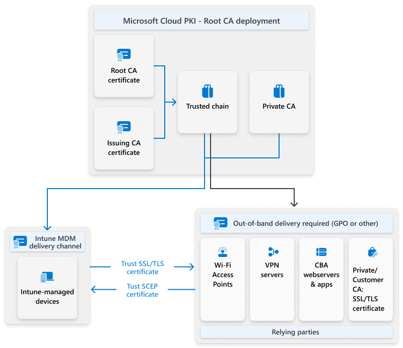
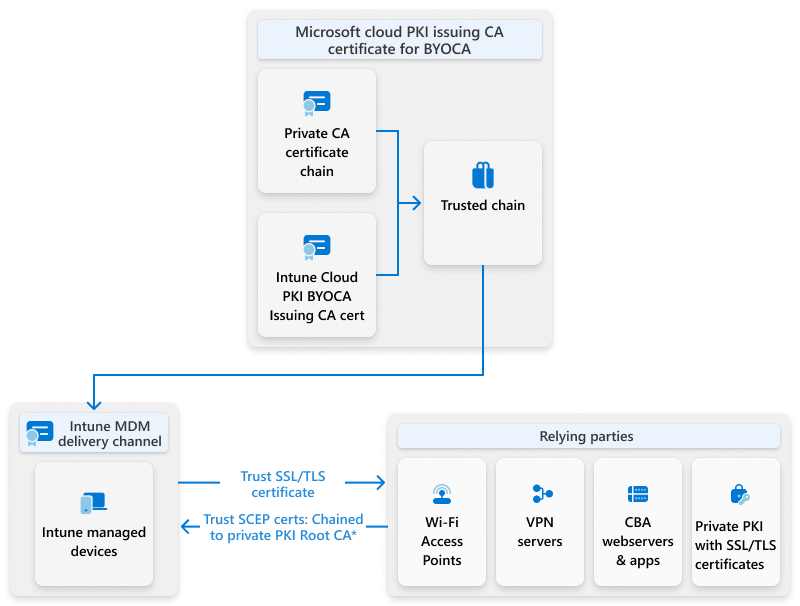

# Microsoft Cloud PKI deployment for Microsoft Intune  

This article describes the deployment models supported by Microsoft Intune and the Microsoft Cloud PKI service.

You have two deployment options:

- Microsoft Cloud PKI root CA: Deploy Microsoft Cloud PKI by using root and issuing CAs in the cloud.

- Bring your own certification authority (BYOCA): Deploy Microsoft Cloud PKI by using your own private CA.

With the *Microsoft Cloud PKI root CA* approach, you can create one or more PKIs within a single Intune tenant. Deploying Cloud PKI this way creates a two-tier hierarchy, so you can have multiple issuing CAs subordinate to the root CA. These CAs aren't public. Rather, you create both the root CA and issuing CAs in the cloud, private to the Intune tenant. The issuing CA issues certificates to Intune-managed devices by using the device configuration SCEP certificate profile.

Alternatively, you can *bring your own certificate authority (BYOCA)*. With this approach, you deploy Microsoft Cloud PKI by using your own private CA. This option requires you to create an issuing CA in the cloud that's private to the Intune tenant. The issuing CA is anchored to a private CA, such as Active Directory Certificate Services (ADCS). When you create a Cloud PKI BYOCA issuing CA, a certificate signing request (CSR) is also created in Intune. Your private CA is required to sign the CSR.

## Before you begin

It's important to review and understand certificate trust chains before you begin deployment. For more PKI concepts and fundamentals, see [Microsoft Cloud PKI fundamentals](microsoft-cloud-pki-fundamentals.md).

### Identify relying parties

Identify your relying parties. The relying party is a user or system that consumes the certificates generated by a PKI. Examples of relying parties include:

- A Wi-Fi access point using radius certificate-based authentication.  
- A VPN server authenticating a remote user.
- A user visiting an TLS/SSL protected web site in a web browser.

### Determine location for trust anchor

Determine the location of the *root trust anchor*. A trust anchor is a CA certificate, or the public key of a CA, used by a relying party as the starting point for certificate trust or path validation. A relying party could have one or more trust anchors derived from more than one source. A trust anchor can be the public key of the root CA or it can be the public key of the CA that issues an end-entity certificate to the relying party.  

### Ensure chain of trust

When using certificates to perform certificate-based authentication, ensure that both relying parties have the CA certificate trust chain (which includes the public keys and root CA) of all certificates involved in a TLS/SSL based conversation. In this context, the relying parties are:  

- The Intune-managed devices.
- The authentication services used by Wi-Fi, VPN, or web services.

If the issuing CA certificate is missing, a relying party can request it via the Authority Information Access (AIA) property in the certificate by using the native OS platform certificate chaining engine.

> [!NOTE]
> When connecting to a relying party such as a Wi-Fi access point or VPN server, an TLS/SSL connection is first established by the managed Intune device when attempting to connect. Microsoft Cloud PKI doesn't provide these TLS/SSL certificates.  You must obtain these certificates through another PKI or CA service.  As a result, when you create a Wi-Fi or VPN profile, you also have to create a trusted certificate profile and assign it to managed devices to trust the TLS/SSL connection. The trusted certificate profile must contain the public keys for the root and issuing CAs responsible for issuing the TLS/SSL certificate.  

## Deployment options

This section describes the Microsoft Intune-supported deployment options for Microsoft Cloud PKI.  

There are methods for deploying CA certificates to relying parties not managed by Intune. Relying parties such as radius servers, Wi-Fi access points, VPN servers, and web app servers supporting certificate-based authentication.  

If the relying party is a member of an Active Directory Domain, then use Group Policy to deploy CA certificates. For more information, see:

- [Distribute Certificates to Client Computers by Using Group Policy](/windows-server/identity/ad-fs/deployment/distribute-certificates-to-client-computers-by-using-group-policy)  
- [Enroll a Windows device automatically using Group Policy](/windows/client-management/enroll-a-windows-10-device-automatically-using-group-policy)  

If the relying party isn't a member of Active Directory Domain, ensure the CA certificate trust chain for the Microsoft Cloud PKI root and issuing CA is installed in the security store of the relying party. The appropriate security store varies depending on the OS platform and the hosting application providing the service.  

Also consider the relying party software configuration needed to support other certification authorities.  

### Option 1: Microsoft Cloud PKI root CA

During a Cloud PKI root CA deployment, the Cloud PKI root certificate needs to be deployed to all relying parties. If an issuing CA certificate isn't present on a relying party, the relying party can automatically retrieve and install it by initiating certificate discovery. This process, known as the certificate chaining engine (CCE), is platform-specific and used to retrieve missing parent certificate. The URL of the issuing CA certificate is in the AIA property of a leaf certificate (the certificate issued to the device using a Cloud PKI issuing CA). A relying party can use the AIA property to retrieve parent CA certificates. The process is similar to CRL downloading.  

>[!NOTE]
> Android OS requires servers to return an entire certificate chain and doesn't do certificate discovery following AIA paths. For more information, see [Android developer docs](https://developer.android.com/training/articles/security-ssl#MissingCa). Be sure to deploy the full certificate chain to Android managed devices and relying parties.  

Intune managed devices, regardless of OS platform, require the following CA certificate trust chain.

| CA certificate type| CA certificate trust chain | Deployment method |
| --------------------------| -------------------------- | ----------------- |
| Cloud PKI CA certificate | Root CA certificate required, issuing CA optional but recommended | Intune trusted certificate configuration profile |
| Private CA certificate | Root CA certificate required, issuing CA certificate is optional but recommended | Intune trusted certificate configuration profile |

Relying parties require the following CA certificate trust chain.  

| CA certificate type| CA certificate trust chain | Deployment method |
| -------------------------- | ----------------- |----------------- |
|Cloud PKI CA certificate| Root CA certificate required, issuing CA optional but recommended | If the relying party's server or service is a member server in Active Directory (AD) domain, use Group Policy to deploy CA certificates. If it's not in AD domain, a manual installation method might be required. |
|Private CA certificate| Root CA certificate required, issuing CA certificate optional but recommended | If the relying party's server or service is a member server in Active Directory (AD) domain, use Group Policy to deploy CA certificates. If it's not in AD domain, a manual installation method might be required. |

The following diagram shows certificates in action for both client and relying parties.    

> [!div class="mx-imgBorder"]
>    

The following diagram shows the respective CA certificate trust chains that must be deployed to both managed devices and relying parties. The CA trust chains ensure Cloud PKI certificates issued to Intune-managed devices are trusted and can be used to authenticate to relying parties.   

> [!div class="mx-imgBorder"]
>   

### Option 2: Bring your own CA (BYOCA)

During a bring-your-own-CA deployment, the Intune managed device needs the following CA certificates:

- The private CA trust chain, including the root and issuing CA certificates, of the CA responsible for signing the BYOCA CSR.
- The BYOCA-issuing CA certificate.

All relying parties should already have the private CA certificate chain.

Intune managed devices, regardless of OS platform, require the following CA certificate trust chain.

| CA certificate type | CA certificate trust chain | Deployment method |
| --------------------------| -------------------------- | ----------------- |
| Cloud PKI CA certificate | Issuing CA optional but recommended | Intune trusted certificate configuration profile |
| Private CA certificate | Root CA certificate required, issuing CA optional but recommended | Intune trusted certificate configuration profile |  

The relying party should already have the private CA certificate chain. However, the BYOCA issuing CA certificate should also be deployed to relying parties. If the relying party is a member server in Active Directory Domain, use GPO as the deployment method.

>[!NOTE]
> If the Cloud PKI BYOCA issuing CA certificate isn't deployed to the relying party platform, then the AIA (URL) property of the Cloud PKI issued SCEP certificate (end-entity/leaf certificate) can be used by the CCE of the relying party to request and install the Cloud PKI BYOCA issuing CA certificate (public-key) in its trust store.  However, this behavior is not guaranteed and dependent on each OS/Platform implementation of the CCE.  It is a best practice to deploy the BYOCA issuing CA certificate to the managed device and relying party.  

Relying parties trust the Cloud PKI BYOCA issued SCEP certificate to the managed device, because it chains up to the private CA trust chain already present on the relying party.

The following diagram illustrates how the respective CA certificate trust chains are deployed to Intune managed devices.   

> [!div class="mx-imgBorder"]
>   
`*` In this diagram, *private* refers to the Active Directory Certificate Service or a non-Microsoft service.  

## Summary

Cloud PKI root and issuing CAs, and BYOCA issuing CAs anchored to a private CA, can exist in the same tenant because Cloud PKI can support both deployment models concurrently.  

Before starting a deployment and issuing certificates, determine the location of the *root trust anchor*. It can be in the Cloud PKI root or private root CA. The location determines the certificate trust chain required by both Intune managed devices and relying parties.  

- Cloud PKI root CA:  You must deploy the Cloud PKI certificate trust chain, which is made up of the root & issuing CA public keys, to all relying parties.
- Cloud PKI BYOCA issuing CA using a private root CA: The private CA certificate trusted chain, which is made up of the root CA and issuing CA, should already be deployed on relying parties throughout your infrastructure. Though not required, we recommend creating a Cloud PKI BYOCA issuing CA certificate.
