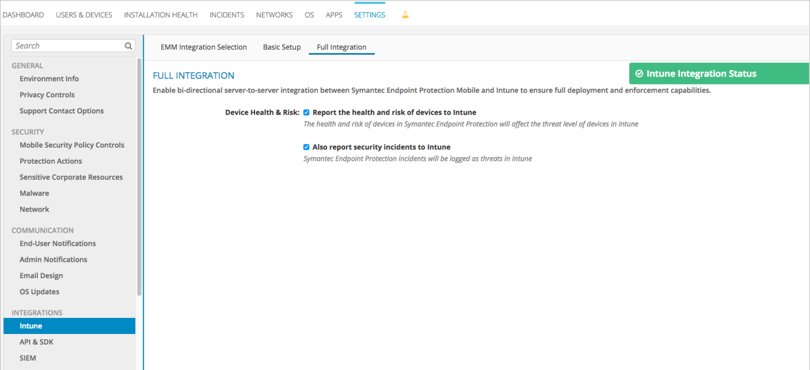

# Set up Symantec Endpoint Protection Mobile integration with Intune

Complete the following steps to integrate the Symantec Endpoint Protection Mobile (SEP Mobile) solution with Intune. You need to add SEP Mobile apps into Microsoft Entra ID P1 to have single sign-on capabilities.

> [!NOTE]
>
> This Mobile Threat Defense vendor is not supported for unenrolled devices.

## Before you begin

### Microsoft Entra account used to integrate Intune and SEP Mobile

- Make sure you have the Microsoft Entra account properly configured in the [Symantec Endpoint Protection Mobile Management console](https://techdocs.broadcom.com/us/en/symantec-security-software/endpoint-security-and-management/endpoint-protection/all/getting-up-and-running-on-for-the-first-time-v45150512-d43e1033/logging-on-to-the-console-v8025272-d23e2462.html) before starting the SEP Mobile Basic setup process.
- The Microsoft Entra account must be a global administrator account to perform the integration.

### Network Setup

You can make sure your network is properly configured for integration with SEP Mobile setup by referring to the Symantec article [Configuring SEP Manager after installation](https://techdocs.broadcom.com/us/en/symantec-security-software/endpoint-security-and-management/endpoint-protection/all/getting-up-and-running-on-for-the-first-time-v45150512-d43e1033/configuring-after-installation-v18374552-d23e1454.html).

### Full integration vs. Read-only

SEP Mobile supports two modes of integration with Intune:

- **Read-only integration (Basic setup):** Only inventories devices from Microsoft Entra ID and populates them in the Symantec Endpoint Protection Mobile Management console.
  - If both the **Report the health and risk of devices to Intune** and **Also report security incidents to Intune** boxes aren't selected in the Symantec Endpoint Protection Mobile Management console, the integration is read-only and therefore will never change a device's state (compliant or noncompliant) in Intune.
- **Full integration:** Allows SEP Mobile to report devices on risk and security incident details to Intune, which creates a bi-directional communication between both cloud services.

### How are the SEP Mobile apps used with Microsoft Entra ID and Intune?

- **iOS app:** Allows end-users to sign in to Microsoft Entra ID using an iOS/iPadOS app.

- **Android app:** Allows end-users to sign in to Microsoft Entra ID using an Android app.

- **Management app:** This is the SEP Mobile Microsoft Entra multi-tenant app, which enables service-to-service communication with Intune.

## To set up the read-only integration between Intune and SEP Mobile

> [!IMPORTANT]
>
> The SEP Mobile admin credentials must consist of an e-mail account that belongs to a valid user in the Microsoft Entra, otherwise the login will fail. SEP Mobile uses Microsoft Entra ID to authenticate its admin using single sign-on (SSO).

1. Go to [Symantec Endpoint Protection Mobile Management Console](https://techdocs.broadcom.com/us/en/symantec-security-software/endpoint-security-and-management/endpoint-protection/all/getting-up-and-running-on-for-the-first-time-v45150512-d43e1033/logging-on-to-the-console-v8025272-d23e2462.html).

2. Enter your **SEP Mobile admin credentials**, and then choose **Continue**.

3. Go to **Settings**, and under **Intune Integration**, choose **Basic Setup**.

4. Next to **iOS App**, choose **Entra ID**.

5. When the sign in page opens, enter your Intune credentials, and then choose **Accept**.

   

6. After the app is added to Microsoft Entra, you'll see an indication that the app was added successfully.

7. Repeat these steps for the **SEP Mobile Android** and **Management** apps.

### Add a Microsoft Entra security group into SEP Mobile

You need to add a Microsoft Entra security group that contains all devices running SEP Mobile.

- Enter and select all the security groups of devices that are running SEP Mobile, and then save the changes.

  

SEP Mobile syncs the devices running its Mobile Threat Defense service with the Microsoft Entra security groups.

## To set up the full integration between Intune and SEP Mobile

### Retrieve the Directory ID in Microsoft Entra

1. Sign in to the [Azure portal](https://portal.azure.com).

2. Select **Microsoft Entra ID**.

3. Choose the **Properties** tab.

4. Next to the **Tenant ID**, choose the copy icon, and then paste it to a safe location. You need this identifier in a later step.

   :::image type="content" source="./media/skycure-mtd-connector-integration/symantec-azure-portal-directory-ID.png" alt-text="Image showing Tenant ID in the Azure portal":::

### (Optional) Create a dedicated Security Group for devices that need to run the SEP Mobile apps

1. In the [Azure portal](https://portal.azure.com), under **Manage**, choose **Users and groups**, and then choose **All groups**.

2. Choose the **Add** button. Type a group **Name**. Under **Membership type**, choose **Assigned**.

3. In the **Members** blade, select the group members, and then choose the **Select** button.

4. In the **Group** blade, choose **Create**.

### Set up the integration between Symantec Endpoint Protection Mobile and Intune

1. Go to [Symantec Endpoint Protection Mobile Management Console](https://techdocs.broadcom.com/us/en/symantec-security-software/endpoint-security-and-management/endpoint-protection/all/getting-up-and-running-on-for-the-first-time-v45150512-d43e1033/logging-on-to-the-console-v8025272-d23e2462.html).

2. Enter your **SEP Mobile admin credentials**, then choose **Continue**.

3. Go to the **Settings** > **Integrations** > **Intune** > **EMM Integration Selection** section.

4. In the **Directory ID** box, paste the Tenant ID you copied from Microsoft Entra ID in the previous section and save the settings.

5. Go to the **Settings** > **Integrations** > **Intune** > **Basic Setup** section.

6. Next to **iOS App**, choose the **Add to Microsoft Entra** button.

7. Sign in using the Microsoft Entra credentials for the Microsoft 365 account that manages the directory.

8. Choose the **Accept** button to add the SEP Mobile iOS/iPadOS app to Microsoft Entra.

   

9. Repeat the same process for the **Android app** and the **Management App**.

10. Select all user groups that need to run the SEP Mobile apps, for example, the security group you created earlier.

   

11. SEP Mobile syncs the devices in the selected groups and starts reporting information to Intune. You can view this data in the Full Integration section. Go to the **Settings** > **Integrations** > **Intune** > **Full Integration** section.

    

## Next steps

[Set up SEP Mobile apps](mtd-apps-ios-app-configuration-policy-add-assign.md)
