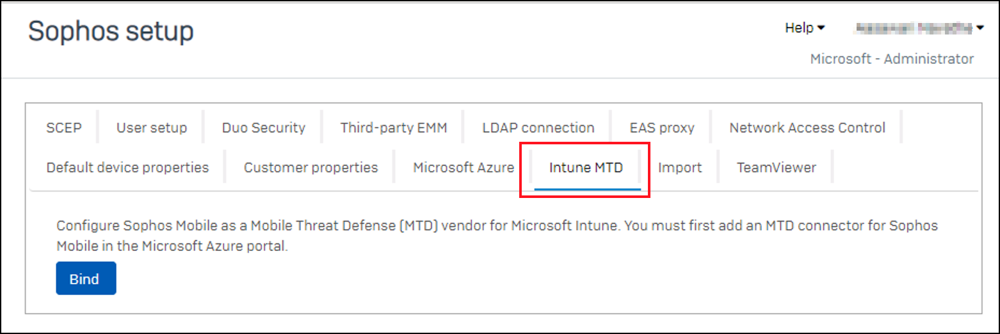
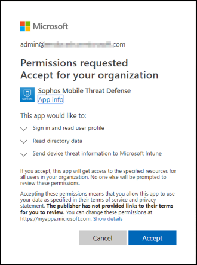
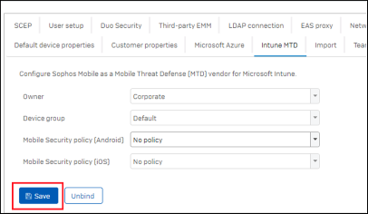

---
# required metadata

title: Set up Sophos Mobile integration with Intune
titleSuffix: Intune on Azure
description: How to set up the Sophos Mobile solution with Microsoft Intune to control mobile device access to your corporate resources.
keywords:
author: brenduns
ms.author: brenduns
manager: dougeby
ms.date: 08/27/2024
ms.topic: how-to
ms.service: microsoft-intune
ms.subservice: protect
ms.localizationpriority: high
ms.assetid:

# optional metadata

#ROBOTS:
#audience:

ms.reviewer: aanavath
#ms.suite: ems
search.appverid: MET150
#ms.tgt_pltfrm:
#ms.custom:
ms.collection:
- tier3
- M365-identity-device-management
- sub-mtd-apps
---

# Integrate Sophos Mobile with Intune

Complete the following steps to integrate the Sophos Mobile Threat Defense solution with Intune.

> [!NOTE]
>
> This Mobile Threat Defense vendor is not supported for unenrolled devices.

## Before you begin

Before starting the process of integrating Sophos Mobile with Intune, make sure you have the following:

- Microsoft Intune Plan 1 subscription
- Microsoft Entra admin credentials to grant the following permissions:
  - Sign in and read user profile
  - Access the directory as the signed-in user
  - Read directory data
  - Send device information to Intune
- Admin credentials to access the Sophos Mobile admin console

### Sophos Mobile app authorization

The Sophos Mobile app authorization process follows:

- Allow the Sophos Mobile service to communicate information related to device health state back to Intune.
- Sophos Mobile syncs with Microsoft Entra Enrollment Group membership to populate its device's database.
- Allow the Sophos Mobile admin console to use Microsoft Entra single sign-on (SSO).
- Allow the Sophos Mobile app to sign in using Microsoft Entra SSO

## To set up Sophos Mobile integration

1. Sign in to the [Microsoft Intune admin center](https://go.microsoft.com/fwlink/?linkid=2109431), go to **Tenant administration** > **Connectors and tokens** > **Mobile Threat Defense** > and select **Add**.
2. On the **Add Connector** page, use the dropdown and select **Sophos**. And then select **Create**.
3. Select the link *Open the Sophos admin console*.
4. Sign in to the [Sophos admin console](https://central.sophos.com/) with your Sophos credentials.
5. Go to **Mobile** > **Settings** > **Setup** > **Sophos setup**.
6. On the **Sophos setup** page, select the **Intune MTD** tab.

   

7. Select **Bind**, and then select **Yes**. Sophos connects to Intune and requires you to sign in to your Intune subscription.
8. In the Microsoft Intune authentication window, enter your Intune credentials and **Accept** the permissions request for *Sophos Mobile Threat Defense*.

   

9. On the **Sophos setup** page, select **Save** to complete the configuration for Intune:

   

10. When the message **Successful Integration** appears, integration is complete.
11. In the Intune admin center, Sophos is now available.

## Next Steps

[Configure Sophos client apps](mtd-apps-ios-app-configuration-policy-add-assign.md)
#### New settings added to the Windows security baseline version 24H2<!-- 32413310 wnready    -->

The most recent Intune security baseline for Windows, version 24H2, is updated to include 15 new settings for managing the Windows Configuration Service Provider (CSP) for [*Lanman Server*](/windows/client-management/mdm/policy-csp-lanmanserver) and [*Lanman Workstation*](/windows/client-management/mdm/policy-csp-lanmanworkstation), and one new setting for [Defender](/windows/client-management/mdm/Defender-csp). These settings were previously unavailable in the baseline due to missing CSP support. The addition of these settings provides better control and configuration options.

Because this is an update to an existing baseline version and not a new baseline version, the new settings aren’t visible in the baselines properties until you edit and save the baseline:

- **Pre-existing baseline instances**:
Before the new settings are available in a pre-existing baseline instance, you must select and then *Edit* that baseline instance. To have the baseline deploy the new settings, you must then *Save* that baseline instance.  When the baseline is opened for editing, each of the new settings becomes visible with its default security baseline configuration. Before saving, you can reconfigure one or more of the new settings or make no changes other than to save the current configuration which then uses the baseline defaults for each of the new settings. 

- **New baseline instances**:
When you create a new instance of a Windows security baseline version 24H2, that instance includes the new settings along with all the previously available settings.

Following are the new settings that are added to the version 24H2 baseline, and the baseline default for each:

[**Lanman Server**](../protect/security-baseline-settings-mdm-all.md&pivots=mdm-24h2#lanman-workstation)  
- [Audit Client Does Not Support Encryption](/windows/client-management/mdm/policy-csp-lanmanserver#auditclientdoesnotsupportencryption) – Baseline default: *Enabled*
- [Audit Client Does Not Support Signing](/windows/client-management/mdm/policy-csp-lanmanserver#auditclientdoesnotsupportsigning) – Baseline default: *Enabled* 
- [Audit Insecure Guest Logon](/windows/client-management/mdm/policy-csp-lanmanserver#auditinsecureguestlogon) – Baseline default: *Enabled*
- [Auth Rate Limiter Delay In Ms](/windows/client-management/mdm/policy-csp-lanmanserver#authratelimiterdelayinms) – Baseline default: *2000*
- [Enable Auth Rate Limiter](/windows/client-management/mdm/policy-csp-lanmanserver#enableauthratelimiter) – Baseline default: * Enabled*
- [Max SMB 2 Dialect](/windows/client-management/mdm/policy-csp-lanmanserver#maxsmb2dialect) – Baseline default: *SMB 3.1.1*
- [Min SMB 2 Dialect](/windows/client-management/mdm/policy-csp-lanmanserver#minsmb2dialect) – Baseline default: * SMB 3.0.0*
- [Enable Mailslots](/windows/client-management/mdm/policy-csp-lanmanserver#enablemailslots) - Baseline default: *Disabled*

[**Lanman Workstation**](../protect/security-baseline-settings-mdm-all.md&pivots=mdm-24h2#lanman-server)  
- [Audit Insecure Guest Logon](/windows/client-management/mdm/policy-csp-LanmanWorkstation?WT.mc_id=Portal-fx#auditinsecureguestlogon) – Baseline default: *Enabled*
- [Audit Server Does Not Support Encryption](/windows/client-management/mdm/policy-csp-LanmanWorkstation?WT.mc_id=Portal-fx#auditserverdoesnotsupportencryption) – Baseline default: *Enabled*
- [Audit Server Does Not Support Signing](/windows/client-management/mdm/policy-csp-LanmanWorkstation?WT.mc_id=Portal-fx#auditserverdoesnotsupportsigning) – Baseline default: *Enabled*
- [Max SMB 2 Dialect](/client-management/mdm/policy-csp-LanmanWorkstation?WT.mc_id=Portal-fx#maxsmb2dialect)  – Baseline default: *SMB 3.1.1*
- [Min SMB 2 Dialect](/windows/client-management/mdm/policy-csp-LanmanWorkstation?WT.mc_id=Portal-fx#minsmb2dialect)  – Baseline default: *SMB 3.0.0*
- [Require Encryption](/windows/client-management/mdm/policy-csp-LanmanWorkstation?WT.mc_id=Portal-fx#requireencryption) – Baseline default: *Disabled*
- [Enable Mailslots](/windows/client-management/mdm/policy-csp-LanmanWorkstation#enablemailslots) - Baseline default: *Disabled*

[**Defender**](../protect/security-baseline-settings-mdm-all.md&pivots=mdm-24h2#defender)  
- [Enable Dynamic Signature Dropped Event Reporting](/windows/client-management/mdm/Defender-csp/?WT.mc_id=Portal-fx#enabledynamicsignaturedroppedeventreporting) – Baseline default: *Enabled*

For more information, see [Intune security baselines](../protect/security-baselines.md).
