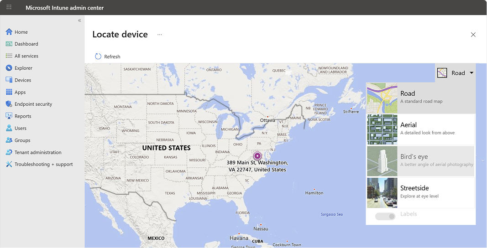

---
# required metadata

title: "Intune Remote Device Action: Find lost devices"
description: Locate lost or stolen devices by using the locate device feature in Microsoft Intune. Get details on security and privacy information when using the locate device action.
ms.date: 08/27/2025
ms.topic: how-to

ms.reviewer: shsivaku
ms.custom: intune-azure
ms.collection:
- tier1
- M365-identity-device-management
- highpri

zone_pivot_groups: d4b2a9c3-d659-4922-8403-9b50d065fc07
---

# Locate devices with Intune

For supported device platforms, you can use a remote device action from within the Microsoft Intune admin center to locate a device should it be lost or stolen.

In addition to identifying the location a lost or stolen device on a map, some platforms support other capabilities to help you find them, including:

- Use a *lost device sound alert* on a phone to help a user locate the device should it be behind a chair or otherwise out-of-sight.
- Report on the time and location of a devices *last known location*, which can help when the device is off-line, or can't be reached to verify where it is at. *(Android Enterprise dedicated devices only)*

You need to enable Windows location services in Windows Out of Box Experience (OOBE) or by using the [Privacy > LetAppsAccessLocation](/windows/client-management/mdm/policy-csp-privacy#privacy-letappsaccesslocation) policy to be able to locate the device.

## Requirements

### :::image type="icon" source="../media/icons/headers/devices.svg" border="false"::: Platform requirements

> [!div class="checklist"]
> This remote action is supported on the following platforms:
>
> - Android
>     - Android Enterprise corporate-owned dedicated (COSU)
>     - Android Enterprise corporate-owned fully managed (COBO)
>     - Android Enterprise corporate-owned work profile (COPE)
> - iOS/iPadOS in [supervised mode](/intune/intune-service/remote-actions/device-supervised-mode) and [lost mode](device-lost-mode.md)
> - Windows

> [!div class="checklist"]
> The **lost device sound alert** action is supported on the following platforms:
>
> - Android
>     - Android Enterprise corporate-owned dedicated (COSU)
>     - Android Enterprise corporate-owned fully managed (COBO)
>     - Android Enterprise corporate-owned work profile (COPE)
> - iOS/iPadOS in [supervised mode](/intune/intune-service/remote-actions/device-supervised-mode) and [lost mode](device-lost-mode.md)

### :::image type="icon" source="../media/icons/headers/rbac.svg" border="false"::: Role and permission requirements

> [!div class="checklist"]
> To execute this remote action, you must use an account that has at least one of the following roles:
>
> - [Help Desk Operator][INT-R1]
> - [School Administrator][INT-R2]
> - [Custom role][INT-RC] with the permissions:
>   - Remote tasks/Locate device
>   - Remote tasks/Play sound to locate lost devices

::: zone pivot="android"

>[!NOTE]
> Android devices require *Google Play Services* version **20.06.16** or later. Location services and *Google Location Accuracy* must be enabled. The "Google Location Accuracy" setting can be found under **Settings** > **Location** > **Location Services**. Corporate-owned work profile devices running Android 12 or above require the end user to grant Intune app location permission by going to **Settings** > **Apps** > **Intune** (in the **Work** tab) > **Permissions** > **Location** > **Allow all the time**

::: zone-end

## Locate a device

1. In the [Microsoft Intune admin center][INT-AC], select **Devices** > **All devices**, or use the following shortcut:
    > [!div class="nextstepaction"]
    > [All devices][INT-AC1]
1. From the devices list, select a device, and then select **...** > **Locate device**.
1. After the device is located, its location is shown in **Locate device**.

   - You can select the location pin on the map to view a location address and coordinates.
::: zone pivot="android"
   - Android Enterprise dedicated devices that aren't currently online can display their [last known location](#last-known-location) when the device last checked in within seven days.

   

Android use of **Locate device** is managed using a device configuration profile (**Devices** > **Manage devices** > **Configuration** > **Create** > **Android Enterprise** for platform > **Device Restrictions** for profile type).

There are two separate toggles, one for dedicated and one for fully managed and corporate-owned work profile devices.

For fully managed and corporate-owned work profile, **Locate device** is set to **Not configured** as the default and it blocks the feature. To allow this feature, use device restrictions within Device Configuration and configure the toggle for **Locate device** to Allow. For corporate-owned work profile devices running Android 12 or above, also have the user of the device enable location permissions by navigating to **Settings** > **Apps** > **Intune** (in the **Work** tab) > **Permissions** > **Location** > **Allow all the time**.

For dedicated devices, **Locate device** is set to **Not configured** as the default, which allows the feature. To turn off this feature, use device restrictions within **Device Configuration** and configure the toggle for **Locate device** to **Block**. When **Locate device** is allowed, users receive a one-time notification, "Intune can access your location", indicating that Intune has the ability to use location permissions on the device.

For more information on the policy settings you can configure, go to [Android Enterprise device settings list to allow or restrict features on corporate-owned devices using Intune](../configuration/device-restrictions-android-for-work.md).

### Last known location

When you use the *Locate device* action for an Android Enterprise dedicated device that is offline and unable to respond with its current location, Intune attempts to display its last known location. This capability uses data submitted by the device when it checks in with Intune.

Intune collects information about the last known location of a device every eight hours or when the device checks in with Intune. Intune keeps this information for up to seven days. The last known location of a device that hasn't checked in with Intune for more than seven days can't be displayed.

**About initialization of last known location**:

To support the *last know location* capability for Android dedicated devices, each device receives an initial default entry for **Locate device** which shows a status of **Complete**. This status appears under *Device actions status* when you view the devices Overview page. This default status is a result of Intune initializing the capability by default, which doesn't mean a locate device action has run.

The date and time of this default status varies:

- Devices that are enrolled before the capability becomes available, reflect the day this capability was enabled for your tenant.
- Devices that you enroll after this capability is available, reflect the time of device enrollment.

Later, this default status updates to reflect the actual date and time that an admin runs the Locate device action for that device.

::: zone-end

::: zone pivot="android,ios"

## Activate lost device sound alert

For supported device platforms, you can remotely trigger the device to play an alert sound so the user can find it. The sound plays until the user disables the sound on the device or the device is removed from lost mode.

To start a lost device sound alert:

1. Sign in to the [Microsoft Intune admin center](https://go.microsoft.com/fwlink/?linkid=2109431).
2. Select **Devices**, and then select **All devices**.
3. Select the device you want to activate.
4. On the devices *Overview* pane:
   - For **iOS/iPadOS**: select **Play Lost mode sound (supervise only)**. The sound plays on an iOS/iPadOS device until the device is removed from lost mode.

::: zone-end

::: zone pivot="android"

   - For **Android Enterprise dedicated devices**, **Android Enterprise corporate-owned work profile devices**, and **Android Enterprise fully managed devices** : select **Play Lost device sound**. The sound plays on an Android Enterprise dedicated device for the set duration or if notifications are enabled, until a user on the device turns it off.

   -  For **Android Enterprise dedicated devices**:
      - devices running on operating systems below version 10, a full screen activity with a **Stop Sound** button pops up.
      - devices running on operating systems version 10 or higher, if notifications are enabled, a notification with a **Stop Sound** button shows up.
      - To configure system notifications for devices in kiosk mode, see [Android Enterprise device settings to allow or restrict features using Intune](../configuration/device-restrictions-android-for-work.md).

   - For **Android Enterprise corporate-owned work profile devices**, and **Android Enterprise fully managed devices** :
     - To configure system notifications for devices, see [Android Enterprise device settings to allow or restrict features using Intune](../configuration/device-restrictions-android-for-work.md).

::: zone-end

## Security and privacy information for lost mode and locate device actions

- No device location information is sent to Intune until you turn on this action.
- When you use the locate device action, the latitude and longitude coordinates of the device can be retrieved by using the Graph API.
- The data is stored for 24 hours, then removed. You can't manually remove the location data.
- The data for last known locations is stored for up to seven days, and then removed.
- Location data is encrypted, both while stored and while being transmitted.
- For iOS/iPadOS devices, when you configure lost mode, you can customize a message that appears on the lock screen. In this message, to help the person that finds the device, be sure to include specific details to return the lost device.
- For fully-managed and corporate-owned work profile scenarios, end users receive a notification when the administrator uses this feature, if notifications are enabled.

## :::image type="icon" source="../media/icons/headers/microsoft-graph.svg" border="false"::: Microsoft Graph API reference

For more information about the APIs used for this action, see:

- [locateDevice action][GRAPH-1]
- [playLostModeSound action][GRAPH-2]

<!--links-->

[INT-AC]: https://go.microsoft.com/fwlink/?linkid=2109431
[INT-AC1]: https://go.microsoft.com/fwlink/?linkid=2109431#view/Microsoft_Intune_DeviceSettings/DevicesMenu/~/allDevices
[INT-AC2]: https://go.microsoft.com/fwlink/?linkid=2109431#view/Microsoft_Intune_Devices/DeviceActionList.ReactView

[INT-RC]: /intune/intune-service/fundamentals/create-custom-role
[INT-R1]: /intune/intune-service/fundamentals/role-based-access-control-reference#help-desk-operator
[INT-R2]: /intune/intune-service/fundamentals/role-based-access-control-reference#school-administrator

[GRAPH-1]: /graph/api/intune-devices-manageddevice-locatedevice
[GRAPH-2]: /graph/api/intune-devices-manageddevice-playlostmodesound

<!--
This feature is intended to be used to locate lost or stolen devices. When the action is triggered, the end user will receive a notification that the device is lost and its location has been queried. Before you continue, make sure you're following local laws and regulations around receiving location data. By requesting the device location, Intune will send the device's latitude and longitude to Bing Maps to retrieve and display an address. Location data is visible in Intune for 24 hours once received.
-->

::: zone pivot="windows"
::: zone-end